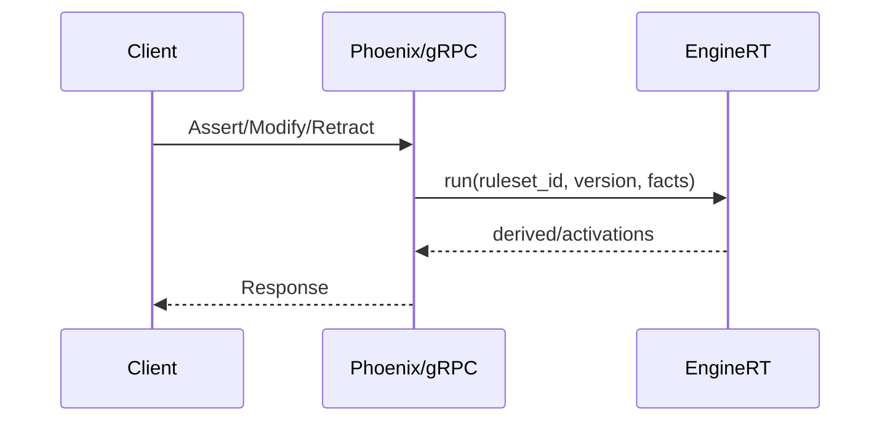

# Public API Specification (Draft)

Defines the application’s public interfaces: local Elixir APIs for internal use and gRPC services for external applications.
Runs on a private network; AuthN/AuthZ not required. Optionally enable mTLS for transport security.
No app-level auth in scope.

## Engine Lifecycle (Local Elixir)

- `compile(rules, opts) :: {:ok, network} | {:error, reason}` — Build a shared network from DSL rules.
- `start_link(network, opts) :: GenServer.on_start()` — Start an engine instance.
- `stop(engine) :: :ok` — Stop the engine.
- `set_ruleset(engine, ruleset_id | {ruleset_id, version}) :: :ok` — Atomically switch engine to a compiled ruleset.

## Fact Operations (Local Elixir)

- `assert(engine, fact | [fact], opts) :: :ok | {:ok, result}`
- `modify(engine, fact | [fact], opts) :: :ok | {:ok, result}` — Fact `id` must match existing; engine diffs old/new.
- `retract(engine, id | [id], opts) :: :ok | {:ok, result}`
- `transact(engine, fun) :: {:ok, result} | {:error, reason}` — Run multiple ops as one batch.
- Options:
  - `return: :none | :activations | :derived` — What to return per op.
  - `trace_id: term` — Correlate operations to traces.
  - `partition_key: term` — Optional explicit routing key for operations (otherwise derived from fact fields).
  - `bulk: true` — Engage bulk-load mode (deferred agenda) for initial ingestion.
  - `ruleset_version: term` — Optional assertion that facts were produced against a specific ruleset version.

## Subscriptions (Local Elixir)

- `subscribe(engine, topic, opts)` — Topics: `:derived`, `{:derived, Module}`, `:activations`, `:trace`.
- `unsubscribe(engine, ref)`.

## Configuration (Local Elixir)

- `set_agenda_policy(engine, policy_module | :default)`.
- `set_refraction(engine, mode)`.
- `configure_tracing(engine, level | filter)`.
- `set_partitions(engine, n :: pos_integer)` — Configure internal partition count (applies on fresh engine).
- `set_memory_budget(engine, bytes)` — Soft cap for WM/memory; engine applies backpressure when exceeded.
- `set_shared_ruleset(tenant_id :: String.t(), ruleset_id)` — Declare the shared bundle used as a base for a tenant.

## Types

- Facts are maps/structs with at least `:id` and a module/type tag.
- Derived facts follow schemas in `fact_schemas.md` and may include `:provenance`.

## Errors

- Returns tagged tuples on validation errors per `error_handling.md`.

## Bulk/Streaming APIs (Local, Optional)

- `assert_stream(engine, stream, opts)` — Backpressured stream ingestion for initial loads of 1–2M facts.
- `load_snapshot(engine, snapshot_path, opts)` — Restore engine from partitioned snapshots.

## Ruleset Management APIs (Local Elixir)

- `define_ruleset(tenant_id :: String.t(), id, source, opts) :: {:ok, ruleset}` — Create or update a ruleset definition (DSL or AST), with metadata.
- `validate_ruleset(tenant_id :: String.t(), id) :: :ok | {:error, issues}` — Static analysis and sample-sim validation.
- `compile_ruleset(tenant_id :: String.t(), id) :: {:ok, {id, version}} | {:error, reason}` — Compile to a network and load artifacts.
- `activate_ruleset(tenant_id :: String.t(), id, version) :: :ok` — Mark compiled version active; engines can target it.
- `deactivate_ruleset(tenant_id :: String.t(), id, version) :: :ok` — Optional rollback control.
- `list_rulesets(tenant_id :: String.t()) :: [ruleset_info]` — Introspection.

## gRPC Services (External Interface)

External applications integrate via gRPC. All requests include a required `tenant_id` field as a single string identifier. AuthN/AuthZ is not covered here and may be added later.

- EngineService
  - `Assert(AssertRequest) returns (OpResponse)` — assert one or more facts.
  - `Modify(ModifyRequest) returns (OpResponse)` — modify facts by id.
  - `Retract(RetractRequest) returns (OpResponse)` — retract facts by id.
  - `SetRuleset(SetRulesetRequest) returns (google.protobuf.Empty)` — switch active ruleset for the tenant.
  - Streaming variants for bulk ingest may be provided (e.g., `stream Assert`), with back-pressure.
- RulesService
  - `DefineRuleset(DefineRulesetRequest) returns (RulesetInfo)`.
  - `ValidateRuleset(ValidateRulesetRequest) returns (ValidationResult)`.
  - `CompileRuleset(CompileRulesetRequest) returns (RulesetVersion)`.
  - `ActivateRuleset(ActivateRulesetRequest) returns (google.protobuf.Empty)`.
  - `ListRulesets(ListRulesetsRequest) returns (ListRulesetsResponse)`.
Conventions
- `tenant_id`: `string`, required on every request.
- Facts: Protobuf messages aligned with schemas in `specs/fact_schemas.md` (initially, a transparent JSON payload may be used, to be typed later).
- Error model: gRPC status codes with rich error details mirroring `error_handling.md`.

## Backpressure and Quotas

- Per-tenant quotas: Engines enforce soft limits for memory (WMEs, alpha/beta memories) and agenda fire rates. Configuration is exposed via ops, not public API.
- Backpressure signals:
  - Local Elixir APIs: return `{:error, :resource_exhausted | :overloaded}` when limits are exceeded.
  - gRPC APIs: return `RESOURCE_EXHAUSTED` with details including current usage and limit hints.
- Client guidance:
  - Retry with exponential backoff and jitter; prefer smaller batches; consider streaming endpoints for bulk ingest.
  - For high-churn tenants, set explicit `partition_key` to reduce contention hotspots.
- Request sizing:
  - Recommend <= 10k facts per batch for non-streaming requests; use `StreamAssert` for larger loads.
  - Max message sizes are transport-configurable; clients should respect service-advertised limits.