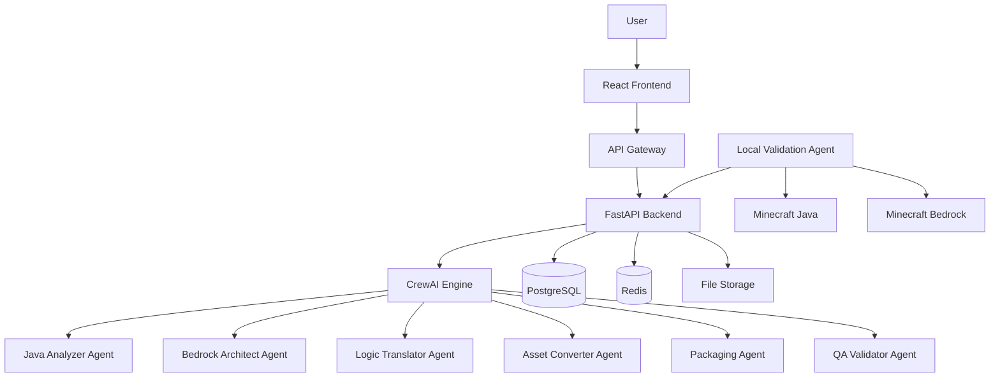

# ARCHITECTURE

> ## Overview

ModPorter AI follows a microservices architecture designed for scalability and maintainability, implementing the PRD requirements through

## Model
- **Default:** `claude-sonnet-4-5`

## System Prompt
# ModPorter AI Architecture

## Overview

ModPorter AI follows a microservices architecture designed for scalability and maintainability, implementing the PRD requirements through specialized services.

## System Architecture



## Service Responsibilities

### Frontend (React + TypeScript)
**Purpose**: User interface implementing PRD visual learning requirements

**Key Components**:
- `ConversionUpload`: PRD Feature 1 implementation
- `ConversionReport`: PRD Feature 3 implementation  
- `ProgressTracker`: Real-time conversion status
- `SmartAssumptionsDisplay`: Visual explanation of AI decisions

**Technologies**: React 18, TypeScript, React Router, Axios

### Backend (FastAPI + Python)
**Purpose**: API orchestration and business logic coordination

**Key Responsibilities**:
- File upload handling and validation
- Conversion workflow coordination
- User session management
- Rate limiting and security

**Technologies**: FastAPI, Pydantic, SQLAlchemy, Redis

### AI Engine (CrewAI + LangChain)
**Purpose**: Core conversion intelligence implementing PRD Feature 2

**Agent Architecture**:
```
Java Analyzer → Bedrock Architect → Logic Translator
                      ↓
Asset Converter ← Packaging Agent ←

*[truncated — see source for full prompt]*