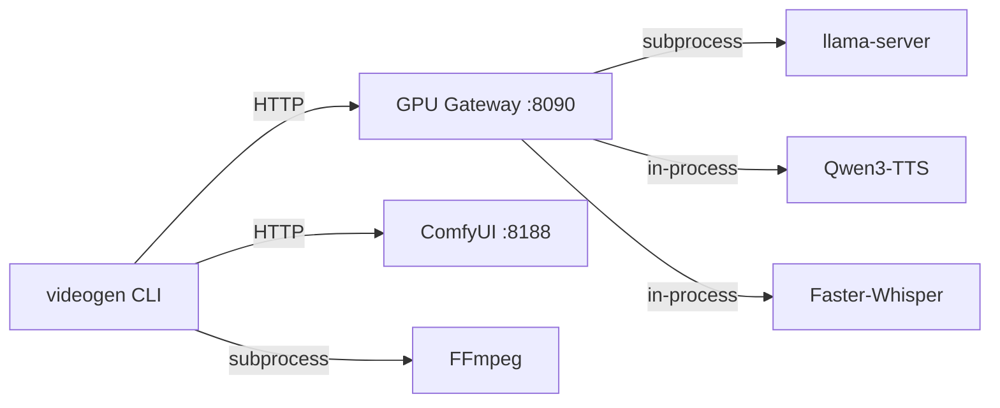

# Dependencies

Videogen orchestrates several external services. All run locally on the homelab.

## System Requirements

| Component | Minimum | Recommended |
|-----------|---------|-------------|
| GPU | NVIDIA with 8GB VRAM | RTX 3070 or better |
| CUDA | 12.x+ | 13.1 |
| RAM | 16GB | 32GB |
| Disk | 20GB free | 50GB free (models + output) |
| OS | Linux (Ubuntu 22.04+) | Linux Mint / Ubuntu |

## Python Dependencies

Installed via `uv sync` from `pyproject.toml`:

| Package | Version | Purpose |
|---------|---------|---------|
| `httpx` | >=0.27 | Async HTTP client for GPU Gateway + ComfyUI APIs |
| `pydantic` | >=2.0 | Data models (Scene, Script, WordTimestamp) |
| `pydantic-settings` | >=2.0 | Environment variable configuration |
| `typer` | >=0.12 | CLI framework |
| `rich` | >=13.0 | Terminal progress bars and formatting |
| `websockets` | >=13.0 | ComfyUI WebSocket communication |

### Dev dependencies

| Package | Purpose |
|---------|---------|
| `ruff` | Linting + formatting |
| `mypy` | Type checking |
| `pytest` | Unit tests |

## External Services

### GPU Gateway

**Repository**: Local service at `~/projects/gpu-gateway/`
**Service**: `systemctl --user status gpu-gateway`
**URL**: `http://localhost:8090`

Provides three models via FastAPI:

| Model | Type | VRAM | Endpoint |
|-------|------|------|----------|
| Qwen3.5-9b | LLM | ~7.7GB | `POST /v1/chat/completions` |
| Qwen3-TTS 1.7B | TTS | ~1.7GB | `POST /v1/audio/speech` |
| Faster-Whisper Medium | STT | ~1.5GB | `POST /v1/audio/transcriptions` |

Models are loaded on-demand and auto-unloaded after 5 minutes idle.

**Setup**:
```bash
cd ~/projects/gpu-gateway
systemctl --user enable gpu-gateway
systemctl --user start gpu-gateway
```

### ComfyUI

**Location**: `~/ComfyUI/`
**URL**: `http://localhost:8188` (started by videogen on demand)

Image generation via Stable Diffusion XL.

**Required checkpoint**:

| File | Size | Location |
|------|------|----------|
| `sd_xl_base_1.0.safetensors` | 6.5GB | `~/ComfyUI/models/checkpoints/` |

```bash
# Download
huggingface-cli download stabilityai/stable-diffusion-xl-base-1.0 \
  sd_xl_base_1.0.safetensors \
  --local-dir ~/ComfyUI/models/checkpoints/ \
  --local-dir-use-symlinks False
```

**Python**: ComfyUI uses its own venv at `~/ComfyUI/venv/`

**CUDA/Torch**: ComfyUI needs PyTorch with CUDA support in its venv.

### FFmpeg

**Version**: 8.0+ required
**Path**: `/home/linuxbrew/.linuxbrew/bin/ffmpeg`

Required features:

| Feature | Used for |
|---------|----------|
| `libx264` | Video encoding (H.264) |
| `libass` | ASS subtitle rendering |
| `zoompan` | Ken Burns effects |
| `aac` | Audio encoding |

```bash
# Verify
ffmpeg -version | head -1
ffmpeg -filters 2>/dev/null | grep -c "zoompan\|ass"
# Should output: 2
```

### Fonts

For subtitle rendering, install **Montserrat Bold**:

```bash
sudo apt install fonts-montserrat
```

Or download from [Google Fonts](https://fonts.google.com/specimen/Montserrat).

## Network Architecture



All communication is localhost or LAN. No external API calls required.

## Disk Space

| Item | Size | Notes |
|------|------|-------|
| SDXL checkpoint | 6.5GB | `~/ComfyUI/models/checkpoints/` |
| Qwen3.5-9b GGUF | ~7.7GB | Managed by GPU Gateway |
| Qwen3-TTS | ~3.4GB | Managed by GPU Gateway |
| Whisper Medium | ~1.5GB | Auto-downloaded by faster-whisper |
| Per video output | ~10-50MB | Images + audio + final MP4 |
| Work directory | ~100-300MB | Cleaned after generation |