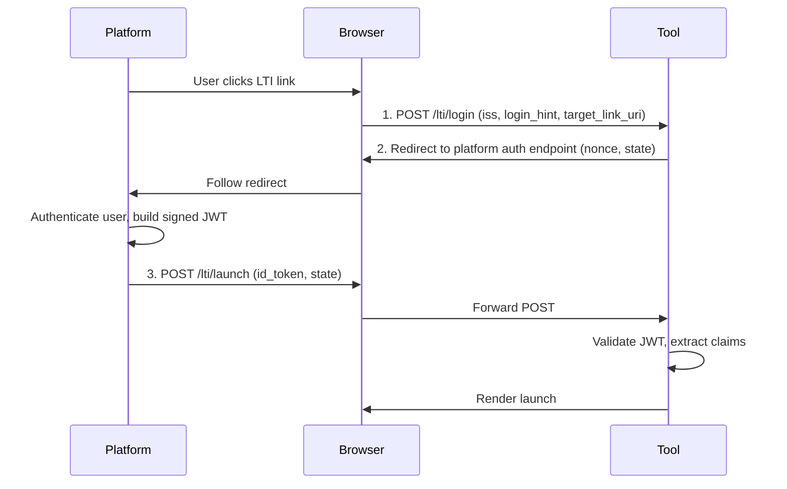

# Concepts

> LTI 1.3 defines how learning platforms connect with external tools.

## Model
- **Default:** `claude-sonnet-4-5`

## System Prompt
# LTI Advantage Concepts

LTI 1.3 defines how learning platforms connect with external tools.
Understanding these concepts will help you configure Ltix, implement
your storage adapter, and debug launch issues. If you're already
familiar with LTI 1.3, skip ahead to
[How Ltix fits in](#how-ltix-fits-in).

## What is LTI?

Learning Tools Interoperability (LTI) connects learning platforms
(like Canvas, Moodle, or Blackboard) with external tools (like a
quiz engine, coding sandbox, or video player). When a student clicks
a link in their course, the platform launches the tool with
information about who the user is, what course they're in, and what
role they have.

LTI 1.3 uses OpenID Connect (OIDC) for the launch flow and signed
JWTs for the data payload.

## Launch flow

An LTI launch is a three-step browser redirect:

1. **Login initiation** — the platform tells the tool "a user wants to
   launch." The tool doesn't know who yet — it just gets the platform's
   identity and a hint. Ltix handles this in `handle_login/3`.

2. **Authorization redirect** — the tool sends the browser to the
   platform's auth endpoint with a nonce and state parameter. The
   platform authenticates the user and builds a signed JWT.

3. **Launch** — the platform POSTs the signed JWT back to the tool.
   The tool validates the signature, checks the nonce, and extracts the
   launch data. Ltix handles this in `handle_callback/3`.

The state parameter (stored in the session between steps 1 and 3)
provides CSRF prot

*[truncated — see source for full prompt]*