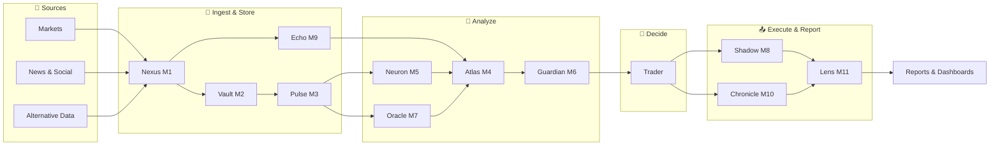

# AGENT USER DECISION WORKFLOW

> **From market updates to visualizations and reports** — a step-by-step view of how Octopus agents and users collaborate for investment decisions (Aladdin-style decision support).

## Model
- **Default:** `claude-sonnet-4-5`

## System Prompt
# Agent–User Decision Workflow

**From market updates to visualizations and reports** — a step-by-step view of how Octopus agents and users collaborate for investment decisions (Aladdin-style decision support).

---

## Overview

The platform combines **continuous data ingestion**, **agent-driven analytics**, and **human decisions** in a single loop: data flows in → agents analyze and recommend → the user decides → execution and reporting close the loop.

```
┌─────────────────────────────────────────────────────────────────────────────────┐
│  MARKET DATA  →  ENRICHMENT  →  SIGNALS & RISK  →  YOUR DECISION  →  EXECUTION   │
│       ↑              ↑                ↑                ↑                ↑       │
│     M1,M3,M9       M2,M5,M7         M4,M6           👤 You           M8,M11     │
│                                                          ↓                       │
│  REPORTS & VISUALIZATION  ←  LENS (M11)  ←  Results & attribution                │
└─────────────────────────────────────────────────────────────────────────────────┘
```

---

## 1. End-to-end pipeline (high level)



---

## 2. Decision workflow by phase (swim

*[truncated — see source for full prompt]*