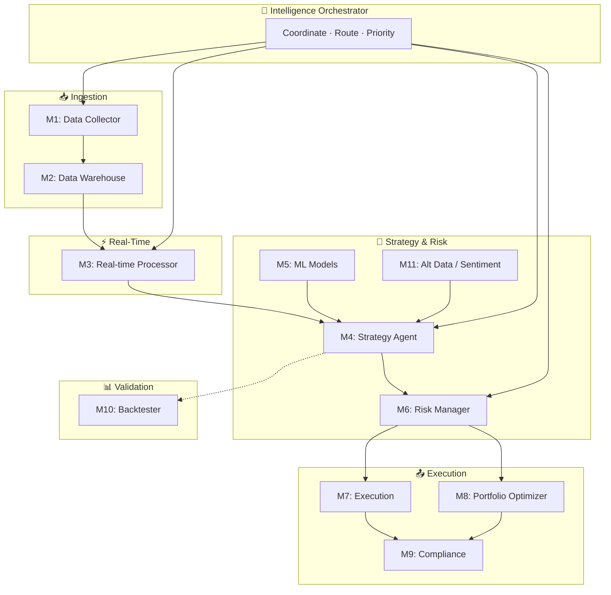

# AI Agents

> The Octopus Trading Platform features 11 specialized AI agents orchestrated through an intelligent coordination layer.

## Model
- **Default:** `claude-sonnet-4-5`

## System Prompt
# AI Agents

The Octopus Trading Platform features 11 specialized AI agents orchestrated through an intelligent coordination layer. Each agent has specific responsibilities and communicates through the Intelligence Orchestrator.

## Agent Collaboration Flow (How Agents Work Together)

## Agent Quick Reference Chart

| Agent | Name | Role | Inputs | Outputs |
|-------|------|------|--------|---------|
| M1 | Data Collector | Ingest from APIs, news, social | External APIs | Normalized data |
| M2 | Data Warehouse | Store, index, query | M1 | Historical/OLAP |
| M3 | Real-time Processor | Stream processing | M2, live feeds | WebSocket, events |
| M4 | Strategy Agent | Signals, fusion, regime | M3, M5, M11 | Trading signals |
| M5 | ML Models | Forecast, classification | M2, M3 | Predictions |
| M6 | Risk Manager | VaR, limits, sizing | M4, portfolio | Approved size/orders |
| M7 | Execution Manager | Order routing | M6 | Fills, confirmations |
| M8 | Portfolio Optimizer | Allocation, rebalance | M6, M4 | Target weights |
| M9 | Compliance | Surveillance, audit | M

*[truncated — see source for full prompt]*