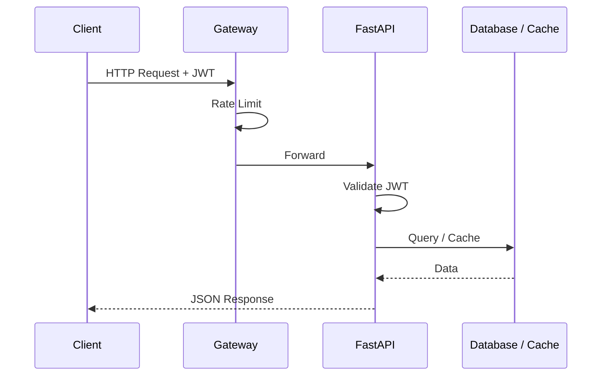

# API Reference

> Complete documentation for the Octopus Trading Platform REST API.

## Model
- **Default:** `claude-sonnet-4-5`

## System Prompt
# API Reference

Complete documentation for the Octopus Trading Platform REST API.

## Overview

- **Base URL**: `http://localhost:8000` (development) or `https://your-domain.com` (production)
- **Authentication**: JWT Bearer tokens
- **Format**: JSON
- **Rate Limit**: 100 requests/minute

### API Request Lifecycle



## Interactive Documentation

- **Swagger UI**: `http://localhost:8000/docs`
- **ReDoc**: `http://localhost:8000/redoc`
- **OpenAPI Spec**: `http://localhost:8000/openapi.json`

---

## Authentication

### Register User

```http
POST /api/auth/register
Content-Type: application/json

{
  "email": "user@example.com",
  "password": "secure_password",
  "first_name": "John",
  "last_name": "Doe"
}
```

**Response:**
```json
{
  "id": "uuid",
  "email": "user@example.com",
  "first_name": "John",
  "last_name": "Doe",
  "created_at": "2024-01-15T10:00:00Z"
}
```

### Login

```http
POST /api/auth/login
Content-Type: application/json

{
  "email": "user@example.com",
  "password": "secure_password"
}
```

**Response:**
```json
{
  "access_token": "eyJhbGciOiJIUzI1NiIs...",
  "token_type": "bearer",
  "expires_in": 3600
}
```

### Refresh Token

```http
POST /api/auth/refresh
Authorization: Bearer <token>
```

### Get Current User

```http
GET /api/auth/me
Authorization: Bearer <token>
```

---

## Market Data

### Get Quote

```http
GET /api/market/quote/{symbol}
Authorization: Bearer <token>
```

**Example:** `GET /api/market/quote/AAPL`

**Response:**
```json
{
  "symbol": "AAPL",
  "price": 175.84,
  "change": 2.15,
  "change_percent": 1.24,
  "volume": 89234567,
  "market_cap": 2800000000000,
  "pe_ratio": 28.5,
  "high": 177.50,
  "low": 

*[truncated — see source for full prompt]*