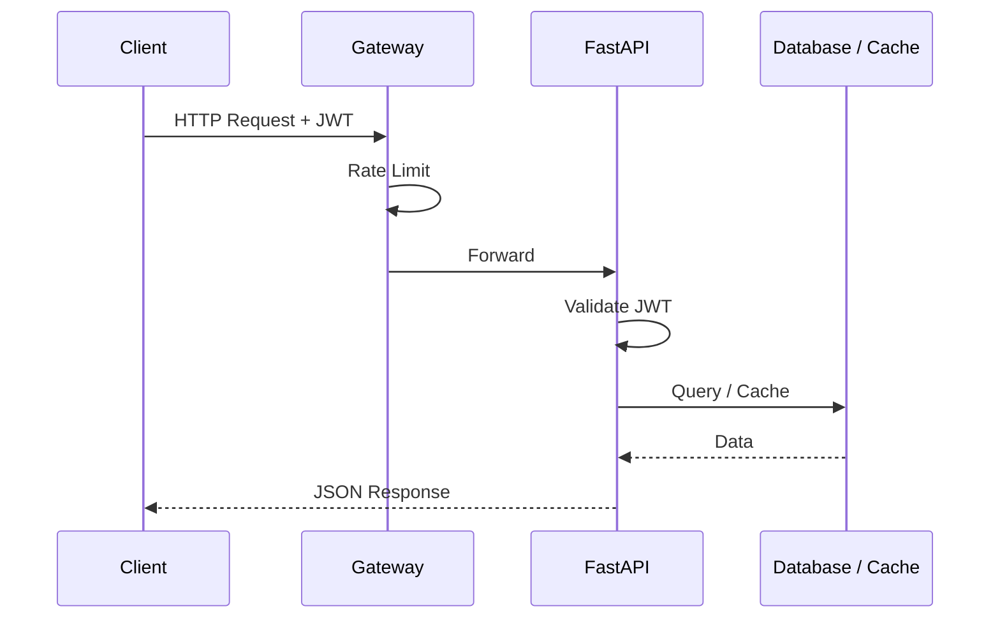

# API Reference

Complete documentation for the Octopus Trading Platform REST API.

## Overview

- **Base URL**: `http://localhost:8000` (development) or `https://your-domain.com` (production)
- **Authentication**: JWT Bearer tokens
- **Format**: JSON
- **Rate Limit**: 100 requests/minute

### API Request Lifecycle



## Interactive Documentation

- **Swagger UI**: `http://localhost:8000/docs`
- **ReDoc**: `http://localhost:8000/redoc`
- **OpenAPI Spec**: `http://localhost:8000/openapi.json`

---

## Authentication

### Register User

```http
POST /api/auth/register
Content-Type: application/json

{
  "email": "user@example.com",
  "password": "secure_password",
  "first_name": "John",
  "last_name": "Doe"
}
```

**Response:**
```json
{
  "id": "uuid",
  "email": "user@example.com",
  "first_name": "John",
  "last_name": "Doe",
  "created_at": "2024-01-15T10:00:00Z"
}
```

### Login

```http
POST /api/auth/login
Content-Type: application/json

{
  "email": "user@example.com",
  "password": "secure_password"
}
```

**Response:**
```json
{
  "access_token": "eyJhbGciOiJIUzI1NiIs...",
  "token_type": "bearer",
  "expires_in": 3600
}
```

### Refresh Token

```http
POST /api/auth/refresh
Authorization: Bearer <token>
```

### Get Current User

```http
GET /api/auth/me
Authorization: Bearer <token>
```

---

## Market Data

### Get Quote

```http
GET /api/market/quote/{symbol}
Authorization: Bearer <token>
```

**Example:** `GET /api/market/quote/AAPL`

**Response:**
```json
{
  "symbol": "AAPL",
  "price": 175.84,
  "change": 2.15,
  "change_percent": 1.24,
  "volume": 89234567,
  "market_cap": 2800000000000,
  "pe_ratio": 28.5,
  "high": 177.50,
  "low": 173.20,
  "open": 174.00,
  "previous_close": 173.69,
  "timestamp": "2024-01-15T16:30:00Z"
}
```

### Get Historical Data

```http
GET /api/market/historical/{symbol}?period=1y&interval=1d
Authorization: Bearer <token>
```

**Parameters:**
| Parameter | Type | Default | Description |
|-----------|------|---------|-------------|
| period | string | 1y | Time period (1d, 5d, 1mo, 3mo, 6mo, 1y, 2y, 5y, max) |
| interval | string | 1d | Data interval (1m, 5m, 15m, 1h, 1d, 1wk, 1mo) |

**Response:**
```json
{
  "symbol": "AAPL",
  "period": "1y",
  "interval": "1d",
  "data": [
    {
      "date": "2024-01-15",
      "open": 174.00,
      "high": 177.50,
      "low": 173.20,
      "close": 175.84,
      "volume": 89234567
    }
  ]
}
```

### Search Symbols

```http
GET /api/market/search?q=apple
Authorization: Bearer <token>
```

### Get Trending

```http
GET /api/market/trending
Authorization: Bearer <token>
```

---

## Portfolio Management

### List Portfolios

```http
GET /api/portfolios/
Authorization: Bearer <token>
```

**Response:**
```json
{
  "portfolios": [
    {
      "id": "uuid",
      "name": "Growth Portfolio",
      "total_value": 150000.00,
      "cash_balance": 25000.00,
      "day_change": 1250.00,
      "day_change_percent": 0.84,
      "positions_count": 12,
      "created_at": "2024-01-01T00:00:00Z"
    }
  ]
}
```

### Create Portfolio

```http
POST /api/portfolios/
Authorization: Bearer <token>
Content-Type: application/json

{
  "name": "Growth Portfolio",
  "description": "Long-term growth focused portfolio",
  "initial_cash": 100000
}
```

### Get Portfolio Details

```http
GET /api/portfolios/{portfolio_id}
Authorization: Bearer <token>
```

### Update Portfolio

```http
PUT /api/portfolios/{portfolio_id}
Authorization: Bearer <token>
Content-Type: application/json

{
  "name": "Updated Portfolio Name",
  "description": "Updated description"
}
```

### Delete Portfolio

```http
DELETE /api/portfolios/{portfolio_id}
Authorization: Bearer <token>
```

---

## Positions

### List Positions

```http
GET /api/portfolios/{portfolio_id}/positions
Authorization: Bearer <token>
```

**Response:**
```json
{
  "positions": [
    {
      "id": "uuid",
      "symbol": "AAPL",
      "quantity": 100,
      "avg_cost": 150.00,
      "current_price": 175.84,
      "market_value": 17584.00,
      "unrealized_pnl": 2584.00,
      "unrealized_pnl_percent": 17.23,
      "weight": 11.72
    }
  ]
}
```

### Add Position

```http
POST /api/portfolios/{portfolio_id}/positions
Authorization: Bearer <token>
Content-Type: application/json

{
  "symbol": "AAPL",
  "quantity": 100,
  "price": 175.00
}
```

### Close Position

```http
DELETE /api/positions/{position_id}
Authorization: Bearer <token>
```

---

## Orders

### Place Order

```http
POST /api/orders/
Authorization: Bearer <token>
Content-Type: application/json

{
  "portfolio_id": "uuid",
  "symbol": "AAPL",
  "side": "buy",
  "order_type": "limit",
  "quantity": 100,
  "price": 175.00
}
```

**Order Types:**
- `market` - Execute immediately at market price
- `limit` - Execute at specified price or better
- `stop` - Trigger at stop price, then execute as market
- `stop_limit` - Trigger at stop price, then execute as limit

**Response:**
```json
{
  "id": "uuid",
  "portfolio_id": "uuid",
  "symbol": "AAPL",
  "side": "buy",
  "order_type": "limit",
  "quantity": 100,
  "price": 175.00,
  "status": "pending",
  "created_at": "2024-01-15T10:00:00Z"
}
```

### List Orders

```http
GET /api/orders/?status=pending
Authorization: Bearer <token>
```

### Get Order Details

```http
GET /api/orders/{order_id}
Authorization: Bearer <token>
```

### Cancel Order

```http
PUT /api/orders/{order_id}/cancel
Authorization: Bearer <token>
```

---

## Risk Management

### Portfolio Risk Metrics

```http
GET /api/risk/portfolio/{portfolio_id}
Authorization: Bearer <token>
```

**Response:**
```json
{
  "portfolio_id": "uuid",
  "var_95": 2500.00,
  "var_99": 3800.00,
  "var_999": 5200.00,
  "sharpe_ratio": 1.85,
  "sortino_ratio": 2.10,
  "max_drawdown": -0.12,
  "beta": 1.15,
  "correlation_matrix": {...},
  "sector_exposure": {...}
}
```

### Value at Risk Calculation

```http
POST /api/risk/var
Authorization: Bearer <token>
Content-Type: application/json

{
  "positions": [
    {"symbol": "AAPL", "value": 17584},
    {"symbol": "GOOGL", "value": 25000}
  ],
  "confidence_level": 0.99,
  "time_horizon": 10
}
```

### Stress Test

```http
POST /api/risk/stress-test
Authorization: Bearer <token>
Content-Type: application/json

{
  "portfolio_id": "uuid",
  "scenarios": ["2008_financial_crisis", "covid_crash", "custom"]
}
```

---

## AI/ML Services

### Price Prediction

```http
POST /api/ml/predict
Authorization: Bearer <token>
Content-Type: application/json

{
  "symbol": "AAPL",
  "horizon": "7d",
  "model": "prophet"
}
```

**Response:**
```json
{
  "symbol": "AAPL",
  "predictions": [
    {
      "date": "2024-01-16",
      "predicted_price": 176.50,
      "lower_bound": 173.00,
      "upper_bound": 180.00,
      "confidence": 0.85
    }
  ]
}
```

### Sentiment Analysis

```http
GET /api/ml/sentiment/{symbol}
Authorization: Bearer <token>
```

**Response:**
```json
{
  "symbol": "AAPL",
  "overall_sentiment": 0.72,
  "sentiment_label": "bullish",
  "news_sentiment": 0.65,
  "social_sentiment": 0.78,
  "analyzed_sources": 45,
  "timestamp": "2024-01-15T10:00:00Z"
}
```

### Strategy Backtesting

```http
POST /api/ml/backtest
Authorization: Bearer <token>
Content-Type: application/json

{
  "strategy": "momentum",
  "symbol": "AAPL",
  "start_date": "2023-01-01",
  "end_date": "2024-01-01",
  "initial_capital": 100000
}
```

---

## WebSocket API

### Connection

```javascript
const ws = new WebSocket('ws://localhost:8000/ws/market-data');
ws.onopen = () => {
  ws.send(JSON.stringify({
    type: 'subscribe',
    symbols: ['AAPL', 'GOOGL', 'MSFT']
  }));
};
```

### Available Channels

| Channel | Description |
|---------|-------------|
| `/ws/market-data` | Real-time market data |
| `/ws/portfolio/{id}` | Portfolio updates |
| `/ws/notifications` | Alert notifications |
| `/ws/trading` | Trade execution updates |

### Message Format

**Subscribe:**
```json
{
  "type": "subscribe",
  "symbols": ["AAPL", "GOOGL"]
}
```

**Unsubscribe:**
```json
{
  "type": "unsubscribe",
  "symbols": ["AAPL"]
}
```

**Data Message:**
```json
{
  "type": "quote",
  "symbol": "AAPL",
  "price": 175.84,
  "change": 2.15,
  "volume": 89234567,
  "timestamp": "2024-01-15T16:30:00.123Z"
}
```

---

## Error Handling

### Error Response Format

```json
{
  "error": "ValidationError",
  "message": "Invalid symbol format",
  "details": {
    "field": "symbol",
    "code": "INVALID_FORMAT"
  },
  "timestamp": "2024-01-15T10:00:00Z",
  "request_id": "req_abc123"
}
```

### HTTP Status Codes

| Code | Description |
|------|-------------|
| 200 | Success |
| 201 | Created |
| 400 | Bad Request |
| 401 | Unauthorized |
| 403 | Forbidden |
| 404 | Not Found |
| 422 | Validation Error |
| 429 | Rate Limit Exceeded |
| 500 | Internal Server Error |

---

## Rate Limiting

- **Default**: 100 requests per minute
- **Burst**: 20 requests in 10 seconds

**Headers:**
```
X-RateLimit-Limit: 100
X-RateLimit-Remaining: 95
X-RateLimit-Reset: 1705312800
```

---

## SDKs

### Python

```python
from octopus_trading import OctopusClient

client = OctopusClient(
    base_url="http://localhost:8000",
    api_key="your-api-key"
)

# Get quote
quote = client.market.get_quote("AAPL")
print(f"AAPL: ${quote.price}")

# Create portfolio
portfolio = client.portfolios.create(
    name="My Portfolio",
    initial_cash=100000
)
```

### JavaScript

```javascript
import { OctopusTrading } from '@octopus/trading-sdk';

const client = new OctopusTrading({
  baseUrl: 'http://localhost:8000',
  apiKey: 'your-api-key'
});

// Get portfolio
const portfolio = await client.portfolios.get('portfolio-id');

// Subscribe to real-time data
client.subscribe('AAPL', (quote) => {
  console.log(`AAPL: $${quote.price}`);
});
```

---

## Next Steps

- [[Architecture]] - System architecture
- [[AI Agents]] - AI agent endpoints
- [[Database]] - Data models