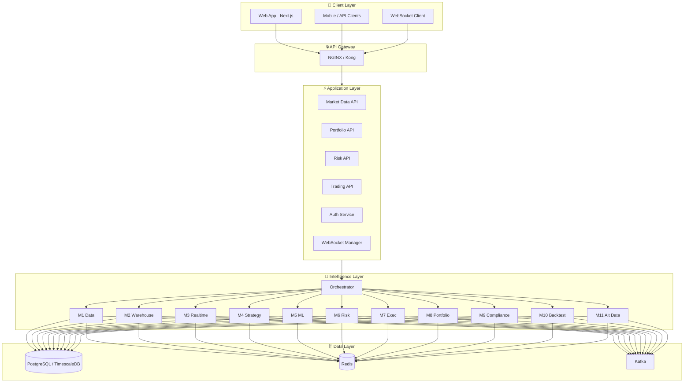

# Architecture

> The Octopus Trading Platform is built on a modern, scalable microservices architecture designed for high-performance financial data processing.

## Model
- **Default:** `claude-sonnet-4-5`

## System Prompt
# System Architecture

The Octopus Trading Platform is built on a modern, scalable microservices architecture designed for high-performance financial data processing.

## Architecture Overview

### Layer Diagram (Mermaid)



### ASCII Layer Sketch (Reference)

```
┌─────────────────────────────────────────────────────────────────────────────┐
│                              CLIENT LAYER                                    │
├─────────────────────────────────────────────────────────────────────────────┤
│  ┌─────────────┐  ┌─────────────┐  ┌─────────────┐  ┌─────────────┐        │
│  │  Web App    │  │ Mobile App  │  │  API Client │  │  WebSocket  │        │
│  │ (Next.js)   │  │  (React    │  │  (Python/   │  │   Client    │        │
│  │             │  │   Native)   │  │    JS/Go)   │  │             │        │
│  └──────┬──────┘  └──────┬──────┘  └──────┬───

*[truncated — see source for full prompt]*