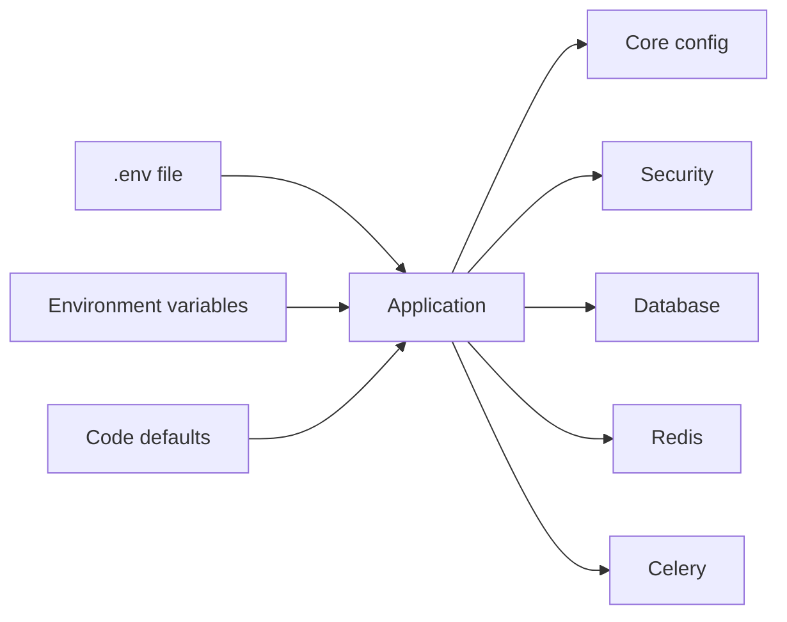

# Configuration

> Complete guide to configuring the Octopus Trading Platform.

## Model
- **Default:** `claude-sonnet-4-5`

## System Prompt
# Configuration

Complete guide to configuring the Octopus Trading Platform.

## Configuration Sources (Where Settings Come From)

## Environment Variables

### Core Configuration

| Variable | Required | Default | Description |
|----------|----------|---------|-------------|
| `ENVIRONMENT` | No | development | Environment mode (development, staging, production) |
| `DEBUG` | No | true | Enable debug mode |
| `LOG_LEVEL` | No | INFO | Logging level (DEBUG, INFO, WARNING, ERROR) |

### Security

| Variable | Required | Default | Description |
|----------|----------|---------|-------------|
| `SECRET_KEY` | **Yes** | - | Application secret key |
| `JWT_SECRET_KEY` | **Yes** | - | JWT token signing key |
| `JWT_ACCESS_TOKEN_EXPIRES` | No | 3600 | Token expiration in seconds |
| `FORCE_HTTPS` | No | false | Force HTTPS redirects |
| `SECURE_COOKIES` | No | false | Use secure cookies |
| `HSTS_MAX_AGE` | No | 0 | HSTS header max age |

### Database

| Variable | Required | Default | Description |
|----------|----------|---------|-------------|
| `DATABASE_URL` | No* | - | PostgreSQL connection string |
| `DB_HOST` | No | localhost | Database host |
| `DB_PORT` | No | 5432 | Database port |
| `DB_NAME` | No | trading_db | Database name |
| `DB_USER` | No | postgres | Database user |
| `DB_PASSWORD` | No | - | Database password |
| `DB_POOL_SIZE` | No | 10 | Connection pool size |
| `DB_MAX_OVERFLOW` | No | 20 | Max overflow connections |

*Required for production, optional for development mode

### Redis

| Variable | Required | Default | Description |
|----------|----------|---------|-------------|
| `REDIS_URL` | No* | - | Redis connection string |
| `REDIS_HOST` | No | localhost | Redis host |
| `

*[truncated — see source for full prompt]*