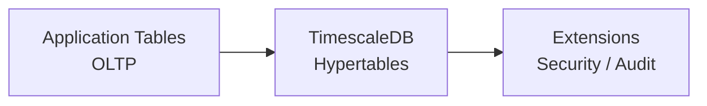
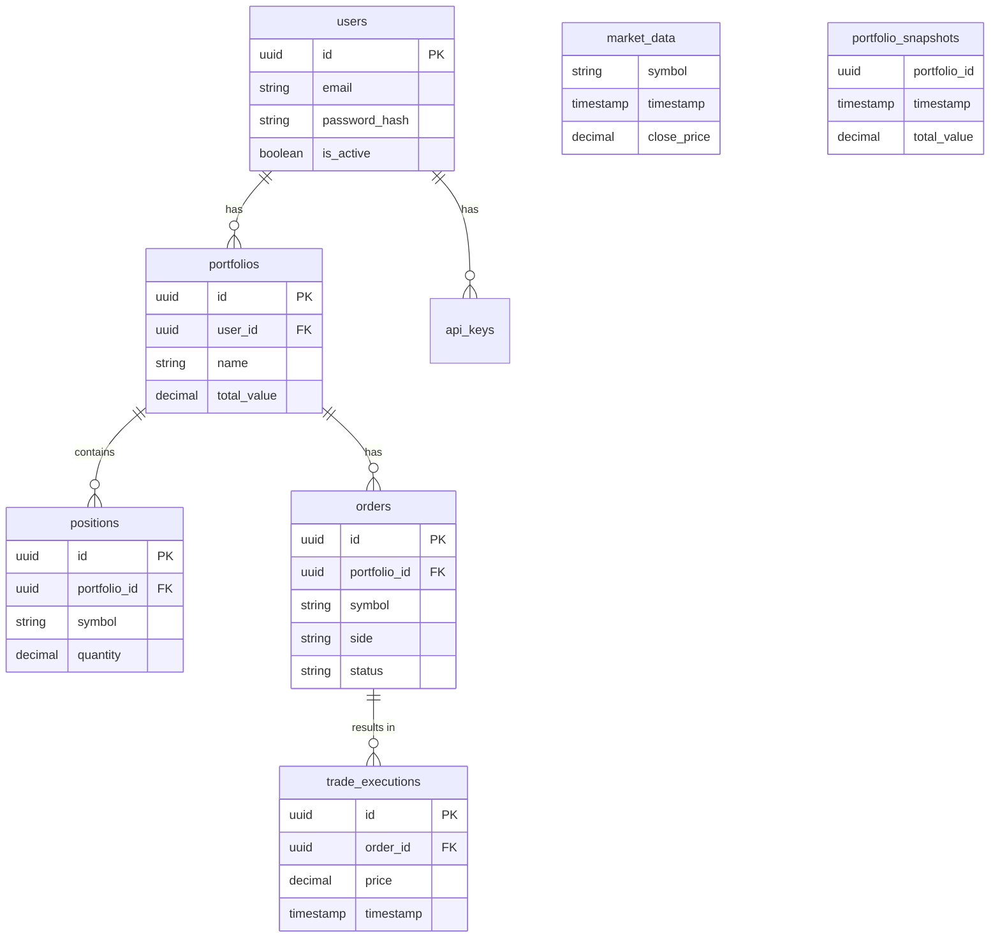

# Database Schema

The Octopus Trading Platform uses PostgreSQL 15 with TimescaleDB extension for time-series data optimization.

## Architecture Overview



*ASCII:*
```
┌─────────────────┐    ┌─────────────────┐    ┌─────────────────┐
│   Application   │    │   TimescaleDB   │    │   Extensions    │
│   Tables        │ -> │   Hypertables   │ -> │   Security      │
│   (OLTP)        │    │   (Time-series) │    │   (Audit/Logs)  │
└─────────────────┘    └─────────────────┘    └─────────────────┘
```

---

## Core Tables

### Users & Authentication

#### `users`
```sql
CREATE TABLE users (
    id UUID PRIMARY KEY DEFAULT uuid_generate_v4(),
    email VARCHAR(255) UNIQUE NOT NULL,
    password_hash VARCHAR(255) NOT NULL,
    first_name VARCHAR(100),
    last_name VARCHAR(100),
    is_active BOOLEAN DEFAULT true,
    is_verified BOOLEAN DEFAULT false,
    roles TEXT[] DEFAULT ARRAY['user'],
    permissions TEXT[] DEFAULT ARRAY[],
    created_at TIMESTAMPTZ DEFAULT NOW(),
    updated_at TIMESTAMPTZ DEFAULT NOW(),
    last_login_at TIMESTAMPTZ,
    failed_login_attempts INTEGER DEFAULT 0,
    locked_until TIMESTAMPTZ
);
```

#### `api_keys`
```sql
CREATE TABLE api_keys (
    id UUID PRIMARY KEY DEFAULT uuid_generate_v4(),
    user_id UUID REFERENCES users(id) ON DELETE CASCADE,
    key_hash VARCHAR(64) UNIQUE NOT NULL,
    name VARCHAR(100) NOT NULL DEFAULT 'API Key',
    is_active BOOLEAN DEFAULT true,
    permissions TEXT[] DEFAULT ARRAY[],
    last_used_at TIMESTAMPTZ,
    expires_at TIMESTAMPTZ,
    created_at TIMESTAMPTZ DEFAULT NOW()
);
```

---

### Portfolio Management

#### `portfolios`
```sql
CREATE TABLE portfolios (
    id UUID PRIMARY KEY DEFAULT uuid_generate_v4(),
    user_id UUID REFERENCES users(id) ON DELETE CASCADE,
    name VARCHAR(255) NOT NULL,
    description TEXT,
    total_value DECIMAL(20, 2) DEFAULT 0.00,
    cash_balance DECIMAL(20, 2) DEFAULT 0.00,
    is_active BOOLEAN DEFAULT true,
    created_at TIMESTAMPTZ DEFAULT NOW(),
    updated_at TIMESTAMPTZ DEFAULT NOW()
);
```

#### `positions`
```sql
CREATE TABLE positions (
    id UUID PRIMARY KEY DEFAULT uuid_generate_v4(),
    portfolio_id UUID REFERENCES portfolios(id) ON DELETE CASCADE,
    symbol VARCHAR(20) NOT NULL,
    quantity DECIMAL(20, 8) NOT NULL,
    avg_cost DECIMAL(20, 2) NOT NULL,
    current_price DECIMAL(20, 2),
    market_value DECIMAL(20, 2),
    unrealized_pnl DECIMAL(20, 2),
    position_type VARCHAR(20) DEFAULT 'long',
    created_at TIMESTAMPTZ DEFAULT NOW(),
    updated_at TIMESTAMPTZ DEFAULT NOW(),
    
    UNIQUE(portfolio_id, symbol)
);
```

#### `orders`
```sql
CREATE TABLE orders (
    id UUID PRIMARY KEY DEFAULT uuid_generate_v4(),
    portfolio_id UUID REFERENCES portfolios(id) ON DELETE CASCADE,
    symbol VARCHAR(20) NOT NULL,
    side VARCHAR(10) NOT NULL CHECK (side IN ('buy', 'sell')),
    order_type VARCHAR(20) NOT NULL,
    quantity DECIMAL(20, 8) NOT NULL CHECK (quantity > 0),
    price DECIMAL(20, 2),
    stop_price DECIMAL(20, 2),
    filled_quantity DECIMAL(20, 8) DEFAULT 0,
    avg_fill_price DECIMAL(20, 2),
    status VARCHAR(20) DEFAULT 'pending',
    external_order_id VARCHAR(100),
    broker VARCHAR(50),
    commission DECIMAL(10, 2) DEFAULT 0,
    created_at TIMESTAMPTZ DEFAULT NOW(),
    updated_at TIMESTAMPTZ DEFAULT NOW(),
    filled_at TIMESTAMPTZ
);
```

---

## Time-Series Tables (TimescaleDB)

### `market_data` (Hypertable)
```sql
CREATE TABLE market_data (
    symbol VARCHAR(20) NOT NULL,
    timestamp TIMESTAMPTZ NOT NULL,
    open_price DECIMAL(20, 2),
    high_price DECIMAL(20, 2),
    low_price DECIMAL(20, 2),
    close_price DECIMAL(20, 2),
    volume BIGINT,
    vwap DECIMAL(20, 2),
    created_at TIMESTAMPTZ DEFAULT NOW()
);

-- Convert to hypertable
SELECT create_hypertable('market_data', 'timestamp');
```

### `portfolio_snapshots` (Hypertable)
```sql
CREATE TABLE portfolio_snapshots (
    portfolio_id UUID NOT NULL,
    timestamp TIMESTAMPTZ NOT NULL,
    total_value DECIMAL(20, 2) NOT NULL,
    cash_balance DECIMAL(20, 2) NOT NULL,
    day_change DECIMAL(20, 2),
    day_change_percent DECIMAL(8, 4),
    positions_count INTEGER,
    created_at TIMESTAMPTZ DEFAULT NOW()
);

SELECT create_hypertable('portfolio_snapshots', 'timestamp');
```

### `trade_executions` (Hypertable)
```sql
CREATE TABLE trade_executions (
    id UUID PRIMARY KEY DEFAULT uuid_generate_v4(),
    order_id UUID REFERENCES orders(id),
    portfolio_id UUID NOT NULL,
    symbol VARCHAR(20) NOT NULL,
    side VARCHAR(10) NOT NULL,
    quantity DECIMAL(20, 8) NOT NULL,
    price DECIMAL(20, 2) NOT NULL,
    commission DECIMAL(10, 2) DEFAULT 0,
    timestamp TIMESTAMPTZ NOT NULL,
    broker VARCHAR(50),
    execution_id VARCHAR(100),
    created_at TIMESTAMPTZ DEFAULT NOW()
);

SELECT create_hypertable('trade_executions', 'timestamp');
```

---

## Security & Audit Tables

### `audit_log` (Hypertable)
```sql
CREATE TABLE audit_log (
    id UUID PRIMARY KEY DEFAULT uuid_generate_v4(),
    user_id UUID REFERENCES users(id),
    action VARCHAR(100) NOT NULL,
    resource_type VARCHAR(50) NOT NULL,
    resource_id VARCHAR(100),
    old_values JSONB,
    new_values JSONB,
    ip_address INET,
    user_agent TEXT,
    timestamp TIMESTAMPTZ NOT NULL DEFAULT NOW(),
    session_id VARCHAR(100)
);

SELECT create_hypertable('audit_log', 'timestamp');
```

### `security_events` (Hypertable)
```sql
CREATE TABLE security_events (
    id UUID PRIMARY KEY DEFAULT uuid_generate_v4(),
    event_type VARCHAR(50) NOT NULL,
    severity VARCHAR(20) NOT NULL,
    user_id UUID REFERENCES users(id),
    ip_address INET,
    details JSONB,
    timestamp TIMESTAMPTZ NOT NULL DEFAULT NOW(),
    resolved_at TIMESTAMPTZ,
    resolved_by UUID REFERENCES users(id)
);

SELECT create_hypertable('security_events', 'timestamp');
```

---

## Analytics & ML Tables

### `predictions`
```sql
CREATE TABLE predictions (
    id UUID PRIMARY KEY DEFAULT uuid_generate_v4(),
    symbol VARCHAR(20) NOT NULL,
    model_name VARCHAR(100) NOT NULL,
    prediction_type VARCHAR(50) NOT NULL,
    predicted_value DECIMAL(20, 6),
    confidence_score DECIMAL(5, 4),
    prediction_horizon VARCHAR(20),
    features JSONB,
    created_at TIMESTAMPTZ DEFAULT NOW(),
    target_date TIMESTAMPTZ
);
```

### `model_performance`
```sql
CREATE TABLE model_performance (
    id UUID PRIMARY KEY DEFAULT uuid_generate_v4(),
    model_name VARCHAR(100) NOT NULL,
    symbol VARCHAR(20),
    metric_name VARCHAR(50) NOT NULL,
    metric_value DECIMAL(10, 6),
    evaluation_date DATE NOT NULL,
    data_period VARCHAR(50),
    created_at TIMESTAMPTZ DEFAULT NOW()
);
```

---

## Indexes

### Primary Indexes
```sql
-- Users
CREATE INDEX idx_users_email ON users(email);
CREATE INDEX idx_users_active ON users(is_active) WHERE is_active = true;

-- Portfolios
CREATE INDEX idx_portfolios_user_id ON portfolios(user_id);
CREATE INDEX idx_portfolios_active ON portfolios(is_active) WHERE is_active = true;

-- Positions
CREATE INDEX idx_positions_portfolio_id ON positions(portfolio_id);
CREATE INDEX idx_positions_symbol ON positions(symbol);

-- Orders
CREATE INDEX idx_orders_portfolio_id ON orders(portfolio_id);
CREATE INDEX idx_orders_symbol ON orders(symbol);
CREATE INDEX idx_orders_status ON orders(status);
CREATE INDEX idx_orders_created_at ON orders(created_at);
```

### TimescaleDB Indexes
```sql
-- Market data
CREATE INDEX idx_market_data_symbol_time ON market_data(symbol, timestamp DESC);
CREATE INDEX idx_market_data_timestamp ON market_data(timestamp DESC);

-- Portfolio snapshots
CREATE INDEX idx_portfolio_snapshots_portfolio_time ON portfolio_snapshots(portfolio_id, timestamp DESC);

-- Trade executions
CREATE INDEX idx_trade_executions_portfolio_time ON trade_executions(portfolio_id, timestamp DESC);
CREATE INDEX idx_trade_executions_symbol_time ON trade_executions(symbol, timestamp DESC);
```

---

## Data Retention Policies

```sql
-- Keep market data for 7 years
SELECT add_retention_policy('market_data', INTERVAL '7 years');

-- Keep portfolio snapshots for 5 years
SELECT add_retention_policy('portfolio_snapshots', INTERVAL '5 years');

-- Keep trade executions permanently (regulatory requirement)
-- No retention policy

-- Keep audit logs for 3 years
SELECT add_retention_policy('audit_log', INTERVAL '3 years');

-- Keep security events for 2 years
SELECT add_retention_policy('security_events', INTERVAL '2 years');
```

---

## Entity Relationship Diagram



*ASCII sketch:*
```
┌────────────┐       ┌──────────────┐       ┌────────────┐
│   users    │───────│  portfolios  │───────│ positions  │
└────────────┘       └──────────────┘       └────────────┘
      │                     │
      │                     │
┌─────▼──────┐       ┌──────▼───────┐
│  api_keys  │       │    orders    │
└────────────┘       └──────────────┘
                            │
                     ┌──────▼───────┐
                     │trade_execut. │
                     └──────────────┘
```

---

## Migration Management

### Alembic Commands

```bash
# Create new migration
alembic revision --autogenerate -m "Add new table"

# Apply migrations
alembic upgrade head

# Rollback one step
alembic downgrade -1

# View migration history
alembic history
```

### Best Practices

1. **Always backup** before running migrations
2. **Test migrations** in staging environment first
3. **Use transactions** for schema changes
4. **Document breaking changes** in migration messages
5. **Monitor performance** after schema changes

---

## Performance Tuning

### Recommended PostgreSQL Settings

```ini
# Memory
shared_buffers = 4GB
effective_cache_size = 12GB
maintenance_work_mem = 1GB
work_mem = 256MB

# Checkpoints
checkpoint_completion_target = 0.9
checkpoint_timeout = 10min
max_wal_size = 4GB

# Connections
max_connections = 200
```

### Useful Queries

```sql
-- Query performance
SELECT query, calls, total_time, mean_time 
FROM pg_stat_statements 
ORDER BY total_time DESC LIMIT 10;

-- Table sizes
SELECT schemaname, tablename, 
       pg_size_pretty(pg_total_relation_size(schemaname||'.'||tablename)) as size
FROM pg_tables 
ORDER BY pg_total_relation_size(schemaname||'.'||tablename) DESC;

-- Index usage
SELECT schemaname, tablename, indexname, idx_scan, idx_tup_read
FROM pg_stat_user_indexes
ORDER BY idx_scan ASC;
```

---

## Next Steps

- [[Architecture]] - System architecture
- [[API Reference]] - API documentation
- [[Deployment]] - Production setup