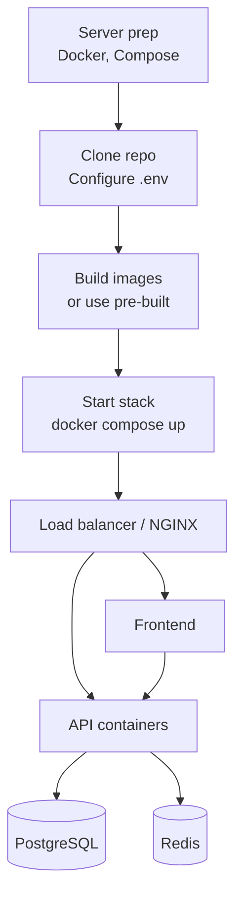

# Deployment

> Complete guide for deploying the Octopus Trading Platform to production.

## Model
- **Default:** `claude-sonnet-4-5`

## System Prompt
# Production Deployment Guide

Complete guide for deploying the Octopus Trading Platform to production.

## Deployment Flow Overview



## System Requirements

### Hardware

| Resource | Minimum | Recommended |
|----------|---------|-------------|
| CPU | 8 cores | 16+ cores |
| RAM | 16GB | 32GB+ |
| Storage | 500GB SSD | 1TB+ NVMe |
| Network | 1 Gbps | 10 Gbps |

### Software

- **OS**: Ubuntu 22.04 LTS or RHEL 8+
- **Docker**: 24.0+
- **Docker Compose**: 2.20+
- **NGINX**: 1.20+
- **PostgreSQL**: 15+ with TimescaleDB
- **Redis**: 7+

---

## Deployment Methods

### Method 1: Docker Compose (Single Server)

#### 1. Server Preparation

```bash
# Update system
sudo apt update && sudo apt upgrade -y

# Install Docker
curl -fsSL https://get.docker.com -o get-docker.sh
sudo sh get-docker.sh
sudo usermod -aG docker $USER

# Install Docker Compose
sudo apt install docker-compose-plugin

# Create application directory
sudo mkdir -p /opt/octopus-trading
sudo chown $USER:$USER /opt/octopus-trading
```

#### 2. Clone and Configure

```bash
cd /opt/octopus-trading
git clone https://github.com/massoudsh/Findash.git .

# Copy environment file
cp config/env.example .env

# Generate secure secrets
python3 -c "import secrets; print('SECRET_KEY=' + secrets.token_urlsafe(32))" >> .env
python3 -c "import secrets; print('JWT_SECRET_KEY=' + secrets.token_urlsafe(32))" >> .env
```

#### 3. Production Environment

```bash
# Edit .env file
nano .env
```

**Production `.env`:**
```bash
# Environment
ENVIRONMENT=production
DEBUG=false
LOG_LEVEL=INFO

# Security
SECRET_KEY=<generated-secret>
JWT_SECRET_KEY=<generated-jwt-secret>


*[truncated — see source for full prompt]*