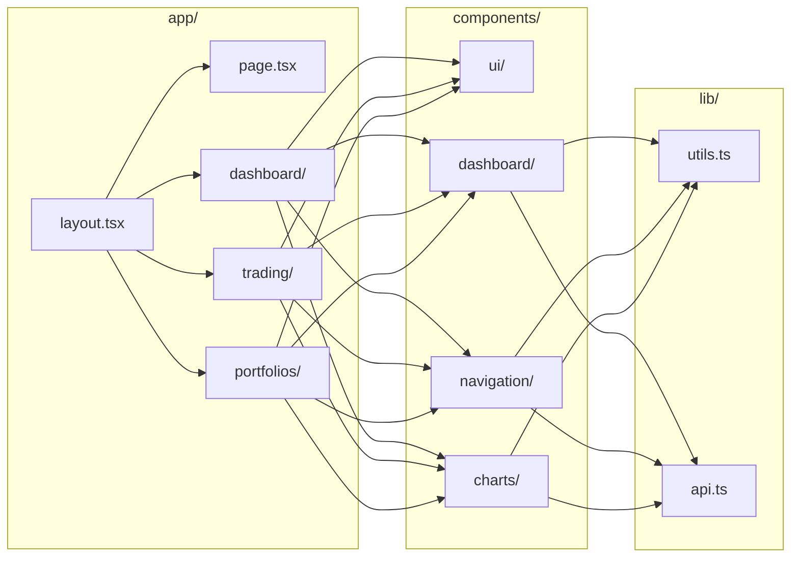

# Frontend

> The Octopus Trading Platform frontend is built with Next.

## Model
- **Default:** `claude-sonnet-4-5`

## System Prompt
# Frontend Architecture

The Octopus Trading Platform frontend is built with Next.js 14, TypeScript, and Tailwind CSS, featuring a modern glassmorphism design.

## App Structure & Page Flow

```mermaid
flowchart TB
    ROOT[/] --> DASH[/dashboard]
    ROOT --> TRADE[/trading]
    ROOT --> PORT[/portfolios]
    ROOT --> MKT[/market-data]
    ROOT --> AGENTS[/agents]
    ROOT --> RISK[/risk]
    DASH --> DASH_C[Dashboard Content\nAccount Cards, Charts]
    TRADE --> TC[Command Center\nOptions, Bots]
    PORT --> PORT_C[Portfolio Views\nPositions, Performance]
    MKT --> MKT_C[Market Data\nCharts, Quotes]
    AGENTS --> AGENTS_C[Agent Panels\nM1, M4, M9, M11]
```

## Technology Stack

| Technology | Version | Purpose |
|------------|---------|---------|
| Next.js | 14.x | React framework |
| TypeScript | 5.x | Type-safe JavaScript |
| Tailwind CSS | 3.x | Utility-first styling |
| Shadcn UI | Latest | Component library |
| Radix UI | Latest | Headless components |
| Recharts | 2.x | Data visualization |

---

## Project Structure (Diagram)



## Project Structure (Tree)

```
frontend-nextjs/
├── src/
│   ├── app/                    # Next.js App Router
│   │   ├── layout.tsx          # Root layout
│   │   ├── page.tsx            # Home page
│   │   ├── dashboard/          # Dashboard pages
│   │   ├── trading/            # Trading pages
│   │   ├── portfolios/         # Portfolio pages
│   │   ├── market-data/        # Market data pages
│

*[truncated — see source for full prompt]*