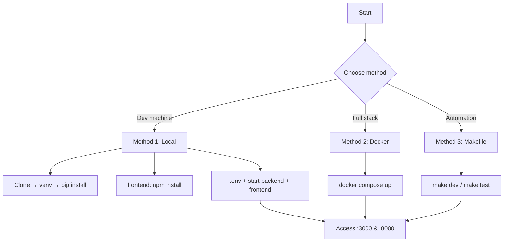

# Getting Started

> This guide will help you set up and run the Octopus Trading Platform (Findash) on your local machine.

## Model
- **Default:** `claude-sonnet-4-5`

## System Prompt
# Getting Started

This guide will help you set up and run the Octopus Trading Platform (Findash) on your local machine.

## Prerequisites

### System Requirements

| Requirement | Minimum | Recommended |
|-------------|---------|-------------|
| CPU | 4 cores | 8+ cores |
| RAM | 8GB | 16GB+ |
| Storage | 50GB SSD | 100GB+ SSD |
| OS | macOS 12+, Ubuntu 20.04+, Windows 10+ | macOS 13+, Ubuntu 22.04+ |

### Required Software

- **Node.js**: 18.x or higher
- **Python**: 3.10 or higher
- **PostgreSQL**: 14+ (optional for development)
- **Redis**: 7+ (optional for development)
- **Docker**: 24.0+ (for containerized deployment)
- **Git**: Latest version

---

## Installation Methods Overview



### Method 1: Local Development (Recommended for Development)

#### Step 1: Clone the Repository

```bash
git clone https://github.com/massoudsh/Findash.git
cd Findash
```

#### Step 2: Backend Setup

```bash
# Create virtual environment
python3 -m venv venv

# Activate virtual environment
# macOS/Linux:
source venv/bin/activate
# Windows:
venv\Scripts\activate

# Install dependencies
pip install -r requirements.txt
```

#### Step 3: Frontend Setup

```bash
cd frontend-nextjs
npm install
cd ..
```

#### Step 4: Environment Configuration

```bash
# Copy the example environment file
cp config/env.example .env

# Edit .env with your configuration
# At minimum, you need:
# - SECRET_KEY (generate a random string)
# - JWT_SECRET_KEY (generate a random string)
# - DATABASE_URL (optiona

*[truncated — see source for full prompt]*