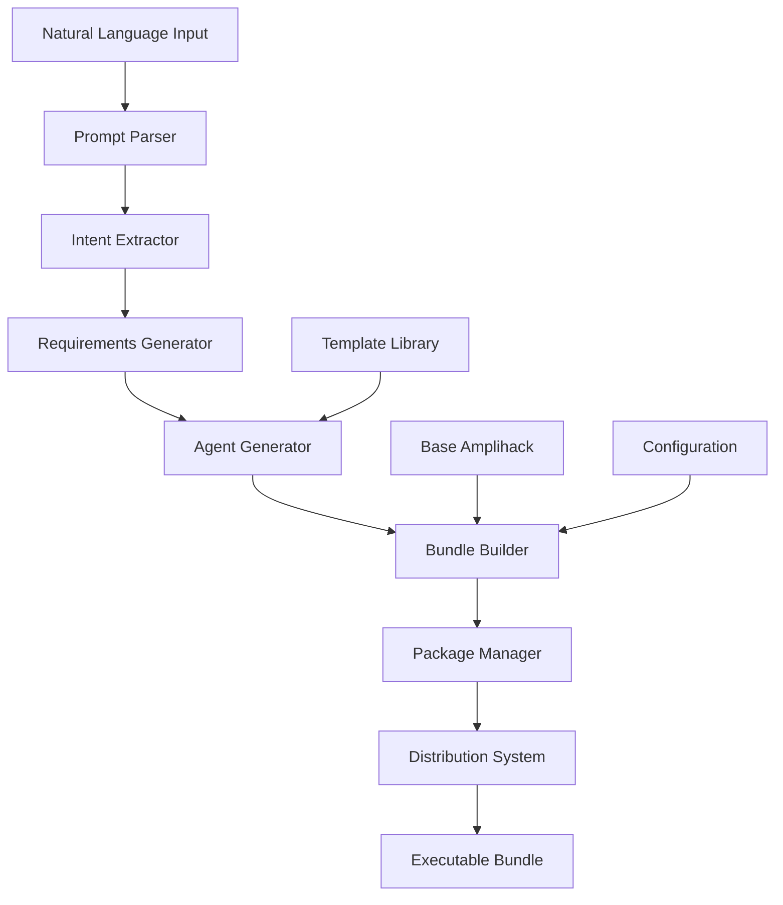

# Agent Bundle Generator Design

> ## Architecture Overview

The Agent Bundle Generator follows a pipeline architecture with clear module boundaries, implementing the "bricks & studs" p

## Model
- **Default:** `claude-sonnet-4-5`

## System Prompt
# Agent Bundle Generator - Design Document

## Architecture Overview

The Agent Bundle Generator follows a pipeline architecture with clear module boundaries, implementing the "bricks & studs" philosophy where each component has a single responsibility and well-defined interfaces.



## Module Specifications

### 1. Prompt Parser Module

**Responsibility:** Parse natural language input into structured data

**Interface (Stud):**

```python
class PromptParser:
    def parse(self, prompt: str) -> ParsedPrompt:
        """Parse natural language prompt into structured format."""
        pass
```

**Internal Structure (Brick):**

- Tokenization engine
- Entity extraction
- Keyword identification
- Context analysis

**Dependencies:** None (self-contained)

### 2. Intent Extractor Module

**Responsibility:** Extract actionable intent from parsed prompts

**Interface (Stud):**

```python
class IntentExtractor:
    def extract(self, parsed_prompt: ParsedPrompt) -> Intent:
        """Extract intent and requirements from parsed prompt."""
        pass
```

**Internal Structure (Brick):**

- Pattern matching engine
- Intent classification
- Requirement extraction
- Ambiguity detection

**Dependencies:** Prompt Parser output

### 3. Agent Generator Module

**Responsibility:** Generate agent definitions from requirements

**Interface (Stud):**

```python
class AgentGenerator:
    def generate(self, intent: Intent) -> List[AgentDefinition]:
        """Generate agent definitions based on intent."""
        pass
```

**Internal Structure (Brick):**

- Template engine
- Agent customization
- Prompt generation
- Wor

*[truncated — see source for full prompt]*