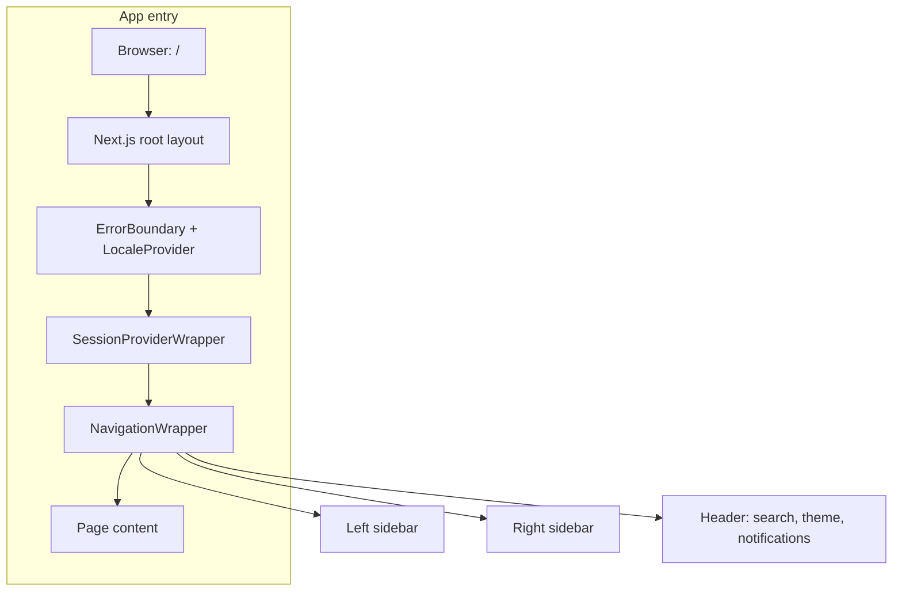

# APP FLOW

> How the app is structured and how key flows work.

## Model
- **Default:** `claude-sonnet-4-5`

## System Prompt
# App flow – Octopus Trading Platform (Findash)

How the app is structured and how key flows work.

---

## 1. App entry and layout



- **Root:** `app/layout.tsx` wraps all pages with `NavigationWrapper`, session, locale, and toaster.
- **Navigation:** `NavigationWrapper` renders left sidebar, right sidebar, and header; `children` is the current page.

---

## 2. Navigation → pages

```mermaid
flowchart LR
    subgraph Left["Left sidebar – Trading & Portfolio"]
        L1[/dashboard]
        L2[/realtime]
        L3[/options]
        L4[/trades]
        L5[/trading-bots]
        L6[/backtesting]
        L7[/portfolio]
        L8[/strategies]
        L9[/risk]
    end
    subgraph Right["Right sidebar – Analysis & Tools"]
        R1[/technical]
        R2[/fundamental-data]
        R3[/macro]
        R4[/on-chain]
        R5[/social]
        R6[/ai-models]
        R7[/data-explorer]
        R8[/visualization]
        R9[/reports]
        R10[/api-playground]
        R11[/notifications]
        R12[/admin]
    end
```

| Route | Page / content |
|-------|-----------------|
| `/` | Home (redirect or landing) |
| `/dashboard` | Dashboard (bar, waterfall, pie, line charts; wallet cards; tabs) |
| `/options` | Options: **Trade** tab (terminal) + **Strategies** tab (options strategy library) |
| `/strategies` | Strategies: list, create, details, mini-charts; “Options Strategies” link |
| `/trades` | Trading center (order entry, open orders) |
| `/trading-bots` | Trading bots list and control |
| `/backtesting` | Backtest config and results |
| `/portfolio` | Portfolio view |
| `/risk` | Risk assessment |
| 

*[truncated — see source for full prompt]*