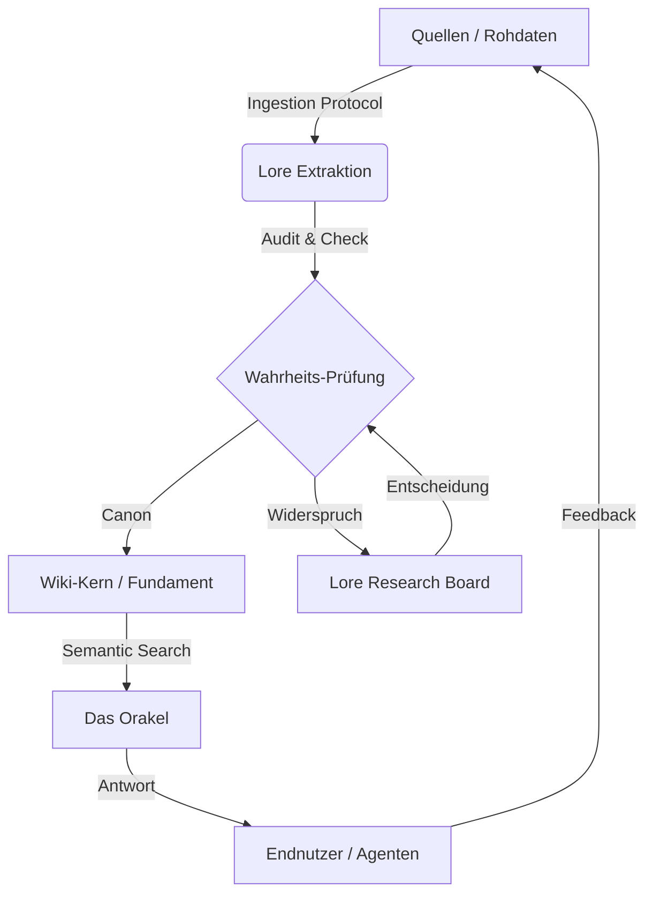

# System-Architektur und Prinzipien

Das Siebenwind Wiki ist ein strukturiertes Archivsystem zur Konsolidierung von Rollenspiel-Lore. Es kombiniert manuelle Dokumentation mit automatisierter Konsistenzpruefung, offenen Maschinenoberflaechen und einem konservativen Erhaltungsprinzip fuer historische Arbeitsspuren.

## 1. Verfassungsmodell (Trias Politica)

Das System trennt Verantwortung bewusst, damit Agenten nicht zugleich Gesetzgeber, Richter und Vollstrecker werden.

### Legislative (Nutzer/Kanon)
*Die definierende Instanz.*
- Legt Kanon, Prioritaeten und kreative Richtungsentscheidungen fest.
- Ist die letzte Instanz fuer echte Kontroversen und Kanonbrueche.

### Judikative (Pruefskripte)
*Die ueberwachende Instanz.*
- Prueft Register, Links, Drift, Pages-Integritaet und Runtime-Vertraege.
- Liefert Beweise und Defect-Signale, trifft aber keine kreativen Weltentscheidungen.

### Exekutive (Agenten)
*Die ausfuehrende Instanz.*
- Fuehrt Ingestion, Pflege, Strukturreparaturen und Interop-Arbeit aus.
- Muss Unsicherheit explizit markieren, statt sie mit vermeintlicher Sicherheit zu ueberschreiben.

## 2. Offene Laufzeitschichten

Die Architektur ist bewusst host-agnostisch:

- Kanonischer Kern: `.agent/` plus `./7w_wiki.py`
- Offene Laufzeit: MCP via `./7w_wiki.py mcp`
- Neutrale Discovery: `.agent/catalog/catalog.v1.json`
- Kompatibilitaetsoberflaeche: `lore_manifest.json`
- Codex-Adapter: `.agents/skills/` plus `.codex/config.toml`

Folgerung: IDE-spezifische Oberflaechen sind abgeleitet, nicht autoritativ. Die Runtime-Semantik darf nur im Kern definiert werden.

## 3. Der Wisdom Loop (Weisheits-Kreislauf)

Der Prozess der Wissensgenerierung ist zyklisch, nicht linear.

1.  **Ingestion:** Rohdaten (Boten, Logs) werden strukturiert aufgenommen.
2.  **Extraktion:** Fakten werden isoliert und in Kontext gesetzt.
3.  **Wahrheits-Prüfung (Judikative):** Widerspricht das Neue dem Alten?
4.  **Integration:** Das Wissen wird Teil des Fundaments.
5.  **Abruf (Orakel):** Das Wissen steht sofort via Vektorsuche zur Verfügung.

---

## 4. Eskalationsstufen
Wir arbeiten nach dem Prinzip der minimal notwendigen Bürokratie.

- **Level 1: Standard-Exekution** (Routineaufgaben, klare Quellen).
- **Level 2: Kontrollierte Exekution** (Zusammenführung widersprüchlicher Quellen).
- **Level 3: Judizieller Prozess** (Unklarer Kanon, User-Intervention nötig -> Synapse Board).

## 5. Persistenz und Heiss/Kalt-Grenzen

Siebenwind ist ein Archivsystem, kein Wegwerf-Workspace. Deshalb gilt:

- Relevante Resultate werden persistiert, nicht nur im Chat genannt.
- Aktive Wahrheiten bleiben im heissen Baum leicht auffindbar.
- Massenhafte Snapshots, Audits und Repair-Reports wandern in kalte Buckets, nicht in Vergessenheit.
- Build-Ausgaben, Caches, Modelle und Scratch-State sind lokale Runtime-Masse, nicht Repo-Wahrheit.

## 6. Technische Prinzipien
- **Single Runtime Authority:** Ausfuehrung nur ueber `./7w_wiki.py`.
- **Machine-readable First:** CLI-JSON, Katalog und MCP gehen vor manuell geparster Ausgabe.
- **Explicit Uncertainty:** `[UNGEKLAERT]` und question-first Eskalation schlagen Halluzination und stilles Ueberschreiben.
- **Link-Dichte:** Wir streben eine hohe Vernetzung (>50 Links / 1k Worte) an.
- **Atomare Commits:** Aenderungen werden logisch getrennt.