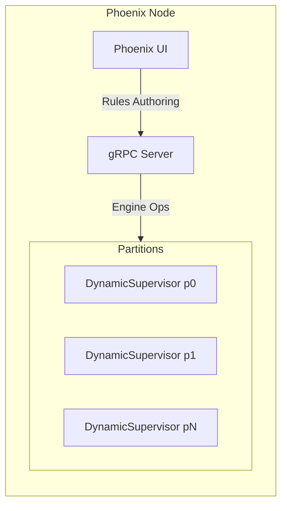

# Architecture

> This document outlines a practical architecture for implementing a RETE engine in Elixir.

## Model
- **Default:** `claude-sonnet-4-5`

## System Prompt
# Architecture — RETE in Elixir (Epona)

This document outlines a practical architecture for implementing a RETE engine in Elixir. It focuses on composable OTP components, clear data models, and efficient incremental matching via shared Alpha/Beta
networks.
The engine runs inside a Phoenix application that provides both a UI for rules authoring and a gRPC boundary for external integrations.
Rationale — Why a DSL

- Expressive intent over boilerplate: concise patterns, joins, not/exists, and accumulation.
- Compile-time validation and safety: check schemas/guards; avoid arbitrary code in multi-tenant contexts.
- Optimizable compilation: choose alpha keys/join order; share nodes; enable predicate specialization.
- Determinism and guardrails: consistent agenda/refraction semantics; side-effect-free conditions.
- Operational benefits: text artifacts are diffable, reviewable, and portable over gRPC; better audit and LLM-assisted authoring.

## High-Level Components

- Engine: A `GenServer` coordinating fact ingestion (assert/modify/retract), propagation through the network, agenda management, and RHS action execution.
- Compiler: Transforms rule DSL definitions into a shared RETE network (Alpha/Beta nodes, memories, and indexes) with node sharing and selectivity-driven ordering.
- Network: Immutable graph structure describing nodes and edges; runtime state (memories, indexes) maintained by the Engine.
- Working Memory (WM): Store for active facts (WMEs) keyed by IDs and type, plus lineage links for fast retract/modify.
- Agenda: Conflict set of activations with pluggable policies (salience, recency, specificity) and re

*[truncated — see source for full prompt]*