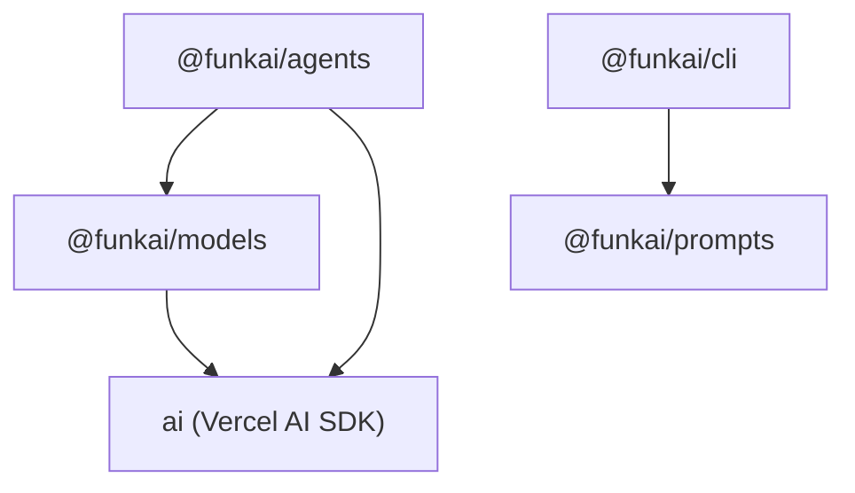

---
name: Architecture
description: ## Package dependency graph



- **`@funkai/agents`** depends on `@funkai/models` (for `ProviderRegistry` type) and `ai` (Vercel AI SDK).
- **`@funkai/models`** depends on `ai` for the `LanguageModel` type. Standalone otherwise.
- **`@funkai/prompts`** is fully standalone -- no dependency on other funkai packages.
- **`@funkai/cli`** depends on `@funkai/prompts` for prompt generation and linting.

## Agent

`agent()` wraps the AI SDK's `generateText` and `streamText` with:

- **Typed input** -- Optional Zod schema + prompt template. When provided, `.generate()` accepts typed input and validates it before calling the model. In simple mode, raw strings or message arrays pass through directly.
- **Tools** -- A record of `tool()` instances exposed to the model for function calling.
- **Subagents** -- Other agents passed via the `agents` config, automatically wrapped as callable tools with abort signal propagation.
- **Hooks** -- `onStart`, `onFinish`, `onError`, `onStepFinish` for observability. Per-call overrides merge with base hooks.
- **Result** -- Every method returns `Result<T>`. Success fields are flat on the object. Errors carry `code`, `message`, and optional `cause`.

The tool loop runs up to `maxSteps` iterations (default 20), where each iteration may invoke tools or subagents before producing a final response.

## FlowAgent

`flowAgent()` provides code-driven orchestration. The handler receives `{ input, $, log }`:

- **`input`** -- Validated against the input Zod schema.
- **`$`** (StepBuilder) -- Traced operations: `$.step()`, `$.agent()`, `$.map()`, `$.each()`, `$.reduce()`, `$.while()`, `$.all()`, `$.race()`. Each call becomes an entry in the execution trace.
- **`log`** -- Scoped logger with contextual bindings.

The handler returns the output value, validated against the optional output Zod schema. Each `$` operation is modeled as a synthetic tool call in the message history, making flow agents compatible with the same `GenerateResult` and `StreamResult` types as regular agents.

FlowAgent results include additional fields: `trace` (array of step entries) and `duration` (wall-clock milliseconds).

## The Runnable interface

Both `Agent` and `FlowAgent` satisfy the `Runnable` interface:

```typescript
interface Runnable<TInput, TOutput> {
  generate(input: TInput, config?): Promise<Result<{ output: TOutput }>>;
  stream(input: TInput, config?): Promise<Result<{ output: Promise<TOutput>; fullStream }>>;
  fn(): (input: TInput, config?) => Promise<Result<{ output: TOutput }>>;
}
```

This enables nesting: a `FlowAgent` can call any `Agent` or `FlowAgent` via `$.agent()`. An `Agent` can delegate to subagents via the `agents` config. The framework uses a symbol-keyed metadata property (`RUNNABLE_META`) to extract the name and input schema when wrapping runnables as tools.

## @funkai/models

Provides three capabilities:

- **Model catalog** -- `model(id)` and `models()` for querying model definitions (capabilities, modalities, pricing) sourced from OpenRouter. The catalog is generated at build time via `pnpm --filter=@funkai/models generate:models`.
- **Provider registry** -- `createProviderRegistry()` maps provider names to AI SDK provider instances, enabling string-based model resolution (e.g., `'openai/gpt-4.1'`).
- **Cost calculation** -- `calculateCost()` computes dollar costs from token usage and model pricing data.

## @funkai/prompts

Build-time prompt templating:

- Prompts are defined as `.prompt` files with YAML frontmatter (metadata, Zod schema reference) and LiquidJS template bodies.
- `createPromptRegistry()` loads compiled prompt modules and provides type-safe rendering at runtime.
- The `@funkai/cli` package provides commands for creating, generating, and linting prompt files.

Prompts are independent of the agents package -- they can be used standalone or integrated into agent prompt functions.