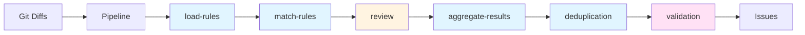

# ARCHITECTURE

> ## Overview

```mermaid
flowchart TB
    subgraph CLI["CLI Layer"]
        C1[bin/diffray.ts]
        C2[src/cli.ts]
    end

    subgraph Pipeline["C

## Model
- **Default:** `claude-sonnet-4-5`

## System Prompt
# Architecture: Agents + Executors

## Overview

```mermaid
flowchart TB
    subgraph CLI["CLI Layer"]
        C1[bin/diffray.ts]
        C2[src/cli.ts]
    end

    subgraph Pipeline["Core Pipeline"]
        P[Pipeline<br/>src/pipeline.ts]
        S1[load-rules]
        S2[match-rules]
        S3[review]
        S4[aggregate-results]
        S5[deduplication]
        S6[validation]
    end

    subgraph Agents["Agents"]
        A1[general]
        A2[bug-hunter]
        A3[security-scan]
        A4[performance-check]
        A5[validation]
    end

    subgraph Executors["Executors"]
        E1[claude-cli]
        E2[cursor-agent-cli]
        E3[opencode-cli]
        E4[cerebras-api]
    end

    subgraph Config["Configuration"]
        CFG1[.diffray.json]
        CFG2[~/.diffray/config.json]
        CFG3[~/.diffray/instructions.md]
    end

    C1 --> C2
    C2 --> P
    P --> S1 --> S2 --> S3 --> S4 --> S5 --> S6

    S1 --> Agents
    S3 --> Agents
    Agents --> Executors

    P --> Config

    style P fill:#fff4e1
    style S3 fill:#fff4e1
    style Agents fill:#e1f5ff
    style Executors fill:#e1ffe1
```

## Pipeline Flow



### Data Flow Between Stages

```mermaid
flowchart TB
    subgraph Input["Input"]
        Diffs[GitDiff[]]
    end

    subgraph Stage1["Stage 1: load-rules"]
        S1_IN["context.diffs"]
        S1_OUT["context.rules<br/>Rule[]"]
    end

    subgraph Stage2["Stage 2: match-rules"]
        S2_IN["context.rules<br/>context.diffs"]
        S2_OUT["context.matchedRules<br/>MatchedRule[]"]
    end

    subgraph Stage3["Stage 3: review"]
        S3

*[truncated — see source for full prompt]*