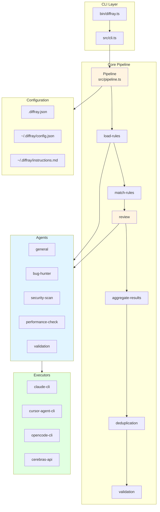
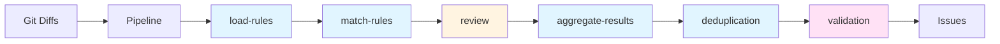
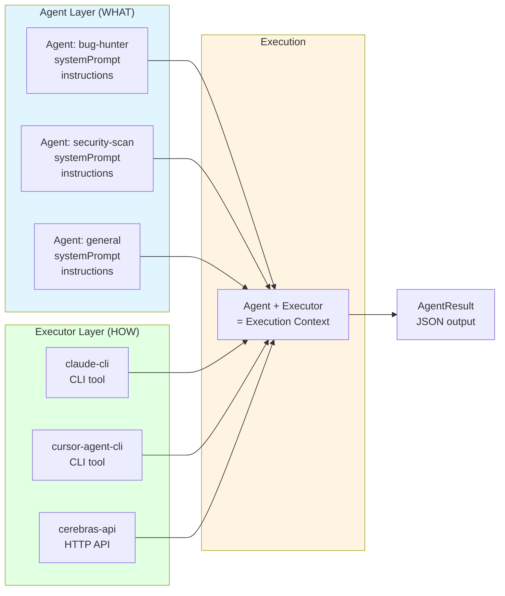
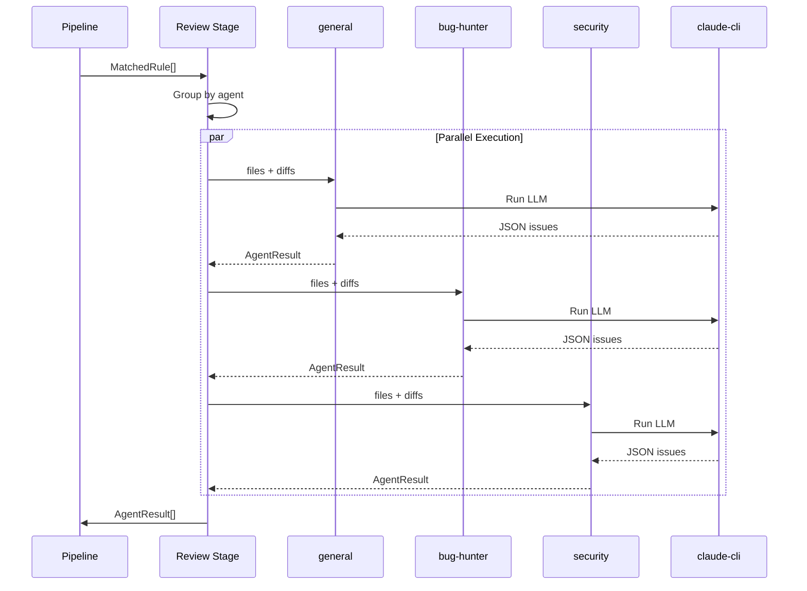
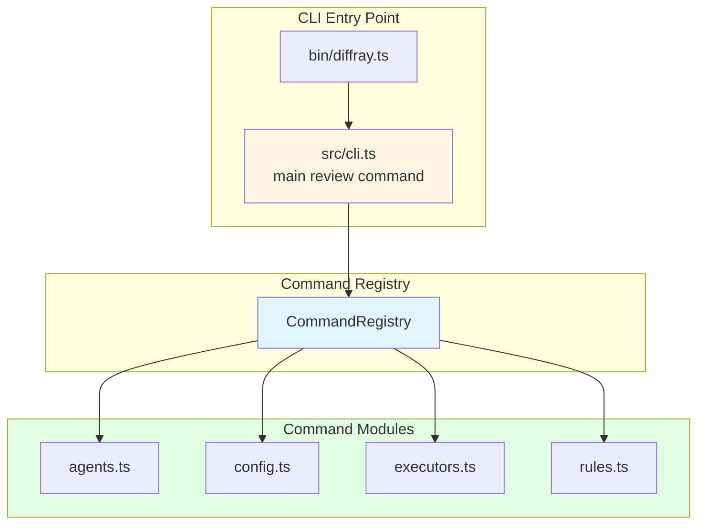

---
name: ARCHITECTURE
description: ## Overview



## Pipeline Flow



### Data Flow Between Stages

```mermaid
flowchart TB
    subgraph Input["Input"]
        Diffs[GitDiff[]]
    end

    subgraph Stage1["Stage 1: load-rules"]
        S1_IN["context.diffs"]
        S1_OUT["context.rules<br/>Rule[]"]
    end

    subgraph Stage2["Stage 2: match-rules"]
        S2_IN["context.rules<br/>context.diffs"]
        S2_OUT["context.matchedRules<br/>MatchedRule[]"]
    end

    subgraph Stage3["Stage 3: review"]
        S3_IN["context.matchedRules"]
        S3_OUT["context.results<br/>AgentResult[]"]
    end

    subgraph Stage4["Stage 4: aggregate-results"]
        S4_IN["context.results"]
        S4_OUT["context.issues<br/>Issue[]"]
    end

    subgraph Stage5["Stage 5: deduplication"]
        S5_IN["context.issues"]
        S5_OUT["context.issues<br/>Issue[] (unique)"]
    end

    subgraph Stage6["Stage 6: validation"]
        S6_IN["context.issues"]
        S6_OUT["context.issues<br/>context.filteredIssues"]
    end

    Diffs --> S1_IN
    S1_OUT --> S2_IN
    S2_OUT --> S3_IN
    S3_OUT --> S4_IN
    S4_OUT --> S5_IN
    S5_OUT --> S6_IN

    style Stage3 fill:#fff4e1
    style Stage6 fill:#ffe1f5

    classDef dataFont font-size:10px
```

**Stage Data Structures:**

| Stage | Input | Output | Description |
|-------|-------|--------|-------------|
| `load-rules` | `context.diffs` | `context.rules: Rule[]` | Loads all rules from MD files |
| `match-rules` | `context.rules, context.diffs` | `context.matchedRules: MatchedRule[]` | Matches files to rules via glob patterns |
| `review` | `context.matchedRules` | `context.results: AgentResult[]` | Runs agents, returns raw JSON |
| `aggregate-results` | `context.results` | `context.issues: Issue[]` | Parses JSON into Issue objects |
| `deduplication` | `context.issues` | `context.issues: Issue[]` | Removes duplicate issues |
| `validation` | `context.issues` | `context.issues, context.filteredIssues` | Validates issues, splits valid/filtered |

**PipelineContext Structure:**
```typescript
interface PipelineContext {
  diffs: GitDiff[];              // Git diff data
  rules?: Rule[];                // Loaded rules
  matchedRules?: MatchedRule[];  // Matched rules
  results?: AgentResult[];       // Agent execution results
  issues?: Issue[];              // Parsed issues
  filteredIssues?: Issue[];      // Filtered by validation
}
```

## Concept

Two-level separation:

1. **Agent** - system prompt/instruction (WHAT to do)
2. **Agent Executor** - isolated executor (HOW to do it)

## Benefits

### 1. Separation of Concerns
- **Agent** is responsible only for the task and prompt
- **Agent Executor** is responsible only for the execution method

### 2. Reusability
- One Agent can use different Executors
- One Executor can execute different Agents

### 3. Isolation
- Each Executor is isolated in its own file
- Easy to add new Executor types (API, CLI, WebSocket, etc.)

### 4. Flexibility
- Can change Executor for Agent without changing the prompt
- Can A/B test different Executors for the same task

## Agent & Executor Relationship



**Key Points:**
- Agent = WHAT to do (prompts, instructions, system prompt)
- Executor = HOW to do it (CLI tool, API, protocol)
- One agent can use different executors (flexibility)
- One executor can run different agents (reusability)

## Examples

### Agent: Bug Hunter

```json
{
  "id": "bug-hunter",
  "name": "Bug Hunter",
  "description": "Detects bugs, logic errors and runtime issues",
  "systemPrompt": "You are a bug detection specialist focused on identifying logic errors...",
  "enabled": true,
  "order": 1,
  "executor": "claude-cli"
}
```

### Agent Executor: Claude CLI

```json
{
  "name": "claude-cli",
  "description": "Execute via Claude Code CLI",
  "type": "cli",
  "command": "claude",
  "model": "sonnet",
  "timeout": 120,
  "enabled": true
}
```

## Executor Types

### 1. CLI Executor

Executes Agents via CLI commands.

**Configuration:**
```typescript
{
  type: "cli",
  command: "claude",
  args: ["-p", "--output-format", "json"],
  model: "sonnet",
  timeout: 120
}
```

**Supported CLI tools:**
- `claude` - Claude Code CLI
- `codex` - Codex CLI
- `cursor-agent` - Cursor Agent CLI
- `opencode` - OpenCode CLI
- Custom CLI tools

### 2. LLM API Executor

Executes Agents via LLM API calls.

**Configuration:**
```typescript
{
  type: "llm-api",
  provider: "cerebras",
  model: "llama-4-scout-17b-16e-instruct",
  apiKey: process.env.CEREBRAS_API_KEY,
  temperature: 0.7,
  maxTokens: 4096
}
```

**Supported providers:**
- `cerebras` - Cerebras API (requires `CEREBRAS_API_KEY` env var)

## Executor Configuration

Executor settings are stored in `~/.diffray/config.json` grouped by executor name:

```json
{
  "executor": "claude-cli",
  "executors": {
    "claude-cli": {
      "review": { "model": "sonnet", "timeout": 120 },
      "validation": { "model": "opus", "timeout": 180 }
    },
    "cursor-agent-cli": {
      "review": { "model": "claude-3-5-sonnet" },
      "validation": { "model": "claude-3-opus" }
    }
  }
}
```

**Key concepts:**
- `executor` - currently active executor
- `executors.<name>` - settings for specific executor
- Each executor has per-stage settings (`review`, `validation`)
- Settings preserved per-executor when switching

**CLI commands:**
```bash
# Switch executor
diffray config set executor cursor-agent-cli

# Configure current executor (shortcut)
diffray config set validation.model opus
# → writes to executors.<current>.validation.model

# Configure specific executor (full path)
diffray config set executors.claude-cli.validation.timeout 180

# View current executor settings
diffray executors
```

**How settings are applied:**
```typescript
// src/agents.ts
const config = await loadConfig();
const currentExecutor = config.executor;
const executorConfig = config.executors[currentExecutor] || {};

return agents.map((agent) => {
  const stage = agent.stage || 'review';
  const stageSettings = executorConfig[stage] || {};

  return {
    ...agent,
    executor: agent.executor || currentExecutor,
    executorSettings: { ...stageSettings, ...agent.executorSettings },
  };
});
```

## Global Singletons

The project uses global singletons for state management:

```typescript
executors        // src/executors.ts - executor registry
agentRegistry    // src/agents/registry.ts - agent registry
configCache      // src/config.ts - config cache
```

**Why singletons are OK here:**
- CLI runs once, does work, exits — no parallel pipelines
- One process = one configuration context
- Simpler than passing dependencies through 5+ call levels
- `factory.reset()` available for test isolation

**When singletons would be problematic:**
- Library with multiple independent instances
- Server handling parallel requests with different configs
- Plugin architecture requiring sandboxed execution

## Usage

### Agent Execution Flow



### Registering Executors

```typescript
import { loadExecutors } from "./executors";

// Load all executors
const executors = await loadExecutors();
```

### Registering Agents

```typescript
import { agentRegistry } from "./agents/registry";
import { getDefaultAgents } from "./agents/defaults";

const agents = getDefaultAgents();
for (const agent of agents) {
  agentRegistry.register(agent);
}
```

### Executing Agents

```typescript
import { executeAgent } from "./executors";

const context: ExecutionContext = {
  agent,
  executor: executor.getInfo(),
  input: diffsText,
  systemPrompt: agent.systemPrompt,
};

const result = await executeAgent(context);
```

## Stage Pipeline Architecture

The pipeline uses a **stage-based architecture** for extensibility:

```
src/stages/
├── index.ts              # Stage registry & ordering
├── load-rules.ts         # Stage 1: Load rules from config
├── match-rules.ts        # Stage 2: Match files to rules
├── review.ts             # Stage 3: Run agents (main logic)
├── aggregate-results.ts  # Stage 4: Combine results
├── deduplication.ts      # Stage 5: Remove duplicates
└── validation.ts         # Stage 6: Validate output
```

**Why stages instead of direct function calls?**

```typescript
// Could be simpler:
const rules = await loadRules();
const matched = matchRules(rules, diffs);
const results = await executeAgents(matched);
// ...

// But stages enable:
// 1. Add new stage by adding file (like executors)
// 2. Enable/disable stages via config
// 3. Reorder stages via config
// 4. Timing/logging per stage
// 5. Future: hooks before/after stages
```

**Stage interface:**
```typescript
interface Stage {
  id: string;
  name: string;
  enabled: boolean;
  execute: (context: PipelineContext) => Promise<StageResult>;
}
```

**Configuration (order matters):**
```typescript
// stages order defined in getStages() function
const stages = [
  createLoadRulesStage(),      // must be first
  createMatchRulesStage(),     // needs rules
  createReviewStage(),         // needs matched rules
  createAggregateResultsStage(),
  createDeduplicationStage(),
  createValidationStage(),     // must be last
];

// User can enable/disable via config.stages
{ id: "deduplication", enabled: false }
```

**Example: Adding GitHub integration stage:**
```typescript
// src/stages/github-publish.ts
export function createGitHubPublishStage(): Stage {
  return {
    id: "github-publish",
    name: "Publish to GitHub",
    enabled: true,
    execute: async (context) => {
      // Post issues as PR comments
      await postToGitHub(context.issues);
      return { success: true, ... };
    },
  };
}

// Add to BUILTIN_STAGES after validation
```

**Trade-off:** More abstraction than needed today, but enables future extensibility without refactoring.

## CLI Command Architecture

The CLI uses a **command registry pattern** to avoid monolithic switch statements:



**Design Benefits:**

```
src/
├── cli.ts                        # Main entry point with review command
└── cli/
    └── commands/
        ├── agents.ts             # Agents subcommands
        ├── config.ts             # Config subcommands
        ├── executors.ts          # Executors subcommands
        └── rules.ts              # Rules subcommands
```

**Design Benefits:**
- **Separation**: Each command in its own file (~30-60 lines each)
- **Extensibility**: Add new commands without modifying main CLI
- **Type safety**: Strongly typed command/subcommand interfaces
- **Testability**: Each command can be tested independently
- **No framework**: Lightweight, zero dependencies

**Pattern:**
```typescript
// Define command
export const myCommand = createCommand({
  name: "my-command",
  description: "Does something",
  subcommands: [
    createSubcommand({
      name: "action",
      description: "Performs action",
      handler: async (args) => { /* ... */ },
    }),
  ],
});

// Register in cli.ts
const registry = new CommandRegistry();
registry.register(myCommand);
await registry.dispatch(commandName, subcommand, args);
```

**Benefits:**
- Main CLI file handles the `review` command directly
- Subcommands (`agents`, `config`, `executors`, `rules`) are modular
- Each command module is small and focused
- Easy to add new commands without modifying main CLI

## Markdown Loader Architecture

The project uses a **generic markdown loader pattern** to avoid code duplication:

```
src/
├── md-loader.ts              # Generic markdown parser & loader (226 lines)
├── agents/
│   └── md-loader.ts          # Agent-specific wrapper (42 lines)
└── rules/
    └── md-loader.ts          # Rule-specific wrapper (48 lines)
```

**Design Rationale:**
- Generic `md-loader.ts` contains all parsing, file I/O, and directory scanning logic
- Type-specific wrappers (`agents/md-loader.ts`, `rules/md-loader.ts`) are thin (~40 lines each)
- Each wrapper provides:
  - `build*` function - domain-specific validation and object construction
  - Type-safe convenience functions - proper TypeScript types for Agent/Rule
- This avoids ~180 lines of duplication while maintaining type safety

**Why not inline?**
- Separation of concerns: generic parsing vs domain logic
- Type safety: Agent and Rule have different required fields
- Future extensibility: easy to add new types (e.g., Hooks, Plugins)

## Caching Strategy

The project uses **in-memory caching** for performance during a single run.

### How It Works

```typescript
// src/cache.ts - Unified cache utility
const cache = new Map<string, CacheEntry<unknown>>();

export async function getCached<T>(key: string, loader: () => Promise<T>): Promise<T> {
  const entry = cache.get(key);
  if (entry !== undefined) {
    return entry.value as T;
  }

  const value = await loader();
  cache.set(key, { value, timestamp: Date.now() });
  return value;
}
```

### What Gets Cached

| Key | Description |
|-----|-------------|
| `config` | Merged configuration from all sources |
| `instructions` | Global instructions from `~/.diffray/instructions.md` |
| `prompt:output-format` | Output format prompt template |
| `prompt:validation` | Validation prompt template |

### Cache Lifecycle

- **Single run**: Cache is populated on first access, reused throughout the run
- **Fresh on each run**: Each CLI invocation starts with empty cache
- **No persistence**: Cache is in-memory only, not persisted to disk

### Loading Strategy

Agents and rules are loaded fresh from MD files on each run:

```
Priority order (highest to lowest):
1. .diffray/agents/ or .diffray/rules/ (project folder)
2. ~/.diffray/agents/ or ~/.diffray/rules/ (home folder)
3. src/defaults/agents/ or src/defaults/rules/ (built-in)
```

This ensures changes to MD files are immediately reflected without manual cache clearing.

## File Structure

```
src/
├── cli.ts                # Main CLI entry point
├── pipeline.ts           # Pipeline orchestration
├── types.ts              # Type definitions
├── config.ts             # Config schema and loading
├── cache.ts              # In-memory cache utility
├── md-loader.ts          # Generic markdown loader
├── executors.ts          # Executor definitions and registry
├── agents.ts             # Agent loading and configuration
├── agents/
│   ├── registry.ts       # Agent registry
│   ├── defaults.ts       # Default agents loader
│   └── md-loader.ts      # Agent-specific markdown loader
├── rules.ts              # Rules loader
├── stages/               # Pipeline stages
│   ├── index.ts
│   ├── load-rules.ts
│   ├── match-rules.ts
│   ├── review.ts
│   ├── aggregate-results.ts
│   ├── deduplication.ts
│   └── validation.ts
├── executors/            # Executor implementations
│   ├── index.ts
│   ├── types.ts
│   ├── api.ts            # Cerebras API executor
│   ├── cli.ts            # CLI executor base
│   ├── claude-cli.ts     # Claude Code CLI executor
│   ├── cursor-agent-cli.ts # Cursor Agent CLI executor
│   ├── opencode-cli.ts   # OpenCode CLI executor
│   ├── process.ts        # Process utilities
│   └── utils.ts          # Shared utilities
├── cli/
│   └── commands/         # CLI subcommands
│       ├── agents.ts
│       ├── config.ts
│       ├── executors.ts
│       └── rules.ts
└── defaults/
    ├── agents/*.md       # Agent definitions
    ├── rules/*.md        # Rule definitions
    └── prompts/*.md      # Prompt templates
```