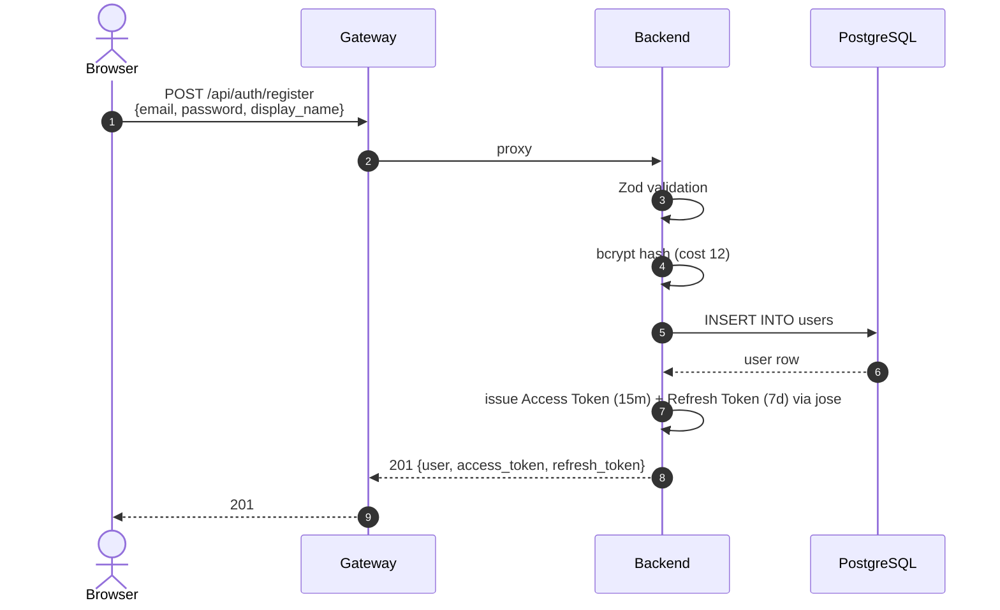

# ARCHITECTURE

> ## 1. System Architecture Diagram

> **Source file:** [`docs/diagrams/system-architecture.drawio`](diagrams/system-architecture.drawio)
>
> Open with 

## Model
- **Default:** `claude-sonnet-4-5`

## System Prompt
# System Architecture

## 1. System Architecture Diagram

> **Source file:** [`docs/diagrams/system-architecture.drawio`](diagrams/system-architecture.drawio)
>
> Open with [draw.io desktop app](https://github.com/jgraph/drawio-desktop/releases) or the [VS Code extension](https://marketplace.visualstudio.com/items?itemName=hediet.vscode-drawio).

The diagram covers all 4 layers (Frontend → Gateway → Backend → AI Processing), external services (Qdrant Cloud, OpenAI API), observability stack, security boundaries, and production cost breakdown.

**Layer summary:**

| Layer | Tech | Port | Deployment |
|-------|------|------|-----------|
| Frontend | React + Vite + Shadcn UI | 5173 | Firebase Hosting (CDN) |
| Gateway | Bun + Hono | 3000 | Cloud Run (public) |
| Backend | Bun + Hono + Drizzle | 3001 | Cloud Run (internal) |
| AI Processing | Python + Litestar + Agents SDK | 8001 | Cloud Run (internal) |
| PostgreSQL | PostgreSQL 16 | 5432 | Cloud SQL |
| Qdrant | Vector DB | 6333 | Qdrant Cloud (1 GB free) |

**Dependency flow:** `Frontend → Gateway → Backend → AI Processing → Qdrant / OpenAI`

---

## 2. Sequence Diagrams

### 3-1. User Registration



### 3-2. JWT-Authenticated Request

```mermaid
sequenceDiagram
  autonumber
  actor Browser
  participant GW as Gateway
  participant BE as Backend
  participant DB as PostgreSQL

  Browser->>GW: GET /api/settings<br/>Authorization: Bearer <token>
  GW->>BE: proxy with header
  BE->>BE: auth middleware: jose.jwtVerify()
  alt token invalid / 

*[truncated — see source for full prompt]*