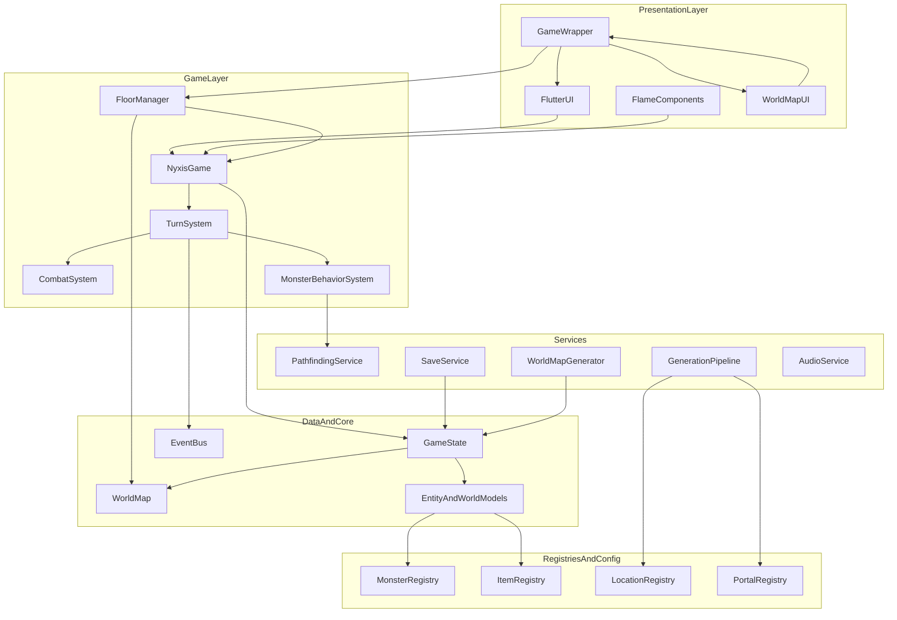

# ARCHITECTURE

> Current architecture for the running game, including world map flow, portal traversal, and generation systems.

## Model
- **Default:** `claude-sonnet-4-5`

## System Prompt
# Nyxis — Architecture Overview

Current architecture for the running game, including world map flow, portal traversal, and generation systems.

---

## System Diagram



---

## Directory Structure

```
lib/
├── main.dart
├── core/
│   ├── core.d

*[truncated — see source for full prompt]*