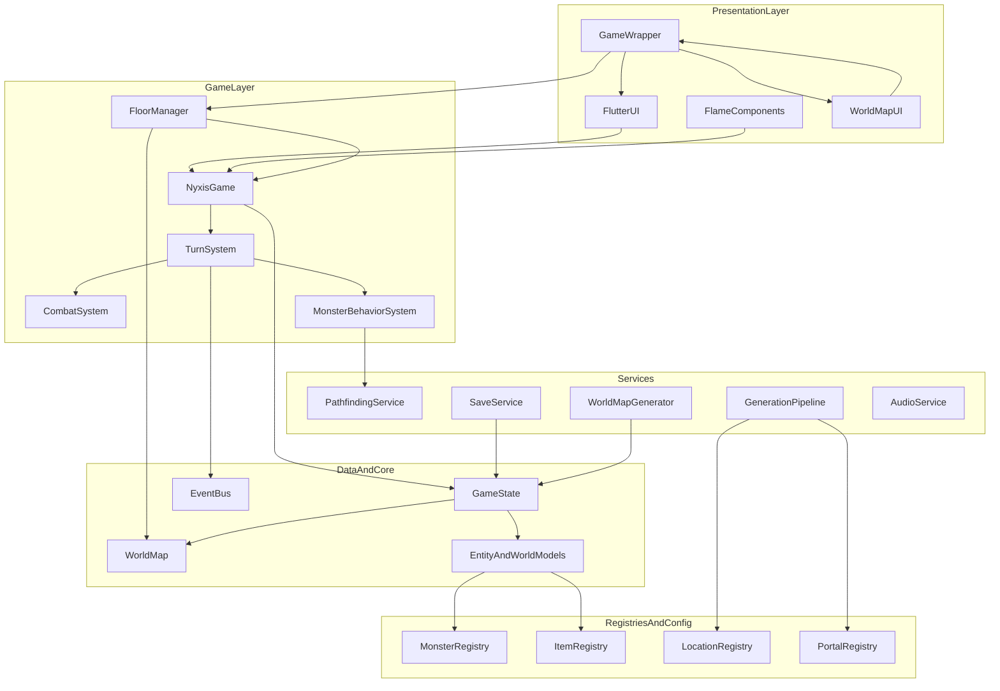
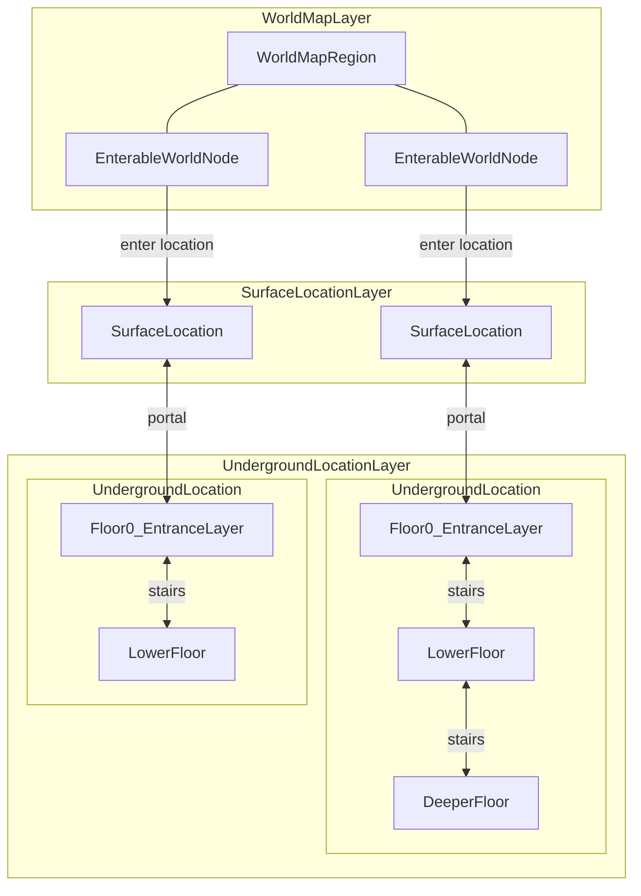
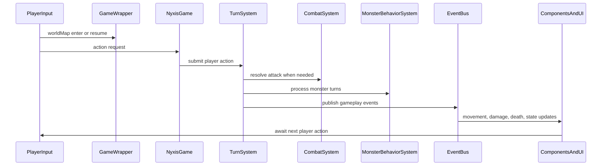
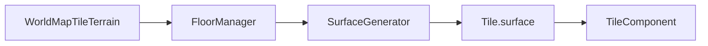

# Nyxis — Architecture Overview

Current architecture for the running game, including world map flow, portal traversal, and generation systems.

---

## System Diagram



---

## Directory Structure

```
lib/
├── main.dart
├── core/
│   ├── core.dart
│   ├── event_bus.dart
│   └── events.dart
├── config/
│   ├── constants.dart
│   ├── monster_config.dart
│   ├── item_config.dart
│   ├── location_config.dart
│   ├── portal_definition.dart
│   └── portal_registry.dart
├── models/
│   ├── game_state.dart
│   ├── entities/
│   │   ├── entity.dart
│   │   ├── player.dart
│   │   ├── monster.dart
│   │   ├── item.dart
│   │   ├── world_object.dart
│   │   └── portal.dart
│   └── world/
│       ├── map.dart
│       ├── tile.dart
│       ├── location.dart
│       └── world_map.dart
├── game/
│   ├── nyxis_game.dart
│   ├── components/
│   │   ├── player_component.dart
│   │   ├── monster_component.dart
│   │   ├── item_component.dart
│   │   └── tile_component.dart
│   ├── services/
│   │   ├── component_manager.dart
│   │   ├── floor_manager.dart
│   │   └── ...
│   └── systems/
│       ├── turn_system.dart
│       ├── combat_system.dart
│       └── monster_behavior_system.dart
├── services/
│   ├── audio_service.dart
│   ├── pathfinding_service.dart
│   ├── save_service.dart
│   ├── world_map_generator.dart
│   └── generation/
│       ├── generation.dart
│       ├── generator_registry.dart
│       ├── location_generator.dart
│       ├── surface_generator.dart
│       ├── dungeon_generator.dart
│       ├── portal_placement.dart
│       └── steps/
├── ui/
│   ├── screens/
│   │   ├── game_wrapper.dart
│   │   ├── main_menu_screen.dart
│   │   ├── game_screen.dart
│   │   ├── inventory_screen.dart
│   │   └── world_map_screen.dart
│   └── widgets/
│       ├── hud_widget.dart
│       ├── action_toolbar.dart
│       ├── health_bar.dart
│       └── minimap_widget.dart
```

---

## Key Architectural Patterns

### 1. Registry-Driven Content

Entity definitions and world routing are data-driven (`MonsterRegistry`, `ItemRegistry`, `LocationRegistry`, `PortalRegistry`), keeping balance and content changes outside core game loop logic.

### 2. Event-Driven Systems

Gameplay systems publish and consume events through `EventBus` (`lib/core/event_bus.dart`), reducing direct coupling between systems, rendering components, and UI reactions.

### 3. Turn-Based Orchestration

`TurnSystem` coordinates player actions, combat resolution, and monster turns, while visual interpolation is handled by Flame components.

### 4. Location-Oriented World Flow

`GameWrapper` owns the canonical `GameState`, switches between `WorldMapScreen` and `GameScreen`, and routes transitions through `FloorManager`. Location gameplay, surface exits, and overworld travel all operate on that single shared state.

### 5. Composable Generation Pipeline

Location generation uses structured generation context + steps + registries so dungeon and surface generation can share orchestration while varying behavior.

### 6. Overworld-Driven Surface Visuals

Surface locations inherit their base ground tile type from the owning overworld `MapTile` terrain. The flow is `WorldMap.findLocationTile()` -> `FloorManager` terrain resolution -> `SurfaceGenerator` -> `Tile.surface(...)`, which keeps surface visuals aligned with the top-level map without changing encounter or spawn logic.

### 7. Layered Navigation Model

Navigation is organized as separate conceptual layers rather than one flat graph:

- `WorldMap` is the high-level routing layer.
- `Surface locations` are enterable local exploration spaces attached to world map nodes.
- `Underground locations` are separate interior spaces connected to surfaces by portals.
- `Dungeon floors` are vertical slices inside one underground location and are connected only by stairs.



This model keeps three transition types distinct:

- `world map travel` moves between world nodes
- `portal travel` moves between sibling locations on different layers
- `stairs travel` moves within a single underground location across floors

---

## Core Runtime Flow



## Surface Visual Flow



---

## Links

- [TECH_STACK.md](TECH_STACK.md) — active dependencies and stack guidance
- [ROADMAP.md](ROADMAP.md) — active priorities and unfinished phases