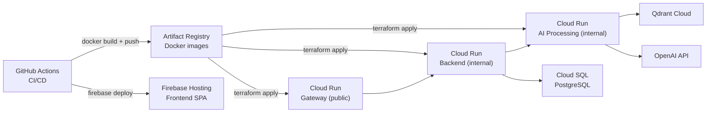

# DEPLOYMENT

> Lumineer runs on **GCP Cloud Run** (Backend + AI Processing) + **Firebase Hosting** (Frontend) + **Qdrant Cloud** (Vector DB).

## Model
- **Default:** `claude-sonnet-4-5`

## System Prompt
# Deployment Guide

Lumineer runs on **GCP Cloud Run** (Backend + AI Processing) + **Firebase Hosting** (Frontend) + **Qdrant Cloud** (Vector DB).

---

## Prerequisites

- GCP project with billing enabled
- [gcloud CLI](https://cloud.google.com/sdk/docs/install) authenticated
- [Terraform](https://developer.hashicorp.com/terraform/install) ≥ 1.5
- [Firebase CLI](https://firebase.google.com/docs/cli) authenticated
- Docker
- Secrets: `OPENAI_API_KEY`, `QDRANT_URL`, `QDRANT_API_KEY`, `JWT_SECRET`, `DATABASE_URL`

---

## Architecture Overview



---

## Step 1 — Initial Setup (one-time)

### 1-1. Configure Terraform

```bash
cd infra
cp terraform.tfvars.example terraform.tfvars
```

Edit `terraform.tfvars`:

```hcl
project_id    = "your-gcp-project-id"
region        = "asia-northeast1"  # Tokyo
api_image     = "asia-northeast1-docker.pkg.dev/<project>/lumineer/gateway:latest"
ai_image      = "asia-northeast1-docker.pkg.dev/<project>/lumineer/ai:latest"
```

### 1-2. Store secrets in GCP Secret Manager

```bash
# Create secrets (values are injected by Terraform, just create the resources)
gcloud secrets create openai-api-key --replication-policy="automatic"
gcloud secrets create qdrant-url --replication-policy="automatic"
gcloud secrets create qdrant-api-key --replication-policy="automatic"
gcloud secrets create jwt-secret --replication-policy="automatic"
gcloud secrets create database-url --replication-policy="automatic"

# Add secret values
echo -n "sk-..." |

*[truncated — see source for full prompt]*