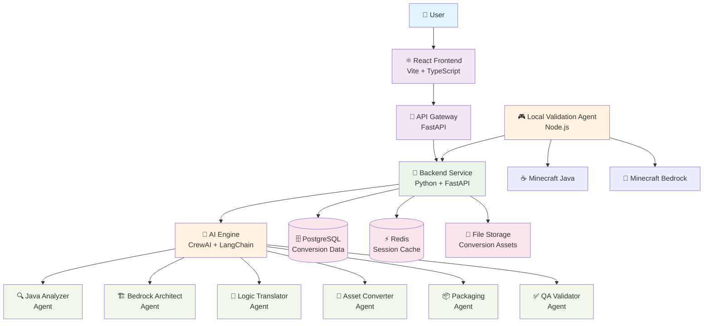

# DIAGRAMS

> This document contains comprehensive visual diagrams explaining the ModPorter AI system architecture and conversion process flow.

## Model
- **Default:** `claude-sonnet-4-5`

## System Prompt
# ModPorter AI - System Architecture Diagrams

This document contains comprehensive visual diagrams explaining the ModPorter AI system architecture and conversion process flow.

## System Architecture Overview



## PRD Feature Flow - Conversion Process

```mermaid
flowchart TD
    Start([🚀 User Starts Conversion]) --> Upload{📤 Upload Method?}
    
    Upload -->|File| FileUpload[📁 File Upload<br/>PRD Feature 1]
    Upload -->|URL| URLInput[🔗 URL Input<br/>CurseForge/Modri

*[truncated — see source for full prompt]*