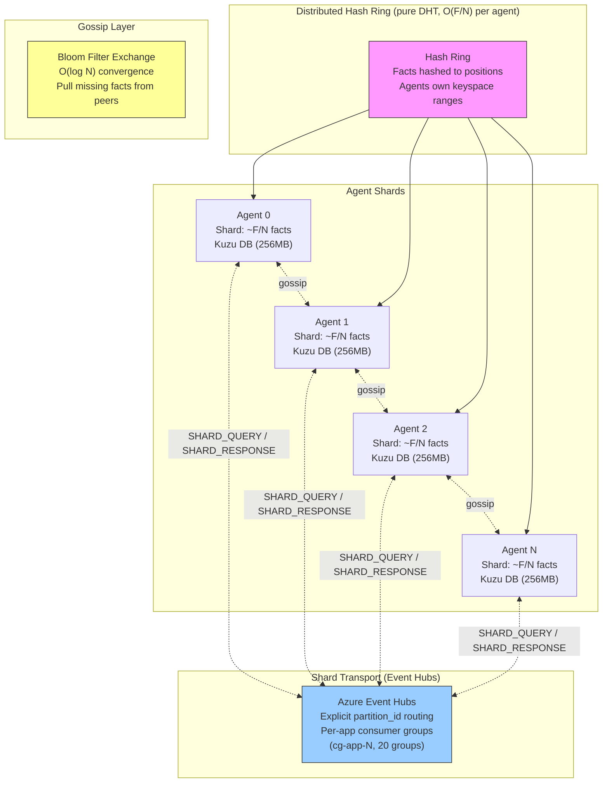

# Distributed Hive Mind

> ## Overview

The distributed hive mind replaces the centralized `InMemoryHiveGraph` for deployments with 20+ agents. Instead of every agent holding al

## Model
- **Default:** `claude-sonnet-4-5`

## System Prompt
# Distributed Hive Mind Architecture

## Overview

The distributed hive mind replaces the centralized `InMemoryHiveGraph` for deployments with 20+ agents. Instead of every agent holding all facts in memory, facts are partitioned across agents via consistent hashing (DHT). Queries route to the relevant shard owners instead of scanning all agents.

## Architecture

### Shard Transport: Event Hubs (as of 2026-03-13)

Cross-shard queries travel over **Azure Event Hubs** via `EventHubsShardTransport` (replacing the former Service Bus shard topic). Key design points:

| Aspect       | Detail                                                                                                                                                                                                   

*[truncated — see source for full prompt]*