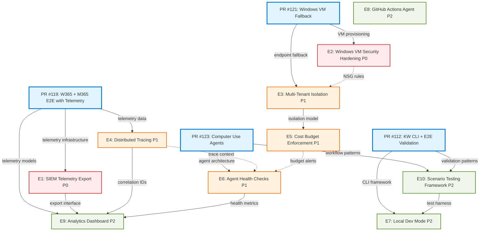

# Enhancement Dependencies and Integration Analysis

**Document Version**: 1.0
**Last Updated**: 2025-11-30
**Status**: Analysis Complete

## Executive Summary

This document analyzes dependencies, conflicts, and integration pathways between 10 proposed enhancements and 4 open pull requests for the Azure HayMaker Knowledge Worker Framework.

**Key Findings**:
- **Critical Path**: PR #119 must merge first (provides telemetry foundation)
- **Security Blocker**: PR #121 has unresolved security issues that block merge
- **Parallel Opportunities**: 5 enhancements can be developed simultaneously after PR #119 merges
- **Breaking Changes**: Multi-Tenant Isolation requires architectural refactoring

---

## Table of Contents

1. [Dependency Graph](#1-dependency-graph)
2. [PR Impact Analysis](#2-pr-impact-analysis)
3. [Critical Path Analysis](#3-critical-path-analysis)
4. [Parallel Work Opportunities](#4-parallel-work-opportunities)
5. [Integration Points](#5-integration-points)
6. [Risk Assessment](#6-risk-assessment)
7. [Recommended Merge Order](#7-recommended-merge-order)
8. [Implementation Sequencing](#8-implementation-sequencing)
9. [Visual Roadmap](#9-visual-roadmap)

---

## 1. Dependency Graph



### Dependency Legend

- **Solid arrows** (→): Hard dependencies - must be completed first
- **Dashed arrows** (-.->): Soft dependencies - beneficial but not required
- **Colors**:
  - Blue = Open PRs
  - Red = P0 (Critical)
  - Orange = P1 (High Priority)
  - Green = P2 (Nice to Have)

---

## 2. PR Impact Analysis

### PR #119: W365 + M365 E2E with Telemetry and Graceful Degradation

**Status**: ✅ Ready to Merge (41 tests passing, 95%+ coverage)

**Provides**:
- `M365TelemetryCollector` class with email, calendar, Teams collection
- Telemetry data models: `EmailEvidence`, `CalendarEvidence`, `TeamsEvidence`
- Graceful degradation pattern for Cloud PC provisioning
- End-to-end demonstration script

**Enables Enhancements**:
1. **E1: SIEM Telemetry Export (P0)** - UNBLOCKED
   - Provides: Telemetry collection infrastructure
   - Integration: Export methods can consume `M365TelemetryCollector` output

2. **E4: Distributed Tracing (P1)** - PARTIALLY UNBLOCKED
   - Provides: Telemetry collection points
   - Missing: Correlation ID propagation (needs separate implementation)

3. **E9: Analytics Dashboard (P2)** - UNBLOCKED
   - Provides: Data sources for visualization
   - Integration: Dashboard can query telemetry storage

**Blocks Nothing**: Safe to merge immediately

**Merge Priority**: 🔴 HIGHEST (unblocks 3 enhancements)

---

### PR #121: Windows VM Fallback for Computer Use Agents

**Status**: ⚠️ BLOCKED - Security Issues (72/100 security score)

**Provides**:
- `WindowsVMManager` for Azure VM provisioning
- Cascade fallback: Cloud PC → Windows VM → Container
- RDP + WinRM connectivity for Computer Use agents

**Security Issues** (Must Fix Before Merge):
1. **CRITICAL**: Credentials returned in plaintext (not Key Vault)
2. **CRITICAL**: NSG allows RDP from any IP (`source: "*"`)
3. **HIGH**: Public IPs by default (no Azure Bastion option)
4. **HIGH**: Weak input validation on worker IDs

**Enables Enhancements**:
1. **E2: Windows VM Security Hardening (P0)** - BLOCKED
   - This enhancement FIXES the security issues in PR #121
   - Cannot implement E2 until PR #121 merges
   - **Circular dependency**: PR #121 needs E2 to be production-ready

2. **E3: Multi-Tenant Isolation (P1)** - UNBLOCKED
   - Provides: Endpoint provisioning that needs isolation
   - Integration: VNet/subnet isolation applies to Windows VMs

**Blocks Enhancements**:
- **E2 (P0)**: Cannot harden VMs that don't exist yet

**Resolution Strategy**:
1. **Option A** (Recommended): Merge PR #121 with security warnings, implement E2 immediately
2. **Option B**: Fix security issues in PR #121 before merge (delays Computer Use agents)
3. **Option C**: Split PR #121 into "basic VM provisioning" + "security hardening" PRs

**Merge Priority**: 🟡 MEDIUM (blocks E2, but E2 can fix security issues post-merge)

---

### PR #123: Computer Use Knowledge Worker Agents

**Status**: ✅ Ready to Merge (46/46 tests passing, 88/100 philosophy score)

**Provides**:
- `ComputerUseKnowledgeWorkerAgent` - browser automation on Windows VMs
- WinRM connection module with PowerShell execution
- Playwright-based browser automation (Outlook, Teams, Calendar)
- Workflow framework: `EmailWorkflow`, `TeamsWorkflow`, `CalendarWorkflow`
- Agent deployment infrastructure

**Depends On**:
- PR #121 (Windows VM provisioning) - **DEPENDENCY**
- PR #119 (telemetry collection) - **SOFT DEPENDENCY**

**Enables Enhancements**:
1. **E6: Agent Health Checks (P1)** - UNBLOCKED
   - Provides: Agent architecture to instrument
   - Integration: Health checks monitor browser automation status

2. **E10: Scenario Testing Framework (P2)** - UNBLOCKED
   - Provides: Workflow patterns to test
   - Integration: Test framework validates workflows

**Blocks Nothing**: Safe to merge after PR #121

**Merge Priority**: 🟢 MEDIUM-LOW (nice to have, but E6 and E10 can use API-based agents initially)

---

### PR #112: Knowledge Worker E2E Validation and CLI Commands

**Status**: ✅ Ready to Merge (529 tests passing)

**Provides**:
- CLI command group: `haymaker kw {init,status,check,deploy,test,e2e-test}`
- `KnowledgeWorkerOrchestrator` - deployment lifecycle management
- Azure app registration setup (`infrastructure/app_setup.py`)
- E2E validation against real Azure tenant

**Enables Enhancements**:
1. **E7: Local Dev Mode (P2)** - UNBLOCKED
   - Provides: CLI framework to extend
   - Integration: Add `haymaker kw dev-mode start` command

2. **E10: Scenario Testing Framework (P2)** - PARTIALLY UNBLOCKED
   - Provides: E2E validation patterns
   - Integration: Extend `haymaker kw test` with scenario framework

**Blocks Nothing**: Safe to merge independently

**Merge Priority**: 🟢 LOW (nice QoL improvement, but not required for enhancements)

---

## 3. Critical Path Analysis

### What Must Be Done First?

```
CRITICAL PATH (Required for Production):

1. PR #119 (MERGE FIRST)
   └─> Provides: Telemetry infrastructure
       └─> Enables: E1 (SIEM Export) - P0
       └─> Enables: E4 (Tracing) - P1
       └─> Enables: E9 (Dashboard) - P2

2. E1: SIEM Telemetry Export (P0)
   └─> Required for: Production security compliance
   └─> Depends on: PR #119 telemetry models

3. PR #121 + E2: Windows VM Security (P0)
   └─> Two-phase approach:
       Phase 1: Merge PR #121 with security warnings
       Phase 2: Implement E2 immediately to fix issues
   └─> Enables: E3 (Multi-Tenant Isolation) - P1
```

### Bottlenecks

1. **PR #119 is a bottleneck**:
   - Blocks: E1 (P0), E4 (P1), E9 (P2)
   - Impact: 3 enhancements waiting
   - **Resolution**: Merge PR #119 immediately

2. **PR #121 Security Issues**:
   - Blocks: E2 (P0) implementation
   - Risk: Cannot deploy Windows VMs to production until E2 completes
   - **Resolution**: Merge with warnings, mark as "dev/test only", implement E2 in parallel

3. **Multi-Tenant Isolation (E3) Blocks Cost Enforcement (E5)**:
   - E5 requires tenant-level budget tracking
   - E3 provides tenant isolation model
   - **Resolution**: Implement E3 before E5, or use subscription-level budgets temporarily

---

## 4. Parallel Work Opportunities

### Phase 1: After PR #119 Merges (5 parallel tracks)

```
Track A: SIEM Export (P0)
  └─ E1: SIEM Telemetry Export Pipeline
     └─ Team: Security Engineer + Backend Dev
     └─ Duration: 1 week

Track B: VM Security (P0)
  └─ PR #121: Merge (with warnings)
  └─ E2: Windows VM Security Hardening
     └─ Team: Security Engineer + Infrastructure Dev
     └─ Duration: 1.5 weeks

Track C: Tracing Infrastructure (P1)
  └─ E4: Distributed Tracing + Correlation IDs
     └─ Team: Backend Dev
     └─ Duration: 1 week

Track D: Cost Management (P1)
  └─ E5: Cost Budget Enforcement
     └─ Team: FinOps Engineer + Backend Dev
     └─ Duration: 1 week (subscription-level only)

Track E: Local Dev Mode (P2)
  └─ E7: Local Development Mode
     └─ Team: Dev Tools Engineer
     └─ Duration: 3 days
```

**Total Parallel Duration**: 1.5 weeks (limited by Track B)

**Resource Requirements**:
- 2-3 Backend Developers
- 1 Security Engineer
- 1 FinOps Engineer
- 1 Dev Tools Engineer

### Phase 2: After E2 Completes (3 parallel tracks)

```
Track A: Multi-Tenant Isolation (P1) [REQUIRES ARCHITECTURE REVIEW]
  └─ E3: Multi-Tenant Resource Isolation
     └─ Team: Architect + 2 Backend Devs
     └─ Duration: 2 weeks

Track B: Agent Infrastructure (P1)
  └─ PR #123: Merge Computer Use Agents
  └─ E6: Agent Health Checks + Circuit Breakers
     └─ Team: Backend Dev
     └─ Duration: 1 week

Track C: Testing Infrastructure (P2)
  └─ E10: Scenario Testing Framework
     └─ Team: QA Engineer + Backend Dev
     └─ Duration: 1 week
```

### Phase 3: Final Enhancements (3 parallel tracks)

```
Track A: Analytics Dashboard (P2)
  └─ E9: Analytics Dashboard
     └─ Depends on: E1 (export), E4 (tracing), E6 (health)
     └─ Team: Frontend Dev + Backend Dev
     └─ Duration: 2 weeks

Track B: CI/CD Integration (P2)
  └─ E8: GitHub Actions Custom Agent
     └─ Team: DevOps Engineer
     └─ Duration: 3 days

Track C: Final PR Merge
  └─ PR #112: Knowledge Worker CLI
     └─ Team: Any available dev
     └─ Duration: 1 day (just merge)
```

---

## 5. Integration Points

### Integration Point 1: Telemetry Collection → SIEM Export (E1)

**Location**: `src/azure_haymaker/knowledge_worker/telemetry/`

**Current State (PR #119)**:
```python
# M365TelemetryCollector returns Evidence objects
class M365TelemetryCollector:
    async def get_run_summary(self, workers, start_time, end_time) -> dict:
        return {
            "run_id": self.run_id,
            "email_count": 123,
            "calendar_count": 45,
            "teams_count": 67,
            "by_worker": {...}
        }
```

**E1 Enhancement Adds**:
```python
# New SIEMExporter class
class SIEMExporter:
    def __init__(self, telemetry_collector: M365TelemetryCollector):
        self.collector = telemetry_collector

    async def export_to_sentinel(self, run_summary: dict) -> ExportResult:
        """Export telemetry to Azure Sentinel."""
        # Convert Evidence objects to CEF format
        # Send to Log Analytics workspace
        pass
```

**Integration Pattern**: Composition (SIEMExporter wraps TelemetryCollector)

**Risk**: LOW (telemetry models are stable in PR #119)

---

### Integration Point 2: Windows VM Provisioning → Security Hardening (E2)

**Location**: `src/azure_haymaker/knowledge_worker/endpoints/windows_vm.py`

**Current State (PR #121)**:
```python
class WindowsVMManager:
    async def provision_vm(self, worker) -> dict[str, str]:
        # ISSUE: Returns password in plaintext
        return {
            "vm_name": vm_name,
            "admin_password": "K9mP$x2Qr7!vN8zL4wT",  # ⚠️  INSECURE
            "public_ip": "20.12.34.56"
        }

        # ISSUE: NSG allows any source IP
        nsg_rules = [
            {"source": "*", "port": 3389, "access": "Allow"}  # ⚠️  INSECURE
        ]
```

**E2 Enhancement Fixes**:
```python
class SecureWindowsVMManager(WindowsVMManager):
    async def provision_vm(self, worker) -> dict[str, str]:
        # FIX: Store password in Key Vault
        secret_url = await self._store_credentials_in_keyvault(...)

        # FIX: Restrict NSG by source IP
        nsg_rules = [
            {"source": allowed_ips, "port": 3389, "access": "Allow"}
        ]

        return {
            "vm_name": vm_name,
            "admin_password_secret": secret_url,  # ✅ SECURE
            "public_ip": "20.12.34.56"
        }
```

**Integration Pattern**: Inheritance or decorator

**Risk**: MEDIUM (requires breaking changes to `provision_vm()` return type)

**Migration Path**:
1. Add `provision_vm_secure()` method (new method, no breaking change)
2. Deprecate `provision_vm()` (warning logs)
3. Remove `provision_vm()` in next major version

---

### Integration Point 3: Orchestrator → Multi-Tenant Isolation (E3)

**Location**: `src/azure_haymaker/orchestrator/orchestrator.py`

**Current State (PR #119)**:
```python
# Single subscription, single resource group
class HayMakerOrchestrator:
    def __init__(self, subscription_id: str, resource_group: str):
        self.subscription_id = subscription_id
        self.resource_group = resource_group
```

**E3 Enhancement Adds**:
```python
# Multi-tenant architecture
class MultiTenantOrchestrator(HayMakerOrchestrator):
    def __init__(self, tenants: list[TenantConfig]):
        self.tenants = {t.tenant_id: t for t in tenants}

    async def provision_worker(self, worker: WorkerIdentity) -> WorkerIdentity:
        # Route to tenant-specific subscription
        tenant = self.tenants[worker.tenant_id]

        # Isolated VNet per tenant
        vnet = f"haymaker-{tenant.tenant_id}-vnet"

        # Tenant-specific resource group
        rg = f"haymaker-{tenant.tenant_id}-rg"

        return await super().provision_worker_in_tenant(worker, tenant)
```

**Integration Pattern**: Subclass with tenant routing

**Risk**: HIGH (architectural change, affects all provisioning code)

**Breaking Changes**:
- `provision_worker()` signature changes
- Configuration files need tenant mapping
- Cleanup logic needs tenant awareness

---

### Integration Point 4: Agent Architecture → Health Checks (E6)

**Location**: `src/azure_haymaker/knowledge_worker/computer_use/agent.py`

**Current State (PR #123)**:
```python
class ComputerUseKnowledgeWorkerAgent:
    async def execute_workflow(self, workflow: BaseWorkflow):
        try:
            await workflow.execute(self.browser)
        except Exception as e:
            logger.error(f"Workflow failed: {e}")
            raise
```

**E6 Enhancement Adds**:
```python
class ComputerUseKnowledgeWorkerAgent:
    def __init__(self, ...):
        self.health_monitor = AgentHealthMonitor()
        self.circuit_breaker = CircuitBreaker(failure_threshold=3)

    async def execute_workflow(self, workflow: BaseWorkflow):
        # Health check before execution
        if not await self.health_monitor.is_healthy():
            raise AgentUnhealthyError()

        # Circuit breaker pattern
        @self.circuit_breaker.protect
        async def protected_execution():
            return await workflow.execute(self.browser)

        try:
            result = await protected_execution()
            self.health_monitor.record_success()
            return result
        except CircuitBreakerOpenError:
            logger.warning("Circuit breaker open, agent degraded")
            # Graceful degradation
            await self.health_monitor.trigger_failover()
```

**Integration Pattern**: Decorator + monitoring hooks

**Risk**: LOW (additive changes, no breaking modifications)

---

### Integration Point 5: Telemetry Export → Analytics Dashboard (E9)

**Location**: New module `src/azure_haymaker/analytics/`

**Data Flow**:
```
M365TelemetryCollector (PR #119)
    └─> SIEMExporter (E1)
        └─> Azure Log Analytics
            └─> Kusto Queries (E9)
                └─> PowerBI / Grafana Dashboard

DistributedTracing (E4)
    └─> Application Insights
        └─> Distributed Trace Explorer (E9)
```

**Dashboard Components**:
1. **Worker Activity Metrics** (from E1 telemetry)
   - Email/Calendar/Teams counts per worker
   - Activity heatmaps by department

2. **Infrastructure Health** (from E6 health checks)
   - Agent success rates
   - Circuit breaker states
   - Endpoint availability (Cloud PC, VM, Container)

3. **Cost Tracking** (from E5 budgets)
   - Cost per worker
   - Budget burn rate
   - Quota utilization

4. **Distributed Traces** (from E4 tracing)
   - End-to-end request latency
   - Dependency graphs
   - Error correlation

**Integration Pattern**: Read-only dashboard (queries existing data)

**Risk**: LOW (no changes to existing systems)

---

## 6. Risk Assessment

### Risk Matrix

| Enhancement | Conflicts With | Breaking Changes | Migration Complexity | Overall Risk |
|-------------|----------------|------------------|----------------------|--------------|
| **E1: SIEM Export (P0)** | None | None | Low (additive) | 🟢 LOW |
| **E2: VM Security (P0)** | PR #121 | High (credential model) | Medium | 🟡 MEDIUM |
| **E3: Multi-Tenant (P1)** | All provisioning code | High (architecture) | High | 🔴 HIGH |
| **E4: Tracing (P1)** | None | None (middleware) | Low | 🟢 LOW |
| **E5: Cost Budgets (P1)** | E3 (isolation model) | Low | Low | 🟢 LOW |
| **E6: Health Checks (P1)** | PR #123 | None (additive) | Low | 🟢 LOW |
| **E7: Local Dev (P2)** | PR #112 | None | Low | 🟢 LOW |
| **E8: GH Actions (P2)** | None | None | Low | 🟢 LOW |
| **E9: Dashboard (P2)** | E1, E4, E6 | None (read-only) | Low | 🟢 LOW |
| **E10: Testing (P2)** | PR #123 | None | Low | 🟢 LOW |

### High-Risk Items Requiring Architecture Review

#### 1. E3: Multi-Tenant Resource Isolation (HIGH RISK)

**Problem**: Current architecture assumes single subscription + single resource group.

**Impact**:
- Changes required in: Orchestrator, EndpointManager, CleanupManager, ServicePrincipalManager
- Configuration files need tenant mapping
- Tagging strategy needs tenant ID
- Cost allocation needs tenant awareness

**Migration Path**:
```
Phase 1: Add tenant_id to all models (optional, defaults to "default")
Phase 2: Support multiple subscriptions in EndpointManager
Phase 3: Implement VNet isolation per tenant
Phase 4: Enforce tenant boundaries in cleanup
Phase 5: Update all documentation
```

**Estimated Effort**: 2 weeks (Architect + 2 Devs)

**Decision Required**:
- Do we support multiple Azure subscriptions?
- Or multiple resource groups in single subscription?
- VNet peering strategy?

---

#### 2. E2: Windows VM Security Hardening (MEDIUM RISK)

**Problem**: PR #121 returns credentials in plaintext in `provision_vm()` response.

**Breaking Change**:
```python
# OLD (PR #121)
vm_details = await vm_manager.provision_vm(worker)
password = vm_details["admin_password"]  # Plaintext string

# NEW (E2)
vm_details = await vm_manager.provision_vm(worker)
secret_uri = vm_details["admin_password_secret"]  # Key Vault URI
password = await keyvault_client.get_secret(secret_uri)  # Requires KV client
```

**Impact**: All code that consumes `provision_vm()` must update

**Migration Path**:
```
Option A: Break immediately (risky)
  - Change return type in E2
  - Update all callers
  - Risk: Breaks external consumers

Option B: Gradual deprecation (safer)
  - Add provision_vm_secure() in E2
  - Deprecate provision_vm() (warnings)
  - Remove provision_vm() in v2.0.0

RECOMMENDED: Option B
```

---

### Conflict Resolution: E3 (Multi-Tenant) vs E5 (Cost Budgets)

**Conflict**: E5 needs tenant-level budget tracking, but E3 not yet implemented.

**Temporary Solution** (implement E5 without E3):
```python
# E5 without tenant isolation (subscription-level budgets)
class CostBudgetManager:
    def __init__(self, subscription_id: str):
        self.subscription_id = subscription_id

    async def enforce_budget(self, budget_usd: float):
        # Track cost at subscription level (all workers)
        current_cost = await self._get_subscription_cost()
        if current_cost > budget_usd:
            await self._trigger_budget_alert()
```

**Future Solution** (after E3):
```python
# E5 with tenant isolation
class TenantAwareBudgetManager(CostBudgetManager):
    async def enforce_budget(self, tenant_id: str, budget_usd: float):
        # Track cost per tenant
        tenant_cost = await self._get_tenant_cost(tenant_id)
        if tenant_cost > budget_usd:
            await self._trigger_tenant_budget_alert(tenant_id)
```

**Resolution**: Implement E5 at subscription level first, refactor after E3 completes.

---

## 7. Recommended Merge Order

### Phase 1: Critical Path (Week 1)

```
1. PR #119: W365 + M365 E2E with Telemetry
   └─ Status: ✅ MERGE NOW
   └─ Unblocks: E1, E4, E9
   └─ Risk: None
   └─ Effort: 0 days (just merge)

2. E1: SIEM Telemetry Export Pipeline (P0)
   └─ Depends on: PR #119
   └─ Unblocks: E9 (dashboard data source)
   └─ Risk: Low
   └─ Effort: 5 days
```

**Week 1 Deliverable**: Production-ready telemetry export to Azure Sentinel

---

### Phase 2: Security + Infrastructure (Week 2)

```
3. PR #121: Windows VM Fallback (merge with security warnings)
   └─ Status: ⚠️  MERGE WITH WARNINGS (mark as dev/test only)
   └─ Unblocks: E2, E3
   └─ Risk: Medium (security issues documented)
   └─ Effort: 0 days (just merge)

4. E2: Windows VM Security Hardening (P0)
   └─ Depends on: PR #121
   └─ Fixes: Credential exposure, NSG rules, Key Vault integration
   └─ Risk: Medium (breaking changes)
   └─ Effort: 7 days

5. E4: Distributed Tracing + Correlation IDs (P1)
   └─ Depends on: PR #119
   └─ Unblocks: E9 (trace visualization)
   └─ Risk: Low
   └─ Effort: 5 days

6. E5: Cost Budget Enforcement (P1)
   └─ Depends on: Nothing (subscription-level only)
   └─ Risk: Low
   └─ Effort: 5 days
```

**Week 2 Deliverable**: Secure Windows VMs + Cost controls + Distributed tracing

---

### Phase 3: Multi-Tenant + Agents (Week 3-4)

```
7. E3: Multi-Tenant Resource Isolation (P1) [ARCHITECTURE REVIEW REQUIRED]
   └─ Depends on: E2 (VM security)
   └─ Unblocks: E5 refactor (tenant-level budgets)
   └─ Risk: High (architectural change)
   └─ Effort: 10 days

8. PR #123: Computer Use Knowledge Worker Agents
   └─ Depends on: PR #121
   └─ Unblocks: E6 (health checks for agents)
   └─ Risk: Low
   └─ Effort: 0 days (just merge)

9. E6: Agent Health Checks + Circuit Breakers (P1)
   └─ Depends on: PR #123
   └─ Unblocks: E9 (health metrics in dashboard)
   └─ Risk: Low
   └─ Effort: 5 days
```

**Week 3-4 Deliverable**: Multi-tenant isolation + Computer Use agents with health monitoring

---

### Phase 4: Developer Experience (Week 5)

```
10. PR #112: Knowledge Worker CLI + E2E Validation
    └─ Status: ✅ MERGE ANYTIME
    └─ Unblocks: E7 (local dev mode CLI)
    └─ Risk: None
    └─ Effort: 0 days (just merge)

11. E7: Local Development Mode (P2)
    └─ Depends on: PR #112
    └─ Unblocks: Faster dev cycles
    └─ Risk: Low
    └─ Effort: 3 days

12. E10: Scenario Testing Framework (P2)
    └─ Depends on: PR #123 (workflow patterns)
    └─ Unblocks: Automated scenario validation
    └─ Risk: Low
    └─ Effort: 5 days

13. E8: GitHub Actions Custom Agent (P2)
    └─ Depends on: Nothing
    └─ Unblocks: CI/CD automation
    └─ Risk: Low
    └─ Effort: 3 days
```

**Week 5 Deliverable**: Developer tools + Testing infrastructure

---

### Phase 5: Analytics (Week 6)

```
14. E9: Analytics Dashboard (P2)
    └─ Depends on: E1 (SIEM export), E4 (tracing), E6 (health)
    └─ Unblocks: Operational visibility
    └─ Risk: Low
    └─ Effort: 10 days
```

**Week 6 Deliverable**: Production analytics dashboard

---

## 8. Implementation Sequencing

### Sprint Plan (6 Sprints = 6 Weeks)

#### Sprint 1: Telemetry Foundation (Week 1)

**Goals**:
- Merge PR #119 (telemetry infrastructure)
- Implement E1 (SIEM export)

**Team**:
- 1 Backend Dev (PR merge + reviews)
- 1 Security Engineer (SIEM export implementation)

**Deliverables**:
- ✅ M365 telemetry collection operational
- ✅ Azure Sentinel export pipeline live
- ✅ CEF format telemetry in Log Analytics

**Success Criteria**:
- 100 events/minute exported to Sentinel
- Telemetry visible in Sentinel workbooks

---

#### Sprint 2: Security Hardening (Week 2)

**Goals**:
- Merge PR #121 (with security warnings)
- Implement E2 (VM security)
- Implement E4 (distributed tracing)
- Implement E5 (cost budgets)

**Team**:
- 1 Security Engineer (E2 implementation)
- 1 Backend Dev (E4 tracing)
- 1 FinOps Engineer (E5 budgets)

**Deliverables**:
- ✅ Windows VMs use Key Vault for credentials
- ✅ NSG rules restricted by source IP
- ✅ Azure Bastion option available
- ✅ Distributed tracing with correlation IDs
- ✅ Cost budget alerts configured

**Success Criteria**:
- 0 plaintext credentials in logs
- RDP only from approved IPs
- Trace every request end-to-end
- Budget alert fires when 80% consumed

---

#### Sprint 3: Multi-Tenant Architecture (Week 3)

**Goals**:
- Architecture review for E3
- Begin E3 implementation (Phase 1: models)

**Team**:
- 1 Architect (design review)
- 2 Backend Devs (implementation)

**Deliverables**:
- ✅ Architecture Decision Record (ADR) for multi-tenancy
- ✅ Tenant-aware data models (WorkerIdentity, DeploymentConfig)
- ✅ Configuration schema for tenant mapping

**Success Criteria**:
- ADR approved by engineering leadership
- All models support tenant_id field
- No breaking changes to existing single-tenant code

---

#### Sprint 4: Multi-Tenant Implementation (Week 4)

**Goals**:
- Complete E3 implementation (Phase 2-4)
- Merge PR #123 (Computer Use agents)
- Begin E6 implementation

**Team**:
- 2 Backend Devs (E3 provisioning logic)
- 1 Backend Dev (E6 health checks)

**Deliverables**:
- ✅ Tenant-specific resource groups provisioned
- ✅ VNet isolation per tenant
- ✅ Tenant-aware cleanup logic
- ✅ Computer Use agents merged
- ✅ Agent health monitoring instrumentation

**Success Criteria**:
- Provision workers in 2 different tenants simultaneously
- No resource leakage between tenants
- Health check endpoint returns 200 OK

---

#### Sprint 5: Developer Tools (Week 5)

**Goals**:
- Merge PR #112 (KW CLI)
- Implement E7 (local dev mode)
- Implement E10 (scenario testing)
- Implement E8 (GitHub Actions agent)
- Complete E6 (circuit breakers)

**Team**:
- 1 Dev Tools Engineer (E7 implementation)
- 1 QA Engineer (E10 test framework)
- 1 DevOps Engineer (E8 GH Actions)
- 1 Backend Dev (E6 circuit breakers)

**Deliverables**:
- ✅ `haymaker kw dev-mode start` command
- ✅ Scenario test harness with 10 sample scenarios
- ✅ GitHub Actions workflow for knowledge worker tests
- ✅ Circuit breakers protect agent workflows

**Success Criteria**:
- Local dev mode runs on developer laptop
- Scenario tests run in <5 minutes
- GH Actions pipeline passes on main branch
- Circuit breaker opens after 3 consecutive failures

---

#### Sprint 6: Analytics Dashboard (Week 6)

**Goals**:
- Implement E9 (analytics dashboard)
- Polish and documentation

**Team**:
- 1 Frontend Dev (dashboard UI)
- 1 Backend Dev (API endpoints)
- 1 Technical Writer (documentation)

**Deliverables**:
- ✅ PowerBI/Grafana dashboard deployed
- ✅ Real-time worker activity metrics
- ✅ Cost tracking dashboard
- ✅ Distributed trace explorer
- ✅ Agent health status board
- ✅ Comprehensive documentation

**Success Criteria**:
- Dashboard loads in <3 seconds
- Metrics update every 30 seconds
- All 10 enhancements documented

---

## 9. Visual Roadmap

### Gantt Chart: 6-Week Implementation Timeline

```
Week 1: Telemetry Foundation
├─ PR #119 Merge              █ (1 day)
├─ E1: SIEM Export             ████████ (5 days)

Week 2: Security + Infrastructure
├─ PR #121 Merge               █ (1 day)
├─ E2: VM Security             ██████████ (7 days)
├─ E4: Tracing                 ████████ (5 days, parallel)
└─ E5: Cost Budgets            ████████ (5 days, parallel)

Week 3: Multi-Tenant Design
├─ E3 Architecture Review      ████ (2 days)
└─ E3 Phase 1 Implementation   ████████████ (8 days)

Week 4: Multi-Tenant + Agents
├─ E3 Phase 2-4                ██████████ (7 days)
├─ PR #123 Merge               █ (1 day)
└─ E6: Health Checks           ████████ (5 days)

Week 5: Developer Experience
├─ PR #112 Merge               █ (1 day)
├─ E7: Local Dev Mode          ████ (3 days, parallel)
├─ E10: Testing Framework      ████████ (5 days, parallel)
├─ E8: GH Actions Agent        ████ (3 days, parallel)
└─ E6: Circuit Breakers        ████ (3 days)

Week 6: Analytics
└─ E9: Analytics Dashboard     ████████████████ (10 days)

═══════════════════════════════════════════════════════
Legend: █ = 0.5 day
        Days shown are elapsed calendar days, not effort days
```

### Milestone Dependencies

```mermaid
gantt
    title Enhancement Implementation Timeline
    dateFormat  YYYY-MM-DD
    axisFormat  Week %U

    section PRs
    Merge PR #119 (Telemetry)         :done, pr119, 2025-11-30, 1d
    Merge PR #121 (Windows VM)        :pr121, after e1, 1d
    Merge PR #123 (Computer Use)      :pr123, after e3, 1d
    Merge PR #112 (KW CLI)            :pr112, after e6, 1d

    section P0 Critical
    E1: SIEM Export                   :e1, after pr119, 5d
    E2: VM Security                   :e2, after pr121, 7d

    section P1 High Priority
    E4: Distributed Tracing           :e4, after pr119, 5d
    E5: Cost Budgets                  :e5, after pr119, 5d
    E3: Multi-Tenant (Design)         :crit, e3a, after e2, 2d
    E3: Multi-Tenant (Impl)           :crit, e3b, after e3a, 8d
    E6: Health Checks                 :e6, after pr123, 5d

    section P2 Nice to Have
    E7: Local Dev Mode                :e7, after pr112, 3d
    E10: Testing Framework            :e10, after e6, 5d
    E8: GitHub Actions                :e8, after e6, 3d
    E9: Analytics Dashboard           :e9, after e6, 10d
```

---

## Summary: Key Decisions Required

### Immediate Decisions (Week 1)

1. **Merge PR #119?** → ✅ YES (recommended)
   - No risk, unblocks 3 enhancements

2. **Merge PR #121 with security warnings?** → ⚠️  DECISION REQUIRED
   - Option A: Merge now, fix in E2 (faster)
   - Option B: Fix security in PR #121 first (safer)
   - **Recommendation**: Option A (mark as "dev/test only" until E2 completes)

### Architecture Decisions (Week 3)

3. **Multi-Tenant Strategy for E3?** → 🔴 ARCHITECTURE REVIEW REQUIRED
   - Multiple Azure subscriptions per tenant?
   - Or multiple resource groups in one subscription?
   - VNet peering strategy?
   - **Recommendation**: Schedule architecture review with Architect + 2 Senior Devs

### Breaking Change Decisions (Week 2)

4. **E2 Breaking Changes?** → 🟡 DECISION REQUIRED
   - Gradual deprecation (provision_vm_secure() + deprecation warnings)?
   - Or immediate break (change provision_vm() return type)?
   - **Recommendation**: Gradual deprecation (less risky)

---

## Appendix: Enhancement Quick Reference

| ID  | Name                              | Priority | Effort | Depends On         | Risk   |
|-----|-----------------------------------|----------|--------|--------------------|--------|
| E1  | SIEM Telemetry Export             | P0       | 5d     | PR #119            | LOW    |
| E2  | Windows VM Security Hardening     | P0       | 7d     | PR #121            | MEDIUM |
| E3  | Multi-Tenant Resource Isolation   | P1       | 10d    | E2                 | HIGH   |
| E4  | Distributed Tracing + Correlation | P1       | 5d     | PR #119            | LOW    |
| E5  | Cost Budget Enforcement           | P1       | 5d     | None               | LOW    |
| E6  | Agent Health Checks + Breakers    | P1       | 5d     | PR #123            | LOW    |
| E7  | Local Development Mode            | P2       | 3d     | PR #112            | LOW    |
| E8  | GitHub Actions Custom Agent       | P2       | 3d     | None               | LOW    |
| E9  | Analytics Dashboard               | P2       | 10d    | E1, E4, E6         | LOW    |
| E10 | Scenario Testing Framework        | P2       | 5d     | PR #123, PR #112   | LOW    |

**Total Effort**: 58 days (sequential) → 6 weeks (with parallelization)

---

**Document Status**: ✅ Complete
**Next Review**: After PR #119 merges
**Owner**: Architect + Engineering Leadership