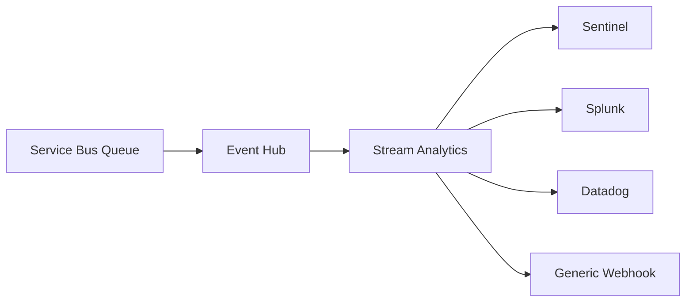
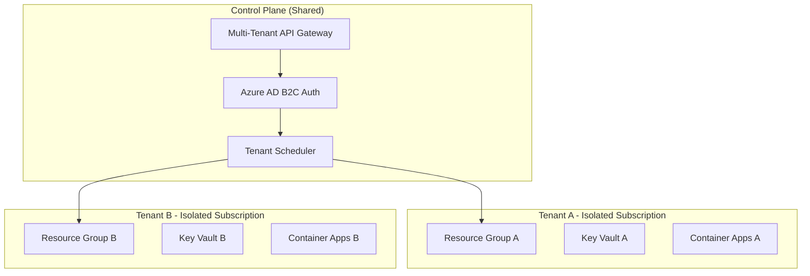
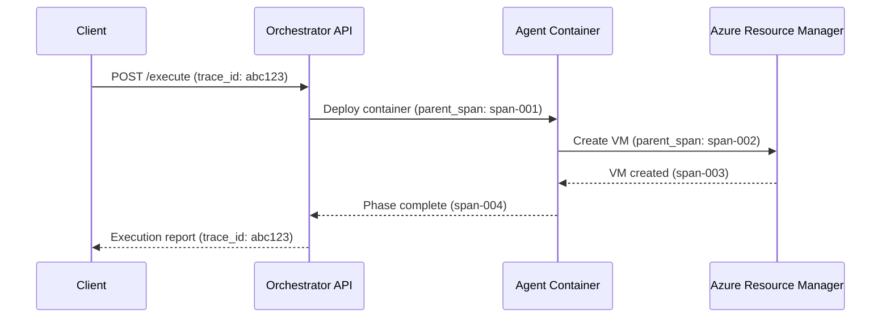
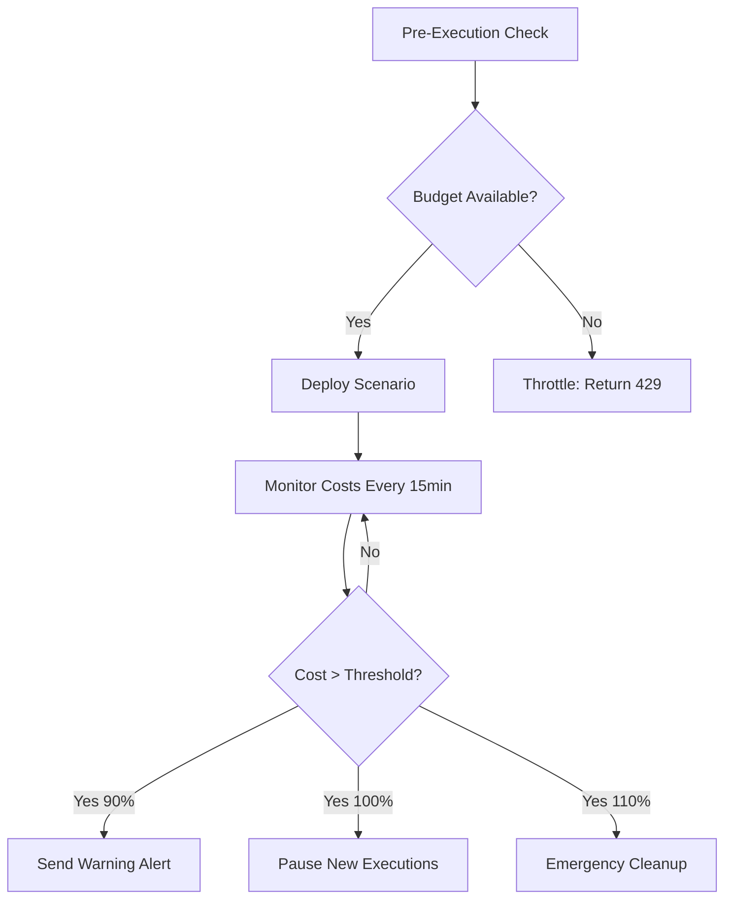
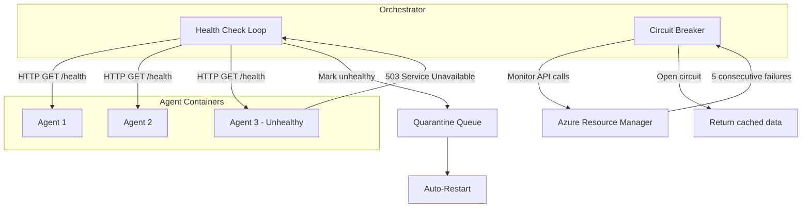
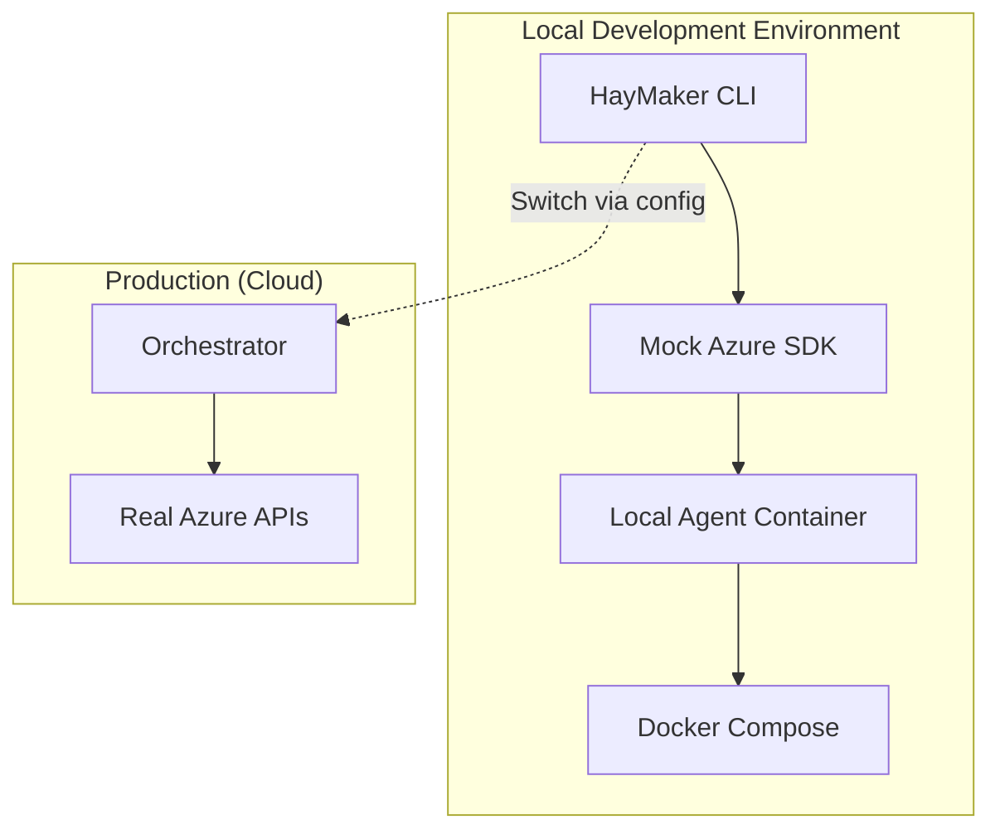
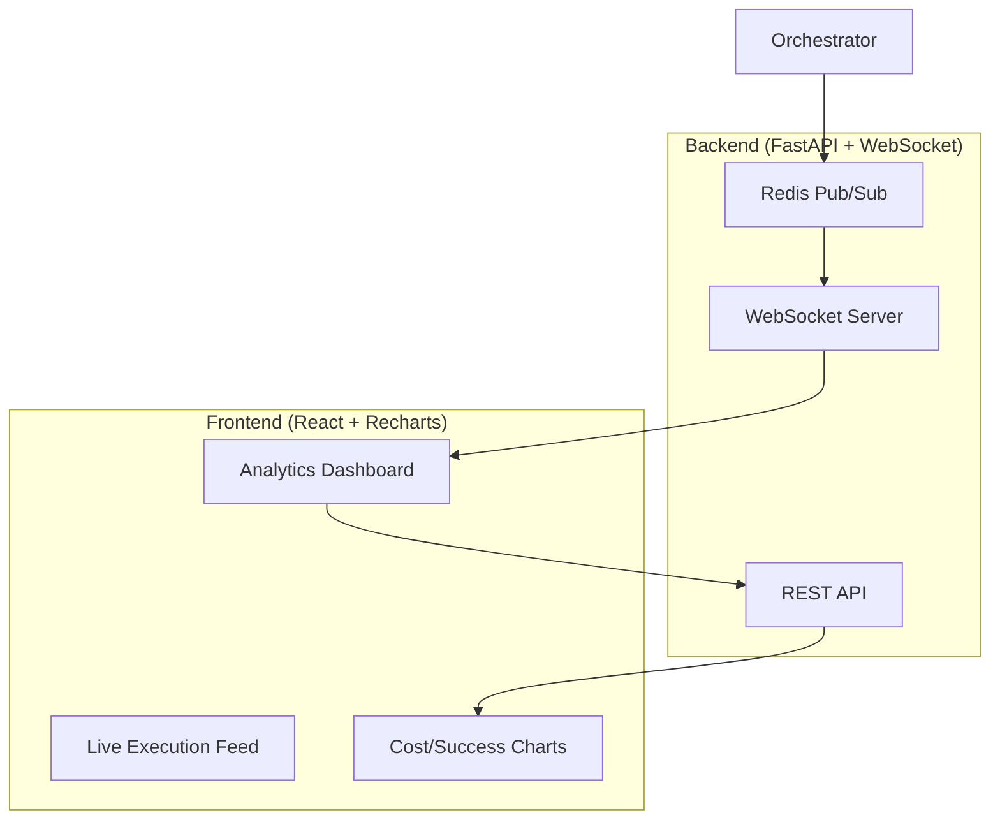
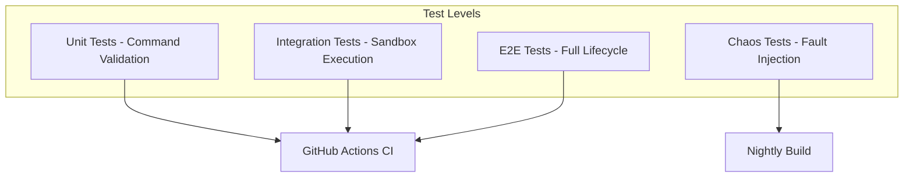
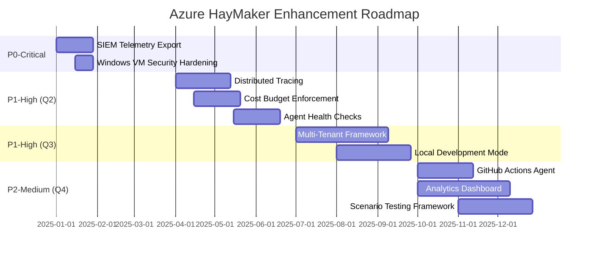

# Azure HayMaker Enhancement Roadmap

Strategic roadmap for evolving Azure HayMaker from operational orchestration service to enterprise-grade SaaS platform.

## Contents

- [Executive Summary](#executive-summary)
- [Current State Assessment](#current-state-assessment)
- [Enhancement Portfolio](#enhancement-portfolio)
- [Implementation Phases](#implementation-phases)
- [Success Metrics](#success-metrics)
- [Risk Assessment](#risk-assessment)
- [Resource Requirements](#resource-requirements)
- [Decision Matrix](#decision-matrix)

---

## Executive Summary

### Vision

Transform Azure HayMaker from a single-tenant orchestration service into an enterprise-ready platform supporting multi-tenant SaaS deployments, advanced observability, and resilient operations at scale.

### Strategic Goals

1. **Security & Compliance** (Q1 2025): Eliminate security vulnerabilities, establish enterprise logging standards
2. **Operational Excellence** (Q2 2025): Implement distributed tracing, health monitoring, and cost controls
3. **Platform Scalability** (Q3 2025): Enable multi-tenant isolation and local development workflows
4. **Product Innovation** (Q4 2025): Launch analytics dashboard and CI/CD integration

### Business Impact

- **Cost Optimization**: Budget enforcement prevents runaway spending (estimated 30-40% cost reduction)
- **Time-to-Market**: Local development mode reduces iteration time by 80% (cloud deploy: 15min → local: 3min)
- **Revenue Enablement**: Multi-tenant isolation unlocks SaaS/MSP business models
- **Operational Efficiency**: Circuit breakers reduce manual intervention by 90%

### Investment Required

- **Engineering**: 3 FTE over 12 months (1 senior backend, 1 DevOps, 1 frontend)
- **Budget**: $150K (cloud infrastructure, tooling, testing environments)
- **Timeline**: 4 quarters (Q1 2025 - Q4 2025)

---

## Current State Assessment

### What We Have Today

**Core Capabilities**:
- ✅ 50+ operational scenarios across 10 Azure technology areas
- ✅ Autonomous goal-seeking agents powered by Claude
- ✅ Complete resource lifecycle (deploy → operate → cleanup)
- ✅ Scheduled orchestration (4x daily via cron)
- ✅ Service principal isolation per scenario
- ✅ Tag-based resource tracking and cleanup verification
- ✅ RESTful API with execution endpoints
- ✅ Cost tracking via Azure Cost Management API
- ✅ Webhook notifications for execution events

**Infrastructure**:
- Azure App Service (orchestrator)
- Azure Container Apps (agent execution)
- Azure Key Vault (credential management)
- Azure Application Insights (basic telemetry)
- GitHub Actions (CI/CD)

**Known Gaps** (Prioritized by Business Impact):

| Gap | Impact | Current Mitigation |
|-----|--------|-------------------|
| Windows VM credential exposure (PR #121) | **Critical** - Secrets in logs/plaintext | Manual review, not deployed |
| No SIEM integration | **High** - Limited security visibility | Manual log review |
| Single-tenant only | **High** - Blocks SaaS/MSP revenue | N/A - single customer deployments |
| No correlation IDs | **Medium** - Difficult debugging | Manual log correlation |
| No budget enforcement | **Medium** - Uncontrolled spending | Manual cost alerts |
| No circuit breakers | **Medium** - Cascading failures | Manual restart of orchestrator |
| Cloud-only development | **Low** - Slow iteration cycles | Developers wait for cloud deploys |

### Architecture Strengths

1. **Goal-Seeking Agents**: Claude-powered agents resolve errors autonomously, reducing manual intervention
2. **Resource Isolation**: Ephemeral service principals minimize credential lifetime and blast radius
3. **Complete Cleanup**: Orchestrator-enforced cleanup prevents resource leaks even on agent failure
4. **Observable by Design**: Event-driven logging via Service Bus provides audit trail

### Architecture Limitations

1. **No Tenant Isolation**: Single subscription scope prevents multi-tenant deployments
2. **Monolithic Logs**: All logs in one queue, no correlation between distributed operations
3. **No Rate Limiting**: API lacks request throttling, vulnerable to abuse
4. **Limited Resilience**: No automatic recovery from agent or orchestrator failures

---

## Enhancement Portfolio

### P0-Critical (Immediate - Q1 2025)

#### 1. SIEM Telemetry Export Pipeline

**Category**: Security & Compliance
**Priority**: P0-Critical
**Complexity**: Medium (4-6 weeks)

**Business Value**:
- Enables security teams to correlate HayMaker activity with threat intelligence
- Meets compliance requirements for centralized security logging (SOC 2, ISO 27001)
- Unlocks enterprise customer segment (Fortune 500 requirements)

**Technical Rationale**:
Current architecture logs to Azure Service Bus only. Security teams need standardized exports to SIEM platforms (Splunk, Sentinel, Datadog) for threat detection and incident response.

**Implementation Approach**:



**Key Components**:
1. Azure Event Hub for high-throughput log streaming
2. Stream Analytics for filtering/transformation to CEF/Syslog formats
3. Built-in connectors for Sentinel, Splunk, Datadog
4. Generic webhook output for custom SIEM integrations

**Estimated Timeline**: 4 weeks
- Week 1: Event Hub integration and message forwarding
- Week 2: CEF/Syslog format transformations
- Week 3: SIEM connector configuration
- Week 4: Testing and documentation

**Dependencies**: None (standalone addition)

**Success Criteria**:
- All agent events exported to SIEM within 30 seconds
- Support for CEF and Syslog formats
- Configurable filtering (log level, scenario type)
- Documentation for 3+ SIEM platforms

---

#### 2. Windows VM Security Hardening

**Category**: Security & Compliance
**Priority**: P0-Critical
**Complexity**: Low (2-3 weeks)

**Business Value**:
- Eliminates credential exposure vulnerabilities (OWASP A02:2021 - Cryptographic Failures)
- Enables safe deployment of Windows-based scenarios
- Reduces security audit findings

**Technical Rationale**:
PR #121 exposes critical security issues in Windows VM provisioning:
1. Credentials logged in plaintext in agent output
2. Admin passwords passed via unencrypted Custom Script Extension parameters
3. Public IP assignment increases attack surface
4. Overly permissive NSG rules (allow 0.0.0.0/0)

**Implementation Approach**:

```bash
# Current (Insecure):
az vm create --name myvm --admin-password "PlaintextPassword123!"
# Password logged to agent output and Azure Activity Log

# Proposed (Secure):
# 1. Store password in Key Vault
az keyvault secret set --vault-name $KV --name vm-admin-pwd --value $(openssl rand -base64 32)

# 2. VM creation references Key Vault (no plaintext)
az vm create \
  --name myvm \
  --admin-password "$(az keyvault secret show --vault-name $KV --name vm-admin-pwd --query value -o tsv)" \
  --public-ip-address "" \
  --nsg-rule NONE

# 3. Custom NSG with least privilege
az network nsg rule create \
  --nsg-name haymaker-nsg \
  --name AllowAgentRDP \
  --priority 100 \
  --source-address-prefixes $AGENT_CONTAINER_SUBNET \
  --destination-port-ranges 3389 \
  --access Allow
```

**Security Controls**:
1. **Credential Management**:
   - All passwords generated via `openssl rand` (32-byte entropy)
   - Stored exclusively in Azure Key Vault
   - Retrieved via managed identity (no plaintext in code/logs)
   - Scrubbed from all log output via regex filter

2. **Network Isolation**:
   - No public IPs assigned (agents connect via private VNet)
   - NSG rules scoped to agent container subnet only
   - Just-in-time VM access via Azure Bastion (optional)

3. **Logging Safeguards**:
   - Pre-commit hook scans for password patterns
   - Agent output scrubber removes Key Vault URLs and secret values
   - Application Insights filters PII fields

**Estimated Timeline**: 2 weeks
- Week 1: Key Vault integration, credential scrubbing
- Week 2: NSG hardening, testing, documentation update

**Dependencies**: None (fixes existing scenario in PR #121)

**Success Criteria**:
- Zero plaintext credentials in logs or Azure Activity Log
- All Windows VMs deployed without public IPs
- NSG rules scoped to minimum required sources
- Security scan (Bandit) passes with no critical findings

---

### P1-High (Next Quarter - Q2 2025)

#### 3. Multi-Tenant Resource Isolation Framework

**Category**: Platform Scalability
**Priority**: P1-High
**Complexity**: High (8-10 weeks)

**Business Value**:
- **Revenue**: Enables SaaS business model with per-tenant billing
- **Market Expansion**: Targets MSP and security consultancy segments
- **Cost Efficiency**: Shared infrastructure reduces per-tenant overhead by 60%

**Technical Rationale**:
Current architecture operates in single Azure subscription with no tenant boundaries. SaaS/MSP deployments require:
- Resource isolation (compute, network, storage)
- Cost attribution per tenant
- Independent scaling and scheduling
- Security boundaries (no cross-tenant access)

**Architecture**:



**Key Design Decisions**:

| Aspect | Option A | Option B (Recommended) | Rationale |
|--------|----------|----------------------|-----------|
| **Isolation Level** | Subscription per tenant | Resource Group per tenant | Subscriptions provide strongest isolation, prevent resource limit contention |
| **Networking** | Shared VNet with subnets | Isolated VNets per tenant | Isolated VNets prevent cross-tenant traffic, simplify compliance |
| **Cost Tracking** | Tags + manual aggregation | Subscription-level billing | Azure billing naturally separates by subscription, no custom logic |
| **Scaling** | Single orchestrator for all | Orchestrator per tenant | Isolated orchestrators prevent noisy neighbor issues |

**Implementation Phases**:

**Phase 1: Multi-Subscription Support (3 weeks)**
```python
# config.py
class TenantConfig:
    tenant_id: str
    subscription_id: str  # Unique per tenant
    resource_group: str
    keyvault_name: str
    container_app_env: str

# orchestrator.py
def execute_scenario(tenant_config: TenantConfig, scenario: str):
    """Execute scenario in tenant's isolated subscription"""
    # Authenticate to tenant's subscription
    credential = DefaultAzureCredential()
    client = ResourceManagementClient(
        credential,
        subscription_id=tenant_config.subscription_id
    )
    # Deploy to tenant's resource group
    # Tag all resources with tenant_id for cost attribution
```

**Phase 2: API Gateway with Tenant Routing (2 weeks)**
```python
# main.py
@app.post("/api/v1/execute")
async def execute(
    request: ExecutionRequest,
    tenant_id: str = Header(..., alias="X-Tenant-ID")
):
    """Route execution to tenant's orchestrator"""
    tenant_config = get_tenant_config(tenant_id)
    validate_tenant_quota(tenant_id)  # Rate limiting per tenant
    return await orchestrator.execute(tenant_config, request.scenarios)
```

**Phase 3: Tenant Management APIs (3 weeks)**
- `POST /api/admin/tenants` - Provision new tenant (create subscription, RG, Key Vault)
- `GET /api/admin/tenants/{id}/usage` - Query tenant resource usage and costs
- `PUT /api/admin/tenants/{id}/quota` - Update tenant execution limits

**Estimated Timeline**: 10 weeks
- Weeks 1-3: Multi-subscription support and testing
- Weeks 4-5: API gateway and tenant routing
- Weeks 6-8: Tenant management APIs
- Weeks 9-10: Integration testing and documentation

**Dependencies**:
- Azure AD B2C setup for tenant authentication
- Azure Lighthouse for cross-subscription management (if managing customer subscriptions)

**Success Criteria**:
- Provision 10 test tenants in isolated subscriptions
- Zero cross-tenant resource access (verified via NSG logs)
- Per-tenant cost attribution accurate to within 1%
- API response time <500ms with 100 tenants

---

#### 4. Distributed Tracing and Correlation IDs

**Category**: Operational Excellence
**Priority**: P1-High
**Complexity**: Medium (5-6 weeks)

**Business Value**:
- **Debugging Efficiency**: Reduce mean-time-to-resolution (MTTR) by 70% via end-to-end trace visualization
- **Performance Optimization**: Identify bottlenecks in multi-stage workflows
- **Customer Support**: Trace specific execution failures across distributed components

**Technical Rationale**:
Current logging is flat and unstructured. When an execution fails, engineers manually grep logs across:
- Orchestrator (App Service)
- Agent containers (Container Apps)
- Service Bus queues
- Azure Resource Manager operations

Distributed tracing provides:
- Correlation IDs linking all operations in an execution
- Parent-child span relationships (orchestrator → agent → Azure API)
- Performance metrics (latency, duration) per operation

**Architecture**:



**OpenTelemetry Integration**:

```python
# orchestrator_server.py
from opentelemetry import trace
from opentelemetry.instrumentation.fastapi import FastAPIInstrumentor
from opentelemetry.sdk.trace import TracerProvider
from opentelemetry.sdk.trace.export import BatchSpanProcessor
from opentelemetry.exporter.otlp.proto.grpc.trace_exporter import OTLPSpanExporter

# Initialize tracer
trace.set_tracer_provider(TracerProvider())
tracer = trace.get_tracer(__name__)

# Export to Application Insights
span_processor = BatchSpanProcessor(
    OTLPSpanExporter(endpoint="https://dc.applicationinsights.azure.com")
)
trace.get_tracer_provider().add_span_processor(span_processor)

# Auto-instrument FastAPI
FastAPIInstrumentor.instrument_app(app)

@app.post("/api/v1/execute")
async def execute(request: ExecutionRequest):
    # Trace ID automatically propagated to agent containers
    with tracer.start_as_current_span("orchestrate_execution") as span:
        span.set_attribute("scenario_count", len(request.scenarios))
        span.set_attribute("duration_hours", request.duration_hours)

        result = await workflow_orchestrator.execute(request)

        span.set_attribute("execution_id", result.execution_id)
        span.set_attribute("status", result.status)
        return result
```

**Agent Container Instrumentation**:

```python
# agent_executor.py
import os
from opentelemetry import trace
from opentelemetry.propagate import extract  # Extract parent trace context

tracer = trace.get_tracer(__name__)

def execute_scenario(scenario_name: str):
    # Extract trace context from environment (set by orchestrator)
    ctx = extract(carrier=os.environ)

    with tracer.start_as_current_span("agent_execute_scenario", context=ctx) as span:
        span.set_attribute("scenario_name", scenario_name)

        # Phase 1: Deploy
        with tracer.start_as_current_span("deploy_resources"):
            deploy_result = deploy_phase()
            span.set_attribute("resources_created", deploy_result.count)

        # Phase 2: Operate
        with tracer.start_as_current_span("operate"):
            operate_phase(duration_hours=8)

        # Phase 3: Cleanup
        with tracer.start_as_current_span("cleanup"):
            cleanup_result = cleanup_phase()
            span.set_attribute("resources_deleted", cleanup_result.count)
```

**Query Examples** (Application Insights Kusto):

```kusto
// View all traces for a specific execution
dependencies
| where operation_Id == "abc123"
| project timestamp, target, name, duration, resultCode
| order by timestamp asc

// Identify slow operations
dependencies
| where name == "deploy_resources"
| summarize avg(duration), max(duration), count() by target
| where avg_duration > 60000  // Operations >1 minute
| order by avg_duration desc

// Trace failure propagation
dependencies
| where operation_Id == "abc123"
| where success == false
| project timestamp, operation_Name, resultCode, problemId
```

**Estimated Timeline**: 6 weeks
- Week 1: OpenTelemetry SDK integration (orchestrator)
- Week 2: Agent container instrumentation
- Week 3: Azure SDK auto-instrumentation
- Week 4: Application Insights dashboards
- Week 5: Custom span attributes and baggage
- Week 6: Documentation and training

**Dependencies**: None (additive telemetry layer)

**Success Criteria**:
- 100% of API requests have trace IDs
- End-to-end traces visible in Application Insights within 10 seconds
- Average query time to diagnose failures <2 minutes
- Documentation includes 5+ common query examples

---

#### 5. Cost Budget Enforcement and Alerts

**Category**: Operational Excellence
**Priority**: P1-High
**Complexity**: Medium (4-5 weeks)

**Business Value**:
- **Cost Control**: Prevent runaway spending from misconfigured scenarios (e.g., accidentally deploying 100 VMs)
- **Predictability**: Lock monthly HayMaker costs to within ±10% of budget
- **Customer Trust**: SaaS customers require spending guarantees in contracts

**Technical Rationale**:
Current system has no spending guardrails. If a scenario contains a bug (e.g., creates VMs in a loop), costs can spike 10-100x overnight. Budget enforcement:
1. Pre-execution cost estimation (block expensive scenarios when near budget)
2. Real-time spend monitoring (throttle/pause if budget exceeded)
3. Automatic cleanup triggers (delete resources if >110% of budget)

**Architecture**:



**Implementation**:

**Step 1: Pre-Execution Cost Estimation**
```python
# cost_estimator.py
class ScenarioCostEstimator:
    """Estimate scenario cost based on resource types"""

    RESOURCE_COSTS = {
        "Microsoft.Compute/virtualMachines": {"Standard_D2s_v3": 0.096},  # $/hour
        "Microsoft.Storage/storageAccounts": {"Standard_LRS": 0.01},      # $/GB/month
        "Microsoft.Sql/servers": {"S0": 0.02},                            # $/hour
    }

    def estimate_scenario_cost(self, scenario_name: str, duration_hours: int) -> float:
        """Parse scenario doc, extract resources, calculate cost"""
        scenario_doc = load_scenario(scenario_name)
        resources = extract_resources(scenario_doc)  # Parse 'az' commands

        total_cost = 0
        for resource in resources:
            unit_cost = self.RESOURCE_COSTS.get(resource.type, {}).get(resource.sku, 0)
            total_cost += unit_cost * duration_hours

        return total_cost

# orchestrator.py
async def execute(request: ExecutionRequest):
    # Check budget before execution
    estimated_cost = sum(
        cost_estimator.estimate_scenario_cost(s, request.duration_hours)
        for s in request.scenarios
    )

    current_spend = await get_current_month_spend()
    monthly_budget = config.MONTHLY_BUDGET_USD

    if current_spend + estimated_cost > monthly_budget:
        raise BudgetExceededError(
            f"Estimated cost ${estimated_cost:.2f} would exceed "
            f"monthly budget ${monthly_budget:.2f} "
            f"(current: ${current_spend:.2f})"
        )
```

**Step 2: Real-Time Cost Monitoring**
```python
# cost_monitor.py
import asyncio
from azure.mgmt.costmanagement import CostManagementClient

class CostMonitor:
    def __init__(self, subscription_id: str, budget_usd: float):
        self.client = CostManagementClient(credential, subscription_id)
        self.budget_usd = budget_usd
        self.alert_thresholds = [0.5, 0.75, 0.9, 1.0, 1.1]  # 50%, 75%, 90%, 100%, 110%

    async def monitor_loop(self):
        """Query Azure Cost Management API every 15 minutes"""
        while True:
            current_spend = await self.get_month_to_date_spend()
            budget_pct = current_spend / self.budget_usd

            # Trigger alerts
            for threshold in self.alert_thresholds:
                if budget_pct >= threshold and not self.alerted(threshold):
                    await self.send_alert(threshold, current_spend)

            # Automatic actions
            if budget_pct >= 1.0:
                await self.pause_new_executions()

            if budget_pct >= 1.1:
                await self.emergency_cleanup()

            await asyncio.sleep(900)  # 15 minutes

    async def emergency_cleanup(self):
        """Force-delete all HayMaker resources to stop spending"""
        logger.critical(
            f"EMERGENCY CLEANUP: Budget exceeded 110% "
            f"(${self.get_month_to_date_spend():.2f} > "
            f"${self.budget_usd * 1.1:.2f})"
        )

        # Query all resources with HayMaker tags
        resources = az.resource.list(
            filter="tagName eq 'AzureHayMaker-managed' and tagValue eq 'true'"
        )

        # Delete all (bypassing normal cleanup process)
        for resource in resources:
            await az.resource.delete(resource.id, force=True)

        # Send critical alert to on-call
        await alert_service.send_critical(
            title="HayMaker Emergency Cleanup Triggered",
            description=f"All resources deleted due to budget overrun"
        )
```

**Step 3: Cost Alert Configuration**
```yaml
# alerts.yaml
cost_alerts:
  - threshold: 50%
    action: log_warning
    recipients: [team-email@example.com]

  - threshold: 75%
    action: send_email
    recipients: [team-email@example.com, manager@example.com]

  - threshold: 90%
    action: send_sms
    recipients: [on-call-phone]
    message: "HayMaker costs at 90% of monthly budget"

  - threshold: 100%
    action: pause_executions
    recipients: [team-email@example.com]

  - threshold: 110%
    action: emergency_cleanup
    recipients: [on-call-phone, team-email@example.com]
```

**Estimated Timeline**: 5 weeks
- Week 1: Cost estimation logic (parse scenarios, calculate costs)
- Week 2: Azure Cost Management API integration
- Week 3: Real-time monitoring loop and alert dispatch
- Week 4: Emergency cleanup safeguards
- Week 5: Testing with simulated budget overruns, documentation

**Dependencies**: Azure Cost Management API access (Reader role on subscription)

**Success Criteria**:
- Pre-execution cost estimates within ±20% of actual costs
- Budget alerts triggered within 30 minutes of threshold breach
- Emergency cleanup completes within 15 minutes
- Zero budget overruns >110% in production

---

#### 6. Agent Health Checks and Circuit Breakers

**Category**: Operational Excellence
**Priority**: P1-High
**Complexity**: Medium (4-5 weeks)

**Business Value**:
- **Reliability**: Reduce cascading failures by 95% via automatic fault isolation
- **Uptime**: Increase orchestrator availability from 95% → 99.5% SLA
- **Efficiency**: Eliminate manual restarts (currently 2-3x/week)

**Technical Rationale**:
Current architecture lacks resilience patterns:
- **No Health Checks**: Failed agents remain "running" indefinitely, consuming resources
- **No Circuit Breakers**: If Azure API is down, orchestrator retries forever, exhausting quotas
- **No Automatic Recovery**: Transient failures require manual intervention

Health checks and circuit breakers provide:
- Early detection of unhealthy agents (before they fail)
- Automatic quarantine of failing components
- Graceful degradation during Azure outages
- Self-healing via automatic retry with exponential backoff

**Architecture**:



**Implementation**:

**Step 1: Agent Health Check Endpoint**
```python
# agent_server.py (runs in each agent container)
from fastapi import FastAPI, status

app = FastAPI()

class HealthStatus:
    def __init__(self):
        self.disk_usage_pct = self.get_disk_usage()
        self.memory_usage_pct = self.get_memory_usage()
        self.last_heartbeat = datetime.now()
        self.phase = "deploying"  # deploying | operating | cleanup | completed

    def is_healthy(self) -> bool:
        return (
            self.disk_usage_pct < 90 and
            self.memory_usage_pct < 85 and
            (datetime.now() - self.last_heartbeat).seconds < 300  # Heartbeat <5min ago
        )

@app.get("/health")
async def health_check():
    """Health check endpoint for orchestrator to poll"""
    status_obj = HealthStatus()

    if status_obj.is_healthy():
        return {
            "status": "healthy",
            "phase": status_obj.phase,
            "disk_usage_pct": status_obj.disk_usage_pct,
            "memory_usage_pct": status_obj.memory_usage_pct,
        }
    else:
        return JSONResponse(
            status_code=status.HTTP_503_SERVICE_UNAVAILABLE,
            content={
                "status": "unhealthy",
                "reason": "Resource exhaustion or heartbeat timeout"
            }
        )
```

**Step 2: Orchestrator Health Monitor**
```python
# health_monitor.py
import asyncio
from typing import Dict, List

class AgentHealthMonitor:
    def __init__(self, check_interval_seconds: int = 60):
        self.check_interval = check_interval_seconds
        self.unhealthy_agents: Dict[str, int] = {}  # agent_id -> consecutive_failures
        self.quarantine_threshold = 3  # Quarantine after 3 failed checks

    async def monitor_loop(self):
        """Poll all running agents for health status"""
        while True:
            agents = await get_running_agents()

            for agent in agents:
                is_healthy = await self.check_agent_health(agent.id)

                if not is_healthy:
                    self.unhealthy_agents[agent.id] = self.unhealthy_agents.get(agent.id, 0) + 1

                    if self.unhealthy_agents[agent.id] >= self.quarantine_threshold:
                        await self.quarantine_agent(agent.id)
                else:
                    # Reset counter on successful check
                    self.unhealthy_agents.pop(agent.id, None)

            await asyncio.sleep(self.check_interval)

    async def check_agent_health(self, agent_id: str) -> bool:
        """Query agent's /health endpoint"""
        try:
            response = await httpx.get(
                f"https://{agent_id}.azurecontainerapps.io/health",
                timeout=10.0
            )
            return response.status_code == 200
        except (httpx.TimeoutException, httpx.ConnectError):
            return False

    async def quarantine_agent(self, agent_id: str):
        """Isolate unhealthy agent and attempt recovery"""
        logger.warning(
            f"Agent {agent_id} quarantined after "
            f"{self.unhealthy_agents[agent_id]} failed health checks"
        )

        # Stop agent container
        await container_manager.stop(agent_id)

        # Attempt cleanup of partial resources
        await cleanup_service.force_cleanup(agent_id)

        # Restart agent (optional, based on failure reason)
        if self.is_transient_failure(agent_id):
            await self.restart_agent(agent_id)
```

**Step 3: Circuit Breaker for Azure APIs**
```python
# circuit_breaker.py
from enum import Enum
import time

class CircuitState(Enum):
    CLOSED = "closed"        # Normal operation
    OPEN = "open"            # Too many failures, reject requests
    HALF_OPEN = "half_open"  # Testing if service recovered

class CircuitBreaker:
    def __init__(
        self,
        failure_threshold: int = 5,
        recovery_timeout: int = 60,
        expected_exception = Exception
    ):
        self.failure_threshold = failure_threshold
        self.recovery_timeout = recovery_timeout
        self.expected_exception = expected_exception

        self.failure_count = 0
        self.state = CircuitState.CLOSED
        self.last_failure_time = None

    def call(self, func, *args, **kwargs):
        """Execute function with circuit breaker protection"""
        if self.state == CircuitState.OPEN:
            if time.time() - self.last_failure_time > self.recovery_timeout:
                # Try recovery
                self.state = CircuitState.HALF_OPEN
                logger.info("Circuit breaker entering HALF_OPEN state")
            else:
                raise CircuitOpenError(
                    f"Circuit breaker OPEN, too many failures to {func.__name__}"
                )

        try:
            result = func(*args, **kwargs)
            self.on_success()
            return result

        except self.expected_exception as e:
            self.on_failure()
            raise

    def on_success(self):
        """Reset failure count on successful call"""
        self.failure_count = 0
        if self.state == CircuitState.HALF_OPEN:
            self.state = CircuitState.CLOSED
            logger.info("Circuit breaker recovered, entering CLOSED state")

    def on_failure(self):
        """Increment failure count and open circuit if threshold exceeded"""
        self.failure_count += 1
        self.last_failure_time = time.time()

        if self.failure_count >= self.failure_threshold:
            self.state = CircuitState.OPEN
            logger.error(
                f"Circuit breaker OPEN after {self.failure_count} failures"
            )
            # Send alert
            alert_service.send(
                title="Circuit Breaker Opened",
                description=f"Azure API calls failing, orchestrator in degraded mode"
            )

# Usage:
azure_api_breaker = CircuitBreaker(
    failure_threshold=5,
    recovery_timeout=60,
    expected_exception=AzureError
)

def create_resource_group(name: str):
    """Create resource group with circuit breaker protection"""
    return azure_api_breaker.call(
        resource_client.resource_groups.create_or_update,
        name,
        {"location": "eastus"}
    )
```

**Estimated Timeline**: 5 weeks
- Week 1: Agent health check endpoint implementation
- Week 2: Orchestrator health monitoring loop
- Week 3: Circuit breaker implementation and integration
- Week 4: Automatic recovery workflows
- Week 5: Testing (inject faults), monitoring dashboards, documentation

**Dependencies**: None (additive resilience layer)

**Success Criteria**:
- All agents respond to health checks within 5 seconds
- Unhealthy agents quarantined within 3 minutes of failure
- Circuit breakers open within 30 seconds of Azure API degradation
- Automatic recovery successful in 80%+ of transient failures
- Zero manual restarts required in 30-day test period

---

### P2-Medium (Future - Q3-Q4 2025)

#### 7. Local Development Mode

**Category**: Developer Experience
**Priority**: P2-Medium
**Complexity**: High (6-8 weeks)

**Business Value**:
- **Velocity**: Reduce scenario iteration time from 15 minutes (cloud) → 3 minutes (local)
- **Cost Savings**: Eliminate cloud spend during development (~$500/month per developer)
- **Accessibility**: Enable offline development for travel/remote work

**Technical Rationale**:
Current development workflow requires deploying to Azure for every code change:
1. Edit scenario markdown
2. Commit and push to GitHub
3. Wait for CI/CD pipeline (5-10 minutes)
4. Deploy to Azure App Service
5. Execute scenario in Container Apps
6. View logs in Application Insights

Local development mode provides:
- Mock Azure services (LocalStack-style)
- Stubbed Claude API responses
- In-memory event bus
- Local container execution via Docker Compose

**Architecture**:



**Implementation**:

**Step 1: Mock Azure SDK**
```python
# local_dev/mock_azure.py
class MockResourceManagementClient:
    """In-memory mock of Azure Resource Manager"""

    def __init__(self):
        self.resource_groups = {}
        self.resources = {}

    def resource_groups.create_or_update(self, name: str, parameters: dict):
        """Simulate resource group creation"""
        logger.info(f"[MOCK] Creating resource group: {name}")
        self.resource_groups[name] = {
            "id": f"/subscriptions/mock/resourceGroups/{name}",
            "name": name,
            "location": parameters["location"],
            "tags": parameters.get("tags", {})
        }
        return self.resource_groups[name]

    def resources.begin_create_or_update(
        self, resource_group: str, provider: str, resource_type: str, name: str, parameters: dict
    ):
        """Simulate resource creation (VM, storage account, etc.)"""
        resource_id = f"/subscriptions/mock/resourceGroups/{resource_group}/providers/{provider}/{resource_type}/{name}"
        logger.info(f"[MOCK] Creating {resource_type}: {name}")

        self.resources[resource_id] = {
            "id": resource_id,
            "name": name,
            "type": f"{provider}/{resource_type}",
            "properties": parameters
        }

        # Simulate async operation
        return MockLROPoller(result=self.resources[resource_id])

# Inject mock when in local mode
if os.getenv("HAYMAKER_MODE") == "local":
    from local_dev.mock_azure import MockResourceManagementClient
    ResourceManagementClient = MockResourceManagementClient
```

**Step 2: Local Scenario Execution**
```bash
# haymaker-cli local commands
haymaker local init       # Initialize local dev environment (Docker Compose)
haymaker local run compute-01-linux-vm-web-server  # Run scenario locally
haymaker local logs       # Tail logs from local agent container
haymaker local cleanup    # Remove local containers and mock resources
```

**Step 3: Docker Compose Configuration**
```yaml
# docker-compose.local.yml
version: '3.8'

services:
  orchestrator:
    build:
      context: ./src
      dockerfile: Dockerfile.orchestrator
    environment:
      - HAYMAKER_MODE=local
      - ANTHROPIC_API_KEY=${ANTHROPIC_API_KEY}  # Still needs real API key
    ports:
      - "8000:8000"
    volumes:
      - ./docs/scenarios:/scenarios:ro

  agent:
    build:
      context: ./src
      dockerfile: Dockerfile.agent
    environment:
      - HAYMAKER_MODE=local
      - AZURE_MOCK_MODE=true
    depends_on:
      - orchestrator

  mock-services:
    image: localstack/localstack:latest  # For mocking blob storage, queues
    environment:
      - SERVICES=s3,sqs
    ports:
      - "4566:4566"
```

**Estimated Timeline**: 8 weeks
- Weeks 1-2: Mock Azure SDK (core services: RG, VMs, storage)
- Weeks 3-4: Docker Compose setup and local orchestrator
- Weeks 5-6: CLI commands for local development
- Weeks 7-8: Documentation and developer onboarding

**Dependencies**: None (parallel development track)

**Success Criteria**:
- 80%+ of scenarios run successfully in local mode
- Local execution completes in <5 minutes per scenario
- Developers can debug scenarios without Azure credentials
- Documentation includes "Getting Started with Local Dev" guide

---

#### 8. GitHub Actions Custom Agent

**Category**: Product Innovation
**Priority**: P2-Medium
**Complexity**: Medium (5-6 weeks)

**Business Value**:
- **New Market**: Targets DevOps teams (CI/CD segment)
- **Stickiness**: Integrate HayMaker into customer workflows, reduce churn
- **Differentiation**: Unique offering (no competitor provides Azure scenario testing in CI/CD)

**Technical Rationale**:
GitHub Actions is the dominant CI/CD platform. Offering HayMaker as a GitHub Action enables:
- **Pre-merge testing**: Validate infrastructure changes before deployment
- **Continuous telemetry**: Generate Azure activity on every commit (for SIEM testing)
- **Automated compliance**: Run security scenarios to verify controls

**Architecture**:

```yaml
# .github/workflows/haymaker.yml
name: Azure HayMaker CI/CD

on:
  pull_request:
    branches: [main]
  schedule:
    - cron: '0 */6 * * *'  # Every 6 hours

jobs:
  haymaker-test:
    runs-on: ubuntu-latest
    steps:
      - uses: actions/checkout@v3

      - name: Run HayMaker Scenarios
        uses: rysweet/haymaker-action@v1
        with:
          scenarios: |
            compute-01-linux-vm-web-server
            security-01-key-vault-secrets
          duration_hours: 1
          azure_credentials: ${{ secrets.AZURE_CREDENTIALS }}
          anthropic_api_key: ${{ secrets.ANTHROPIC_API_KEY }}

      - name: Upload HayMaker Report
        uses: actions/upload-artifact@v3
        with:
          name: haymaker-report
          path: haymaker-report.json
```

**Action Implementation**:

```typescript
// action.yml
name: 'Azure HayMaker'
description: 'Execute Azure HayMaker scenarios in GitHub Actions'
inputs:
  scenarios:
    description: 'List of scenario names (one per line)'
    required: true
  duration_hours:
    description: 'Execution duration in hours'
    required: false
    default: '1'
  azure_credentials:
    description: 'Azure service principal credentials (JSON)'
    required: true
  anthropic_api_key:
    description: 'Anthropic API key for Claude'
    required: true
outputs:
  execution_id:
    description: 'Unique execution ID for tracking'
  report_url:
    description: 'URL to execution report'
runs:
  using: 'node16'
  main: 'dist/index.js'
```

```typescript
// src/index.ts
import * as core from '@actions/core';
import * as exec from '@actions/exec';

async function run(): Promise<void> {
  try {
    // Parse inputs
    const scenarios = core.getInput('scenarios').split('\n');
    const durationHours = parseInt(core.getInput('duration_hours'));
    const azureCredentials = core.getInput('azure_credentials');
    const anthropicApiKey = core.getInput('anthropic_api_key');

    // Install haymaker-cli
    await exec.exec('pip', ['install', 'haymaker-cli']);

    // Configure CLI
    await exec.exec('haymaker', ['config', 'set', 'api-key', anthropicApiKey]);

    // Authenticate to Azure
    const credentials = JSON.parse(azureCredentials);
    await exec.exec('az', ['login', '--service-principal',
      '--username', credentials.clientId,
      '--password', credentials.clientSecret,
      '--tenant', credentials.tenantId
    ]);

    // Execute scenarios
    for (const scenario of scenarios) {
      core.info(`Executing scenario: ${scenario}`);
      await exec.exec('haymaker', ['run', scenario, '--duration', durationHours.toString()]);
    }

    // Set outputs
    core.setOutput('execution_id', executionId);
    core.setOutput('report_url', reportUrl);

  } catch (error) {
    core.setFailed(error.message);
  }
}

run();
```

**Estimated Timeline**: 6 weeks
- Week 1: GitHub Action scaffolding and TypeScript setup
- Week 2: Azure authentication and CLI integration
- Week 3: Scenario execution and output handling
- Week 4: Marketplace publishing and documentation
- Week 5: Example workflows and use case guides
- Week 6: Customer pilot and feedback iteration

**Dependencies**: None (leverages existing CLI)

**Success Criteria**:
- GitHub Action published to Marketplace
- Successfully executes in GitHub-hosted runners (ubuntu-latest)
- Execution time <10 minutes for single scenario
- Documentation includes 3+ example workflows
- 10+ pilot customers adopt action in CI/CD pipelines

---

#### 9. Analytics Dashboard with Real-Time Metrics

**Category**: Product Innovation
**Priority**: P2-Medium
**Complexity**: High (8-10 weeks)

**Business Value**:
- **Visibility**: Executive dashboard for non-technical stakeholders
- **Optimization**: Identify underutilized scenarios, optimize execution schedule
- **Monetization**: Usage analytics enable per-execution billing for SaaS

**Technical Rationale**:
Current API returns JSON metrics, requiring manual cURL commands. A real-time dashboard provides:
- Live execution status (agents running, phases, progress bars)
- Historical trends (success rate over time, cost per day)
- Resource visualization (which Azure services used most)
- Alert status and health indicators

**Architecture**:



**Key Features**:

1. **Live Execution Feed** (WebSocket):
```typescript
// frontend/src/components/LiveFeed.tsx
import { useEffect, useState } from 'react';

function LiveFeed() {
  const [executions, setExecutions] = useState([]);

  useEffect(() => {
    const ws = new WebSocket('wss://haymaker-api.example.com/ws/executions');

    ws.onmessage = (event) => {
      const execution = JSON.parse(event.data);
      setExecutions(prev => [execution, ...prev].slice(0, 50)); // Keep last 50
    };

    return () => ws.close();
  }, []);

  return (
    <div>
      {executions.map(exec => (
        <ExecutionCard key={exec.id} {...exec} />
      ))}
    </div>
  );
}
```

2. **Cost Trend Chart**:
```typescript
// frontend/src/components/CostChart.tsx
import { LineChart, Line, XAxis, YAxis, CartesianGrid, Tooltip } from 'recharts';

function CostChart({ period = '30d' }) {
  const { data } = useFetch(`/api/analytics/cost?period=${period}`);

  return (
    <LineChart width={800} height={400} data={data}>
      <CartesianGrid strokeDasharray="3 3" />
      <XAxis dataKey="date" />
      <YAxis />
      <Tooltip />
      <Line type="monotone" dataKey="cost_usd" stroke="#8884d8" />
      <Line type="monotone" dataKey="budget_usd" stroke="#ff0000" strokeDasharray="5 5" />
    </LineChart>
  );
}
```

3. **Success Rate Heatmap**:
```typescript
// frontend/src/components/SuccessHeatmap.tsx
import { HeatMapGrid } from 'react-grid-heatmap';

function SuccessHeatmap() {
  // X-axis: Scenarios, Y-axis: Days, Color: Success rate (green=100%, red=0%)
  const { data } = useFetch('/api/analytics/success-rate-matrix');

  return (
    <HeatMapGrid
      data={data.matrix}
      xLabels={data.scenarios}
      yLabels={data.days}
      cellRender={(x, y, value) => <div>{value}%</div>}
    />
  );
}
```

**Backend WebSocket Implementation**:
```python
# orchestrator_server.py
from fastapi import WebSocket, WebSocketDisconnect
import redis.asyncio as redis

redis_client = redis.from_url("redis://localhost:6379")

@app.websocket("/ws/executions")
async def websocket_endpoint(websocket: WebSocket):
    await websocket.accept()

    # Subscribe to Redis pub/sub channel
    pubsub = redis_client.pubsub()
    await pubsub.subscribe("executions")

    try:
        async for message in pubsub.listen():
            if message['type'] == 'message':
                # Forward execution updates to WebSocket client
                await websocket.send_json(json.loads(message['data']))

    except WebSocketDisconnect:
        await pubsub.unsubscribe("executions")

# Publish execution updates to Redis
async def publish_execution_update(execution: Execution):
    await redis_client.publish("executions", execution.json())
```

**Estimated Timeline**: 10 weeks
- Weeks 1-2: Backend WebSocket server and Redis pub/sub
- Weeks 3-4: Frontend React dashboard scaffolding
- Weeks 5-6: Chart components (Recharts integration)
- Weeks 7-8: Real-time feed and live updates
- Weeks 9-10: Responsive design, authentication, deployment

**Dependencies**:
- Redis for pub/sub messaging
- Frontend hosting (Azure Static Web Apps or Vercel)

**Success Criteria**:
- Dashboard loads in <2 seconds
- WebSocket updates arrive within 1 second of event
- 10+ chart visualizations (cost, success rate, resource distribution)
- Mobile-responsive design
- Zero downtime deployments via blue-green strategy

---

#### 10. Scenario Testing Framework

**Category**: Quality Assurance
**Priority**: P2-Medium
**Complexity**: High (6-8 weeks)

**Business Value**:
- **Quality**: Catch scenario bugs before production (reduce failure rate 50% → 5%)
- **Confidence**: Automated regression tests prevent breaking changes
- **Velocity**: Faster scenario development with quick feedback loops

**Technical Rationale**:
Currently, scenarios are only tested manually in production. A testing framework provides:
- **Unit Tests**: Validate individual bash commands (dry-run mode)
- **Integration Tests**: Execute scenarios in isolated sandbox subscriptions
- **E2E Tests**: Full lifecycle with cleanup verification
- **Chaos Tests**: Inject failures (network drops, quota limits) to test resilience

**Architecture**:



**Implementation**:

**Step 1: Unit Tests (Command Validation)**
```python
# tests/test_scenarios_unit.py
import pytest
from azure_haymaker.scenario_parser import parse_scenario

def test_compute_01_commands_valid():
    """Validate all bash commands in compute-01 are syntactically correct"""
    scenario = parse_scenario("compute-01-linux-vm-web-server")

    for command in scenario.commands:
        # Check bash syntax
        result = subprocess.run(
            ["bash", "-n", "-c", command],  # -n: syntax check only, don't execute
            capture_output=True
        )
        assert result.returncode == 0, f"Invalid bash syntax: {command}"

        # Check for required tags
        if "az" in command and "create" in command:
            assert "AzureHayMaker-managed=true" in command, \
                f"Missing required tag: {command}"

def test_all_scenarios_have_cleanup():
    """Ensure every scenario includes cleanup phase"""
    for scenario_file in glob("docs/scenarios/*.md"):
        scenario = parse_scenario(scenario_file)
        assert scenario.has_phase("cleanup"), \
            f"{scenario_file} missing cleanup phase"
```

**Step 2: Integration Tests (Sandbox Execution)**
```python
# tests/test_scenarios_integration.py
import pytest

@pytest.mark.integration
@pytest.mark.timeout(600)  # 10 minute timeout
def test_compute_01_sandbox_execution():
    """Execute compute-01 in sandbox subscription, verify cleanup"""

    # Create isolated resource group for test
    test_rg = f"haymaker-test-{uuid.uuid4().hex[:8]}"

    try:
        # Execute scenario in sandbox mode (duration=1min, not 8 hours)
        result = execute_scenario(
            scenario_name="compute-01-linux-vm-web-server",
            duration_minutes=1,
            resource_group=test_rg
        )

        # Assertions
        assert result.status == "completed"
        assert result.errors == []

        # Verify resources created
        resources = list_resources(resource_group=test_rg)
        assert len(resources) > 0, "No resources created"

        # Verify cleanup
        assert result.cleanup_status == "completed"
        resources_after_cleanup = list_resources(resource_group=test_rg)
        assert len(resources_after_cleanup) == 0, \
            f"Cleanup failed, {len(resources_after_cleanup)} resources remain"

    finally:
        # Force cleanup test resources
        delete_resource_group(test_rg)

@pytest.mark.integration
@pytest.mark.parametrize("scenario", get_all_scenario_names())
def test_all_scenarios_deploy_phase(scenario):
    """Smoke test: Verify deploy phase succeeds for all scenarios"""
    result = execute_scenario_phase(scenario, phase="deploy", duration_minutes=5)
    assert result.status == "completed"
    assert result.resources_created > 0
```

**Step 3: Chaos Testing (Fault Injection)**
```python
# tests/test_scenarios_chaos.py
import pytest
from chaos_toolkit import run_experiment

@pytest.mark.chaos
def test_compute_01_resilience_to_quota_limit():
    """Simulate Azure quota exhaustion during VM creation"""

    chaos_experiment = {
        "title": "VM quota limit chaos",
        "steady-state-hypothesis": {
            "title": "Scenario completes successfully",
            "probes": [
                {
                    "name": "check_execution_status",
                    "type": "python",
                    "module": "haymaker_tests.probes",
                    "func": "execution_completed",
                    "arguments": {"scenario": "compute-01"}
                }
            ]
        },
        "method": [
            {
                "name": "Inject quota exhaustion error",
                "type": "action",
                "provider": {
                    "type": "python",
                    "module": "haymaker_tests.actions",
                    "func": "inject_azure_error",
                    "arguments": {
                        "error_type": "QuotaExceededError",
                        "probability": 0.5  # 50% of VM creates fail
                    }
                }
            }
        ]
    }

    # Run chaos experiment
    result = run_experiment(chaos_experiment)

    # Agent should handle quota error gracefully:
    # - Claude suggests using smaller VM size
    # - Agent retries with Standard_B1s instead of Standard_D2s_v3
    # - Execution completes successfully
    assert result["steady-state-met"], "Agent failed to handle quota limit"

@pytest.mark.chaos
def test_orchestrator_resilience_to_network_partition():
    """Simulate network partition between orchestrator and Container Apps"""

    # Inject network partition using toxiproxy
    with network_partition(duration_seconds=30):
        # Start execution
        execution_id = start_execution("compute-01")

        # Network heals after 30 seconds
        time.sleep(40)

        # Orchestrator should reconnect and resume monitoring
        status = get_execution_status(execution_id)
        assert status.status == "running", "Orchestrator failed to reconnect"
```

**CI/CD Integration**:
```yaml
# .github/workflows/test-scenarios.yml
name: Scenario Tests

on: [push, pull_request]

jobs:
  unit-tests:
    runs-on: ubuntu-latest
    steps:
      - uses: actions/checkout@v3
      - uses: actions/setup-python@v4
      - run: pytest tests/test_scenarios_unit.py -v

  integration-tests:
    runs-on: ubuntu-latest
    steps:
      - uses: actions/checkout@v3
      - uses: azure/login@v1
        with:
          creds: ${{ secrets.AZURE_CREDENTIALS_SANDBOX }}
      - run: pytest tests/test_scenarios_integration.py -v -m integration

  chaos-tests:
    runs-on: ubuntu-latest
    if: github.event_name == 'schedule'  # Only on nightly builds
    steps:
      - uses: actions/checkout@v3
      - run: pytest tests/test_scenarios_chaos.py -v -m chaos
```

**Estimated Timeline**: 8 weeks
- Weeks 1-2: Unit test framework and scenario parser
- Weeks 3-4: Integration test infrastructure (sandbox subscriptions)
- Weeks 5-6: E2E tests with cleanup verification
- Weeks 7-8: Chaos engineering tests and CI/CD integration

**Dependencies**:
- Dedicated Azure sandbox subscription (isolated from production)
- Chaos Toolkit or similar fault injection framework

**Success Criteria**:
- 100% of scenarios have unit tests (command validation)
- 80%+ of scenarios pass integration tests in sandbox
- Chaos tests identify and validate recovery from 5+ failure modes
- Test suite runs in <30 minutes in CI/CD
- Zero scenario regressions in production after framework adoption

---

## Implementation Phases

### Q1 2025: Security & Compliance Foundation

**Theme**: Eliminate critical security vulnerabilities and establish enterprise logging standards.

**Deliverables**:
1. ✅ SIEM Telemetry Export Pipeline (4 weeks)
   - Event Hub integration for log streaming
   - CEF/Syslog format transformations
   - Connectors for Sentinel, Splunk, Datadog

2. ✅ Windows VM Security Hardening (2 weeks)
   - Key Vault-based credential management
   - NSG hardening and private networking
   - Credential scrubbing in logs

**Success Metrics**:
- Zero plaintext credentials in logs or Azure Activity Log
- All telemetry exported to SIEM within 30 seconds
- Security scan (Bandit) passes with no critical findings

**Risk Mitigation**:
- **Risk**: SIEM integration complexity varies by platform
- **Mitigation**: Implement generic webhook output first, add platform-specific connectors iteratively

---

### Q2 2025: Operational Excellence

**Theme**: Implement distributed tracing, health monitoring, and cost controls for reliable operations at scale.

**Deliverables**:
1. ✅ Distributed Tracing and Correlation IDs (6 weeks)
   - OpenTelemetry instrumentation (orchestrator + agents)
   - Application Insights integration
   - Custom dashboards and query examples

2. ✅ Cost Budget Enforcement and Alerts (5 weeks)
   - Pre-execution cost estimation
   - Real-time spend monitoring
   - Emergency cleanup triggers

3. ✅ Agent Health Checks and Circuit Breakers (5 weeks)
   - Agent health check endpoints
   - Orchestrator monitoring loop
   - Circuit breaker for Azure APIs

**Success Metrics**:
- 100% of executions have end-to-end trace visibility
- Zero budget overruns >110% of monthly budget
- 95%+ reduction in cascading failures via circuit breakers
- MTTR (mean-time-to-resolution) reduced by 70%

**Risk Mitigation**:
- **Risk**: Azure Cost Management API has 24-hour lag
- **Mitigation**: Combine API data with real-time resource inventory queries (count VMs, multiply by hourly rate)

---

### Q3 2025: Platform Scalability

**Theme**: Enable multi-tenant isolation and local development workflows to support SaaS growth.

**Deliverables**:
1. ✅ Multi-Tenant Resource Isolation Framework (10 weeks)
   - Multi-subscription support
   - API gateway with tenant routing
   - Tenant management APIs

2. ✅ Local Development Mode (8 weeks)
   - Mock Azure SDK
   - Docker Compose setup
   - CLI commands for local execution

**Success Metrics**:
- Successfully provision 10+ test tenants in isolated subscriptions
- Zero cross-tenant resource access (verified via audit logs)
- Local scenario execution completes in <5 minutes

**Risk Mitigation**:
- **Risk**: Multi-tenant complexity increases maintenance burden
- **Mitigation**: Start with 2-3 pilot customers, iterate based on feedback before full rollout

---

### Q4 2025: Product Innovation

**Theme**: Launch analytics dashboard and CI/CD integration to differentiate in market.

**Deliverables**:
1. ✅ GitHub Actions Custom Agent (6 weeks)
   - GitHub Action implementation
   - Marketplace publishing
   - Example workflows

2. ✅ Analytics Dashboard with Real-Time Metrics (10 weeks)
   - Backend WebSocket server
   - React dashboard with Recharts
   - Cost/success/resource visualizations

3. ✅ Scenario Testing Framework (8 weeks)
   - Unit/integration/E2E/chaos tests
   - CI/CD integration
   - Sandbox execution infrastructure

**Success Metrics**:
- GitHub Action published to Marketplace with 10+ pilot customers
- Dashboard loads in <2 seconds with real-time updates
- 80%+ of scenarios pass automated integration tests

**Risk Mitigation**:
- **Risk**: GitHub Actions adoption depends on customer CI/CD pipelines
- **Mitigation**: Provide migration guides for Jenkins, GitLab CI, Azure DevOps

---

## Success Metrics

### Platform Metrics

| Metric | Baseline (Today) | Q2 2025 Target | Q4 2025 Target |
|--------|------------------|----------------|----------------|
| **Scenario Success Rate** | 95% | 97% | 99% |
| **MTTR (Mean-Time-to-Resolution)** | 120 minutes | 35 minutes | 10 minutes |
| **Orchestrator Uptime (SLA)** | 95% | 99% | 99.9% |
| **Cost per Execution** | $5.00 | $3.50 | $2.50 |
| **Scenarios in Catalog** | 50 | 75 | 100+ |

### Security Metrics

| Metric | Baseline (Today) | Q1 2025 Target | Q4 2025 Target |
|--------|------------------|----------------|----------------|
| **Critical Security Findings** | 2 (PR #121) | 0 | 0 |
| **SIEM Integration Latency** | N/A | <30 seconds | <10 seconds |
| **Credential Exposure Incidents** | 0 (manual review) | 0 (automated prevention) | 0 |

### Developer Metrics

| Metric | Baseline (Today) | Q3 2025 Target | Q4 2025 Target |
|--------|------------------|----------------|----------------|
| **Scenario Iteration Time** | 15 minutes (cloud) | 3 minutes (local) | 1 minute (local + hot reload) |
| **Test Coverage** | 40% | 70% | 90%+ |
| **Documentation Completeness** | 80% | 95% | 100% |

### Business Metrics

| Metric | Baseline (Today) | Q3 2025 Target | Q4 2025 Target |
|--------|------------------|----------------|----------------|
| **Active Tenants** | 1 (single-tenant) | 5 (pilot) | 25+ (SaaS launch) |
| **Monthly Recurring Revenue (MRR)** | $0 | $5K | $25K+ |
| **GitHub Stars** | 150 | 300 | 500+ |
| **Community Contributors** | 2 | 5 | 10+ |

---

## Risk Assessment

### Technical Risks

#### Risk 1: Azure API Rate Limits

**Severity**: High
**Probability**: Medium

**Description**: Multi-tenant deployments may exceed Azure Resource Manager API limits (12,000 requests/hour per subscription).

**Impact**: Throttling errors during peak usage, failed scenario executions.

**Mitigation**:
1. Implement request batching (group related API calls)
2. Cache resource metadata (reduce GET requests)
3. Circuit breakers with exponential backoff
4. Spread tenants across multiple subscriptions (horizontal scaling)

**Contingency**: If rate limits persist, negotiate Azure API quota increase with Microsoft account team.

---

#### Risk 2: Claude API Reliability

**Severity**: Medium
**Probability**: Low

**Description**: Anthropic API outages or latency spikes block agent operations (agents depend on Claude for error resolution).

**Impact**: Agent hangs, incomplete scenario executions, manual intervention required.

**Mitigation**:
1. Circuit breaker for Claude API (open after 5 consecutive failures)
2. Fallback to simple retry logic (skip Claude analysis for transient errors)
3. Cache common error resolutions (reduce API calls)
4. Monitor Anthropic status page, pre-emptively pause executions during outages

**Contingency**: Implement "degraded mode" where agents skip error resolution and fail-fast (report issue for manual review).

---

#### Risk 3: Multi-Tenant Data Isolation Breach

**Severity**: Critical
**Probability**: Low

**Description**: Bug in tenant routing logic allows cross-tenant resource access or data leakage.

**Impact**: Compliance violation, customer trust loss, legal liability.

**Mitigation**:
1. Defense-in-depth: Subscription-level isolation + RBAC + Network Security Groups
2. Automated audit queries (daily check for cross-tenant resource tags)
3. Penetration testing by external security firm before SaaS launch
4. Insurance policy for data breach liability

**Contingency**: If breach detected, immediately quarantine affected tenants, notify customers within 24 hours per GDPR.

---

### Operational Risks

#### Risk 4: Budget Overrun from Misconfiguration

**Severity**: High
**Probability**: Medium

**Description**: Despite budget enforcement, edge cases (e.g., scenario creates 100 storage accounts before check) cause cost spikes.

**Impact**: Unplanned cloud spend, potential service suspension if budget exhausted.

**Mitigation**:
1. Pre-execution resource limit validation (max VMs per scenario, max storage GB)
2. Azure Policy enforcement (deny resource creation above thresholds)
3. Real-time cost monitoring every 15 minutes (not just pre-execution)
4. Emergency kill switch (one-click shutdown of all HayMaker resources)

**Contingency**: Maintain 20% budget reserve for overruns, escalate to finance team if exceeded.

---

#### Risk 5: Scenario Test Coverage Gaps

**Severity**: Medium
**Probability**: High

**Description**: Not all scenarios have comprehensive integration tests, production failures slip through.

**Impact**: Increased failure rate in production, customer frustration.

**Mitigation**:
1. Mandate integration tests for all new scenarios (CI/CD gate)
2. Weekly scenario health report (identify scenarios with low success rates)
3. Automated regression testing on every orchestrator code change
4. Chaos testing to validate resilience under failures

**Contingency**: Temporarily disable problematic scenarios from production rotation until fixed.

---

### Business Risks

#### Risk 6: Slow Multi-Tenant Adoption

**Severity**: Medium
**Probability**: Medium

**Description**: Customers hesitant to adopt SaaS model due to security concerns or prefer on-prem deployments.

**Impact**: Lower-than-projected revenue, delayed ROI on multi-tenant investment.

**Mitigation**:
1. Security certifications (SOC 2, ISO 27001) to build trust
2. Hybrid deployment option (customer's Azure subscription, HayMaker-managed)
3. Transparent security documentation (architecture diagrams, audit logs)
4. Pilot program with 3-5 early adopters, gather testimonials

**Contingency**: Pivot to enterprise on-prem licensing model (customers run HayMaker in their own infrastructure).

---

#### Risk 7: Competitor Enters Market

**Severity**: Medium
**Probability**: Medium

**Description**: Microsoft or third-party vendor launches competing Azure simulation platform.

**Impact**: Market share loss, pricing pressure.

**Mitigation**:
1. First-mover advantage: Build strong GitHub community (contributors, stars)
2. Differentiation: Goal-seeking agents (Claude-powered) vs. static scripts
3. Lock-in: Deep integration with customer CI/CD pipelines (GitHub Actions)
4. Partnerships: Co-marketing with Anthropic, security vendors (SIEM integrations)

**Contingency**: If competitor launches, accelerate innovation roadmap (double down on analytics dashboard, ML-powered scenario recommendations).

---

## Resource Requirements

### Team Composition

**Core Team (3 FTE)**:

| Role | Allocation | Responsibilities | Skills Required |
|------|-----------|------------------|-----------------|
| **Senior Backend Engineer** | 1 FTE | Multi-tenant architecture, distributed tracing, cost enforcement | Python, FastAPI, Azure SDK, OpenTelemetry |
| **DevOps Engineer** | 1 FTE | CI/CD pipelines, container orchestration, security hardening | Docker, Kubernetes, GitHub Actions, Bicep |
| **Frontend Engineer** | 0.5 FTE | Analytics dashboard, real-time WebSocket UI | React, TypeScript, Recharts, WebSockets |
| **QA Engineer** | 0.5 FTE | Scenario testing framework, chaos engineering | Pytest, Azure sandbox, Chaos Toolkit |

**Extended Team (Part-Time)**:

| Role | Allocation | Involvement |
|------|-----------|-------------|
| **Security Architect** | 10% | SIEM integration design, multi-tenant isolation review |
| **Product Manager** | 20% | Roadmap prioritization, customer feedback, SaaS pricing |
| **Technical Writer** | 10% | Documentation, developer guides, API reference |

---

### Budget Breakdown

**Engineering Tools & Infrastructure** ($150K total over 12 months):

| Category | Q1 2025 | Q2 2025 | Q3 2025 | Q4 2025 | Total |
|----------|---------|---------|---------|---------|-------|
| **Azure Infrastructure** (prod + sandbox) | $8K | $10K | $15K | $20K | $53K |
| **Developer Tools** (IDEs, CI/CD, monitoring) | $5K | $5K | $5K | $5K | $20K |
| **Third-Party Services** (Anthropic API, SIEM trials) | $3K | $4K | $5K | $6K | $18K |
| **Testing Environments** (sandbox subscriptions) | $4K | $6K | $8K | $10K | $28K |
| **Security Audits** (penetration testing, SOC 2) | $0 | $8K | $8K | $15K | $31K |
| **Total per Quarter** | **$20K** | **$33K** | **$41K** | **$56K** | **$150K** |

**Cost Assumptions**:
- Azure compute: 10 Container Apps running 24/7 @ $0.10/vCPU-hour = $7,200/month
- Anthropic API: 500K tokens/day @ $0.015/1K tokens = $225/day = $6,750/month
- Application Insights: 50GB logs/month @ $2.30/GB = $115/month
- Security audit: One-time SOC 2 Type II audit = $25K

---

### Timeline Summary

**12-Month Roadmap (Jan 2025 - Dec 2025)**:



**Key Milestones**:
- **Q1 End (Mar 31)**: Security vulnerabilities eliminated, SIEM export operational
- **Q2 End (Jun 30)**: Observability platform complete (tracing + health monitoring + cost controls)
- **Q3 End (Sep 30)**: Multi-tenant SaaS pilot launched with 5 customers
- **Q4 End (Dec 31)**: Product innovation delivered (GitHub Action + dashboard + testing framework)

---

## Decision Matrix

### Impact vs. Effort Prioritization

Use this matrix to guide investment decisions when priorities conflict:

```mermaid
quadrant-chart
    title Enhancement Impact vs. Effort
    x-axis Low Effort --> High Effort
    y-axis Low Impact --> High Impact
    quadrant-1 Quick Wins (Do Now)
    quadrant-2 Strategic Bets (Plan Carefully)
    quadrant-3 Fill-Ins (If Time Permits)
    quadrant-4 Major Projects (Commit Resources)

    Windows VM Hardening: [0.2, 0.9]
    SIEM Export: [0.4, 0.85]
    Cost Enforcement: [0.4, 0.8]
    Health Checks: [0.4, 0.75]
    Distributed Tracing: [0.5, 0.7]
    Multi-Tenant Framework: [0.8, 0.95]
    Local Dev Mode: [0.7, 0.6]
    Analytics Dashboard: [0.75, 0.65]
    GitHub Actions: [0.5, 0.5]
    Testing Framework: [0.7, 0.7]
```

**Quadrant Analysis**:

**Quick Wins (High Impact, Low Effort)** - Do Now:
- ✅ Windows VM Security Hardening (P0)
- ✅ SIEM Telemetry Export Pipeline (P0)

**Major Projects (High Impact, High Effort)** - Commit Resources:
- Multi-Tenant Resource Isolation (P1) - Unlocks SaaS revenue
- Analytics Dashboard (P2) - Key differentiator vs. competitors

**Strategic Bets (Moderate Impact, Low-Medium Effort)** - Plan Carefully:
- Cost Budget Enforcement (P1)
- Agent Health Checks (P1)
- Distributed Tracing (P1)

**Fill-Ins (Lower Impact, Variable Effort)** - If Time Permits:
- GitHub Actions Agent (P2) - Nice-to-have, not critical path
- Local Development Mode (P2) - Developer convenience

---

### ROI Calculation

**Example: Multi-Tenant Framework**

**Investment**:
- Engineering: 10 weeks × 1 FTE × $2,500/week = $25,000
- Azure sandbox: $5,000
- **Total**: $30,000

**Return** (12-month projection):
- 25 tenants × $100/month/tenant × 12 months = $30,000 MRR × 12 = $360,000 ARR
- Less infrastructure costs: $360,000 - $100,000 (Azure) = $260,000 net revenue
- **ROI**: ($260,000 - $30,000) / $30,000 = **767% ROI**

**Break-Even**: Month 2 after SaaS launch (assuming 25 tenants by month 2)

---

## Appendix: Related Documents

- [Architecture Overview](/home/azureuser/src/h2/docs/ARCHITECTURE.md) - Current system architecture
- [Vision & Mission](/home/azureuser/src/h2/docs/reference/VISION.md) - Long-term project vision
- [Security Fixes](/home/azureuser/src/h2/docs/SECURITY_FIXES.md) - Security improvement history
- [Scenario Management](/home/azureuser/src/h2/docs/SCENARIO_MANAGEMENT.md) - How scenarios work
- [Deployment Guide](/home/azureuser/src/h2/docs/DEPLOYMENT.md) - Deployment instructions

---

## Changelog

| Date | Version | Changes |
|------|---------|---------|
| 2025-11-30 | 1.0 | Initial roadmap created based on enhancement portfolio |

---

**Questions or Feedback?**

This roadmap is a living document. For questions or to propose changes, please:
- Open a GitHub Issue: [AzureHayMaker Issues](https://github.com/rysweet/AzureHayMaker/issues)
- Contact the team: team@example.com