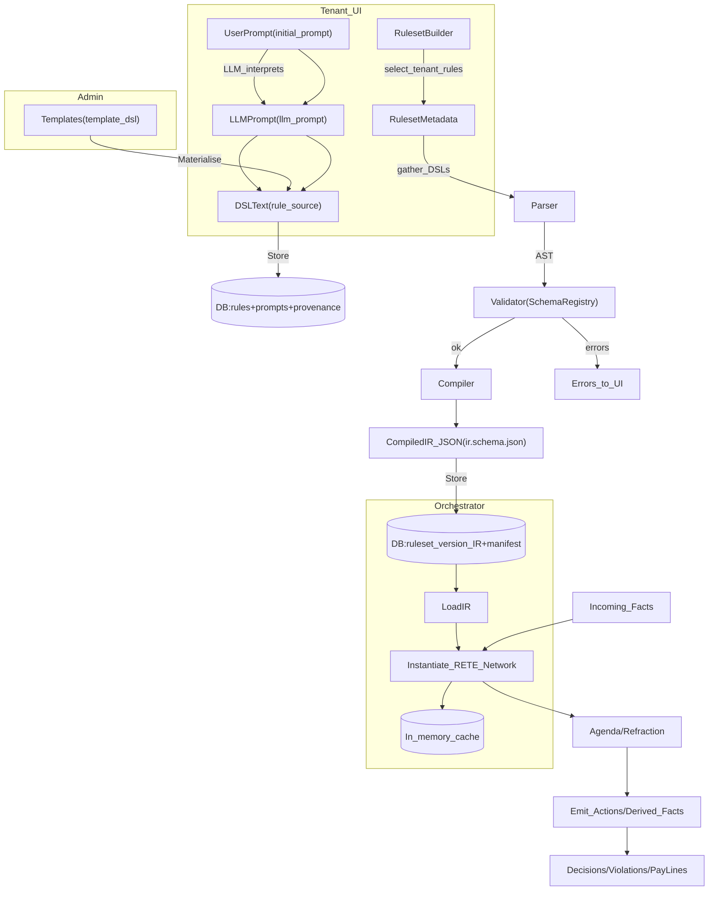

# Rule Authoring → Execution Flow (v0)

Notes

- Templates are read-only and used to create tenant-owned rules.
- Rules store `initial_prompt`, `llm_prompt`, `llm_model`, but prompts are omitted in standard reads.
- Rulesets compile only tenant rules into a single IR artefact, which the orchestrator loads.