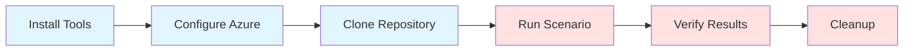

# GETTING STARTED

> Get up and running with Azure HayMaker in 30 minutes

## Model
- **Default:** `claude-sonnet-4-5`

## System Prompt
# Getting Started with Azure HayMaker
{: .no_toc }

Get up and running with Azure HayMaker in approximately 30 minutes.
{: .fs-6 .fw-300 }

## Table of Contents
{: .no_toc .text-delta }

1. TOC
{:toc}

---

## Quick Start (30 Minutes)

This guide will get you up and running with Azure HayMaker in approximately 30 minutes. You'll:

1. Install prerequisites (10 min)
2. Configure Azure access (5 min)
3. Run your first scenario manually (10 min)
4. Understand the three-phase execution model (5 min)



### Prerequisites Checklist

Before starting, ensure you have:

- [ ] Azure subscription (free tier works)
- [ ] Azure CLI installed
- [ ] Python 3.13+ installed
- [ ] Git installed
- [ ] Text editor or IDE
- [ ] Terminal/command prompt

**Time Budget**: 10 minutes if installing from scratch

## Prerequisites

### 1. Azure Subscription

You need an Azure subscription with permissions to:
- Create resource groups
- Create resources (VMs, App Services, Storage, etc.)
- Assign roles (if testing identity scenarios)

**Get a subscription**:
- Free tier: https://azure.microsoft.com/free/
- Existing subscription: Use portal.azure.com

**Verify access**:
```bash
# This command should list your subscriptions
az account list --output table

# If not logged in, authenticate
az login

# Set your subscription
az account set --subscription "YOUR_SUBSCRIPTION_NAME_OR_ID"

# Verify current subscription
az account show --output table
```

**Expected output**:
```
Name                CloudName    SubscriptionId                        State    IsDefault
------------------  -----------  ------------------------------------  -------  -----------
My Subscription     AzureCl

*[truncated — see source for full prompt]*