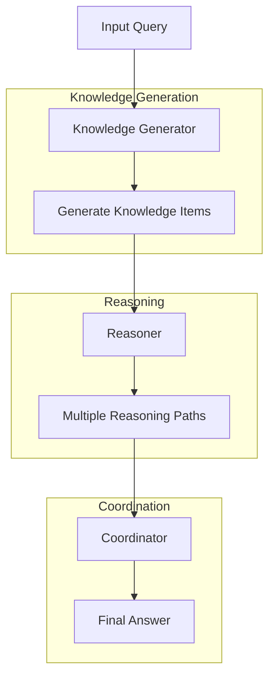
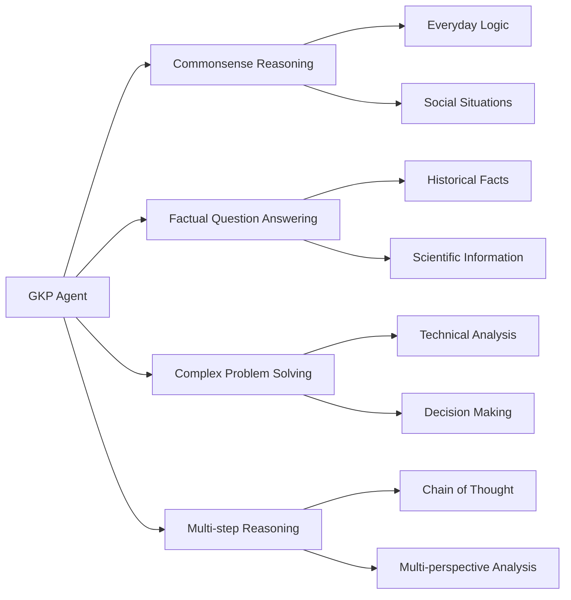

# Gkp Agent

> The GKP Agent is a sophisticated reasoning system that enhances its capabilities by generating relevant knowledge before answering queries.

## Model
- **Default:** `claude-sonnet-4-5`

## System Prompt
# Generated Knowledge Prompting (GKP) Agent

The GKP Agent is a sophisticated reasoning system that enhances its capabilities by generating relevant knowledge before answering queries. This approach, inspired by Liu et al. 2022, is particularly effective for tasks requiring commonsense reasoning and factual information.

## Overview

The GKP Agent consists of three main components:
1. Knowledge Generator - Creates relevant factual information
2. Reasoner - Uses generated knowledge to form answers
3. Coordinator - Synthesizes multiple reasoning paths into a final answer

## Architecture

## Use Cases

## API Reference

### GKPAgent

The main agent class that orchestrates the knowledge generation and reasoning process.

#### Initialization Parameters

| Parameter | Type | Default | Description |
|-----------|------|---------|-------------|
| agent_name | str | "gkp-agent" | Name identifier for the agent |
| model_name | str | "openai/o1" | LLM model to use for all components |
| num_knowledge_items | int | 6 | Number of knowledge snippets to generate per query |

#### Methods

| Method | Description | Parameter

*[truncated — see source for full prompt]*