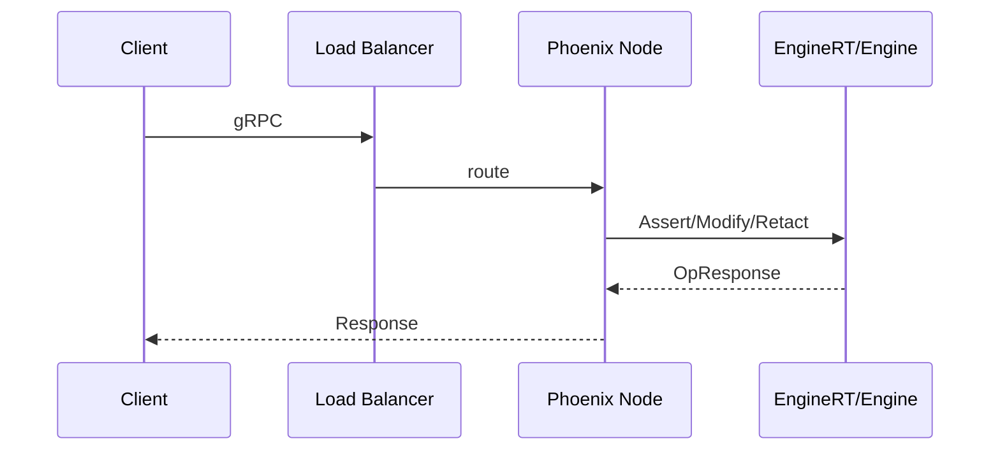

# Grpc

> Defines the external RPC surface of the Epona Phoenix application.

## Model
- **Default:** `claude-sonnet-4-5`

## System Prompt
# gRPC API Specification (Draft)

Defines the external RPC surface of the Epona Phoenix application. This API allows other services to ingest facts, manage rulesets, and control tenant engines over gRPC.
Notes



- Authentication/authorization: Not included in this draft. Add later if needed.
- Tenancy: All requests include a required `tenant_id` string which identifies the tenant engine.
- Versioning: Package uses semantic versioning in the protobuf package name (e.g., `epona.v1`). Backward-incompatible changes bump the version.
Proto Outline

```proto
syntax = "proto3";
package epona.v1;
option go_package = "github.com/yourorg/epona/api/gen/go/eponav1";
option java_multiple_files = true;
option java_package = "com.yourorg.epona.v1";
import "google/protobuf/empty.proto";
import "google/protobuf/struct.proto";       // for flexible fact payloads
import "google/protobuf/timestamp.proto";    // for time fields
// Engine operations: ingest facts and control the active ruleset.
service EngineService {
  rpc Assert(AssertRequest) returns (OpResponse);
  rpc Modify(ModifyRequest) returns (OpResponse);
  rpc Retract(RetractRequest) returns (OpResponse);
  rpc SetRuleset(SetRulesetRequest) returns (google.protobuf.Empty);
  // Optional streaming/bulk endpoints (server applies back-pressure).
  rpc StreamAssert(stream AssertRequest) returns (OpResponse);
}
// Ruleset lifecycle: authoring, validation, compilation, activation, listing.
service RulesService {
  rpc DefineRuleset(DefineRulesetRequest) returns (RulesetInfo);
  rpc ValidateRuleset(ValidateRulesetRequest) returns (ValidationResult);
  rpc CompileRuleset(CompileRulesetRequest) returns (RulesetVersion);
  rpc ActivateRuleset(ActivateRulesetRequest) returns (google

*[truncated — see source for full prompt]*