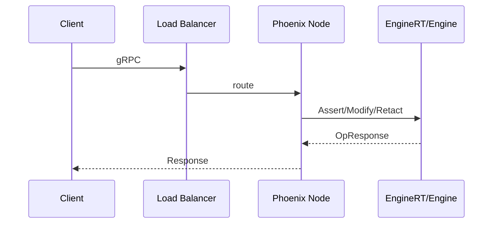

# gRPC API Specification (Draft)

Defines the external RPC surface of the Epona Phoenix application. This API allows other services to ingest facts, manage rulesets, and control tenant engines over gRPC.
Notes



- Authentication/authorization: Not included in this draft. Add later if needed.
- Tenancy: All requests include a required `tenant_id` string which identifies the tenant engine.
- Versioning: Package uses semantic versioning in the protobuf package name (e.g., `epona.v1`). Backward-incompatible changes bump the version.
Proto Outline

```proto
syntax = "proto3";
package epona.v1;
option go_package = "github.com/yourorg/epona/api/gen/go/eponav1";
option java_multiple_files = true;
option java_package = "com.yourorg.epona.v1";
import "google/protobuf/empty.proto";
import "google/protobuf/struct.proto";       // for flexible fact payloads
import "google/protobuf/timestamp.proto";    // for time fields
// Engine operations: ingest facts and control the active ruleset.
service EngineService {
  rpc Assert(AssertRequest) returns (OpResponse);
  rpc Modify(ModifyRequest) returns (OpResponse);
  rpc Retract(RetractRequest) returns (OpResponse);
  rpc SetRuleset(SetRulesetRequest) returns (google.protobuf.Empty);
  // Optional streaming/bulk endpoints (server applies back-pressure).
  rpc StreamAssert(stream AssertRequest) returns (OpResponse);
}
// Ruleset lifecycle: authoring, validation, compilation, activation, listing.
service RulesService {
  rpc DefineRuleset(DefineRulesetRequest) returns (RulesetInfo);
  rpc ValidateRuleset(ValidateRulesetRequest) returns (ValidationResult);
  rpc CompileRuleset(CompileRulesetRequest) returns (RulesetVersion);
  rpc ActivateRuleset(ActivateRulesetRequest) returns (google.protobuf.Empty);
  rpc ListRulesets(ListRulesetsRequest) returns (ListRulesetsResponse);
}
// --------------------------------------------------------------------
// Messages — Engine
// --------------------------------------------------------------------
message AssertRequest {
  string tenant_id = 1;                    // required
  repeated Fact facts = 2;                 // one or more facts to assert
  bool bulk = 3;                           // engage bulk-load mode (defer agenda)
  string partition_key = 4;                // optional explicit routing key
  string trace_id = 5;                     // correlate with tracing
  string ruleset_version = 6;              // optional expected version for alignment
  Return return = 7;                       // what to return
  enum Return { RETURN_UNSPECIFIED = 0; NONE = 1; ACTIVATIONS = 2; DERIVED = 3; }
}
message ModifyRequest {
  string tenant_id = 1;                    // required
  repeated Fact facts = 2;                 // facts with existing ids; engine diffs
  bool bulk = 3;
  string partition_key = 4;
  string trace_id = 5;
  string ruleset_version = 6;
  AssertRequest.Return return = 7;
}
message RetractRequest {
  string tenant_id = 1;                    // required
  repeated string ids = 2;                 // fact ids to retract
  bool bulk = 3;
  string partition_key = 4;
  string trace_id = 5;
}
message SetRulesetRequest {
  string tenant_id = 1;                    // required
  string ruleset_id = 2;                   // logical ruleset name
  string version = 3;                      // compiled version to activate (optional if default)
}
message OpResponse {
  repeated Activation activations = 1;     // present if return == ACTIVATIONS
  repeated DerivedFact derived = 2;        // present if return == DERIVED
}
message Activation {
  string rule_id = 1;
  repeated string wme_ids = 2;             // contributing fact ids
  map<string, string> bindings = 3;        // bound variables as strings (opaque to client)
  google.protobuf.Timestamp fired_at = 4;
}
message Fact {
  string id = 1;                           // required stable id
  string type = 2;                         // type tag or module name
  google.protobuf.Struct attrs = 3;        // flexible attributes; can be typed later
  google.protobuf.Timestamp effective_from = 4;
  google.protobuf.Timestamp effective_to = 5;
}
message DerivedFact {
  Fact fact = 1;
  string provenance = 2;                   // optional provenance info
}
// --------------------------------------------------------------------
// Messages — Rules Management
// --------------------------------------------------------------------
message DefineRulesetRequest {
  string tenant_id = 1;                    // required
  string ruleset_id = 2;                   // logical id
  string dsl_source = 3;                   // full DSL source text
  string description = 4;                  // optional human description
}
message ValidateRulesetRequest {
  string tenant_id = 1;
  string ruleset_id = 2;
}
message CompileRulesetRequest {
  string tenant_id = 1;
  string ruleset_id = 2;
}
message ActivateRulesetRequest {
  string tenant_id = 1;
  string ruleset_id = 2;
  string version = 3;
}
message RulesetInfo {
  string tenant_id = 1;
  string ruleset_id = 2;
  string active_version = 3;               // empty if none active
  repeated string versions = 4;            // known compiled versions
}
message RulesetVersion {
  string ruleset_id = 1;
  string version = 2;
}
message ValidationResult {
  bool ok = 1;
  repeated string issues = 2;              // human-readable messages
}
message ListRulesetsRequest {
  string tenant_id = 1;
}
message ListRulesetsResponse {
  repeated RulesetInfo items = 1;
}
```

Conventions

- Tenant ID: `tenant_id` is a single string; callers must supply it in every request.
- Fact typing: `Fact.attrs` uses `google.protobuf.Struct` initially for flexibility; specific domains can migrate to typed fields later.
- Time: Use `google.protobuf.Timestamp` for effective time ranges; omit if not applicable.
- Idempotency: `Assert` and `Modify` are expected to be idempotent per fact id; clients may safely retry on transient errors.
- Bulk ingest: Prefer `StreamAssert` for large initial loads; the server may apply flow control and defer agenda.
- Errors: Use gRPC status codes; include rich error details (e.g., invalid argument with field violations) to mirror specs/error_handling.md.
Backpressure and Quotas
- RESOURCE_EXHAUSTED is used when per-tenant or node-level quotas are exceeded (memory budget, fire-rate caps, queue limits).
- Error details include suggested retry-after milliseconds and current utilization when available.
- Clients should implement exponential backoff with jitter and reduce batch sizes; switch to streaming for bulk loads.
Error Details Example

```json
{
  "@type": "type.googleapis.com/google.rpc.ErrorInfo",
  "reason": "QUOTA_EXCEEDED",
  "domain": "epona.grpc",
  "metadata": {
    "tenant_id": "acme",
    "kind": "memory_budget",
    "limit_bytes": "17179869184",
    "used_bytes": "16800000000",
    "retry_after_ms": "750",
    "hint": "reduce_batch_or_use_streaming"
  }
}
```

Servers MAY also include a `google.rpc.ResourceInfo` detail naming the constrained resource.
Error Model (mapping)

- INVALID_ARGUMENT: validation failures (schema, missing id/type, bad timestamps, etc.).
- FAILED_PRECONDITION: ruleset not active for tenant; version mismatch.
- NOT_FOUND: retract/modify for unknown id when required.
- RESOURCE_EXHAUSTED: memory budget exceeded; backpressure engaged.
- UNAVAILABLE: engine starting or overloaded; client should retry with backoff.
Versioning and Compatibility
- New optional fields may be added to requests/responses without a version bump.
- Breaking changes require a new package (e.g., `epona.v2`) and dual-publishing during migration.
Examples
- See specs/api.md for the corresponding local Elixir APIs that back these RPCs.