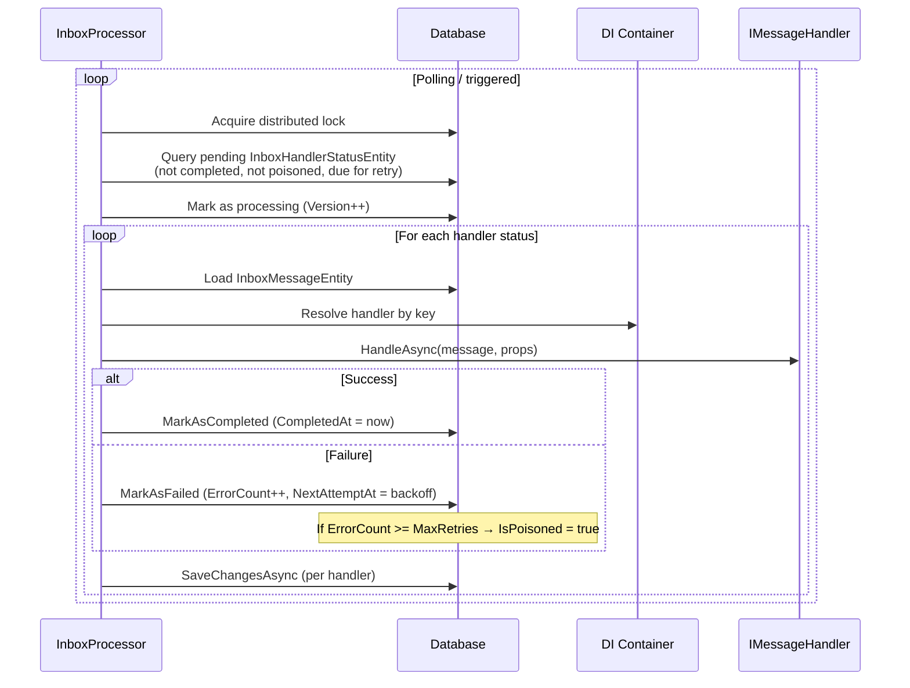

# Inbox

The inbox pattern provides **durable, per-handler delivery** with automatic retry and deduplication. Once a message is accepted into the inbox, each registered handler is invoked at least once per (message ID, handler) pair — surviving application crashes, redeliveries, and concurrent processing. Persisted completion records prevent duplicate deliveries under normal operation.

> [!IMPORTANT]
> **Handlers must be idempotent.** The inbox deduplicates deliveries per (message ID, handler) pair, but does not guarantee exactly-once *processing*. If a handler succeeds but the process crashes before the completion status is persisted, the handler will be re-invoked. Design handlers to produce the same result when called twice — use upserts, check for existing records, or use the message ID as an idempotency key.

## When to Use

Use the inbox when:

- Handler failures must not prevent other handlers from succeeding (per-handler isolation)
- Message processing must survive application crashes without redelivery from the broker
- Deduplication per (message ID, handler) pair is required to minimize duplicate processing
- You want durable retry with backoff instead of relying on the transport's retry mechanism

## Setup

### 1. Configure Durability

[!code-csharp[](../examples/Docs/Program.cs#ConfigureDurability)]

### 2. Implement DbContext Interfaces

Your `DbContext` must implement `IInboxDbContext` (and `IOutboxDbContext` if using the outbox):

[!code-csharp[](../examples/Docs/Data/OrderDbContext.cs#OrderDbContext)]

### 3. Register Handlers with Stable Keys

Handlers on inbox channels must have a stable key:

```csharp
bus.AddEventConsumeChannel("orders.events", c => c
    .WithRabbitMq(r => r
        .WithQueueName("orders.events.subscriptions")
        .WithRetry(maxRetries: 3, delay: TimeSpan.FromSeconds(30)))
    .Consumes<OrderPlaced>(m => m
        .WithHandler<OrderPlacedHandler>("order-handler"))
    .UseInbox<OrderDbContext>());
```

The handler key (`"order-handler"`) is persisted in the database. It must be stable across deployments — renaming without a transition causes in-flight messages to be poisoned.

> [!WARNING]
> On channels with `UseInbox()`, every handler **must** have a key. Registering a handler without a key throws `InvalidOperationException` at startup. Handler keys must be **globally unique** across all channels and DbContexts.

### 4. Optional Safeguard: Require UseInbox on Consume Channels

If your team standard is "all consume channels should use inbox," enable the policy in `UseInbox(...)`:

```csharp
bus.AddEfCoreDurability<OrderDbContext>(d => d.UseInbox(inbox =>
{
    inbox.WithConsumeChannelInboxRequirement(ConsumeChannelInboxRequirement.Fail);
}));
```

Policy values:

- `ConsumeChannelInboxRequirement.None` (default): no extra checks.
- `ConsumeChannelInboxRequirement.Warn`: logs startup warnings for consume channels without `UseInbox<TDbContext>()`.
- `ConsumeChannelInboxRequirement.Fail`: throws `InvalidOperationException` at startup.

Per-channel opt-out is explicit:

```csharp
bus.AddEventConsumeChannel("legacy.fire-and-forget", c => c
    .AllowConsumeWithoutInbox()
    .Consumes<OrderPlaced>(m => m.WithHandler<LegacyHandler>()));
```

> [!NOTE]
> This opt-out only affects the optional safeguard above. It does not bypass hard validation rules like EF Core transport requirements.

### Handler Key Renaming (Legacy Keys)

When renaming a handler key, use legacy keys to drain in-flight messages under the old key:

```csharp
// Step 1: Deploy with the new key and the old key as a legacy key.
// New inbox entries use "order-handler-v2"; existing entries with "order-handler" are still processed.
.Consumes<OrderPlaced>(m => m
    .WithHandler<OrderPlacedHandler>("order-handler-v2", "order-handler"))
```

Legacy keys are matched when processing existing `InboxHandlerStatus` rows but **never** used to create new inbox entries. Once all in-flight messages under the old key have been processed or have expired via retention cleanup, remove the legacy key:

```csharp
// Step 2: After all old entries are drained, remove the legacy key.
.Consumes<OrderPlaced>(m => m
    .WithHandler<OrderPlacedHandler>("order-handler-v2"))
```

Multiple legacy keys are supported for handlers that have been renamed more than once:

```csharp
.WithHandler<OrderPlacedHandler>("order-handler-v3", "order-handler-v2", "order-handler")
```

> [!NOTE]
> Legacy keys participate in the global uniqueness check — a legacy key must not collide with any other primary or legacy key.

## Processing Flow



1. A message arrives (from RabbitMQ, the outbox, or `PublishDirectAsync`)
2. The message and one `InboxHandlerStatus` row per handler are written to the database **before** the transport acknowledges receipt
3. The `InboxProcessor` polls for pending handler statuses and delivers them in batches
4. On success: `CompletedAt` is set. Each handler's result is persisted immediately — completed handlers are not lost if a subsequent handler fails.
5. On failure: `ErrorCount` is incremented, `NextAttemptAt` is set with exponential backoff
6. After `MaxRetries` failures: the status is marked `IsPoisoned = true` and no longer retried
7. On application shutdown (cancellation): the attempt is **not** counted as a failure. The status remains in "processing" state and is recovered by stuck message detection on next startup.

## Handler Isolation

Each handler runs in its own DI scope. A failure or `ChangeTracker.Clear()` in one handler's scope does not affect other handlers for the same message.

If you need fire-and-forget handlers alongside inbox-managed handlers for the same message type, register them on a separate consume channel without `UseInbox()`.

## Deduplication

Deduplication is per **(message ID, handler key)**. If the same CloudEvents `id` is received twice (e.g., RabbitMQ redelivery or outbox retry), the second delivery is a no-op: the unique constraint on `(MessageId, HandlerKey)` prevents duplicate handler status rows.

> [!NOTE]
> The CloudEvents `id` (i.e., `MessageProperties.Id`) must not exceed **200 characters**. Messages with longer IDs are rejected with an `InvalidOperationException`.

## Retry and Backoff

Failed handlers are retried with exponential backoff:

```text
base = min(2^ErrorCount seconds, MaxRetryDelay)
NextAttemptAt = now + base/2 + random(0..base/2)

Example with MaxRetryDelay = 5 min:
  Attempt 1 → retry after 1–2s
  Attempt 2 → retry after 2–4s
  Attempt 3 → retry after 4–8s
  ...
  Attempt 9+ → capped at 150–300s (2.5–5 min)
```

After exceeding `MaxRetries`, the handler status is marked as poisoned and no longer retried. Deterministically unrecoverable errors (deleted inbox message, unregistered handler key) are poisoned immediately without going through the retry cycle.

## Stuck Message Detection

If a handler has been in "processing" state longer than `StuckMessageThreshold` (default: 5 minutes), the processor clears its `ProcessingStartedAt` field, making it eligible for retry. This handles cases where a worker crashes mid-processing.

## Distributed Lock Safety

The `InboxProcessor` acquires a distributed lock before processing batches. If the lock is lost mid-processing (e.g., network partition), the processor detects it immediately and stops. Any in-flight handler status is recovered by stuck message detection on the next cycle.

## Configuration

```csharp
bus.AddEfCoreDurability<OrderDbContext>(d => d.UseInbox(inbox =>
{
    inbox.WithMaxRetries(5);
    inbox.WithMaxRetryDelay(TimeSpan.FromMinutes(5));
    inbox.WithPollingInterval(TimeSpan.FromSeconds(30));
    inbox.WithBatchSize(100);
    inbox.WithStuckMessageThreshold(TimeSpan.FromMinutes(5));
    inbox.WithHandlerTimeout(TimeSpan.FromMinutes(2));
    inbox.WithRestartDelay(TimeSpan.FromSeconds(5));
    inbox.WithLockAcquireTimeout(TimeSpan.FromSeconds(60));
    inbox.WithLockName("custom-inbox-lock");
}));
```

| Option | Default | Description |
|--------|---------|-------------|
| `WithMaxRetries(int)` | `5` | Maximum failed attempts before marking as poisoned. 0 = poisoned on first failure. |
| `WithMaxRetryDelay(TimeSpan)` | `5 minutes` | Maximum backoff delay. Jitter is applied to prevent thundering herd. |
| `WithPollingInterval(TimeSpan)` | `30 seconds` | How often the processor polls the DB when idle |
| `WithBatchSize(int)` | `100` | Handler statuses processed per batch |
| `WithStuckMessageThreshold(TimeSpan)` | `5 minutes` | Time before a "processing" status is considered stuck |
| `WithHandlerTimeout(TimeSpan)` | *none* | Maximum handler execution time. Timeout counts as a failure. |
| `WithRestartDelay(TimeSpan)` | `5 seconds` | Delay before restarting the processor after a crash |
| `WithLockAcquireTimeout(TimeSpan)` | `60 seconds` | Timeout for acquiring the distributed lock |
| `WithLockName(string)` | `"InboxProcessor_{DbContext}"` | Distributed lock name (auto-generated per DbContext) |
| `WithRetention(TimeSpan)` | *none* | Auto-cleanup retention period for completed messages |
| `WithCleanupInterval(TimeSpan)` | `1 hour` | How often the cleanup service runs |
| `WithCleanupBatchSize(int)` | `10,000` | Messages deleted per cleanup batch |
| `WithCleanupLockName(string)` | `"InboxCleanup_{DbContext}"` | Cleanup distributed lock name (auto-generated per DbContext) |
| `WithConsumeChannelInboxRequirement(ConsumeChannelInboxRequirement)` | `None` | Optional safeguard for channels that forget `UseInbox()` |

## Data Retention

Configure automatic cleanup:

```csharp
d.UseInbox(inbox => inbox
    .WithRetention(TimeSpan.FromDays(30)));
```

The cleanup service deletes completed handler statuses older than the retention period and removes orphaned `InboxMessages` rows. **Poisoned statuses are never auto-deleted.**

## Multi-DbContext Support

Each consume channel can use a different `DbContext` for its inbox, enabling bounded context isolation:

```csharp
bus.AddEfCoreDurability<OrdersDbContext>(d => d.UseInbox());
bus.AddEfCoreDurability<ShippingDbContext>(d => d.UseInbox());

bus.AddEventConsumeChannel("orders.inbox", c => c
    .Consumes<OrderPlaced>(m => m
        .WithHandler<FulfillmentHandler>("fulfillment"))
    .UseInbox<OrdersDbContext>());

bus.AddEventConsumeChannel("shipping.inbox", c => c
    .Consumes<OrderPlaced>(m => m
        .WithHandler<ShipmentHandler>("shipment"))
    .UseInbox<ShippingDbContext>());
```

Each `DbContext` type gets its own processor, lock, and configuration. Multiple channels sharing the same `DbContext` reuse the same processor.

> [!NOTE]
> Each `DbContext` type is expected to have its own database. If two `DbContext` types share a database, their processors will see each other's data.

## Database Schema

**`InboxMessageEntity`** — one row per unique message (keyed by CloudEvents ID):

| Column | Description |
|--------|-------------|
| `Id` | CloudEvents message ID (string, PK) |
| `TransportName` | Source transport |
| `Content` | Serialized message body |
| `SerializedProperties` | JSON-encoded MessageProperties |
| `ReceivedAt` | When the message was first received |

**`InboxHandlerStatusEntity`** — one row per (message, handler) pair:

| Column | Description |
|--------|-------------|
| `Id` | Primary key (GUID v7) |
| `MessageId` | FK → InboxMessageEntity.Id |
| `HandlerKey` | Stable handler key (unique with MessageId) |
| `ErrorCount` | Number of failed attempts |
| `LastError` | Last error message |
| `ProcessingStartedAt` | Set during processing, cleared on completion |
| `NextAttemptAt` | Exponential backoff timestamp |
| `IsPoisoned` | True after max retries exceeded |
| `CompletedAt` | When successfully handled (null while pending) |
| `Version` | Optimistic concurrency token |

The unique constraint on `(MessageId, HandlerKey)` provides deduplication.

## RabbitMQ Integration

When using RabbitMQ, the consumer delegates to `MessageRouter`, which calls `InboxAcceptor` before dispatching. The consumer has no inbox awareness — it just calls `RouteAsync`. The acceptor creates its own DI scope, so its `DbContext` is fully isolated from handler scopes. Failures in inbox-managed handlers do not affect broker acknowledgement.

## Handler Key Stability

Handler keys are the inbox's deduplication and retry key. They are persisted in the database as part of `InboxHandlerStatusEntity` and are used to match in-flight messages to handlers across deployments. Changing a handler key **without a transition** will poison in-flight messages.

### What happens when a handler key changes without legacy keys

When a handler key is renamed between v1 and v2 without using legacy keys:

1. A v1 instance writes `InboxHandlerStatusEntity` rows with the old key
2. A v2 instance picks up those rows, looks up the handler by key, and finds no match
3. The processor immediately marks the status as **poisoned** — there is no grace period or fallback

### How to safely rename a handler key

Use **legacy keys** for a zero-downtime rename (see [Handler Key Renaming](#handler-key-renaming-legacy-keys)):

1. **Deploy with legacy key** — add the old key as a legacy key: `.WithHandler<T>("new-key", "old-key")`
2. **Wait for drain** — all in-flight entries under the old key will be processed normally
3. **Remove legacy key** — once drained, deploy with only the new key: `.WithHandler<T>("new-key")`

If downtime is acceptable, you can alternatively use the **drain-rename-restart** procedure:

1. **Stop new message production** or ensure the affected channel is quiesced
2. **Wait for in-flight messages to complete** — monitor the `InboxHandlerStatusEntity` table until all rows with `CompletedAt IS NULL` for the old key are processed
3. **Deploy the new version** with the renamed handler key
4. **Resume message production**

### Best practices

- Choose handler keys that are stable, descriptive, and unlikely to change (e.g., `"process-order-v1"`, not `"OrderHandler"`)
- Use legacy keys for zero-downtime renames instead of stopping message production
- Document handler keys in your codebase so renames are deliberate, not accidental
- Include handler key changes in your deployment checklist
- Monitor `InboxHandlerStatusEntity` for poisoned rows after deployments — a sudden spike indicates a key mismatch

## What's Next

- [Outbox](outbox.md) — Transactional message staging
- [Operations](operations.md) — Poisoned message investigation and manual retry
- [Testing](testing.md) — Testing inbox behavior with `WithoutBackgroundProcessing()`