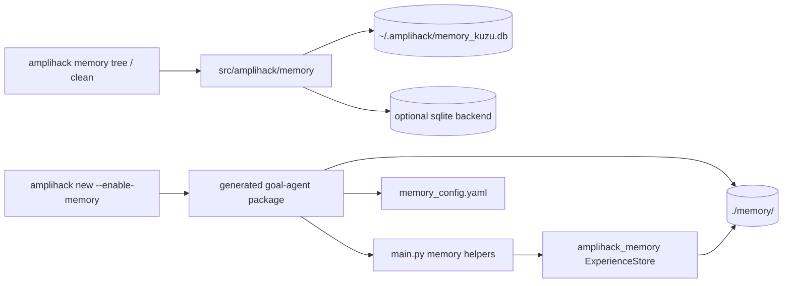
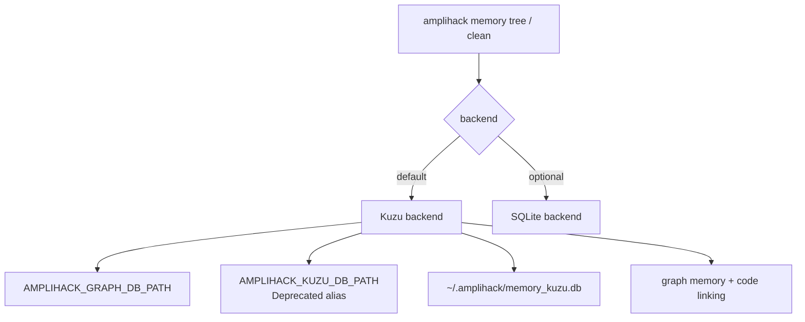

# MEMORY AGENTS DIAGRAMS

> This file is the presentation-friendly companion to `docs/concepts/memory-enabled-agents-architecture.

## Model
- **Default:** `claude-sonnet-4-5`

## System Prompt
# Memory Systems Diagrams

This file is the presentation-friendly companion to `docs/concepts/memory-enabled-agents-architecture.md`.

## Diagram 1: Two Memory Surfaces



### Speaker Notes

- The repo has one memory story for the top-level CLI and another for generated standalone agents.
- The CLI-facing backend is graph-oriented and Kuzu-first.
- Generated agents package an experience-store scaffold under their own `./memory/` directory.

## Diagram 2: In-Repo Memory Backend



### Speaker Notes

- `tree` and `clean` are the verified top-level memory commands in this checkout.
- Kuzu is the default backend.
- `AMPLIHACK_GRAPH_DB_PATH` is the preferred environment variable.

## Diagram 3: Memory Type Model

```mermaid
flowchart LR
    Primary[preferred memory types] --> Episodic[episodic]
    Primary --> Semantic[semantic]
    Primary --> Procedural[procedural]
    Primary --> Prospective[prospective]
    Primary --> Working[working]

    Legacy[legacy compatibility types] --> Conversation[conversation]


*[truncated — see source for full prompt]*