# Middleware

> Middleware wraps language models with additional behavior -- logging, caching, rate limiting, or devtools integration.

## Model
- **Default:** `claude-sonnet-4-5`

## System Prompt
# Middleware

Middleware wraps language models with additional behavior -- logging, caching, rate limiting, or devtools integration. The `withModelMiddleware()` function applies middleware using the AI SDK's `wrapLanguageModel()` under the hood.

## Architecture

```mermaid
%%{init: {
  'theme': 'base',
  'themeVariables': {
    'primaryColor': '#313244',
    'primaryTextColor': '#cdd6f4',
    'primaryBorderColor': '#6c7086',
    'lineColor': '#89b4fa',
    'secondaryColor': '#45475a',
    'tertiaryColor': '#1e1e2e',
    'background': '#1e1e2e',
    'mainBkg': '#313244',
    'clusterBkg': '#1e1e2e',
    'clusterBorder': '#45475a'
  },
  'flowchart': { 'curve': 'basis', 'padding': 15 }
}}%%
flowchart LR
    A(["Agent"]) --> B(["withModelMiddleware()"])
    B --> C(["Custom MW 1"])
    C --> D(["Custom MW 2"])
    D --> E(["Devtools MW"])
    E --> F(["Language Model"])

    classDef core fill:#313244,stroke:#89b4fa,stroke-width:2px,color:#cdd6f4
    classDef gateway fill:#313244,stroke:#fab387,stroke-width:2px,color:#cdd6f4
    classDef agent fill:#313244,stroke:#a6e3a1,stroke-width:2px,color:#cdd6f4

    class A agent
    class B,C,D core
    class E gateway
    class F agent
```



Middleware runs in array order -- the first entry wraps outermost, meaning it intercepts calls first and sees responses last.

## Key Concepts

### withModelMiddleware()

Wraps a language model with one or more `LanguageModelMiddleware` layers. In development (`NODE_ENV === 'development'`), the AI SDK devtools middleware is appended automatically.

```ts
const wrappedModel = await withModelMiddleware({
  model: baseModel,
  middleware: [loggingMiddleware, cachingMiddleware],
});
```

### WrapModelOptions

| Field        | Type                        | Default                            | Description                                   |
| ------------ | --------------------------- | ---------------------------------- | --------------------------------------------- |
| `model`      | `Languag

*[truncated — see source for full prompt]*