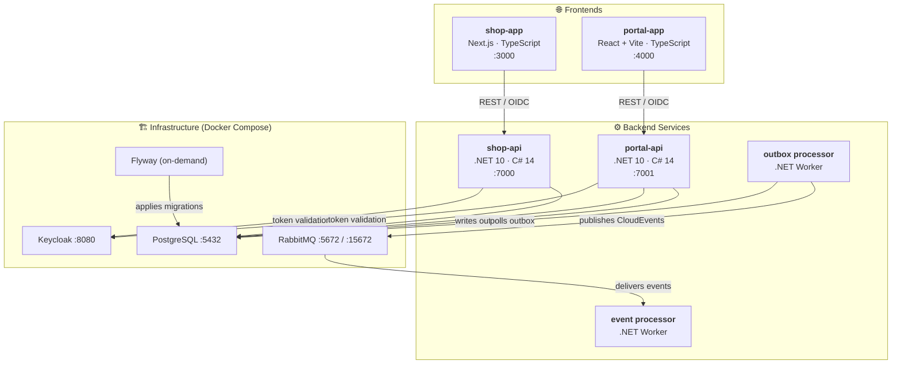
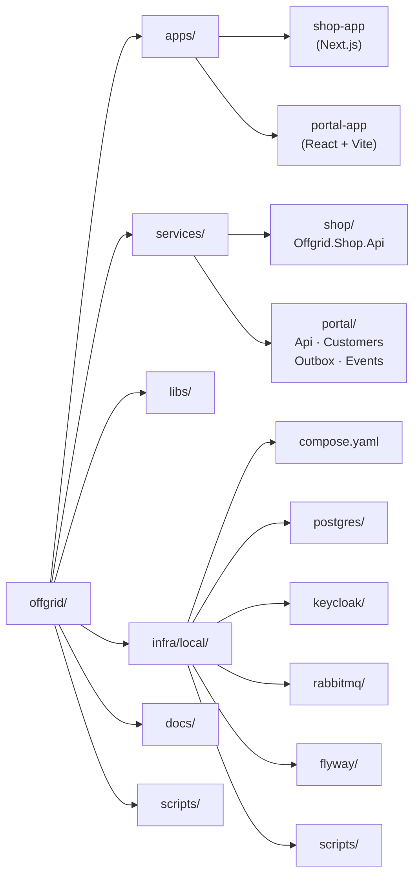
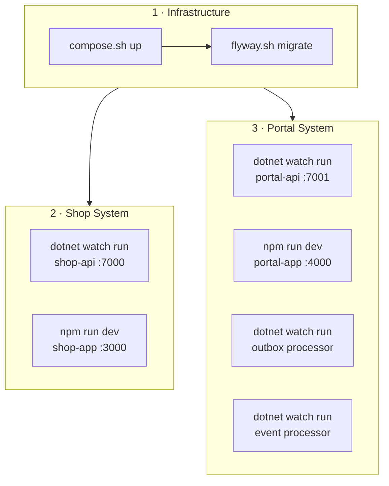
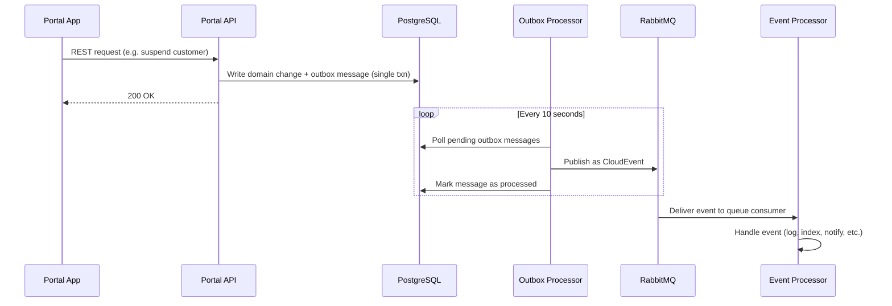
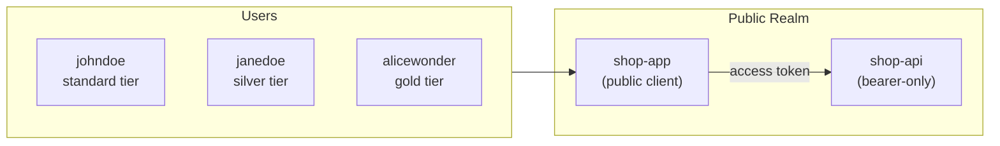

# Offgrid — Monorepo Onboarding Guide

> **Last updated:** 2025-02-15 &nbsp;|&nbsp; **Audience:** New contributors & returning team members

Welcome to **Offgrid** — a fictitious online adventure store that sells biking, winter sports, and water sports equipment. This monorepo contains everything needed to run two full-stack systems locally: a **customer-facing shop** and a **staff-facing admin portal**.

---

## Table of Contents

- [Offgrid — Monorepo Onboarding Guide](#offgrid--monorepo-onboarding-guide)
  - [Table of Contents](#table-of-contents)
  - [📐👷🏻‍♀️ Architecture Overview](#️-architecture-overview)
  - [🗺️ Repository Layout](#️-repository-layout)
  - [🦾 Technology Stack](#-technology-stack)
  - [🏗️ Local Setup](#️-local-setup)
    - [Prerequisites](#prerequisites)
    - [Step 1 — Clone \& verify tooling](#step-1--clone--verify-tooling)
    - [Step 2 — Configure environment files](#step-2--configure-environment-files)
      - [Infrastructure (required first)](#infrastructure-required-first)
      - [Shop app](#shop-app)
      - [Portal app](#portal-app)
      - [Hosts file (required for Docker auth flows)](#hosts-file-required-for-docker-auth-flows)
    - [Step 3 — Start infrastructure](#step-3--start-infrastructure)
    - [Step 4 — Run database migrations](#step-4--run-database-migrations)
    - [Step 5 — Start apps \& APIs](#step-5--start-apps--apis)
    - [Quick-check — service URLs](#quick-check--service-urls)
  - [☑️ Common Tasks](#️-common-tasks)
    - [Manage the local infra stack](#manage-the-local-infra-stack)
    - [Connect to services](#connect-to-services)
  - [✅ VS Code Tasks \& Extensions](#-vs-code-tasks--extensions)
  - [🧩 Domain Event Flow (Portal)](#-domain-event-flow-portal)
  - [🗝️ Authentication \& Keycloak](#️-authentication--keycloak)
  - [🏛️ it Conventions](#️-it-conventions)
  - [⚖️ Decision Making](#️-decision-making)
  - [🐞 Gotchas \& Troubleshooting](#-gotchas--troubleshooting)
  - [👉 Where to Go Next](#-where-to-go-next)

---

## 📐👷🏻‍♀️ Architecture Overview

Offgrid is split into two independent systems backed by shared infrastructure:



| System     | Frontend                   | API               | Auxiliary workers                 |
| ---------- | -------------------------- | ----------------- | --------------------------------- |
| **Shop**   | Next.js SSR/SSG (`:3000`)  | .NET 10 (`:7000`) | —                                 |
| **Portal** | React + Vite SPA (`:4000`) | .NET 10 (`:7001`) | Outbox Processor, Event Processor |

Both APIs follow a **Modular Monolith** architecture with Clean Architecture layering inside each module.

---

## 🗺️ Repository Layout

```text
offgrid/
├── apps/
│   ├── portal-app/          # React + Vite admin portal
│   └── shop-app/            # Next.js customer shop
│
├── services/
│   ├── Offgrid.slnx         # Full .NET solution (all services)
│   ├── portal/
│   │   ├── Offgrid.Portal.slnx
│   │   └── src/
│   │       ├── Offgrid.Portal.Api/
│   │       ├── Offgrid.Portal.Customers/
│   │       ├── Offgrid.Portal.Customers.Contracts/
│   │       ├── Offgrid.Portal.Customers.OutboxProcessor/
│   │       └── Offgrid.Portal.Customers.EventProcessor/
│   └── shop/
│       ├── Offgrid.Shop.slnx
│       └── src/
│           └── Offgrid.Shop.Api/
│
├── libs/dotnet/              # Shared .NET libraries (Offgrid.Framework)
├── infra/local/              # Docker Compose stack & helper scripts
├── docs/                     # Design docs, standards, images
└── scripts/                  # Repo-wide utility scripts
```



---

## 🦾 Technology Stack

| Layer                 | Technology                                | Purpose                           |
| --------------------- | ----------------------------------------- | --------------------------------- |
| **Frontend (Shop)**   | Next.js, TypeScript, Tailwind CSS, HeroUI | SSR/SSG customer website          |
| **Frontend (Portal)** | React, Vite, TypeScript, Material UI      | Admin SPA                         |
| **Backend**           | .NET 10, C# 14                            | REST APIs & background workers    |
| **Identity**          | Keycloak 26.x (OIDC / OAuth 2.0)          | Auth for apps & APIs              |
| **Database**          | PostgreSQL 18                             | Relational data (ACID)            |
| **Products Database** | MongoDB 8                                 | NoSQL db for products             |
| **Migrations**        | Redgate Flyway 11.x                       | Version-controlled SQL migrations |
| **Messaging**         | RabbitMQ 4.x                              | Async event distribution          |
| **Containers**        | Docker Desktop, Docker Compose            | Local dev environment             |
| **Shell**             | Bash                                      | Automation scripts                |

---

## 🏗️ Local Setup

### Prerequisites

| Tool               | Required version          | Check              |
| ------------------ | ------------------------- | ------------------ |
| **Node.js**        | 24.x                      | `node -v`          |
| **npm**            | Ships with Node           | `npm -v`           |
| **.NET SDK**       | 10.x                      | `dotnet --version` |
| **Docker Desktop** | Latest                    | `docker -v`        |
| **Git**            | 2.x+                      | `git --version`    |
| **Shell**          | Git Bash or WSL (Windows) | —                  |

### Step 1 — Clone & verify tooling

```bash
git clone https://github.com/drminnaar/offgrid.git
cd offgrid

# one-shot prerequisite report
./scripts/prereq-check.sh
```

The script runs three sub-checks:

1. **Tool installation** — verifies Node, .NET, Docker, Git, and optional CLIs.
2. **Environment files** — confirms required `.env` files exist.
3. **Host file entries** — checks for the `keycloak` hostname mapping.

### Step 2 — Configure environment files

Three groups of env files must be created from their `.example` counterparts:

#### Infrastructure (required first)

```bash
cp infra/local/scripts/.env.example infra/local/scripts/.env
```

Contents (sensible defaults are in the example):

```bash
# postgres
OG_POSTGRES_USER=postgres
OG_POSTGRES_PASSWORD=password
OG_POSTGRES_DB=offgrid

# keycloak
OG_KC_BOOTSTRAP_ADMIN_USERNAME=admin
OG_KC_BOOTSTRAP_ADMIN_PASSWORD=admin

# rabbitmq
OG_RABBITMQ_DEFAULT_USER=admin
OG_RABBITMQ_DEFAULT_PASS=password
```

#### Shop app

```bash
cp apps/shop-app/.env.example apps/shop-app/.env
```

> **Important:** Generate the `AUTH_SECRET` value by running:
> ```bash
> cd apps/shop-app && npx auth secret
> ```

#### Portal app

```bash
cp apps/portal-app/.env.example apps/portal-app/.env
```

#### Hosts file (required for Docker auth flows)

Add a `keycloak` entry so the browser can resolve `http://keycloak:8080`:

- **Windows** — edit `C:\Windows\System32\drivers\etc\hosts` as Administrator:
  ```
  127.0.0.1 keycloak
  ```
- **Linux/Mac** — edit `/etc/hosts` as root and add the same line.

### Step 3 — Start infrastructure

```bash
./infra/local/scripts/compose.sh up
```

This brings up **Postgres**, **Keycloak** (with realm import), **RabbitMQ**, and **MongoDB** via Docker Compose. Verify everything is healthy:

```bash
./infra/local/scripts/compose.sh ps
```

MongoDB will be available at `localhost:27017`. If enabled, Mongo Express GUI is at `localhost:8081`.

To seed the products collection, the `mongo-init` service will run automatically. You can update seed data in `infra/local/mongo/seed/products.json`.

### Step 4 — Run database migrations

```bash
./infra/local/scripts/flyway.sh migrate
```

Verify migration status:

```bash
./infra/local/scripts/flyway.sh info
```

### Step 5 — Start apps & APIs

Install frontend dependencies (first time only):

```bash
npm install --prefix ./apps/shop-app
npm install --prefix ./apps/portal-app
```

Restore .NET packages:

```bash
dotnet restore ./services/Offgrid.slnx
```

Then start the services you need. Each command should run in its own terminal:



**Shop** (2 terminals):

```bash
# terminal 1 — API
dotnet watch run --project ./services/shop/src/Offgrid.Shop.Api/Offgrid.Shop.Api.csproj

# terminal 2 — app
npm run dev --prefix ./apps/shop-app
```

**Portal** (up to 4 terminals):

```bash
# terminal 1 — API
dotnet watch run --project ./services/portal/src/Offgrid.Portal.Api/Offgrid.Portal.Api.csproj

# terminal 2 — app
npm run dev --prefix ./apps/portal-app

# terminal 3 — outbox processor (optional, needed for event flow)
dotnet watch run --project ./services/portal/src/Offgrid.Portal.Customers.OutboxProcessor/Offgrid.Portal.Customers.OutboxProcessor.csproj

# terminal 4 — event processor (optional, consumes events from RabbitMQ)
dotnet watch run --project ./services/portal/src/Offgrid.Portal.Customers.EventProcessor/Offgrid.Portal.Customers.EventProcessor.csproj
```

### Quick-check — service URLs

| Service             | URL                                              |
| ------------------- | ------------------------------------------------ |
| Shop App            | [http://localhost:3000](http://localhost:3000)   |
| Shop API            | [http://localhost:7000](http://localhost:7000)   |
| Portal App          | [http://localhost:4000](http://localhost:4000)   |
| Portal API          | [http://localhost:7001](http://localhost:7001)   |
| Keycloak Admin      | [http://localhost:8080](http://localhost:8080)   |
| RabbitMQ Management | [http://localhost:15672](http://localhost:15672) |
| MongoDB             | `localhost:27017`                                |
| Mongo Express GUI   | [http://localhost:8081](http://localhost:8081)   |

---

## ☑️ Common Tasks

### Manage the local infra stack

```bash
./infra/local/scripts/compose.sh up          # start stack
./infra/local/scripts/compose.sh down        # stop & remove
./infra/local/scripts/compose.sh ps          # container status
./infra/local/scripts/compose.sh logs        # all logs
./infra/local/scripts/compose.sh logs postgres  # single-service logs
./infra/local/scripts/compose.sh recreate postgres  # rebuild one service
./infra/local/scripts/compose.sh logs mongo      # mongo logs
./infra/local/scripts/compose.sh recreate mongo  # rebuild mongo service
```

### Connect to services

```bash
./infra/local/scripts/psql.sh              # open psql session
./infra/local/scripts/psql-test.sh         # test postgres connectivity
./infra/local/scripts/flyway.sh info       # migration status
./infra/local/scripts/flyway.sh migrate    # apply pending migrations
./infra/local/scripts/rabbitmqadmin.sh     # rabbitmq admin CLI
./infra/local/scripts/mongosh.sh           # open MongoDB shell
```

To access Mongo Express GUI (if enabled):

Visit [http://localhost:8081](http://localhost:8081)

To seed products, update `infra/local/mongo/seed/products.json` and restart the `mongo-init` service.
```

### Run REST client requests

Install the [REST Client](https://marketplace.visualstudio.com/items?itemName=humao.rest-client) VS Code extension, then use the `.http` files:

| System | Requests directory          |
| ------ | --------------------------- |
| Shop   | `services/shop/requests/`   |
| Portal | `services/portal/requests/` |

> Switch the REST Client environment (`Ctrl+Alt+E`) to match your setup (default vs docker).

### Inspect the outbox table

```bash
./infra/local/scripts/psql.sh
```

```sql
SELECT id, event_type, created_at, processed_at, retry_count, is_deadletter
FROM customers.customer_outbox_message;
```

---

## ✅ VS Code Tasks & Extensions

Press `Ctrl+Shift+B` to access pre-configured tasks:

| Task                                  | What it does                               |
| ------------------------------------- | ------------------------------------------ |
| `bash: compose up`                    | Start infra stack                          |
| `bash: compose down`                  | Stop infra stack                           |
| `bash: compose ps`                    | Show container status                      |
| `bash: compose logs`                  | Tail service logs (prompts for service)    |
| `bash: flyway`                        | Run a Flyway command (prompts for command) |
| `bash: psql`                          | Open Postgres shell                        |
| `bash: rabbitmqadmin`                 | Open RabbitMQ admin CLI                    |
| `dotnet: run shop-api`                | Start shop API with hot reload             |
| `npm: run shop-app`                   | Start shop frontend dev server             |
| `dotnet: run portal-api`              | Start portal API with hot reload           |
| `dotnet: run portal-outbox-processor` | Start outbox processor                     |
| `dotnet: run portal-event-processor`  | Start event processor                      |
| `npm: run portal-app`                 | Start portal frontend dev server           |

**Recommended extensions:**

- REST Client (`humao.rest-client`)
- C# Dev Kit (`ms-dotnettools.csdevkit`)
- ESLint (`dbaeumer.vscode-eslint`)
- Tailwind CSS IntelliSense (`bradlc.vscode-tailwindcss`)

Multi-root workspace files are provided at the repo root for scoped views: `portal.code-workspace`, `shop.code-workspace`, `dotnet.code-workspace`.

---

## 🧩 Domain Event Flow (Portal)

The Portal system uses the **Transactional Outbox** pattern to reliably publish domain events:



**CloudEvent types:**

| Domain event              | CloudEvent type                                    |
| ------------------------- | -------------------------------------------------- |
| `CustomerChangedEvent`    | `com.offgrid.portal.customers.customer-changed`    |
| `CustomerSuspendedEvent`  | `com.offgrid.portal.customers.customer-suspended`  |
| `CustomerReinstatedEvent` | `com.offgrid.portal.customers.customer-reinstated` |

**Retry policy:** Exponential backoff ($30 \times 2^{n}$ seconds), max 5 retries, then dead-lettered.

---

## 🗝️ Authentication & Keycloak

Both systems use **Keycloak** for OIDC / OAuth 2.0 authentication:



**Realm:** `offgrid-public` — auto-imported on first Keycloak start.

| Seed user     | Group                | Tier role                                    | Password        |
| ------------- | -------------------- | -------------------------------------------- | --------------- |
| `johndoe`     | `/customer-standard` | `customer-standard`                          | Set in Keycloak |
| `janedoe`     | `/customer-silver`   | `customer-silver` (inherits standard)        | Set in Keycloak |
| `alicewonder` | `/customer-gold`     | `customer-gold` (inherits silver + standard) | Set in Keycloak |

**Shop app auth setup** — uses Auth.js with the Keycloak provider. Requires `AUTH_SECRET` (generate via `npx auth secret`). See [apps/shop-app/README.md](../apps/shop-app/README.md).

**Portal app auth setup** — uses `keycloak-js` adapter directly. See [apps/portal-app/README.md](../apps/portal-app/README.md).

---

## 🏛️ it Conventions

This project uses **[Conventional Commits 1.0.0](https://www.conventionalcommits.org/en/v1.0.0/)**:

```
<type>(<optional scope>): <description>
```

Common types: `feat`, `fix`, `docs`, `style`, `refactor`, `test`, `chore`, `perf`, `ci`, `build`.

Examples:

```
feat(shop-api): add product search endpoint
fix(portal-app): resolve null ref in customer list
docs(onboarding): update local setup steps
chore(deps): bump next.js to 16.2
```

Full reference: [docs/standards/git/git-commit-convention.md](standards/git/git-commit-convention.md)

---

## ⚖️ Decision Making

Critical project choices/decisions are captured in a _Decision Registry_ found [here](../docs/decision-registry/decisions/).

Follow the project standard for recording important/critical project decisions. An important/critical decision, put simply, is one that once made is difficult to change after the fact. For example, decisions relating to technical, strategic, or operational concerns.

  - See [README](../docs/decision-registry/README.md)
  - See [Decision SOP](../docs/decision-registry/decision-sop.md)
  - See [Decision Template](../docs/decision-registry/decision-template.md)
  - See [Decision Summary](../docs/decision-registry/decision-summary.md)

---

## 🐞 Gotchas & Troubleshooting

| Issue                                        | Cause                                         | Fix                                                                         |
| -------------------------------------------- | --------------------------------------------- | --------------------------------------------------------------------------- |
| **Bash scripts fail on Windows**             | Running from cmd.exe or PowerShell            | Use **Git Bash** or **WSL** for all `*.sh` scripts                          |
| **`compose.sh up` fails immediately**        | Missing `.env` file                           | Copy `infra/local/scripts/.env.example` → `.env` and fill values            |
| **API can't connect to Postgres/Keycloak**   | Infra not running or migrations not applied   | Run `compose.sh ps` to check, then `flyway.sh migrate`                      |
| **Keycloak login redirect fails in browser** | `keycloak` hostname not resolvable            | Add `127.0.0.1 keycloak` to your hosts file                                 |
| **Shop app auth error (`AUTH_SECRET`)**      | Secret not generated                          | Run `npx auth secret` inside `apps/shop-app/`                               |
| **Docker containers can't reach each other** | Using `localhost` instead of service names    | In container config use Compose service names (e.g. `postgres`, `keycloak`) |
| **REST Client requests return errors**       | Wrong environment selected                    | Press `Ctrl+Alt+E` and pick the correct environment                         |
| **Port already in use**                      | Another process on the port                   | Stop the conflicting process or check compose port mappings                 |
| **Flyway migration fails**                   | Postgres not healthy yet                      | Wait for `compose.sh ps` to show postgres as healthy, then retry            |
| **Scripts lack execute permission**          | Missing `+x` on Linux/Mac                     | Run `chmod +x ./scripts/*.sh ./infra/local/scripts/*.sh`                    |
| **MongoDB not available**                    | Service not started or unhealthy              | Check `compose.sh ps` and logs for mongo; verify env variables              |
| **Mongo Express GUI not accessible**         | Service not enabled or env vars missing       | Uncomment in compose.yaml and set env vars; restart infra                   |
| **Product seeding not working**              | Seed file missing or init service not running | Update `seed/products.json` and restart `mongo-init` service                |

---

## 👉 Where to Go Next

| Topic                  | Link                                                                                  |
| ---------------------- | ------------------------------------------------------------------------------------- |
| Infra deep-dive        | [infra/local/README.md](../infra/local/README.md)                                     |
| Shop design docs       | [docs/shop/design/version-1](shop/design/version-1)                                   |
| Portal design docs     | [docs/portal/design/version-1](portal/design/version-1)                               |
| Org & strategic design | [docs/design/org-design.md](design/org-design.md)                                     |
| DDD guide              | [docs/design/domain-driven-design-guide.md](design/domain-driven-design-guide.md)     |
| Shop app README        | [apps/shop-app/README.md](../apps/shop-app/README.md)                                 |
| Portal app README      | [apps/portal-app/README.md](../apps/portal-app/README.md)                             |
| Shop API README        | [services/shop/README.md](../services/shop/README.md)                                 |
| Portal API README      | [services/portal/README.md](../services/portal/README.md)                             |
| Git conventions        | [docs/standards/git/git-commit-convention.md](standards/git/git-commit-convention.md) |