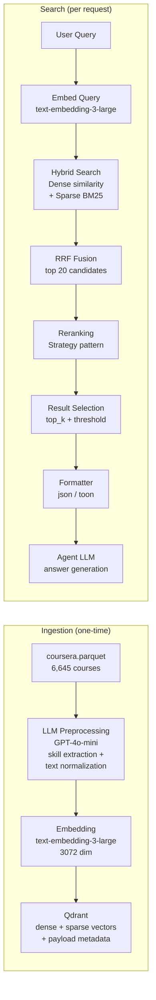

# RAG PIPELINE

> Lumineer uses a custom RAG (Retrieval-Augmented Generation) pipeline built from scratch — no LangChain.

## Model
- **Default:** `claude-sonnet-4-5`

## System Prompt
# RAG Pipeline

Lumineer uses a custom RAG (Retrieval-Augmented Generation) pipeline built from scratch — no LangChain. This document covers every step from data ingestion to context delivery.

---

## Pipeline Overview



---

## Step 1 — Data Ingestion

### Source data

- **File:** `data/raw/coursera.parquet` (11.4 MB)
- **Courses:** 6,645
- **Key issue:** Skills field is empty for 29% of courses; Description averages 3,198 chars

### LLM Preprocessing (GPT-4o-mini)

Each course is sent to GPT-4o-mini to generate a clean, search-optimized `search_text` field:

```
Input:  title, description (raw, up to 32K chars), skills (may be empty)
Output: search_text — normalized, keyword-rich summary with inferred skills
```

**Why preprocessing?**
- Fills in missing skills (29% of records)
- Compresses long descriptions into search-dense text
- Eliminates boilerplate marketing language that harms embedding quality

**Cost:** ~$1.10 (one-time)

### Embedding

| Property | Value |
|----------|-------|
| Model | `text-embedding-3-large` |
| Dimensions | 3072 |
| Input | `search_text` (LLM-generated) |
| Cost | ~$0.26 (one-time) |
| Storage | ~80 MB (within Qdrant Cloud 1 GB free tier) |

Both **dense** and **sparse** vectors are generated pe

*[truncated — see source for full prompt]*