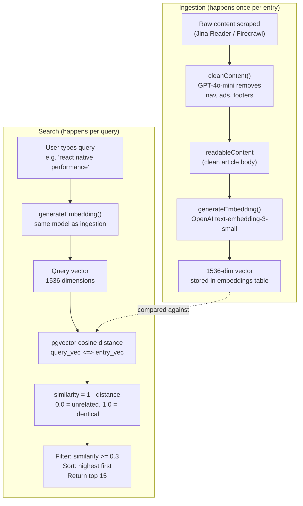

# SEARCH

> ## Overview

mymemory uses **embedding-based semantic search**. Instead of matching keywords, it compares the *meaning* of your query against the mean

## Model
- **Default:** `claude-sonnet-4-5`

## System Prompt
# Semantic Search — How It Works

## Overview

mymemory uses **embedding-based semantic search**. Instead of matching keywords, it compares the *meaning* of your query against the meaning of every entry. This is powered by OpenAI's `text-embedding-3-small` model and PostgreSQL's `pgvector` extension.

---

## How Similarity Is Calculated



### The Math

**Cosine similarity** measures the angle between two vectors, ignoring magnitude:

```
similarity = 1 - cosine_distance(query_vector, entry_vector)

Where cosine_distance = 1 - (A . B) / (||A|| * ||B||)

Result: 0.0 (completely unrelated) to 1.0 (semantically identical)
```

pgvector's `<=>` operator computes cosine distance. We convert to similarity by subtracting from 1.

---

## What Gets Embedded

This is the critical question — **what text produces the vector determines search quality**.

```mermaid
flowchart LR
    subgraph URL_Entry ["URL Entry"]
        U1["Raw scraped markdown\n(50K+ chars, noisy)"] --> U2["cleanContent()\nAI noise removal"]
        U2 --> U3["readableContent\n(article body only)"]
        U3 --> U4["generat

*[truncated — see source for full prompt]*