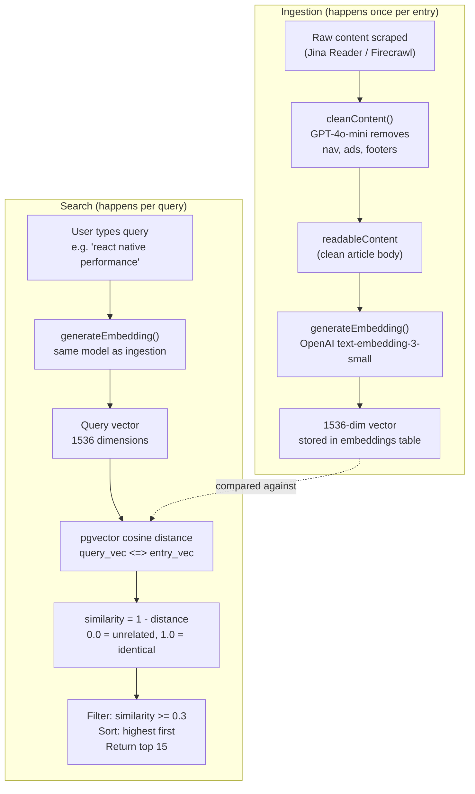
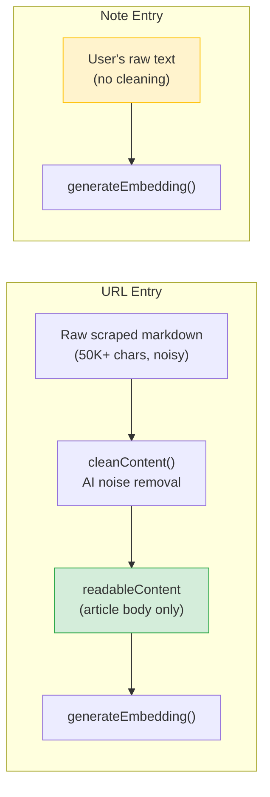
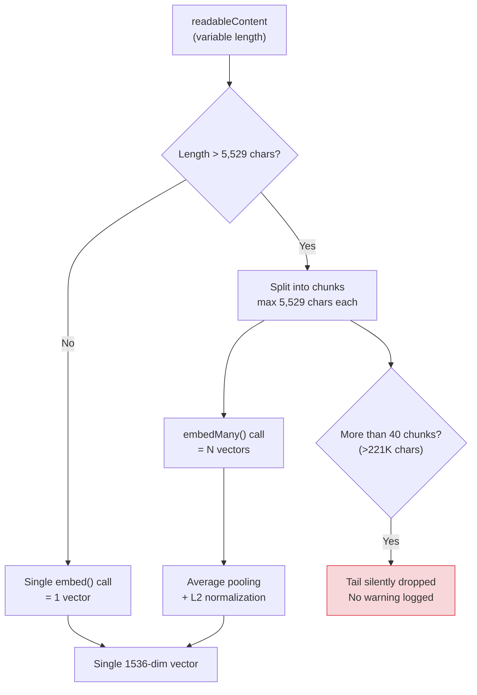
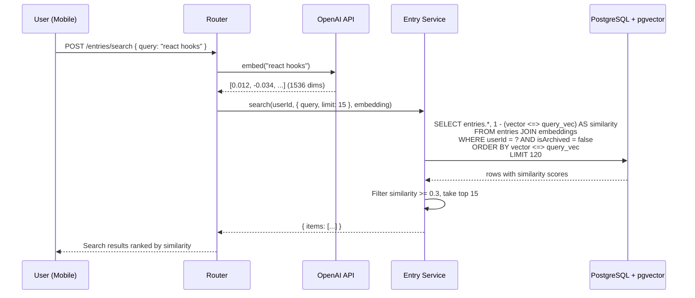

# Semantic Search — How It Works

## Overview

mymemory uses **embedding-based semantic search**. Instead of matching keywords, it compares the *meaning* of your query against the meaning of every entry. This is powered by OpenAI's `text-embedding-3-small` model and PostgreSQL's `pgvector` extension.

---

## How Similarity Is Calculated



### The Math

**Cosine similarity** measures the angle between two vectors, ignoring magnitude:

```
similarity = 1 - cosine_distance(query_vector, entry_vector)

Where cosine_distance = 1 - (A . B) / (||A|| * ||B||)

Result: 0.0 (completely unrelated) to 1.0 (semantically identical)
```

pgvector's `<=>` operator computes cosine distance. We convert to similarity by subtracting from 1.

---

## What Gets Embedded

This is the critical question — **what text produces the vector determines search quality**.



| Entry type | What is embedded | What is NOT embedded |
|------------|-----------------|---------------------|
| **URL** | Cleaned article body (`readableContent`) | Title, summary, tags, topics, URL, metadata |
| **Note** | Raw user text as-is | Nothing — it's all embedded |

### The Problem

**Only the article body is embedded.** The AI-generated title, summary, key points, tags, and topics are **not** part of the embedding input. This means:

- Searching for a tag name won't find entries with that tag (unless the tag word appears in the article body)
- Searching for the exact title of an article may not rank it highest
- Short notes embed well (the full text IS the meaning), but long articles may lose signal in noise

---

## Chunking for Long Content



| Content length | Chunks | Behavior |
|---------------|--------|----------|
| < 5,529 chars | 1 | Direct embed — best quality |
| 5,529 - 221K chars | 2-40 | Chunked + averaged — good quality |
| > 221K chars | 40 (capped) | Tail content lost — degraded quality |

---

## Search Flow (End to End)



---

## Current Configuration

| Parameter | Value | Location |
|-----------|-------|----------|
| Embedding model | `text-embedding-3-small` | `generate-embedding.ts:27` |
| Vector dimensions | 1536 | `embeddings.ts:6` |
| Max chars per chunk | 5,529 | `generate-embedding.ts:16-22` |
| Max chunks | 40 | `generate-embedding.ts:25` |
| Similarity threshold | 0.3 | `entry.service.ts:21` |
| Max results | 15 (default), 30 (max) | `entry.contract.ts` |
| Debounce (mobile) | 400ms | `SearchScreen` |
| Vector index | **None** (sequential scan) | `embeddings.ts` |

---

## Known Limitations

See `docs/SEARCH-FINDINGS.md` for the full analysis and improvement roadmap.