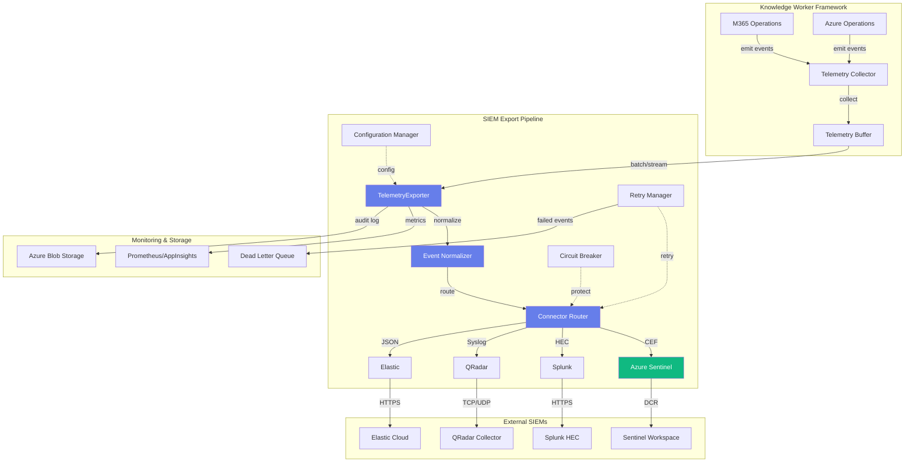
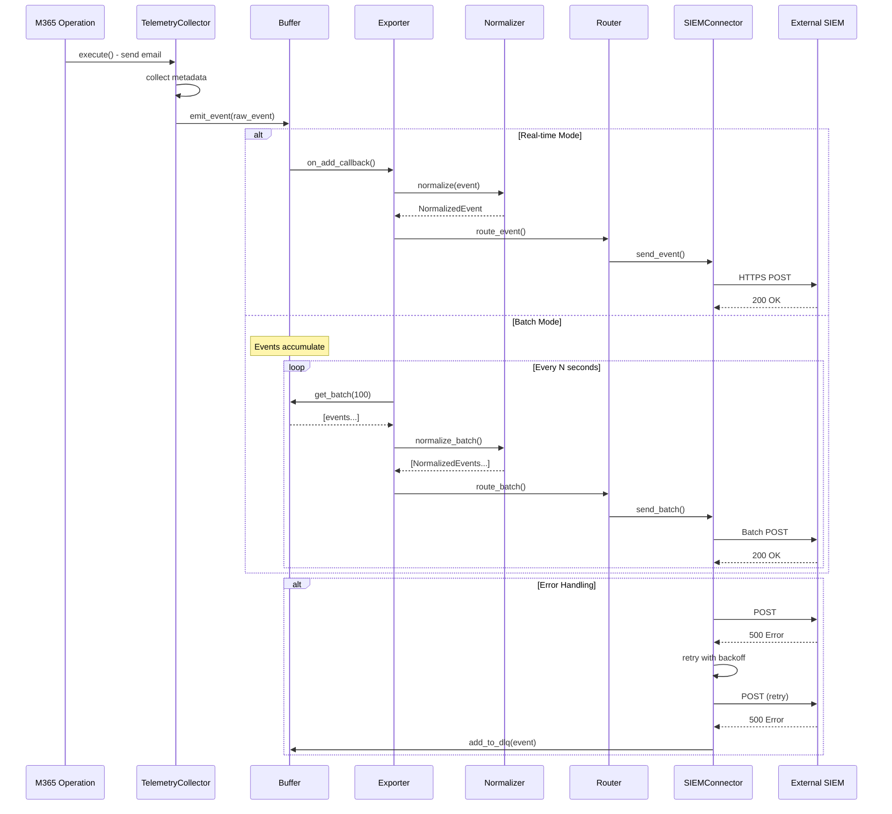

# SIEM Telemetry Export Pipeline - Implementation Specification

## Executive Summary

This specification defines the SIEM Telemetry Export Pipeline for Azure HayMaker, enabling real-time and batch export of M365 and Azure telemetry data to external Security Information and Event Management (SIEM) platforms. This is a **P0-Critical** feature required for red team exercises where benign "hay" telemetry must appear in target SIEMs alongside malicious "needle" activity.

**Status**: Design Phase
**Priority**: P0-Critical
**Target Completion**: 2-3 weeks
**Dependencies**: Knowledge Worker telemetry collection (✓ Complete)

---

## Table of Contents

1. [Architecture Overview](#architecture-overview)
2. [Component Design](#component-design)
3. [Data Flow](#data-flow)
4. [Telemetry Schema](#telemetry-schema)
5. [Connector Specifications](#connector-specifications)
6. [Configuration Model](#configuration-model)
7. [Error Handling & Resilience](#error-handling--resilience)
8. [Performance Considerations](#performance-considerations)
9. [Security](#security)
10. [Testing Strategy](#testing-strategy)
11. [Implementation Plan](#implementation-plan)
12. [API Design](#api-design)

---

## Architecture Overview

### High-Level Design



### Design Principles

1. **Pluggable Connectors**: Easy to add new SIEM platforms
2. **Fire-and-Forget Reliability**: Local buffering + retry ensures no data loss
3. **Zero-Config Defaults**: Works with minimal configuration
4. **Observable**: Full metrics and distributed tracing
5. **Testable**: Each component independently testable
6. **Secure**: Credentials in Key Vault, TLS everywhere

### Component Overview

| Component | Responsibility | Technology |
|-----------|---------------|------------|
| `TelemetryExporter` | Orchestrates export lifecycle | Python async |
| `EventNormalizer` | Converts to standard formats | Dataclasses + Pydantic |
| `ConnectorRouter` | Routes events to connectors | Registry pattern |
| `SIEMConnector` (base) | Abstract connector interface | ABC |
| `SentinelConnector` | Azure Sentinel DCR export | Azure Monitor Ingestion API |
| `SplunkConnector` | Splunk HEC export | HTTPS POST |
| `SyslogConnector` | RFC 5424/3164 export | TCP/UDP/TLS |
| `ElasticConnector` | Elasticsearch bulk API | HTTPS POST |
| `RetryManager` | Exponential backoff retry | Tenacity |
| `CircuitBreaker` | Failure isolation | pybreaker |
| `ConfigManager` | Configuration loading | Pydantic + YAML |

---

## Component Design

### 1. TelemetryExporter (Core Orchestrator)

**File**: `src/azure_haymaker/knowledge_worker/telemetry/exporter.py`

```python
"""SIEM telemetry export orchestrator.

Coordinates telemetry collection, normalization, and export to external SIEMs.
"""

import asyncio
import logging
from datetime import datetime, timedelta
from typing import Any

from azure_haymaker.knowledge_worker.telemetry.buffer import TelemetryBuffer
from azure_haymaker.knowledge_worker.telemetry.config import ExportConfig
from azure_haymaker.knowledge_worker.telemetry.connectors.router import ConnectorRouter
from azure_haymaker.knowledge_worker.telemetry.normalizer import EventNormalizer

logger = logging.getLogger(__name__)


class TelemetryExporter:
    """Orchestrates SIEM telemetry export.

    Coordinates:
    - Event collection from M365/Azure operations
    - Buffering and batching
    - Normalization to standard formats
    - Routing to configured SIEM connectors
    - Retry and error handling

    Supports two modes:
    - Real-time streaming (low latency, higher API cost)
    - Batch export (cost-effective, higher latency)

    Example:
        >>> config = ExportConfig.from_yaml("siem_config.yaml")
        >>> exporter = TelemetryExporter(config)
        >>> await exporter.start()
        >>> # Export runs in background
        >>> await exporter.stop()
    """

    def __init__(
        self,
        config: ExportConfig,
        buffer: TelemetryBuffer | None = None,
        normalizer: EventNormalizer | None = None,
        router: ConnectorRouter | None = None,
    ):
        """Initialize TelemetryExporter.

        Args:
            config: Export configuration
            buffer: Event buffer (created if None)
            normalizer: Event normalizer (created if None)
            router: Connector router (created if None)
        """
        self.config = config
        self.buffer = buffer or TelemetryBuffer(
            max_size=config.buffer_max_size,
            max_age_seconds=config.buffer_max_age_seconds,
        )
        self.normalizer = normalizer or EventNormalizer()
        self.router = router or ConnectorRouter.from_config(config)

        self._running = False
        self._export_task: asyncio.Task | None = None

    async def start(self) -> None:
        """Start the export pipeline.

        Initializes connectors and starts background export task.
        """
        if self._running:
            logger.warning("Exporter already running")
            return

        logger.info("Starting SIEM telemetry exporter")
        await self.router.initialize_connectors()

        self._running = True

        if self.config.mode == "real-time":
            # Real-time: export immediately on buffer add
            self.buffer.on_add_callback = self._export_immediate
        else:
            # Batch: export on schedule
            self._export_task = asyncio.create_task(self._export_loop())

        logger.info(f"Exporter started in {self.config.mode} mode")

    async def stop(self) -> None:
        """Stop the export pipeline gracefully.

        Flushes remaining buffered events before stopping.
        """
        if not self._running:
            return

        logger.info("Stopping SIEM telemetry exporter")
        self._running = False

        if self._export_task:
            self._export_task.cancel()
            try:
                await self._export_task
            except asyncio.CancelledError:
                pass

        # Flush remaining events
        await self._flush_buffer()
        await self.router.close_connectors()

        logger.info("Exporter stopped")

    async def emit_event(self, event: dict[str, Any]) -> None:
        """Emit a telemetry event for export.

        Args:
            event: Raw telemetry event from M365/Azure operations
        """
        if not self._running:
            logger.warning("Exporter not running, event dropped")
            return

        await self.buffer.add(event)

    async def _export_loop(self) -> None:
        """Background task for batch export."""
        while self._running:
            try:
                await asyncio.sleep(self.config.batch_interval_seconds)
                await self._flush_buffer()
            except Exception as e:
                logger.error(f"Export loop error: {e}", exc_info=True)

    async def _export_immediate(self, event: dict[str, Any]) -> None:
        """Export single event immediately (real-time mode)."""
        try:
            normalized = self.normalizer.normalize(event)
            await self.router.route_event(normalized)
        except Exception as e:
            logger.error(f"Immediate export failed: {e}", exc_info=True)
            # Add to DLQ
            await self.buffer.add_to_dlq(event, str(e))

    async def _flush_buffer(self) -> None:
        """Flush buffered events to connectors."""
        if self.buffer.is_empty():
            return

        events = await self.buffer.get_batch(self.config.batch_size)
        if not events:
            return

        logger.info(f"Flushing {len(events)} events to SIEM connectors")

        # Normalize all events
        normalized_events = []
        for event in events:
            try:
                normalized = self.normalizer.normalize(event)
                normalized_events.append(normalized)
            except Exception as e:
                logger.error(f"Normalization failed: {e}", event_id=event.get("id"))
                await self.buffer.add_to_dlq(event, str(e))

        # Route to connectors
        for event in normalized_events:
            try:
                await self.router.route_event(event)
            except Exception as e:
                logger.error(f"Routing failed: {e}", event_id=event.get("id"))
                await self.buffer.add_to_dlq(event.raw_event, str(e))

    async def get_stats(self) -> dict[str, Any]:
        """Get export statistics.

        Returns:
            Dictionary with metrics:
            - events_buffered: Current buffer size
            - events_exported: Total events exported
            - events_failed: Total failures
            - connector_stats: Per-connector metrics
        """
        return {
            "running": self._running,
            "mode": self.config.mode,
            "buffer_size": self.buffer.size(),
            "dlq_size": self.buffer.dlq_size(),
            "connector_stats": await self.router.get_stats(),
        }
```

### 2. Event Normalizer

**File**: `src/azure_haymaker/knowledge_worker/telemetry/normalizer.py`

```python
"""Event normalization to standard telemetry formats.

Converts raw M365/Azure events to normalized format with support for:
- Common Event Format (CEF)
- JSON (Elastic Common Schema)
- Syslog RFC 5424
"""

from dataclasses import dataclass, field
from datetime import datetime
from typing import Any


@dataclass
class NormalizedEvent:
    """Normalized telemetry event.

    Standard format that can be serialized to CEF, JSON, Syslog, etc.

    Attributes:
        event_id: Unique event identifier
        timestamp: Event timestamp
        source: Event source (m365_email, m365_teams, azure_compute, etc.)
        event_type: Type of event (email_send, vm_create, etc.)
        severity: Severity level (info, warning, error)
        actor: Principal who performed the action
        target: Resource that was acted upon
        outcome: success or failure
        details: Additional event-specific data
        raw_event: Original raw event for debugging
    """

    event_id: str
    timestamp: datetime
    source: str
    event_type: str
    severity: str
    actor: dict[str, str]  # user_id, upn, object_id
    target: dict[str, str]  # resource_id, resource_type, name
    outcome: str  # success, failure, pending
    details: dict[str, Any] = field(default_factory=dict)
    raw_event: dict[str, Any] = field(default_factory=dict)

    def to_cef(self) -> str:
        """Convert to Common Event Format (CEF).

        Format:
        CEF:Version|Device Vendor|Device Product|Device Version|Signature ID|Name|Severity|Extension

        Returns:
            CEF-formatted string
        """
        # CEF header
        version = "0"
        vendor = "AzureHayMaker"
        product = "KnowledgeWorker"
        device_version = "1.0"
        signature_id = self.event_type
        name = f"{self.source} - {self.event_type}"
        severity = self._map_severity_to_cef()

        # CEF extension (key=value pairs)
        extensions = []
        extensions.append(f"rt={int(self.timestamp.timestamp() * 1000)}")
        extensions.append(f"suser={self.actor.get('upn', 'unknown')}")
        extensions.append(f"dhost={self.target.get('name', 'unknown')}")
        extensions.append(f"outcome={self.outcome}")
        extensions.append(f"externalId={self.event_id}")

        # Add custom details
        for key, value in self.details.items():
            # CEF sanitization
            safe_key = key.replace("=", "_")
            safe_value = str(value).replace("=", "_").replace("|", "_")
            extensions.append(f"{safe_key}={safe_value}")

        extension_str = " ".join(extensions)

        return f"CEF:{version}|{vendor}|{product}|{device_version}|{signature_id}|{name}|{severity}|{extension_str}"

    def to_json(self) -> dict[str, Any]:
        """Convert to JSON (Elastic Common Schema compatible).

        Returns:
            Dictionary with ECS-compatible fields
        """
        return {
            "@timestamp": self.timestamp.isoformat(),
            "event": {
                "id": self.event_id,
                "kind": "event",
                "category": self._map_category(),
                "type": [self.event_type],
                "outcome": self.outcome,
            },
            "source": {
                "domain": self.source,
            },
            "user": {
                "id": self.actor.get("user_id"),
                "email": self.actor.get("upn"),
            },
            "resource": {
                "id": self.target.get("resource_id"),
                "type": self.target.get("resource_type"),
                "name": self.target.get("name"),
            },
            "message": self._generate_message(),
            "labels": self.details,
            "ecs": {"version": "8.0.0"},
        }

    def to_syslog(self, facility: int = 16) -> str:
        """Convert to Syslog RFC 5424 format.

        Args:
            facility: Syslog facility (default: 16 = local0)

        Returns:
            RFC 5424 formatted string
        """
        # Calculate priority
        severity_map = {"info": 6, "warning": 4, "error": 3}
        severity_num = severity_map.get(self.severity, 6)
        priority = facility * 8 + severity_num

        # Format timestamp
        timestamp_str = self.timestamp.strftime("%Y-%m-%dT%H:%M:%S.%fZ")

        # Hostname
        hostname = "azure-haymaker"

        # App name
        app_name = "knowledge-worker"

        # Process ID
        proc_id = "-"

        # Message ID
        msg_id = self.event_type

        # Structured data
        sd_elements = []
        sd_elements.append(f'[event id="{self.event_id}" source="{self.source}"]')
        sd_elements.append(f'[actor upn="{self.actor.get("upn", "-")}"]')
        sd_elements.append(f'[target name="{self.target.get("name", "-")}"]')
        sd_data = "".join(sd_elements)

        # Message
        message = self._generate_message()

        return f"<{priority}>1 {timestamp_str} {hostname} {app_name} {proc_id} {msg_id} {sd_data} {message}"

    def _map_severity_to_cef(self) -> str:
        """Map severity to CEF numeric value (0-10)."""
        mapping = {
            "info": "2",
            "warning": "5",
            "error": "8",
        }
        return mapping.get(self.severity, "2")

    def _map_category(self) -> list[str]:
        """Map event type to ECS categories."""
        if self.source.startswith("m365_"):
            return ["email"] if "email" in self.event_type else ["communication"]
        elif self.source.startswith("azure_"):
            return ["infrastructure"]
        return ["activity"]

    def _generate_message(self) -> str:
        """Generate human-readable message."""
        actor_name = self.actor.get("upn", "unknown")
        target_name = self.target.get("name", "unknown")
        return f"{actor_name} performed {self.event_type} on {target_name}: {self.outcome}"


class EventNormalizer:
    """Normalizes raw telemetry events to standard format.

    Handles M365 and Azure event formats.
    """

    def normalize(self, event: dict[str, Any]) -> NormalizedEvent:
        """Normalize a raw event.

        Args:
            event: Raw event from M365/Azure operations

        Returns:
            NormalizedEvent instance

        Raises:
            ValueError: If event format is invalid
        """
        source = event.get("source")

        if not source:
            raise ValueError("Event missing 'source' field")

        if source.startswith("m365_"):
            return self._normalize_m365(event)
        elif source.startswith("azure_"):
            return self._normalize_azure(event)
        else:
            raise ValueError(f"Unknown event source: {source}")

    def _normalize_m365(self, event: dict[str, Any]) -> NormalizedEvent:
        """Normalize M365 event."""
        return NormalizedEvent(
            event_id=event.get("event_id", event.get("message_id", "unknown")),
            timestamp=self._parse_timestamp(event.get("timestamp")),
            source=event["source"],
            event_type=event.get("event_type", "unknown"),
            severity=event.get("severity", "info"),
            actor={
                "user_id": event.get("worker_id"),
                "upn": event.get("sender") or event.get("actor"),
                "object_id": event.get("actor_object_id"),
            },
            target={
                "resource_id": event.get("target_id"),
                "resource_type": event.get("target_type"),
                "name": event.get("target_name") or event.get("subject"),
            },
            outcome=event.get("outcome", "success"),
            details=event.get("details", {}),
            raw_event=event,
        )

    def _normalize_azure(self, event: dict[str, Any]) -> NormalizedEvent:
        """Normalize Azure event."""
        return NormalizedEvent(
            event_id=event.get("event_id", "unknown"),
            timestamp=self._parse_timestamp(event.get("timestamp")),
            source=event["source"],
            event_type=event.get("event_type", "unknown"),
            severity=event.get("severity", "info"),
            actor={
                "user_id": event.get("principal_id"),
                "upn": event.get("principal_upn"),
                "object_id": event.get("principal_object_id"),
            },
            target={
                "resource_id": event.get("resource_id"),
                "resource_type": event.get("resource_type"),
                "name": event.get("resource_name"),
            },
            outcome=event.get("outcome", "success"),
            details=event.get("details", {}),
            raw_event=event,
        )

    def _parse_timestamp(self, ts: Any) -> datetime:
        """Parse timestamp from various formats."""
        if isinstance(ts, datetime):
            return ts
        elif isinstance(ts, str):
            return datetime.fromisoformat(ts.replace("Z", "+00:00"))
        elif isinstance(ts, (int, float)):
            return datetime.fromtimestamp(ts)
        else:
            return datetime.utcnow()
```

### 3. SIEM Connector Interface

**File**: `src/azure_haymaker/knowledge_worker/telemetry/connectors/base.py`

```python
"""Base SIEM connector interface and common utilities."""

from abc import ABC, abstractmethod
from dataclasses import dataclass
from typing import Any

from azure_haymaker.knowledge_worker.telemetry.normalizer import NormalizedEvent


@dataclass
class ConnectorConfig:
    """Base configuration for SIEM connectors.

    Attributes:
        name: Connector name/identifier
        enabled: Whether this connector is active
        format: Output format (cef, json, syslog)
        batch_size: Maximum events per batch
        timeout_seconds: Request timeout
        retry_attempts: Max retry attempts
        retry_backoff_seconds: Initial retry backoff
    """

    name: str
    enabled: bool = True
    format: str = "json"
    batch_size: int = 100
    timeout_seconds: int = 30
    retry_attempts: int = 3
    retry_backoff_seconds: float = 1.0

    # Connector-specific config as dict
    extra: dict[str, Any] = None

    def __post_init__(self):
        if self.extra is None:
            self.extra = {}


class SIEMConnector(ABC):
    """Abstract base class for SIEM connectors.

    All connectors must implement:
    - initialize(): Setup connections, auth
    - send_event(): Send single event
    - send_batch(): Send multiple events (batched)
    - close(): Cleanup resources
    - health_check(): Verify connectivity
    """

    def __init__(self, config: ConnectorConfig):
        """Initialize connector.

        Args:
            config: Connector configuration
        """
        self.config = config
        self._initialized = False

    @abstractmethod
    async def initialize(self) -> None:
        """Initialize the connector.

        Called once at startup. Should establish connections,
        authenticate, and prepare for sending events.

        Raises:
            ConnectionError: If initialization fails
        """
        pass

    @abstractmethod
    async def send_event(self, event: NormalizedEvent) -> None:
        """Send a single event to the SIEM.

        Args:
            event: Normalized event to send

        Raises:
            ConnectionError: If sending fails
        """
        pass

    @abstractmethod
    async def send_batch(self, events: list[NormalizedEvent]) -> None:
        """Send multiple events in a batch.

        More efficient than multiple send_event() calls.

        Args:
            events: List of normalized events

        Raises:
            ConnectionError: If sending fails
        """
        pass

    @abstractmethod
    async def close(self) -> None:
        """Close the connector and cleanup resources."""
        pass

    @abstractmethod
    async def health_check(self) -> bool:
        """Check if the connector is healthy.

        Returns:
            True if connector can send events, False otherwise
        """
        pass

    def format_event(self, event: NormalizedEvent) -> str | dict:
        """Format event according to connector format.

        Args:
            event: Normalized event

        Returns:
            Formatted event (string or dict)
        """
        if self.config.format == "cef":
            return event.to_cef()
        elif self.config.format == "json":
            return event.to_json()
        elif self.config.format == "syslog":
            return event.to_syslog()
        else:
            raise ValueError(f"Unknown format: {self.config.format}")
```

### 4. Azure Sentinel Connector (Priority)

**File**: `src/azure_haymaker/knowledge_worker/telemetry/connectors/sentinel.py`

```python
"""Azure Sentinel connector using Data Collection Rules (DCR).

Uses Azure Monitor Ingestion API to send events to Log Analytics workspace
via Data Collection Endpoints and Rules.

Setup Requirements:
1. Create Log Analytics workspace
2. Create custom table (e.g., HayMaker_CL)
3. Create Data Collection Endpoint
4. Create Data Collection Rule with:
   - Stream: Custom-HayMaker
   - Destination: Log Analytics workspace
5. Assign appropriate IAM role (Monitoring Metrics Publisher)
"""

import logging
from typing import Any

import aiohttp
from azure.identity.aio import DefaultAzureCredential
from azure.monitor.ingestion.aio import LogsIngestionClient

from azure_haymaker.knowledge_worker.telemetry.connectors.base import (
    ConnectorConfig,
    SIEMConnector,
)
from azure_haymaker.knowledge_worker.telemetry.normalizer import NormalizedEvent

logger = logging.getLogger(__name__)


class SentinelConnector(SIEMConnector):
    """Azure Sentinel SIEM connector using DCR ingestion.

    Configuration:
        extra:
            dce_endpoint: Data Collection Endpoint URL
            dcr_immutable_id: Data Collection Rule ID
            stream_name: Stream name (default: Custom-HayMaker)
            table_name: Custom table name (default: HayMaker_CL)

    Example config:
        name: azure-sentinel
        format: json
        extra:
            dce_endpoint: https://my-dce-xyz.eastus-1.ingest.monitor.azure.com
            dcr_immutable_id: dcr-0123456789abcdef
            stream_name: Custom-HayMaker
    """

    def __init__(self, config: ConnectorConfig):
        super().__init__(config)

        self.dce_endpoint = config.extra.get("dce_endpoint")
        self.dcr_immutable_id = config.extra.get("dcr_immutable_id")
        self.stream_name = config.extra.get("stream_name", "Custom-HayMaker")

        if not self.dce_endpoint or not self.dcr_immutable_id:
            raise ValueError("Sentinel connector requires dce_endpoint and dcr_immutable_id")

        self.credential: DefaultAzureCredential | None = None
        self.client: LogsIngestionClient | None = None

    async def initialize(self) -> None:
        """Initialize Sentinel connector."""
        logger.info(f"Initializing Sentinel connector: {self.config.name}")

        self.credential = DefaultAzureCredential()
        self.client = LogsIngestionClient(
            endpoint=self.dce_endpoint,
            credential=self.credential,
        )

        self._initialized = True
        logger.info("Sentinel connector initialized")

    async def send_event(self, event: NormalizedEvent) -> None:
        """Send single event to Sentinel."""
        await self.send_batch([event])

    async def send_batch(self, events: list[NormalizedEvent]) -> None:
        """Send batch of events to Sentinel via DCR.

        Args:
            events: List of normalized events

        Raises:
            ConnectionError: If ingestion fails
        """
        if not self._initialized or not self.client:
            raise RuntimeError("Connector not initialized")

        # Convert to JSON format
        logs = [event.to_json() for event in events]

        try:
            logger.debug(f"Sending {len(logs)} events to Sentinel")

            await self.client.upload(
                rule_id=self.dcr_immutable_id,
                stream_name=self.stream_name,
                logs=logs,
            )

            logger.info(f"Sent {len(logs)} events to Sentinel successfully")

        except Exception as e:
            logger.error(f"Failed to send events to Sentinel: {e}", exc_info=True)
            raise ConnectionError(f"Sentinel ingestion failed: {e}") from e

    async def close(self) -> None:
        """Close Sentinel connector."""
        if self.client:
            await self.client.close()
        if self.credential:
            await self.credential.close()

        self._initialized = False
        logger.info("Sentinel connector closed")

    async def health_check(self) -> bool:
        """Check Sentinel connectivity.

        Sends a test event to verify DCR is accessible.
        """
        if not self._initialized:
            return False

        try:
            # Send minimal test event
            test_event = {
                "@timestamp": "2024-01-01T00:00:00Z",
                "event": {"id": "health-check"},
                "message": "Health check event",
            }

            await self.client.upload(
                rule_id=self.dcr_immutable_id,
                stream_name=self.stream_name,
                logs=[test_event],
            )

            return True

        except Exception as e:
            logger.warning(f"Sentinel health check failed: {e}")
            return False
```

### 5. Splunk HEC Connector

**File**: `src/azure_haymaker/knowledge_worker/telemetry/connectors/splunk.py`

```python
"""Splunk HTTP Event Collector (HEC) connector.

Sends events to Splunk via HEC API endpoint.

Setup Requirements:
1. Enable HEC in Splunk
2. Create HEC token
3. Configure index for events
"""

import logging
from typing import Any

import aiohttp

from azure_haymaker.knowledge_worker.telemetry.connectors.base import (
    ConnectorConfig,
    SIEMConnector,
)
from azure_haymaker.knowledge_worker.telemetry.normalizer import NormalizedEvent

logger = logging.getLogger(__name__)


class SplunkConnector(SIEMConnector):
    """Splunk HEC SIEM connector.

    Configuration:
        extra:
            hec_endpoint: HEC endpoint URL
            hec_token: HEC authentication token (from Key Vault)
            index: Splunk index name
            source: Event source name
            sourcetype: Splunk sourcetype
            verify_ssl: Whether to verify SSL (default: True)

    Example config:
        name: splunk-prod
        format: json
        extra:
            hec_endpoint: https://splunk.example.com:8088
            hec_token: ${keyvault:splunk-hec-token}
            index: haymaker
            sourcetype: _json
    """

    def __init__(self, config: ConnectorConfig):
        super().__init__(config)

        self.hec_endpoint = config.extra.get("hec_endpoint")
        self.hec_token = config.extra.get("hec_token")
        self.index = config.extra.get("index", "main")
        self.source = config.extra.get("source", "azure_haymaker")
        self.sourcetype = config.extra.get("sourcetype", "_json")
        self.verify_ssl = config.extra.get("verify_ssl", True)

        if not self.hec_endpoint or not self.hec_token:
            raise ValueError("Splunk connector requires hec_endpoint and hec_token")

        self.session: aiohttp.ClientSession | None = None

    async def initialize(self) -> None:
        """Initialize Splunk connector."""
        logger.info(f"Initializing Splunk connector: {self.config.name}")

        # Create session with HEC token header
        headers = {
            "Authorization": f"Splunk {self.hec_token}",
            "Content-Type": "application/json",
        }

        connector = aiohttp.TCPConnector(verify_ssl=self.verify_ssl)
        self.session = aiohttp.ClientSession(
            headers=headers,
            connector=connector,
            timeout=aiohttp.ClientTimeout(total=self.config.timeout_seconds),
        )

        self._initialized = True
        logger.info("Splunk connector initialized")

    async def send_event(self, event: NormalizedEvent) -> None:
        """Send single event to Splunk HEC."""
        await self.send_batch([event])

    async def send_batch(self, events: list[NormalizedEvent]) -> None:
        """Send batch of events to Splunk HEC.

        Uses batch mode for efficiency.
        """
        if not self._initialized or not self.session:
            raise RuntimeError("Connector not initialized")

        # Format as HEC batch
        # Each event on separate line (newline-delimited JSON)
        lines = []
        for event in events:
            event_json = event.to_json()
            hec_event = {
                "time": event.timestamp.timestamp(),
                "host": "azure-haymaker",
                "source": self.source,
                "sourcetype": self.sourcetype,
                "index": self.index,
                "event": event_json,
            }
            lines.append(hec_event)

        try:
            logger.debug(f"Sending {len(lines)} events to Splunk HEC")

            # Post to /services/collector/event/1.0
            url = f"{self.hec_endpoint}/services/collector/event/1.0"

            async with self.session.post(url, json=lines) as resp:
                if resp.status != 200:
                    body = await resp.text()
                    raise ConnectionError(f"HEC returned {resp.status}: {body}")

                result = await resp.json()
                if result.get("code") != 0:
                    raise ConnectionError(f"HEC error: {result}")

            logger.info(f"Sent {len(lines)} events to Splunk successfully")

        except aiohttp.ClientError as e:
            logger.error(f"Failed to send events to Splunk: {e}", exc_info=True)
            raise ConnectionError(f"Splunk HEC failed: {e}") from e

    async def close(self) -> None:
        """Close Splunk connector."""
        if self.session:
            await self.session.close()

        self._initialized = False
        logger.info("Splunk connector closed")

    async def health_check(self) -> bool:
        """Check Splunk HEC connectivity."""
        if not self._initialized or not self.session:
            return False

        try:
            # Use health endpoint
            url = f"{self.hec_endpoint}/services/collector/health"
            async with self.session.get(url) as resp:
                return resp.status == 200

        except Exception as e:
            logger.warning(f"Splunk health check failed: {e}")
            return False
```

---

## Data Flow

### Telemetry Collection to SIEM Export Flow



### Event Lifecycle States

1. **COLLECTED**: Event emitted from M365/Azure operation
2. **BUFFERED**: Event stored in local buffer
3. **NORMALIZED**: Event converted to standard format
4. **ROUTED**: Event sent to connector(s)
5. **ACKNOWLEDGED**: SIEM confirmed receipt
6. **FAILED**: Moved to Dead Letter Queue after retries

---

## Telemetry Schema

### Raw Event Schema (Internal)

```python
{
    # Common fields
    "event_id": "uuid-string",
    "timestamp": "2024-11-30T12:00:00Z",
    "source": "m365_email | m365_teams | m365_calendar | azure_compute | azure_storage",
    "event_type": "email_send | vm_create | etc.",
    "severity": "info | warning | error",
    "outcome": "success | failure | pending",

    # Actor (who performed action)
    "worker_id": "worker-123",
    "actor": "user@tenant.onmicrosoft.com",
    "actor_object_id": "entra-object-id",

    # Target (what was acted upon)
    "target_id": "resource-id",
    "target_type": "email | vm | storage",
    "target_name": "Display name",

    # Event-specific details
    "details": {
        "subject": "Email subject",
        "recipients": ["user1@example.com"],
        "size_bytes": 12345,
        # ... custom fields
    }
}
```

### M365 Email Event

```python
{
    "event_id": "msg-abc123",
    "timestamp": "2024-11-30T10:15:30Z",
    "source": "m365_email",
    "event_type": "email_send",
    "severity": "info",
    "outcome": "success",

    "worker_id": "worker-42",
    "actor": "alice@contoso.onmicrosoft.com",
    "actor_object_id": "00000000-0000-0000-0000-000000000001",

    "target_id": "msg-xyz789",
    "target_type": "email",
    "target_name": "Quarterly Report",

    "details": {
        "subject": "Q4 2024 Financial Report",
        "recipients": ["bob@contoso.onmicrosoft.com"],
        "cc": ["manager@contoso.onmicrosoft.com"],
        "has_attachments": true,
        "importance": "high",
        "body_preview": "Please find attached...",
    }
}
```

### Azure Compute Event

```python
{
    "event_id": "evt-compute-001",
    "timestamp": "2024-11-30T11:20:45Z",
    "source": "azure_compute",
    "event_type": "vm_create",
    "severity": "info",
    "outcome": "success",

    "worker_id": "agent-sp-17",
    "actor": "sp-azure-haymaker-17",
    "actor_object_id": "00000000-0000-0000-0000-000000000017",

    "target_id": "/subscriptions/sub-id/resourceGroups/rg-hay/providers/Microsoft.Compute/virtualMachines/vm-web-01",
    "target_type": "vm",
    "target_name": "vm-web-01",

    "details": {
        "location": "eastus",
        "vm_size": "Standard_B2s",
        "os_type": "Linux",
        "image": "Ubuntu 22.04 LTS",
        "tags": {
            "AzureHayMaker-managed": "true",
            "scenario": "compute-basic-01"
        }
    }
}
```

---

## Connector Specifications

### 1. Azure Sentinel Connector

**Protocol**: Azure Monitor Ingestion API
**Authentication**: Azure AD Managed Identity / Service Principal
**Format**: JSON (ECS-compatible)
**Endpoint**: Data Collection Endpoint (DCE)

**Setup Steps**:

```bash
# 1. Create Log Analytics workspace
az monitor log-analytics workspace create \
  --resource-group rg-haymaker \
  --workspace-name law-haymaker-siem \
  --location eastus

# 2. Create custom table
# Table schema: HayMaker_CL (Custom Log)
# Columns: TimeGenerated, RawData (dynamic)

# 3. Create Data Collection Endpoint
az monitor data-collection endpoint create \
  --name dce-haymaker \
  --resource-group rg-haymaker \
  --location eastus \
  --public-network-access Enabled

# 4. Create Data Collection Rule
az monitor data-collection rule create \
  --name dcr-haymaker \
  --resource-group rg-haymaker \
  --location eastus \
  --endpoint-id <dce-id> \
  --rule-file dcr-definition.json

# 5. Assign IAM role
az role assignment create \
  --assignee <managed-identity-id> \
  --role "Monitoring Metrics Publisher" \
  --scope <dcr-id>
```

**DCR Definition** (`dcr-definition.json`):

```json
{
  "properties": {
    "dataCollectionEndpointId": "<dce-resource-id>",
    "streamDeclarations": {
      "Custom-HayMaker": {
        "columns": [
          {"name": "TimeGenerated", "type": "datetime"},
          {"name": "EventId", "type": "string"},
          {"name": "Source", "type": "string"},
          {"name": "EventType", "type": "string"},
          {"name": "Actor", "type": "string"},
          {"name": "Target", "type": "string"},
          {"name": "Outcome", "type": "string"},
          {"name": "RawData", "type": "dynamic"}
        ]
      }
    },
    "destinations": {
      "logAnalytics": [
        {
          "workspaceResourceId": "<law-resource-id>",
          "name": "law-haymaker"
        }
      ]
    },
    "dataFlows": [
      {
        "streams": ["Custom-HayMaker"],
        "destinations": ["law-haymaker"],
        "transformKql": "source",
        "outputStream": "Custom-HayMaker_CL"
      }
    ]
  }
}
```

### 2. Splunk HEC Connector

**Protocol**: HTTPS POST
**Authentication**: HEC Token
**Format**: JSON
**Endpoint**: `https://<splunk-host>:8088/services/collector`

**Configuration**:

```yaml
connectors:
  - name: splunk-production
    type: splunk
    enabled: true
    format: json
    batch_size: 100
    timeout_seconds: 30
    retry_attempts: 3
    extra:
      hec_endpoint: https://splunk.contoso.com:8088
      hec_token: ${keyvault:splunk-hec-token}
      index: haymaker
      source: azure_haymaker
      sourcetype: _json
      verify_ssl: true
```

**Splunk Index Setup**:

```spl
# Create index
| makeindex haymaker

# Create sourcetype
[_json]
INDEXED_EXTRACTIONS = json
KV_MODE = json
TIME_PREFIX = @timestamp
TIME_FORMAT = %Y-%m-%dT%H:%M:%S.%3N%Z
```

### 3. Syslog Connector (RFC 5424)

**Protocol**: TCP/UDP/TLS
**Authentication**: None (network-based)
**Format**: RFC 5424 Syslog
**Endpoint**: Syslog server IP:PORT

**File**: `src/azure_haymaker/knowledge_worker/telemetry/connectors/syslog.py`

```python
"""Syslog connector (RFC 5424 and RFC 3164).

Sends events to syslog servers via TCP, UDP, or TLS.
"""

import asyncio
import logging
import ssl
from typing import Any

from azure_haymaker.knowledge_worker.telemetry.connectors.base import (
    ConnectorConfig,
    SIEMConnector,
)
from azure_haymaker.knowledge_worker.telemetry.normalizer import NormalizedEvent

logger = logging.getLogger(__name__)


class SyslogConnector(SIEMConnector):
    """Syslog SIEM connector.

    Configuration:
        extra:
            host: Syslog server hostname
            port: Syslog server port (default: 514)
            protocol: tcp | udp | tls (default: tcp)
            facility: Syslog facility (0-23, default: 16)
            tls_verify: Verify TLS certificate (default: True)
    """

    def __init__(self, config: ConnectorConfig):
        super().__init__(config)

        self.host = config.extra.get("host")
        self.port = config.extra.get("port", 514)
        self.protocol = config.extra.get("protocol", "tcp")
        self.facility = config.extra.get("facility", 16)
        self.tls_verify = config.extra.get("tls_verify", True)

        if not self.host:
            raise ValueError("Syslog connector requires host")

        self.reader: asyncio.StreamReader | None = None
        self.writer: asyncio.StreamWriter | None = None

    async def initialize(self) -> None:
        """Initialize Syslog connector."""
        logger.info(f"Initializing Syslog connector: {self.config.name}")

        if self.protocol == "tcp":
            self.reader, self.writer = await asyncio.open_connection(
                self.host, self.port
            )
        elif self.protocol == "tls":
            ssl_context = ssl.create_default_context()
            if not self.tls_verify:
                ssl_context.check_hostname = False
                ssl_context.verify_mode = ssl.CERT_NONE

            self.reader, self.writer = await asyncio.open_connection(
                self.host, self.port, ssl=ssl_context
            )
        elif self.protocol == "udp":
            # UDP doesn't need persistent connection
            pass
        else:
            raise ValueError(f"Unknown protocol: {self.protocol}")

        self._initialized = True
        logger.info("Syslog connector initialized")

    async def send_event(self, event: NormalizedEvent) -> None:
        """Send single event via syslog."""
        if not self._initialized:
            raise RuntimeError("Connector not initialized")

        message = event.to_syslog(facility=self.facility)

        if self.protocol == "udp":
            # UDP socket
            transport, protocol = await asyncio.get_event_loop().create_datagram_endpoint(
                lambda: asyncio.DatagramProtocol(),
                remote_addr=(self.host, self.port)
            )
            transport.sendto(message.encode("utf-8"))
            transport.close()
        else:
            # TCP/TLS
            if not self.writer:
                raise RuntimeError("TCP connection not established")

            self.writer.write(message.encode("utf-8") + b"\n")
            await self.writer.drain()

    async def send_batch(self, events: list[NormalizedEvent]) -> None:
        """Send batch of events."""
        for event in events:
            await self.send_event(event)

    async def close(self) -> None:
        """Close Syslog connector."""
        if self.writer:
            self.writer.close()
            await self.writer.wait_closed()

        self._initialized = False
        logger.info("Syslog connector closed")

    async def health_check(self) -> bool:
        """Check syslog connectivity."""
        if not self._initialized:
            return False

        # For TCP/TLS, connection existence = healthy
        # For UDP, always return True (no connection)
        return self.protocol == "udp" or self.writer is not None
```

### 4. Elasticsearch/Elastic Cloud Connector

**Protocol**: HTTPS POST
**Authentication**: API Key or Basic Auth
**Format**: JSON (Bulk API)
**Endpoint**: `https://<elastic-host>:9200/_bulk`

---

## Configuration Model

### Export Configuration Schema

**File**: `src/azure_haymaker/knowledge_worker/telemetry/config.py`

```python
"""SIEM export configuration models."""

from pathlib import Path
from typing import Any, Literal

import yaml
from pydantic import BaseModel, Field


class ConnectorConfigModel(BaseModel):
    """Configuration for a single SIEM connector."""

    name: str = Field(..., description="Connector identifier")
    type: Literal["sentinel", "splunk", "syslog", "elastic"] = Field(
        ..., description="Connector type"
    )
    enabled: bool = Field(True, description="Whether connector is active")
    format: Literal["json", "cef", "syslog"] = Field(
        "json", description="Output format"
    )
    batch_size: int = Field(100, ge=1, le=1000, description="Max events per batch")
    timeout_seconds: int = Field(30, ge=1, description="Request timeout")
    retry_attempts: int = Field(3, ge=0, description="Max retry attempts")
    retry_backoff_seconds: float = Field(1.0, ge=0.1, description="Initial backoff")
    extra: dict[str, Any] = Field(
        default_factory=dict, description="Connector-specific config"
    )


class BufferConfigModel(BaseModel):
    """Configuration for telemetry buffer."""

    max_size: int = Field(10000, ge=100, description="Max buffered events")
    max_age_seconds: int = Field(300, ge=10, description="Max buffer age")
    dlq_path: Path | None = Field(None, description="Dead letter queue path")


class ExportConfig(BaseModel):
    """Main export configuration.

    Example YAML:
        mode: batch
        batch_interval_seconds: 60
        batch_size: 100

        buffer:
          max_size: 10000
          max_age_seconds: 300
          dlq_path: /var/log/haymaker/dlq

        connectors:
          - name: azure-sentinel
            type: sentinel
            enabled: true
            format: json
            extra:
              dce_endpoint: https://dce-xyz.ingest.monitor.azure.com
              dcr_immutable_id: dcr-abc123

          - name: splunk-prod
            type: splunk
            enabled: true
            format: json
            batch_size: 100
            extra:
              hec_endpoint: https://splunk.contoso.com:8088
              hec_token: ${keyvault:splunk-token}
              index: haymaker
    """

    mode: Literal["real-time", "batch"] = Field(
        "batch", description="Export mode"
    )
    batch_interval_seconds: int = Field(
        60, ge=10, description="Batch export interval"
    )
    batch_size: int = Field(100, ge=1, description="Default batch size")

    buffer: BufferConfigModel = Field(
        default_factory=BufferConfigModel, description="Buffer config"
    )
    buffer_max_size: int = Field(10000, ge=100)  # Deprecated, use buffer.max_size
    buffer_max_age_seconds: int = Field(300, ge=10)  # Deprecated

    connectors: list[ConnectorConfigModel] = Field(
        default_factory=list, description="SIEM connectors"
    )

    @classmethod
    def from_yaml(cls, path: Path | str) -> "ExportConfig":
        """Load configuration from YAML file.

        Supports environment variable substitution:
        - ${ENV_VAR} - Replace with environment variable
        - ${keyvault:secret-name} - Fetch from Azure Key Vault

        Args:
            path: Path to YAML config file

        Returns:
            ExportConfig instance
        """
        path = Path(path)
        with path.open() as f:
            data = yaml.safe_load(f)

        # TODO: Implement env var and Key Vault substitution

        return cls(**data)

    def to_yaml(self, path: Path | str) -> None:
        """Save configuration to YAML file.

        Args:
            path: Output path
        """
        path = Path(path)
        with path.open("w") as f:
            yaml.dump(self.model_dump(), f, default_flow_style=False)
```

### Example Configuration Files

**`config/siem_export.yaml`** (Development):

```yaml
mode: batch
batch_interval_seconds: 60
batch_size: 100

buffer:
  max_size: 10000
  max_age_seconds: 300
  dlq_path: /tmp/haymaker/dlq

connectors:
  # Azure Sentinel (Primary)
  - name: azure-sentinel-dev
    type: sentinel
    enabled: true
    format: json
    batch_size: 100
    timeout_seconds: 30
    retry_attempts: 3
    extra:
      dce_endpoint: https://dce-dev-xyz.eastus-1.ingest.monitor.azure.com
      dcr_immutable_id: dcr-0123456789abcdef
      stream_name: Custom-HayMaker

  # Splunk (Secondary)
  - name: splunk-dev
    type: splunk
    enabled: false  # Disabled in dev
    format: json
    batch_size: 100
    extra:
      hec_endpoint: https://splunk-dev.contoso.com:8088
      hec_token: ${keyvault:splunk-dev-hec-token}
      index: haymaker_dev
      sourcetype: _json
```

**`config/siem_export.prod.yaml`** (Production):

```yaml
mode: real-time  # Real-time for prod
batch_interval_seconds: 10
batch_size: 500

buffer:
  max_size: 50000
  max_age_seconds: 60
  dlq_path: /var/log/haymaker/dlq

connectors:
  # Azure Sentinel (Primary)
  - name: azure-sentinel-prod
    type: sentinel
    enabled: true
    format: json
    batch_size: 500
    timeout_seconds: 60
    retry_attempts: 5
    retry_backoff_seconds: 2.0
    extra:
      dce_endpoint: https://dce-prod-xyz.eastus-1.ingest.monitor.azure.com
      dcr_immutable_id: dcr-prod-abcdef123456
      stream_name: Custom-HayMaker

  # Splunk (Secondary)
  - name: splunk-prod
    type: splunk
    enabled: true
    format: json
    batch_size: 500
    extra:
      hec_endpoint: https://splunk-prod.contoso.com:8088
      hec_token: ${keyvault:splunk-prod-hec-token}
      index: haymaker_prod
      sourcetype: haymaker_json
      verify_ssl: true

  # Syslog (Tertiary - QRadar)
  - name: qradar-syslog
    type: syslog
    enabled: true
    format: syslog
    batch_size: 100
    extra:
      host: qradar.contoso.com
      port: 514
      protocol: tls
      facility: 16  # local0
      tls_verify: true
```

---

## Error Handling & Resilience

### Retry Strategy

**Implementation**: Uses `tenacity` library for exponential backoff

```python
"""Retry manager for SIEM exports."""

import logging
from typing import Any, Callable

from tenacity import (
    AsyncRetrying,
    RetryError,
    stop_after_attempt,
    wait_exponential,
    retry_if_exception_type,
)

logger = logging.getLogger(__name__)


class RetryManager:
    """Manages retry logic for SIEM exports.

    Uses exponential backoff with jitter.
    """

    def __init__(
        self,
        max_attempts: int = 3,
        initial_wait: float = 1.0,
        max_wait: float = 60.0,
    ):
        """Initialize retry manager.

        Args:
            max_attempts: Maximum retry attempts
            initial_wait: Initial wait time in seconds
            max_wait: Maximum wait time between retries
        """
        self.max_attempts = max_attempts
        self.initial_wait = initial_wait
        self.max_wait = max_wait

    async def execute_with_retry(
        self,
        func: Callable,
        *args: Any,
        **kwargs: Any,
    ) -> Any:
        """Execute function with retry logic.

        Args:
            func: Async function to execute
            *args: Positional arguments
            **kwargs: Keyword arguments

        Returns:
            Function result

        Raises:
            RetryError: If all attempts fail
        """
        retry_config = AsyncRetrying(
            stop=stop_after_attempt(self.max_attempts),
            wait=wait_exponential(
                multiplier=self.initial_wait,
                max=self.max_wait,
            ),
            retry=retry_if_exception_type((ConnectionError, TimeoutError)),
            reraise=True,
        )

        try:
            async for attempt in retry_config:
                with attempt:
                    logger.debug(f"Attempt {attempt.retry_state.attempt_number}")
                    return await func(*args, **kwargs)
        except RetryError as e:
            logger.error(f"All retry attempts failed: {e}")
            raise
```

### Circuit Breaker Pattern

**Implementation**: Uses `pybreaker` library

```python
"""Circuit breaker for SIEM connectors."""

import logging
from typing import Any

from pybreaker import CircuitBreaker, CircuitBreakerError

logger = logging.getLogger(__name__)


class SIEMCircuitBreaker:
    """Circuit breaker for SIEM connectors.

    Prevents cascading failures by temporarily disabling
    failing connectors.

    States:
    - CLOSED: Normal operation
    - OPEN: Connector disabled (too many failures)
    - HALF_OPEN: Testing if connector recovered
    """

    def __init__(
        self,
        fail_max: int = 5,
        timeout_seconds: int = 60,
    ):
        """Initialize circuit breaker.

        Args:
            fail_max: Failures before opening circuit
            timeout_seconds: Time before attempting recovery
        """
        self.breaker = CircuitBreaker(
            fail_max=fail_max,
            timeout_duration=timeout_seconds,
            name="siem-connector",
        )

    async def call(self, func: Any, *args: Any, **kwargs: Any) -> Any:
        """Execute function with circuit breaker protection.

        Args:
            func: Function to execute
            *args: Positional arguments
            **kwargs: Keyword arguments

        Returns:
            Function result

        Raises:
            CircuitBreakerError: If circuit is open
        """
        try:
            return await self.breaker.call_async(func, *args, **kwargs)
        except CircuitBreakerError as e:
            logger.warning(f"Circuit breaker open: {e}")
            raise

    @property
    def state(self) -> str:
        """Get current circuit breaker state."""
        return self.breaker.current_state
```

### Dead Letter Queue

**File**: `src/azure_haymaker/knowledge_worker/telemetry/dlq.py`

```python
"""Dead Letter Queue for failed events."""

import json
import logging
from datetime import datetime
from pathlib import Path
from typing import Any

logger = logging.getLogger(__name__)


class DeadLetterQueue:
    """Persistent queue for failed export events.

    Failed events are written to disk for manual recovery.
    """

    def __init__(self, base_path: Path):
        """Initialize DLQ.

        Args:
            base_path: Directory for DLQ files
        """
        self.base_path = Path(base_path)
        self.base_path.mkdir(parents=True, exist_ok=True)

    async def add(
        self,
        event: dict[str, Any],
        error: str,
        connector_name: str | None = None,
    ) -> None:
        """Add failed event to DLQ.

        Args:
            event: Failed event
            error: Error message
            connector_name: Connector that failed
        """
        timestamp = datetime.utcnow().isoformat()
        filename = f"dlq_{timestamp}_{event.get('event_id', 'unknown')}.json"
        filepath = self.base_path / filename

        dlq_entry = {
            "timestamp": timestamp,
            "error": error,
            "connector": connector_name,
            "event": event,
        }

        try:
            with filepath.open("w") as f:
                json.dump(dlq_entry, f, indent=2)

            logger.info(f"Event added to DLQ: {filepath}")

        except Exception as e:
            logger.error(f"Failed to write DLQ entry: {e}", exc_info=True)

    def list_entries(self) -> list[Path]:
        """List all DLQ entries.

        Returns:
            List of DLQ file paths
        """
        return list(self.base_path.glob("dlq_*.json"))

    def get_entry(self, filepath: Path) -> dict[str, Any]:
        """Read DLQ entry.

        Args:
            filepath: Path to DLQ file

        Returns:
            DLQ entry dictionary
        """
        with filepath.open() as f:
            return json.load(f)

    def delete_entry(self, filepath: Path) -> None:
        """Delete DLQ entry after recovery.

        Args:
            filepath: Path to DLQ file
        """
        filepath.unlink()
        logger.info(f"Deleted DLQ entry: {filepath}")
```

---

## Performance Considerations

### Batching Strategy

**Goal**: Balance latency vs. throughput

- **Real-time mode**: Send immediately (< 1s latency)
- **Batch mode**: Collect N events or T seconds (whichever first)

**Implementation**:

```python
class TelemetryBuffer:
    """Efficient event buffer with batching."""

    def __init__(self, max_size: int = 10000, max_age_seconds: int = 300):
        self.max_size = max_size
        self.max_age_seconds = max_age_seconds
        self._buffer: list[dict] = []
        self._lock = asyncio.Lock()
        self._oldest_timestamp: datetime | None = None

    async def add(self, event: dict) -> None:
        """Add event to buffer."""
        async with self._lock:
            self._buffer.append(event)

            if self._oldest_timestamp is None:
                self._oldest_timestamp = datetime.utcnow()

            # Auto-flush if full
            if len(self._buffer) >= self.max_size:
                await self._flush_callback()

    async def get_batch(self, size: int) -> list[dict]:
        """Get batch of events."""
        async with self._lock:
            batch = self._buffer[:size]
            self._buffer = self._buffer[size:]

            if not self._buffer:
                self._oldest_timestamp = None

            return batch

    def should_flush(self) -> bool:
        """Check if buffer should be flushed."""
        if not self._buffer:
            return False

        # Flush if too old
        if self._oldest_timestamp:
            age = (datetime.utcnow() - self._oldest_timestamp).total_seconds()
            if age >= self.max_age_seconds:
                return True

        # Flush if too full
        if len(self._buffer) >= self.max_size:
            return True

        return False
```

### Compression

For batch exports, compress payloads to reduce network transfer:

```python
import gzip
import json

def compress_batch(events: list[dict]) -> bytes:
    """Compress event batch with gzip."""
    json_data = json.dumps(events)
    return gzip.compress(json_data.encode("utf-8"))
```

### Rate Limiting

Respect SIEM API rate limits:

```python
from aiolimiter import AsyncLimiter

class RateLimitedConnector:
    """Connector with rate limiting."""

    def __init__(self, max_rate: int = 100, time_period: float = 1.0):
        # max_rate requests per time_period seconds
        self.limiter = AsyncLimiter(max_rate, time_period)

    async def send_with_rate_limit(self, event: dict) -> None:
        """Send event respecting rate limit."""
        async with self.limiter:
            await self._send(event)
```

### Performance Targets

| Metric | Target | Notes |
|--------|--------|-------|
| Throughput | 10,000 events/sec | Batch mode, all connectors |
| Latency (real-time) | < 1 second | P50 |
| Latency (batch) | < 60 seconds | Configurable |
| Buffer overhead | < 100 MB | For 10K events |
| CPU usage | < 10% | Single core |

---

## Security

### Credential Management

**All secrets stored in Azure Key Vault**:

```python
from azure.identity.aio import DefaultAzureCredential
from azure.keyvault.secrets.aio import SecretClient


class SecretManager:
    """Fetch secrets from Azure Key Vault."""

    def __init__(self, vault_url: str):
        self.credential = DefaultAzureCredential()
        self.client = SecretClient(
            vault_url=vault_url,
            credential=self.credential,
        )

    async def get_secret(self, name: str) -> str:
        """Fetch secret by name.

        Args:
            name: Secret name

        Returns:
            Secret value
        """
        secret = await self.client.get_secret(name)
        return secret.value

    async def resolve_config_secrets(self, config: dict) -> dict:
        """Resolve ${keyvault:name} placeholders in config.

        Args:
            config: Configuration dictionary

        Returns:
            Config with secrets resolved
        """
        # Recursively find and replace ${keyvault:...}
        # Implementation details...
        pass
```

### TLS/SSL Everywhere

All external connections use TLS:

- Azure Sentinel: HTTPS (enforced by Azure)
- Splunk HEC: HTTPS with certificate validation
- Syslog: TLS with optional cert validation
- Elasticsearch: HTTPS with API key

### Data Sanitization

Remove sensitive data before export:

```python
class DataSanitizer:
    """Sanitize sensitive fields in events."""

    SENSITIVE_FIELDS = [
        "password",
        "token",
        "secret",
        "api_key",
        "credit_card",
    ]

    def sanitize(self, event: dict) -> dict:
        """Remove or redact sensitive fields.

        Args:
            event: Event dictionary

        Returns:
            Sanitized event
        """
        sanitized = event.copy()

        for field in self.SENSITIVE_FIELDS:
            if field in sanitized:
                sanitized[field] = "[REDACTED]"

        # Recursively sanitize nested dicts
        for key, value in sanitized.items():
            if isinstance(value, dict):
                sanitized[key] = self.sanitize(value)

        return sanitized
```

---

## Testing Strategy

### Unit Tests

Test each component in isolation:

```python
"""Unit tests for EventNormalizer."""

import pytest
from datetime import datetime

from azure_haymaker.knowledge_worker.telemetry.normalizer import (
    EventNormalizer,
    NormalizedEvent,
)


def test_normalize_m365_email():
    """Test M365 email event normalization."""
    normalizer = EventNormalizer()

    raw_event = {
        "event_id": "msg-123",
        "timestamp": "2024-11-30T10:00:00Z",
        "source": "m365_email",
        "event_type": "email_send",
        "severity": "info",
        "outcome": "success",
        "worker_id": "worker-1",
        "sender": "alice@contoso.com",
        "subject": "Test Email",
        "details": {"recipients": ["bob@contoso.com"]},
    }

    normalized = normalizer.normalize(raw_event)

    assert normalized.event_id == "msg-123"
    assert normalized.source == "m365_email"
    assert normalized.event_type == "email_send"
    assert normalized.actor["upn"] == "alice@contoso.com"


def test_normalize_to_cef():
    """Test CEF format conversion."""
    event = NormalizedEvent(
        event_id="evt-1",
        timestamp=datetime(2024, 11, 30, 10, 0, 0),
        source="m365_email",
        event_type="email_send",
        severity="info",
        actor={"upn": "alice@contoso.com"},
        target={"name": "Test Email"},
        outcome="success",
    )

    cef = event.to_cef()

    assert cef.startswith("CEF:0|AzureHayMaker|KnowledgeWorker|")
    assert "suser=alice@contoso.com" in cef
    assert "outcome=success" in cef


def test_normalize_to_json():
    """Test JSON/ECS format conversion."""
    event = NormalizedEvent(
        event_id="evt-1",
        timestamp=datetime(2024, 11, 30, 10, 0, 0),
        source="m365_email",
        event_type="email_send",
        severity="info",
        actor={"upn": "alice@contoso.com"},
        target={"name": "Test Email"},
        outcome="success",
    )

    json_data = event.to_json()

    assert json_data["@timestamp"] == "2024-11-30T10:00:00"
    assert json_data["event"]["id"] == "evt-1"
    assert json_data["user"]["email"] == "alice@contoso.com"
    assert json_data["ecs"]["version"] == "8.0.0"
```

### Integration Tests

Test connector integration with external SIEMs:

```python
"""Integration tests for Sentinel connector."""

import pytest

from azure_haymaker.knowledge_worker.telemetry.connectors.sentinel import (
    SentinelConnector,
)
from azure_haymaker.knowledge_worker.telemetry.connectors.base import (
    ConnectorConfig,
)
from azure_haymaker.knowledge_worker.telemetry.normalizer import NormalizedEvent


@pytest.mark.integration
@pytest.mark.asyncio
async def test_sentinel_send_event(sentinel_config):
    """Test sending event to Sentinel."""
    config = ConnectorConfig(
        name="test-sentinel",
        type="sentinel",
        format="json",
        extra=sentinel_config,
    )

    connector = SentinelConnector(config)
    await connector.initialize()

    event = NormalizedEvent(
        event_id="test-1",
        timestamp=datetime.utcnow(),
        source="m365_email",
        event_type="email_send",
        severity="info",
        actor={"upn": "test@contoso.com"},
        target={"name": "Test"},
        outcome="success",
    )

    # Should not raise
    await connector.send_event(event)

    await connector.close()


@pytest.mark.integration
@pytest.mark.asyncio
async def test_sentinel_health_check(sentinel_config):
    """Test Sentinel health check."""
    config = ConnectorConfig(
        name="test-sentinel",
        type="sentinel",
        format="json",
        extra=sentinel_config,
    )

    connector = SentinelConnector(config)
    await connector.initialize()

    is_healthy = await connector.health_check()
    assert is_healthy is True

    await connector.close()
```

### End-to-End Tests

Test full pipeline from operation to SIEM:

```python
"""E2E tests for SIEM export pipeline."""

import pytest
from datetime import datetime

from azure_haymaker.knowledge_worker.telemetry.exporter import TelemetryExporter
from azure_haymaker.knowledge_worker.telemetry.config import ExportConfig


@pytest.mark.e2e
@pytest.mark.asyncio
async def test_email_send_to_sentinel_e2e(test_config, m365_client):
    """Test email send event flows to Sentinel."""
    # Setup exporter
    config = ExportConfig.from_yaml(test_config)
    exporter = TelemetryExporter(config)
    await exporter.start()

    # Simulate M365 operation
    event = {
        "event_id": "e2e-test-1",
        "timestamp": datetime.utcnow().isoformat(),
        "source": "m365_email",
        "event_type": "email_send",
        "severity": "info",
        "outcome": "success",
        "worker_id": "test-worker",
        "sender": "test@contoso.com",
        "subject": "E2E Test Email",
        "details": {"recipients": ["recipient@contoso.com"]},
    }

    await exporter.emit_event(event)

    # Wait for export (batch mode)
    await asyncio.sleep(config.batch_interval_seconds + 5)

    # Verify in Sentinel
    stats = await exporter.get_stats()
    assert stats["connector_stats"]["azure-sentinel"]["events_sent"] >= 1

    await exporter.stop()
```

### Test Configuration

**`tests/config/siem_test.yaml`**:

```yaml
mode: batch
batch_interval_seconds: 5  # Fast for tests
batch_size: 10

buffer:
  max_size: 100
  max_age_seconds: 10

connectors:
  - name: test-sentinel
    type: sentinel
    enabled: true
    format: json
    extra:
      dce_endpoint: ${TEST_DCE_ENDPOINT}
      dcr_immutable_id: ${TEST_DCR_ID}
      stream_name: Custom-HayMaker-Test
```

---

## Implementation Plan

### Phase 1: Core Infrastructure (Week 1)

**Deliverables**:
- `TelemetryExporter` orchestrator
- `EventNormalizer` with CEF/JSON/Syslog support
- `TelemetryBuffer` with batching
- Unit tests for core components

**Effort**: 3-4 days

**Tasks**:
1. Create module structure:
   ```
   src/azure_haymaker/knowledge_worker/telemetry/
   ├── __init__.py
   ├── exporter.py
   ├── normalizer.py
   ├── buffer.py
   ├── config.py
   └── connectors/
       ├── __init__.py
       ├── base.py
       └── router.py
   ```

2. Implement `EventNormalizer`:
   - M365 event normalization
   - Azure event normalization
   - CEF format conversion
   - JSON/ECS format conversion
   - Syslog RFC 5424 format

3. Implement `TelemetryBuffer`:
   - Thread-safe buffer
   - Batching logic
   - Age-based flushing
   - Size-based flushing

4. Implement `TelemetryExporter`:
   - Start/stop lifecycle
   - Real-time vs batch modes
   - Integration with buffer
   - Stats collection

5. Write unit tests (>90% coverage)

### Phase 2: Sentinel Connector (Week 1-2)

**Deliverables**:
- Azure Sentinel connector
- DCR setup scripts
- Integration tests
- Documentation

**Effort**: 2-3 days

**Tasks**:
1. Implement `SentinelConnector`:
   - Azure Monitor Ingestion API client
   - Batch upload support
   - Error handling
   - Health check

2. Create DCR setup:
   - ARM templates for DCR
   - Azure CLI setup script
   - Custom table schema

3. Integration tests:
   - Send test events
   - Verify in Log Analytics
   - Test error scenarios

4. Documentation:
   - Setup guide
   - Configuration reference
   - Troubleshooting

### Phase 3: Additional Connectors (Week 2)

**Deliverables**:
- Splunk HEC connector
- Syslog connector
- Connector router with multiple destinations

**Effort**: 3-4 days

**Tasks**:
1. Implement `SplunkConnector`:
   - HEC API client
   - Batch mode support
   - Token authentication

2. Implement `SyslogConnector`:
   - TCP/UDP/TLS support
   - RFC 5424 format
   - Connection pooling

3. Implement `ConnectorRouter`:
   - Registry pattern
   - Multi-connector routing
   - Parallel sends

4. Integration tests for each connector

### Phase 4: Resilience & Error Handling (Week 2-3)

**Deliverables**:
- Retry manager with exponential backoff
- Circuit breaker pattern
- Dead letter queue
- Monitoring and metrics

**Effort**: 2-3 days

**Tasks**:
1. Implement `RetryManager`:
   - Tenacity integration
   - Exponential backoff
   - Retry policies

2. Implement `CircuitBreaker`:
   - pybreaker integration
   - Failure detection
   - Recovery testing

3. Implement `DeadLetterQueue`:
   - Persistent storage
   - Recovery CLI
   - Monitoring

4. Add metrics:
   - Events exported
   - Failures
   - Latency (P50, P95, P99)
   - Buffer size

### Phase 5: Integration & E2E Testing (Week 3)

**Deliverables**:
- E2E tests
- Performance benchmarks
- Production configuration
- Deployment guide

**Effort**: 2-3 days

**Tasks**:
1. E2E tests:
   - Email send → Sentinel
   - VM create → Splunk
   - Calendar event → Syslog

2. Performance testing:
   - Throughput benchmarks
   - Latency measurements
   - Resource usage profiling

3. Production config:
   - Sentinel production DCR
   - Splunk HEC token setup
   - Rate limits and batching

4. Documentation:
   - Architecture diagram
   - Deployment guide
   - Operations runbook

### Effort Summary

| Phase | Duration | Dependencies |
|-------|----------|--------------|
| Phase 1: Core | 3-4 days | None |
| Phase 2: Sentinel | 2-3 days | Phase 1 |
| Phase 3: Connectors | 3-4 days | Phase 1 |
| Phase 4: Resilience | 2-3 days | Phase 2, 3 |
| Phase 5: E2E | 2-3 days | Phase 4 |
| **Total** | **12-17 days** | **(2.5-3.5 weeks)** |

---

## API Design

### REST API Endpoints

Add SIEM export management endpoints to orchestrator API:

**File**: `src/azure_haymaker/orchestrator/api/siem_endpoints.py`

```python
"""SIEM export management API endpoints."""

from fastapi import APIRouter, HTTPException, status
from pydantic import BaseModel

from azure_haymaker.knowledge_worker.telemetry.exporter import TelemetryExporter

router = APIRouter(prefix="/api/v1/siem", tags=["siem"])


class ExportStatsResponse(BaseModel):
    """SIEM export statistics response."""

    running: bool
    mode: str
    buffer_size: int
    dlq_size: int
    connector_stats: dict


class ConnectorHealthResponse(BaseModel):
    """Connector health status."""

    name: str
    type: str
    enabled: bool
    healthy: bool
    last_check: str | None


@router.get("/stats", response_model=ExportStatsResponse)
async def get_export_stats():
    """Get SIEM export statistics.

    Returns metrics about:
    - Buffer size
    - Dead letter queue size
    - Per-connector statistics
    - Export mode and status
    """
    # Get exporter instance from app state
    exporter: TelemetryExporter = app.state.telemetry_exporter

    stats = await exporter.get_stats()
    return ExportStatsResponse(**stats)


@router.post("/start", status_code=status.HTTP_204_NO_CONTENT)
async def start_export():
    """Start SIEM export pipeline.

    Initializes connectors and begins exporting events.
    """
    exporter: TelemetryExporter = app.state.telemetry_exporter
    await exporter.start()


@router.post("/stop", status_code=status.HTTP_204_NO_CONTENT)
async def stop_export():
    """Stop SIEM export pipeline gracefully.

    Flushes remaining buffered events before stopping.
    """
    exporter: TelemetryExporter = app.state.telemetry_exporter
    await exporter.stop()


@router.get("/health", response_model=list[ConnectorHealthResponse])
async def check_connector_health():
    """Check health of all configured SIEM connectors.

    Returns health status for each connector.
    """
    exporter: TelemetryExporter = app.state.telemetry_exporter

    results = []
    for connector in exporter.router.connectors:
        healthy = await connector.health_check()
        results.append(
            ConnectorHealthResponse(
                name=connector.config.name,
                type=connector.config.type,
                enabled=connector.config.enabled,
                healthy=healthy,
                last_check=datetime.utcnow().isoformat(),
            )
        )

    return results


@router.get("/dlq", response_model=list[dict])
async def list_dlq_entries():
    """List failed events in Dead Letter Queue.

    Returns metadata for each failed event.
    """
    exporter: TelemetryExporter = app.state.telemetry_exporter

    entries = exporter.buffer.dlq.list_entries()

    results = []
    for entry_path in entries:
        entry = exporter.buffer.dlq.get_entry(entry_path)
        results.append({
            "filename": entry_path.name,
            "timestamp": entry["timestamp"],
            "error": entry["error"],
            "connector": entry.get("connector"),
            "event_id": entry["event"].get("event_id"),
        })

    return results


@router.post("/dlq/{filename}/retry", status_code=status.HTTP_204_NO_CONTENT)
async def retry_dlq_entry(filename: str):
    """Retry a failed event from Dead Letter Queue.

    Resubmits the event for export and deletes from DLQ if successful.
    """
    exporter: TelemetryExporter = app.state.telemetry_exporter

    dlq_path = exporter.buffer.dlq.base_path / filename
    if not dlq_path.exists():
        raise HTTPException(
            status_code=status.HTTP_404_NOT_FOUND,
            detail=f"DLQ entry not found: {filename}",
        )

    entry = exporter.buffer.dlq.get_entry(dlq_path)
    event = entry["event"]

    # Retry export
    try:
        await exporter.emit_event(event)
        # Delete from DLQ on success
        exporter.buffer.dlq.delete_entry(dlq_path)
    except Exception as e:
        raise HTTPException(
            status_code=status.HTTP_500_INTERNAL_SERVER_ERROR,
            detail=f"Retry failed: {str(e)}",
        )
```

### CLI Commands

**File**: `cli/src/haymaker_cli/siem.py`

```python
"""SIEM export management CLI commands."""

import click
from rich.console import Console
from rich.table import Table

from haymaker_cli.cli_utils import get_client, handle_error

console = Console()


@click.group()
def siem():
    """Manage SIEM telemetry export."""
    pass


@siem.command(name="status")
@click.pass_context
def status(ctx: click.Context):
    """Show SIEM export status and statistics.

    Example:
        haymaker siem status
    """
    try:
        client = get_client(ctx)
        stats = client.get_siem_stats()

        console.print(f"[cyan]SIEM Export Status[/cyan]")
        console.print(f"  Running: {stats['running']}")
        console.print(f"  Mode: {stats['mode']}")
        console.print(f"  Buffer: {stats['buffer_size']} events")
        console.print(f"  DLQ: {stats['dlq_size']} failed events")

        # Connector table
        table = Table(title="Connectors")
        table.add_column("Name")
        table.add_column("Type")
        table.add_column("Events Sent")
        table.add_column("Failures")

        for name, conn_stats in stats['connector_stats'].items():
            table.add_row(
                name,
                conn_stats['type'],
                str(conn_stats['events_sent']),
                str(conn_stats['failures']),
            )

        console.print(table)

    except Exception as e:
        handle_error(e)


@siem.command(name="health")
@click.pass_context
def health(ctx: click.Context):
    """Check health of SIEM connectors.

    Example:
        haymaker siem health
    """
    try:
        client = get_client(ctx)
        health_results = client.check_siem_health()

        table = Table(title="Connector Health")
        table.add_column("Name")
        table.add_column("Type")
        table.add_column("Status")

        for result in health_results:
            status_emoji = "✅" if result['healthy'] else "❌"
            status_text = "Healthy" if result['healthy'] else "Unhealthy"

            table.add_row(
                result['name'],
                result['type'],
                f"{status_emoji} {status_text}",
            )

        console.print(table)

    except Exception as e:
        handle_error(e)


@siem.command(name="dlq-list")
@click.pass_context
def dlq_list(ctx: click.Context):
    """List failed events in Dead Letter Queue.

    Example:
        haymaker siem dlq-list
    """
    try:
        client = get_client(ctx)
        entries = client.list_dlq_entries()

        if not entries:
            console.print("[green]No failed events in DLQ[/green]")
            return

        table = Table(title=f"Dead Letter Queue ({len(entries)} entries)")
        table.add_column("Timestamp")
        table.add_column("Event ID")
        table.add_column("Connector")
        table.add_column("Error")

        for entry in entries:
            table.add_row(
                entry['timestamp'],
                entry['event_id'],
                entry['connector'] or "-",
                entry['error'][:50] + "...",
            )

        console.print(table)

    except Exception as e:
        handle_error(e)


@siem.command(name="dlq-retry")
@click.argument("filename")
@click.pass_context
def dlq_retry(ctx: click.Context, filename: str):
    """Retry a failed event from DLQ.

    Example:
        haymaker siem dlq-retry dlq_2024-11-30T12:00:00_evt-123.json
    """
    try:
        client = get_client(ctx)
        client.retry_dlq_entry(filename)

        console.print(f"[green]Successfully retried {filename}[/green]")

    except Exception as e:
        handle_error(e)
```

---

## Appendix: Reference Implementation

### Complete Example: Email Send with SIEM Export

```python
"""Example: Email send operation with SIEM export."""

import asyncio
from datetime import datetime

from azure_haymaker.knowledge_worker.operations.email import EmailOperations
from azure_haymaker.knowledge_worker.telemetry.exporter import TelemetryExporter
from azure_haymaker.knowledge_worker.telemetry.config import ExportConfig


async def main():
    # Initialize SIEM exporter
    config = ExportConfig.from_yaml("config/siem_export.yaml")
    exporter = TelemetryExporter(config)
    await exporter.start()

    # Initialize email operations
    email_ops = EmailOperations(worker_identity, m365_client, validator)

    # Send email
    message_id = await email_ops.send_email(
        to=["colleague@contoso.onmicrosoft.com"],
        subject="Project Update",
        body="<p>Here's the Q4 update...</p>",
    )

    # Emit telemetry event
    event = {
        "event_id": message_id,
        "timestamp": datetime.utcnow().isoformat(),
        "source": "m365_email",
        "event_type": "email_send",
        "severity": "info",
        "outcome": "success",
        "worker_id": worker_identity.worker_id,
        "actor": worker_identity.upn,
        "actor_object_id": worker_identity.entra_object_id,
        "target_id": message_id,
        "target_type": "email",
        "target_name": "Project Update",
        "details": {
            "subject": "Project Update",
            "recipients": ["colleague@contoso.onmicrosoft.com"],
            "importance": "normal",
        },
    }

    await exporter.emit_event(event)

    # Event will be exported to configured SIEMs (Sentinel, Splunk, etc.)

    # Cleanup
    await exporter.stop()


if __name__ == "__main__":
    asyncio.run(main())
```

---

## Summary

This specification provides a complete design for the SIEM Telemetry Export Pipeline:

1. **Pluggable Architecture**: Easy to add new SIEM platforms
2. **Production-Ready**: Retry, circuit breakers, DLQ
3. **Observable**: Metrics, health checks, API
4. **Secure**: Key Vault, TLS, credential management
5. **Performant**: Batching, compression, rate limiting
6. **Testable**: Unit, integration, E2E tests

**Next Steps**:
1. Review and approve specification
2. Begin Phase 1 implementation
3. Setup Azure Sentinel DCR for testing
4. Implement core components
5. Add connectors incrementally
6. E2E testing and validation

**Success Criteria**:
- ✅ Events flow from M365 operations to Azure Sentinel
- ✅ Splunk HEC integration working
- ✅ < 1s latency in real-time mode
- ✅ 10K events/sec throughput in batch mode
- ✅ Zero data loss with DLQ
- ✅ Full observability and monitoring