# Streaming

> Streaming lets consumers process generation output incrementally as it arrives, rather than waiting for completion.

## Model
- **Default:** `claude-sonnet-4-5`

## System Prompt
# Streaming

Streaming lets consumers process generation output incrementally as it arrives, rather than waiting for completion. Both `Agent` and `FlowAgent` support streaming via `.stream()`, returning a `StreamResult` with a live `fullStream` of typed events.

## Architecture

```mermaid
%%{init: {
  'theme': 'base',
  'themeVariables': {
    'primaryColor': '#313244',
    'primaryTextColor': '#cdd6f4',
    'primaryBorderColor': '#6c7086',
    'lineColor': '#89b4fa',
    'secondaryColor': '#45475a',
    'tertiaryColor': '#1e1e2e',
    'actorBkg': '#313244',
    'actorBorder': '#89b4fa',
    'actorTextColor': '#cdd6f4',
    'signalColor': '#cdd6f4',
    'signalTextColor': '#cdd6f4'
  }
}}%%
sequenceDiagram
    participant C as Consumer
    participant A as Agent
    participant M as Model

    C->>A: agent.stream(input)
    A-->>C: Result<StreamResult>

    rect rgb(49, 50, 68)
        Note over C,M: Stream consumption
        M-->>A: text-delta
        A-->>C: StreamPart (text-delta)
        M-->>A: tool-call
        A-->>C: StreamPart (tool-call)
        M-->>A: tool-result
        A-->>C: StreamPart (tool-result)
        M-->>A: finish
        A-->>C: StreamPart (finish)
    end

    C->>C: await result.output
    C->>C: await result.messages
```



## Key Concepts

### StreamResult

Returned by `.stream()` inside a `Result` wrapper. The `fullStream` is available immediately; other fields are promises that resolve after the stream completes.

```ts
interface StreamResult<TOutput = string> {
  output: Promise<TOutput>;
  messages: Promise<Message[]>;
  usage: Promise<TokenUsage>;
  finishReason: Promise<string>;
  fullStream: AsyncIterableStream<StreamPart>;
}
```

| Field          | Type                              | When Available         |
| -------------- | --------------------------------- | ---------------------- |
| `fullStream`   | `AsyncIterableStream<StreamPart>` | Immediately            |
| `output`       | `Promise<TOutput>`                | After stre

*[truncated — see source for full prompt]*