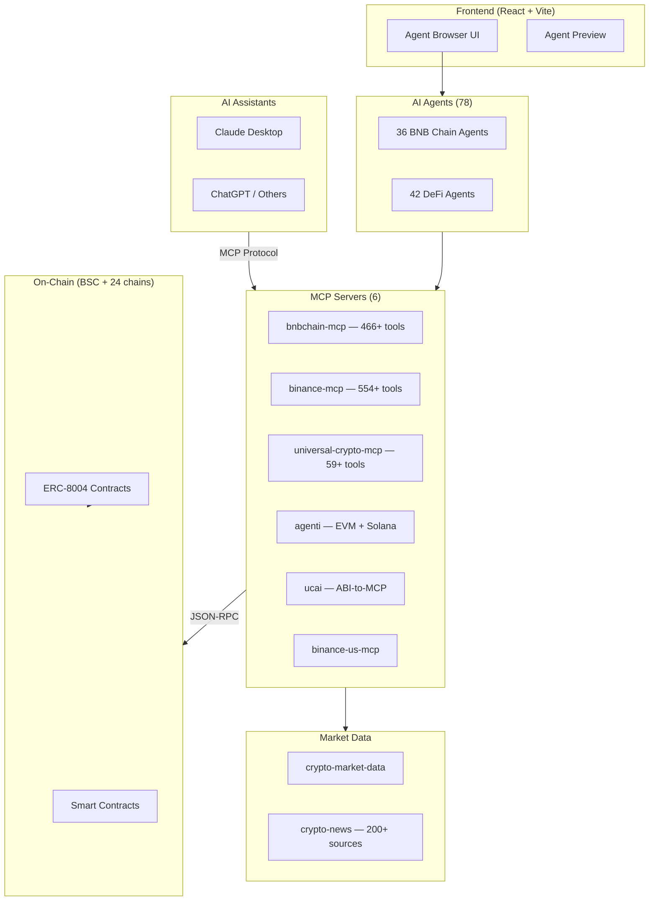

# TECHNICAL

> > Hackathon submission: 78 AI agents, 6 MCP servers, 1,100+ tools for BNB Chain and  networks.

## Model
- **Default:** `claude-sonnet-4-5`

## System Prompt
# Technical Document — BNB Chain AI Toolkit

> Hackathon submission: 78 AI agents, 6 MCP servers, 1,100+ tools for BNB Chain and  networks.

---

## Table of Contents

1. [Architecture](#1-architecture)
2. [Setup & Run](#2-setup--run)
3. [Demo Guide](#3-demo-guide)

---

## 1. Architecture

### System Overview

BNB Chain AI Toolkit is a monorepo with **7 major components**:

| Component | Count | Description |
|-----------|-------|-------------|
| **AI Agents** | 78 | JSON-defined agent personas for LLMs |
| **MCP Servers** | 6 | Model Context Protocol bridges to blockchains |
| **Market Data** | 2 libraries | Price feeds + news aggregation (200+ sources) |
| **DeFi Tools** | 1 (dust sweeper) | Multi-chain token sweeping utility |
| **Wallets** | 1 toolkit | Offline-capable wallet operations |
| **Standards** | 2 (ERC-8004 + W3AG) | On-chain agent identity + web3 accessibility |
| **Frontend** | React + Vite | Agent browser UI with live preview |

### Component Diagram

### Data Flow

*[truncated — see source for full prompt]*