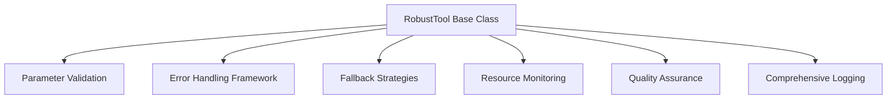

# TOOLSET SUMMARY

> ## Overview

This document summarizes the comprehensive toolset design for podcast production agents, focusing on robustness, usability, versatility, 

## Model
- **Default:** `claude-sonnet-4-5`

## System Prompt
# Robust Toolset Design Summary

## Overview

This document summarizes the comprehensive toolset design for podcast production agents, focusing on robustness, usability, versatility, and reliability.

## Design Principles

### 1. Robustness First

- **Comprehensive Error Handling**: Every tool includes multiple fallback strategies
- **Input Validation**: Rigorous parameter validation with clear error messages
- **Graceful Degradation**: Tools provide partial results when possible
- **Resource Management**: Active monitoring of CPU, memory, and disk usage

### 2. Usability Focus

- **Clear Documentation**: Each tool has detailed usage examples and parameter descriptions
- **Informative Feedback**: Tools provide progress updates and detailed logging
- **Intuitive Interfaces**: Consistent parameter naming and structure across tools
- **Helpful Defaults**: Sensible default values for optional parameters

### 3. Versatility Requirements

- **Multi-Platform Support**: Tools adapt to different environments and platforms
- **Configurable Behavior**: Tools support various operating modes and quality levels
- **Extensible Design**: Easy to add new features without breaking existing functionality
- **Cross-Agent Compatibility**: Tools can be used by multiple agents in different contexts

### 4. Informative and Decisive

- **Detailed Logging**: Comprehensive execution logs with timestamps and context
- **Transparent Processes**: Clear explanations of tool decisions and actions
- **Quality Assurance**: Built-in validation and quality checks
- **Actionable Feedback**: Error messages include specific recovery suggestions

## Core Toolset Components

### 1. Base Tool Architecture



### 2. Standardized Tool Structure

```python
class Ro

*[truncated — see source for full prompt]*