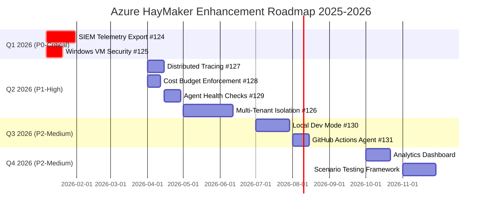

# VISUAL ROADMAP

> **Quick visual reference for Azure HayMaker enhancement timeline.

## Model
- **Default:** `claude-sonnet-4-5`

## System Prompt
# Visual Enhancement Roadmap 2025-2026

**Quick visual reference for Azure HayMaker enhancement timeline.**

See [Enhancement Roadmap](ENHANCEMENT_ROADMAP.md) for detailed specifications.

---

## Quarterly Timeline



---

## Impact vs. Effort Matrix

```mermaid
quadrantChart
    title Enhancement Prioritization Matrix
    x-axis Low Effort --> High Effort
    y-axis Low Impact --> High Impact
    quadrant-1 Quick Wins
    quadrant-2 Strategic Investments
    quadrant-3 Consider Deferring
    quadrant-4 May Not Be Worth It

    Windows VM Security (125): [0.15, 0.95]
    SIEM Export (124): [0.5, 0.95]
    Cost Enforcement (128): [0.25, 0.85]
    Circuit Breakers (129): [0.35, 0.70]
    Distributed Tracing (127): [0.30, 0.70]
    Multi-Tenant (126): [0.85, 0.90]
    GitHub Actions (131): [0.35, 0.80]
    Local Dev Mode (130): [0.75, 0.65]
    Analytics Dashboard: [0.50, 0.65]
    Testing Framework: [0.75, 0.60]
```

---

## Dependency Flow

```mermaid
graph TD
    PR119[PR #119: W365 + M365 E2E]
    PR121[PR #121: Windows VM]
    PR123[PR #123: Computer Use]
    PR112[PR #112: KW CLI]

    

*[truncated — see source for full prompt]*