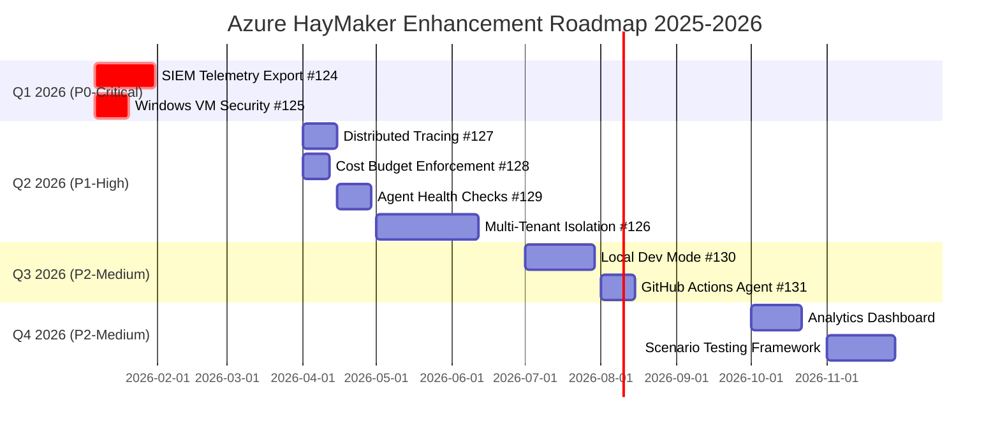
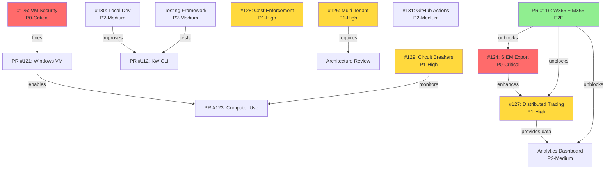
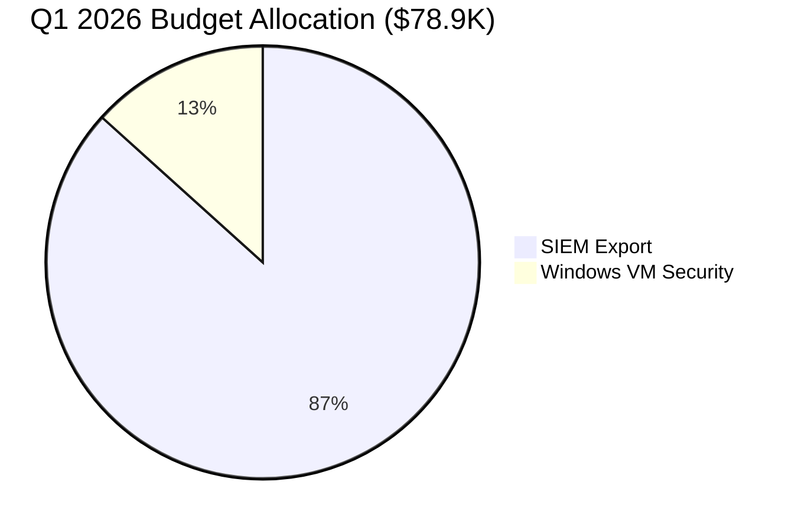
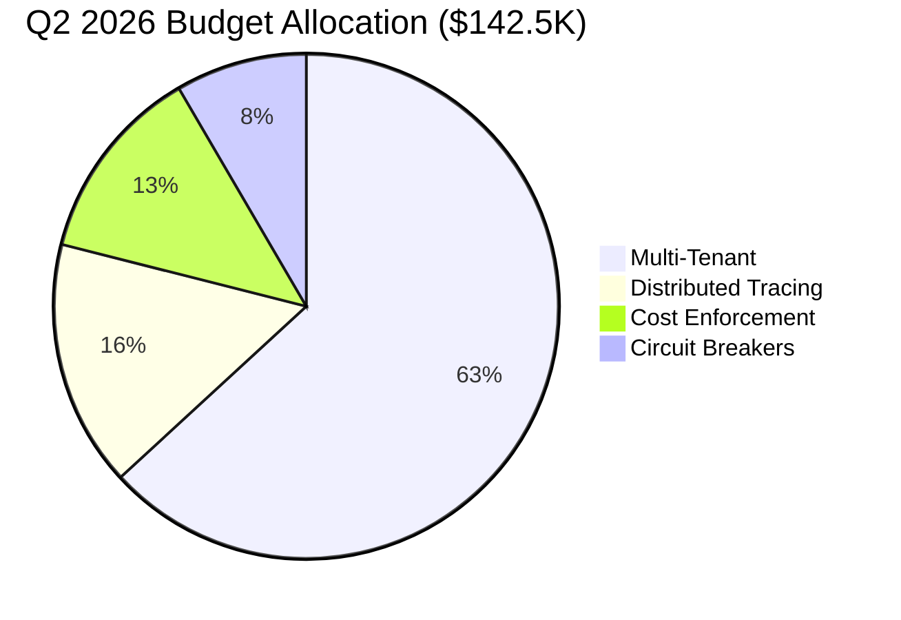

# Visual Enhancement Roadmap 2025-2026

**Quick visual reference for Azure HayMaker enhancement timeline.**

See [Enhancement Roadmap](ENHANCEMENT_ROADMAP.md) for detailed specifications.

---

## Quarterly Timeline



---

## Impact vs. Effort Matrix

```mermaid
quadrantChart
    title Enhancement Prioritization Matrix
    x-axis Low Effort --> High Effort
    y-axis Low Impact --> High Impact
    quadrant-1 Quick Wins
    quadrant-2 Strategic Investments
    quadrant-3 Consider Deferring
    quadrant-4 May Not Be Worth It

    Windows VM Security (125): [0.15, 0.95]
    SIEM Export (124): [0.5, 0.95]
    Cost Enforcement (128): [0.25, 0.85]
    Circuit Breakers (129): [0.35, 0.70]
    Distributed Tracing (127): [0.30, 0.70]
    Multi-Tenant (126): [0.85, 0.90]
    GitHub Actions (131): [0.35, 0.80]
    Local Dev Mode (130): [0.75, 0.65]
    Analytics Dashboard: [0.50, 0.65]
    Testing Framework: [0.75, 0.60]
```

---

## Dependency Flow



**Legend**:
- 🟢 Green: Ready to merge
- 🔴 Red: P0-Critical
- 🟡 Yellow: P1-High
- ⬜ White: P2-Medium

---

## ROI Comparison

```mermaid
bar
    title Enhancement ROI Comparison
    x-axis [Windows VM Security, Multi-Tenant, Cost Enforcement, SIEM Export, Distributed Tracing]
    y-axis ROI Percentage (0-1200)
    bar [1165, 233, 184, 120, 36]
```

---

## Resource Allocation by Quarter





---

## Priority Overview

| Priority | Count | Total Investment | Total Returns | Portfolio ROI |
|----------|-------|------------------|---------------|---------------|
| P0-Critical | 2 | $112,500 | $599,000 | 432% |
| P1-High | 4 | $161,700 | $635,000 | 293% |
| P2-Medium | 4 | $61,500 | TBD | TBD |
| **TOTAL** | **10** | **$335,700** | **$1,234,000** | **267%** |

---

## Quick Decision Guide

**Choose enhancement based on your goal:**

| Your Goal | Enhancement | Issue |
|-----------|-------------|-------|
| 🔒 Block production security risks | Windows VM Security | #125 |
| 🎯 Enable core red team use case | SIEM Telemetry Export | #124 |
| 💰 Prevent cost overruns | Cost Budget Enforcement | #128 |
| 🚀 Enable SaaS business model | Multi-Tenant Isolation | #126 |
| 🔍 Improve troubleshooting | Distributed Tracing | #127 |
| 🛡️ Improve reliability | Circuit Breakers | #129 |
| 👨‍💻 Improve developer experience | Local Dev Mode | #130 |
| 📊 Improve visibility | Analytics Dashboard | - |
| 🧪 Improve quality | Testing Framework | - |
| 🔗 Enable DevOps integration | GitHub Actions Agent | #131 |

---

## Files & Resources

**Documentation**:
- [Full Roadmap](ENHANCEMENT_ROADMAP.md) - Complete strategic plan
- [Quick Reference](ENHANCEMENT_QUICK_REFERENCE.md) - One-page summary
- [Roadmap Status](ROADMAP_STATUS.md) - Live progress tracking
- [Contributing Guide](CONTRIBUTING_ENHANCEMENTS.md) - How to contribute

**Specifications**:
- [Specs Index](../specs/README.md) - All implementation specs
- [SIEM Export Spec](../specs/SIEM_TELEMETRY_EXPORT.md) - P0-Critical
- [VM Security Spec](../specs/WINDOWS_VM_SECURITY_HARDENING.md) - P0-Critical
- [Dependencies](../specs/ENHANCEMENT_DEPENDENCIES.md) - Critical path
- [Cost-Benefit](../specs/ENHANCEMENT_COST_BENEFIT_ANALYSIS.md) - ROI analysis

**GitHub**:
- [All Issues](https://github.com/rysweet/AzureHayMaker/issues?q=is%3Aissue+is%3Aopen+label%3Aenhancement)
- [Milestones](https://github.com/rysweet/AzureHayMaker/milestones)
- [Pull Requests](https://github.com/rysweet/AzureHayMaker/pulls)

---

**Last Updated**: 2025-11-30