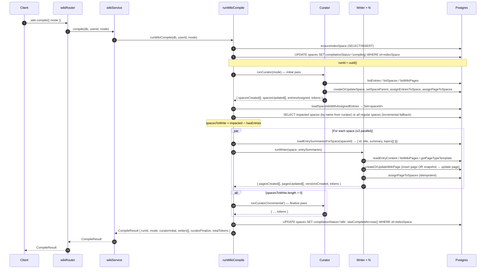
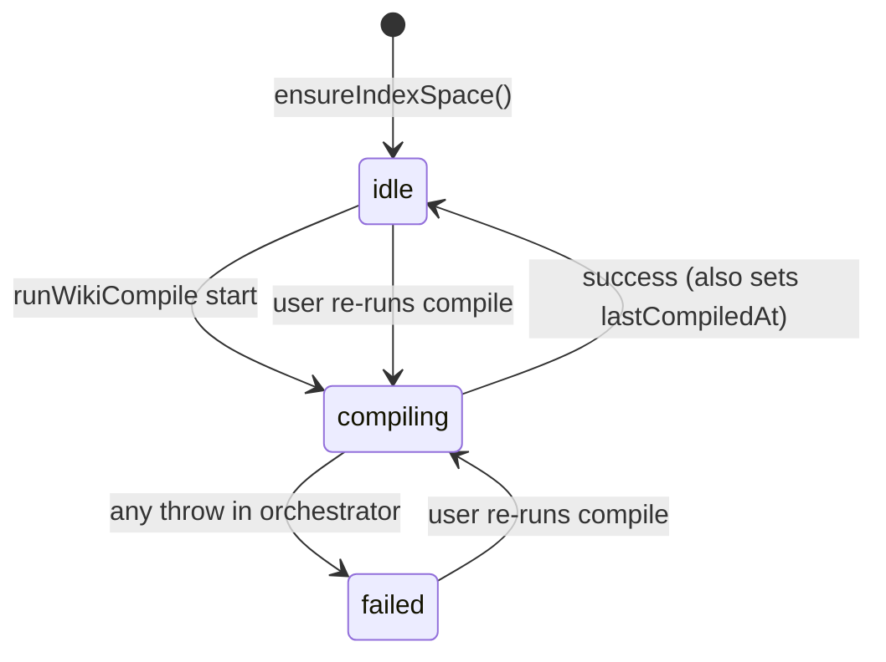
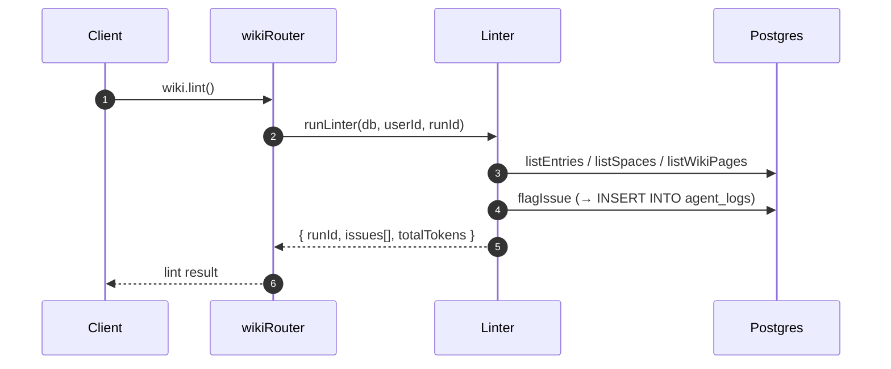
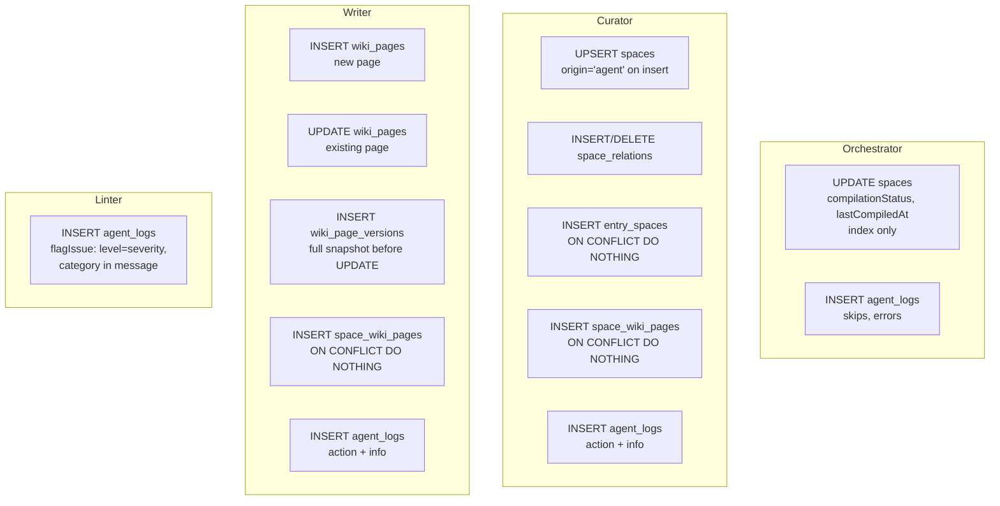

# Wiki Compiler — Architecture & Flow

End-to-end reference for how the wiki compiler works today: entry points, agent pipeline, prompts, tools, persistence, concurrency, and error handling. Everything below is grounded in the current code under `apps/server/src/` and `packages/db/src/` (no speculation).

---

## 1. The 30-second picture

Three specialised agents run inside one orchestrator. Each is an `ai` SDK `generateText` call with `gpt-4o-mini`, a system prompt, and a bounded tool set:

| Agent | Role | Writes? | Tools | Called by |
|-------|------|---------|-------|-----------|
| **Curator** | Organize: create spaces, assign entries, maintain hierarchy, update index | yes (spaces, M2Ms, index page) | 7 tools | Orchestrator — twice per compile |
| **Writer** | Synthesize: write/update wiki pages per space | yes (wiki_pages, versions, M2M) | 5 tools | Orchestrator — one per "dirty" space, up to 3 in parallel |
| **Linter** | Health-check: flag orphans / thin pages / duplicates | no (only `agent_logs`) | 4 tools | Separate entrypoint `runWikiLint` |

```mermaid
flowchart LR
  A[Mobile app] -- wiki.compile --> B[wikiRouter]
  A -. wiki.lint .-> B
  B --> C[wikiService.compile]
  C --> D[runWikiCompile]
  D --> E((Orchestrator))

  E --> F[Curator • initial]
  F --> G[Writer × N<br/>parallel ≤3]
  G --> H[Curator • finalize]

  E -.lint path.-> I[runWikiLint]
  I --> J[Linter]

  F & G & H & J --> K[(Postgres)]
  F & G & H & J --> L[(agent_logs)]

  subgraph Optional async path
    M[wikiCompileTask<br/>Trigger.dev] --> D
    N[wikiLintTask<br/>Trigger.dev] --> I
  end
```

The Trigger.dev tasks exist but are **not currently invoked** from the HTTP path — every compile today runs synchronously inside the HTTP request. The tasks are there for future auto-compile (see `docs/tickets/wiki-agent/T-015p-auto-compile-infrastructure.md`, deferred).

---

## 2. Entry points

All file paths are relative to the monorepo root.

### HTTP (oRPC) — `apps/server/src/router/wiki.router.ts`

| Endpoint | Input | Output | Handler |
|---|---|---|---|
| `wiki.compile` | `{ mode: "full" \| "incremental" }` | `CompileResult` | `wikiService.compile(db, userId, mode)` — runs `runWikiCompile` **inline** |
| `wiki.lint` | — | `{ runId, issues[], totalTokens }` | `wikiService.lint(db, userId)` — runs `runWikiLint` inline |
| `wiki.status` | — | `{ status, lastCompiledAt }` | Reads `compilationStatus` + `lastCompiledAt` from the user's **index space** |
| `wiki.logs` | `{ runId?, limit? }` | `AgentLog[]` | Reads `agent_logs` |

### Trigger.dev — `apps/server/src/trigger/wiki-compile.ts`

| Task | ID | Queue | Payload | Calls |
|---|---|---|---|---|
| `wikiCompileTask` | `wiki-compile` | `wikiCompileQueue` (concurrencyLimit 1) | `{ userId, mode }` | `runWikiCompile(undefined, userId, mode)` |
| `wikiLintTask` | `wiki-lint` | (no queue) | `{ userId }` | `runWikiLint(undefined, userId)` |

> Known nit: the queue is **global** concurrency=1, not per-user. Fix is to pass `{ concurrencyKey: payload.userId }` at every `.trigger()` call. Tracked in the deferred T-015p.

### Mobile trigger surface

`apps/mobile/src/features/wiki/hooks/useWikiMutations.ts` exposes `useCompileWiki()` and `useLintWiki()`. The only surface today is the manual buttons on `SpacesScreen` (`CompileStatusCard`) and the `SettingsScreen` wiki section.

---

## 3. `runWikiCompile` — full pipeline

`apps/server/src/modules/ai/agents/wiki-orchestrator.ts` (lines 157–313).



### Phases in `runWikiCompile`

| # | Phase | Key code | What it does |
|---|---|---|---|
| 1 | Init + index | `ensureIndexSpace` (wiki-orchestrator.ts:39–70) | Singleton "Index" space per user, `isIndex=true`, `origin='agent'`, `sortOrder=-1` |
| 2 | Mark compiling | wiki-orchestrator.ts:165–168 | Sets `compilationStatus='compiling'` on **the index space only** |
| 3 | Curator initial | wiki-orchestrator.ts:181 | `runCurator(db, userId, runId, mode)` — mode propagates to the prompt |
| 4 | Pick impacted spaces | wiki-orchestrator.ts:183–225 | Cross-references curator's `spacesCreated`/`spacesUpdated` against spaces that actually have assigned entries. Spaces with zero entries are skipped and logged |
| 5 | Writers in parallel | wiki-orchestrator.ts:227–249 via `runWithConcurrencyLimit` (125–150) | Up to **3** concurrent; one `runWriter` call per space with its per-space entry summaries |
| 6 | Curator finalize | wiki-orchestrator.ts:251–253 | Only if `spacesToWrite.length > 0`. Always invoked with `mode='incremental'` |
| 7 | Mark idle + return | wiki-orchestrator.ts:255–275 | `compilationStatus='idle'`, `lastCompiledAt=now()`, sum tokens, return `CompileResult` |
| 8 | Error path | wiki-orchestrator.ts:276–312 | `compilationStatus='failed'` on the index space, `agent_logs` error row, return `CompileResult` with `error` field |

### `CompileResult` shape (wiki-orchestrator.ts:24–32)

```ts
export type CompileResult = {
  runId: string;
  mode: "full" | "incremental";
  curatorInitial: CuratorResult;
  writers: WriterRunSummary[];
  curatorFinalize: CuratorResult | null;
  totalTokens: number;
  error?: string;
};
```

### `compilationStatus` state machine (index space only)



Regular spaces carry the `compilationStatus` column too but **it is never written** by the compile pipeline — only the index space is ever transitioned. Reads in mobile that display a per-space compile badge are effectively reading a stale/default value for non-index spaces today.

### Full vs. incremental

Mode only affects the **Curator prompt** (`buildCuratorSystemPrompt(mode)`), not orchestrator branching directly. Downstream:

- Curator prompt nudges more aggressive restructuring on `full`.
- Orchestrator picks impacted spaces the same way in both modes.
- Curator finalize **always** runs in `incremental` (even if the initial pass was `full`).

---

## 4. Lint pipeline

`runWikiLint` (wiki-orchestrator.ts:315–322) is a thin wrapper: it just invokes the Linter agent. It does **not** go through the compile orchestrator, does not ensure the index space, and does not write `compilationStatus`.



Issues live in `agent_logs` only — there is no dedicated `wiki_lint_issues` table. Each flag is a row with `toolName='flagIssue'`, `level` = severity (`info`/`warn`/`error`), `toolInput` containing the full issue record (category, targetId, suggestedFix, autoFixable).

---

## 5. Agents in detail

### 5.1 Curator

**File:** `apps/server/src/modules/ai/agents/curator-agent.ts`

| Property | Value |
|---|---|
| Model | `openai("gpt-4o-mini")` (hardcoded, curator-agent.ts:78) |
| Max steps | `CURATOR_MAX_STEPS = 25` (`agent-step-limits.ts:10`) |
| System prompt | `buildCuratorSystemPrompt(mode)` — `wiki-prompts.ts:18–106` |
| User prompt | `buildCuratorUserPrompt(args)` — `wiki-prompts.ts:108–127` |
| Tool set | `buildCuratorTools(db, userId, runId)` — `wiki-tools.ts:870–881` |
| Tools | `listEntries`, `listSpaces`, `createOrUpdateSpace`, `setSpaceParent`, `assignEntriesToSpace`, `listWikiPages`, `assignPageToSpaces` |
| Called | Twice per compile — initial (mode-driven), finalize (always `incremental`, only if writers ran) |
| Output parsing | JSON: `{ spacesCreated[], spacesUpdated[], entriesAssigned, notes }` |

**Key rules the system prompt encodes** (excerpts from `wiki-prompts.ts`):

- **Minimum 2 entries per space** before creating/keeping it.
- **Max 3 spaces per entry** (entries can belong to multiple spaces).
- **2-tier hierarchy only**: parent → child, enforced by `setSpaceParent` logic.
- **User-created spaces (`origin='user'`) are read-only scaffolding**: never rename, merge, delete, or overwrite description/content/properties. Assigning entries and setting parent/child relations is fine.
- **Merge/dedup**: prefer larger space when collapsing duplicates; **never** delete user-created spaces during a merge.
- **Topic normalization**: reuse existing topic names when meanings match (fed via `existingTopicsWithDescriptions` during ingest's `analyzeContent`, upstream of the compiler).

### 5.2 Writer

**File:** `apps/server/src/modules/ai/agents/writer-agent.ts`

| Property | Value |
|---|---|
| Model | `openai("gpt-4o-mini")` (writer-agent.ts:97) |
| Max steps | `WRITER_MAX_STEPS = 10` (`agent-step-limits.ts:11`) |
| System prompt | `buildWriterSystemPrompt()` — `wiki-prompts.ts:129–145` |
| User prompt | `buildWriterUserPrompt({ space, entrySummaries })` — `wiki-prompts.ts:147–172` |
| Tool set | `buildWriterTools(db, userId, runId)` — `wiki-tools.ts:883–892` |
| Tools | `readEntryContent`, `listWikiPages`, `createOrUpdateWikiPage`, `assignPageToSpaces`, `getPageTypeTemplate` |
| Called | Per-space, up to 3 in parallel via `runWithConcurrencyLimit` |
| Output parsing | JSON: `{ pagesCreated[], pagesUpdated[], versionsCreated, notes }` |

**Key rules the system prompt encodes**:

- **Incremental growth**: `listWikiPages(spaceId)` first, then extend existing sections instead of rewriting from scratch. Updates trigger a version snapshot automatically.
- **Traceability**: every claim must be traceable via `sourceEntryIds` on the page and on sections.
- **Page-to-page links** are `{ pageId, label }` refs rendered by the mobile `WikiLinkChip` component.
- **Maturity indicator** in `properties`: `stub` | `draft` | `complete`.
- **Second-person voice**, mobile-friendly short paragraphs and bullets.
- **Template-aware**: must call `getPageTypeTemplate(pageType)` before writing each page type and fill that shape. `createOrUpdateWikiPage` accepts a synthesis shortcut (`sections[]` at top level → auto-wrapped into the full synthesis shape).

**Writer input context (per call):**

- `space`: `{ id, name, description }` only — **not** the current page list.
- `entrySummaries`: `{ id, title, summary, topics[] }[]` pre-loaded by the orchestrator from `entrySpaces` JOIN `entries`.
- To see existing pages, Writer must explicitly call `listWikiPages(spaceId)` — this is a cost-saving default that forces the Writer to only fetch what it needs.

**Create vs. update decision:** determined at **the tool level** inside `createOrUpdateWikiPage` (wiki-tools.ts:693–782), not in the prompt. The tool looks up the page by `(userId, slug)`:

- Not found → INSERT new page. Returns `{ isNew: true, versionCreated: false }`.
- Found → INSERT a version snapshot of the **old** content/properties/sourceEntryIds into `wiki_page_versions` (full snapshot, not a diff), then UPDATE the page. Returns `{ isNew: false, versionCreated: true }`.

### 5.3 Linter

**File:** `apps/server/src/modules/ai/agents/linter-agent.ts`

| Property | Value |
|---|---|
| Model | `openai("gpt-4o-mini")` (linter-agent.ts:78) |
| System prompt | `buildLinterSystemPrompt()` — `wiki-prompts.ts:174–190` |
| Tool set | wiki-tools.ts:894–901 |
| Tools | `listEntries`, `listSpaces`, `listWikiPages`, `flagIssue` (**read-only except for agent_logs**) |
| Called | Only from `runWikiLint` — **not** during compile |
| Output parsing | `{ issues[] }` with severity/category/message/suggestedFix/autoFixable |

**Issue categories** the prompt enumerates:

`orphan_entry` · `empty_space` · `stale_page` · `missing_link` · `contradiction` · `duplicate_space` · `thin_page` (less than ~200 chars of synthesis-like text)

---

## 6. Prompts — where every string lives

Single source of truth for prompt text: **`apps/server/src/modules/ai/agents/wiki-prompts.ts`**

| Symbol | Lines | Used by |
|---|---|---|
| `buildCuratorSystemPrompt(mode)` | 18–106 | Curator (both calls) |
| `buildCuratorUserPrompt(args)` | 108–127 | Curator (both calls) |
| `buildWriterSystemPrompt()` | 129–145 | Writer |
| `buildWriterUserPrompt({ space, entrySummaries })` | 147–172 | Writer |
| `buildLinterSystemPrompt()` | 174–190 | Linter |
| `buildLinterUserPrompt()` | 192–205 | Linter |

No prompt text lives in the orchestrator, agent, or tool files — those only assemble arguments and pass them through.

---

## 7. Tool reference (wiki-tools.ts)

All tools are wrapped through `makeTool` (wiki-tools.ts:199–211) and exposed to the AI SDK via `wrapTools` (wiki-tools.ts:904–915). `userId` and `db` are threaded as a **closure** via `createTools(db, userId, runId)` (wiki-tools.ts:299) — the LLM never sees those.

| Tool | Reads | Writes | Notes |
|---|---|---|---|
| `listEntries` | `entries`, `entry_topics` + `topics`, `entry_tags` + `tags` | — | Paginated 1–100; supports `topicFilter`, `unassignedOnly`. Returns contentType/depth/authors (from T-015i metadata foundation) |
| `readEntryContent` | `entries` | — | Returns `readableContent` **truncated to 8000 chars** + keyPoints, url, etc. |
| `listSpaces` | `spaces`, `entry_spaces`, `space_wiki_pages`, `space_relations` | — | Returns entry count + page count + `parentSpaceId` + `childSpaceIds[]` per space |
| `createOrUpdateSpace` | `spaces` | `spaces` (UPSERT on `(userId, name)`), optionally `space_relations` via `setSpaceParentInternal` | Always sets `origin='agent'` on insert; preserves existing origin on update (protects user spaces) |
| `setSpaceParent` | `spaces`, `space_relations` | `space_relations` (DELETE + INSERT) | Enforces 2-level max, index-space cannot be child, no cycles |
| `assignEntriesToSpace` | `spaces`, `entries` | `entry_spaces` (INSERT + `onConflictDoNothing`) | Max 50 entries per call; idempotent |
| `listWikiPages` | `wiki_pages`, `space_wiki_pages` | — | Optional `spaceId` filter; returns title, slug, pageType, sourceEntryIds, properties, updatedAt |
| `createOrUpdateWikiPage` | `wiki_pages`, `wiki_page_versions` | `wiki_pages` (INSERT or UPDATE) + `wiki_page_versions` (INSERT snapshot on UPDATE) | Accepts full `content` OR synthesis-shortcut `sections`; version auto-increment |
| `assignPageToSpaces` | `wiki_pages`, `spaces` | `space_wiki_pages` (INSERT + `onConflictDoNothing`) | Idempotent |
| `getPageTypeTemplate` | (in-memory) | — | Returns canonical JSONB shape for `synthesis`/`timeline`/`comparison`/`glossary`/`index` |
| `flagIssue` | — | `agent_logs` (INSERT) | Linter-only write; severity → `level`, category → prefixed in `message`, input → `toolInput` |

---

## 8. Page type templates

Templates are **shape contracts, not starter content.** Declared inline in `apps/server/src/modules/ai/agents/wiki-tools.ts` (lines 109–197) and typed in `apps/server/src/modules/ai/agents/wiki-agent.types.ts`.

```ts
// Synthesis (the default, most common)
type SynthesisContent = {
  tableOfContents: Array<{ id: string; title: string; level: number }>;
  sections: Array<{
    id: string;
    title: string;
    body: string;
    sourceEntryIds: string[];
    links: { pageId: string; label: string }[];
    lastUpdated: string;
  }>;
  insights: string[];
  contradictions: string[];
  openQuestions: string[];
};

// Comparison — matrix of items × criteria
type ComparisonContent = {
  items: Array<{ name: string; description: string; sourceEntryIds: string[] }>;
  criteria: string[];
  matrix: Record<string, Record<string, string>>; // item → criterion → value
  verdict: string;
  sourceEntryIds: string[];
};

// Timeline — dated events
type TimelineContent = {
  events: Array<{ date; title; body; sourceEntryIds; links }>;
  insights: string[];
};

// Glossary — term → definition
type GlossaryContent = {
  terms: Array<{ term; definition; sourceEntryIds; links }>;
};

// Index — the special per-user overview page
type IndexContent = {
  spaces: Array<{ spaceId; name; summary; pageCount; entryCount }>;
  totalPages: number;
  totalEntries: number;
  lastCompiled: string;
};
```

Writer flow: narrative prompt logic picks the `pageType` → calls `getPageTypeTemplate(pageType)` → fills the shape → passes to `createOrUpdateWikiPage`. The tool validates the payload against the expected shape.

---

## 9. Persistence map

Every DB write that the compiler produces.



**Tables touched:** `spaces`, `space_relations`, `entry_spaces`, `wiki_pages`, `wiki_page_versions`, `space_wiki_pages`, `agent_logs`.

**Never touched by the compiler:** `entries` (immutable raw source, read-only), `embeddings`, `users`, `wiki_settings` (doesn't exist yet).

**Rollback behaviour:** none. Writes are not wrapped in a transaction across the pipeline. If Curator succeeds, writers run in parallel, and one writer throws, the other writers' writes **persist**. The orchestrator's error path only marks the index space failed and logs the error.

---

## 10. Agent log writes — every call site

`agent_logs` is the single observability sink. Rows always carry `userId + runId + level + message + toolName`, often with `toolInput` / `toolOutput`.

| # | Site | Level | Message | Emitted by |
|---|---|---|---|---|
| 1 | Orchestrator — skipped writers | `info` | "Wiki compile: skipped writer for N space(s) with no assigned entries." | wiki-orchestrator.ts:215–222 |
| 2 | Orchestrator — error | `error` | `Wiki compile failed: ${msg}` | wiki-orchestrator.ts:287–297 |
| 3 | Curator — per tool call | `action` | `Curator called ${toolName}` | curator-agent.ts:89–99 (onStepFinish) |
| 4 | Curator — completion | `info` | `Curator finished (${mode})` | curator-agent.ts:107–120 |
| 5 | Writer — per tool call | `action` | `Writer called ${toolName}` | writer-agent.ts:113–123 |
| 6 | Writer — completion | `info` | `Writer finished for space ${name}` | writer-agent.ts:131–145 |
| 7 | Linter — per tool call | `action` | `Linter called ${toolName}` | linter-agent.ts:89–97 |
| 8 | Linter — completion | `info` | `Linter finished` | linter-agent.ts:105–116 |
| 9 | `flagIssue` tool | `severity` | `[${category}] ${message}` | wiki-tools.ts:836–843 |

Token counts land on rows #4, #6, #8 under `toolOutput.tokens`.

---

## 11. Concurrency model

- **Across users / runs**: today, nothing coordinates two compiles for the same user. The Trigger.dev queue would, but HTTP compile bypasses it. A double-tap of the Compile button can race.
- **Within a run**: Curator is sequential. Writers fan out up to **3** at a time via a hand-rolled `runWithConcurrencyLimit` (wiki-orchestrator.ts:125–150). The finalize Curator call runs after **all** writers settle.
- **Inside each agent**: step-bounded by `stepCountIs(MAX_STEPS)` from the `ai` SDK. Curator=25 steps, Writer=10 steps.

```mermaid
gantt
  title One compile run (happy path)
  dateFormat  X
  axisFormat  %s
  section Orchestrator
  Init + status    :a1, 0, 1
  Mark idle        :a2, 12, 1
  section Curator
  Initial          :c1, 1, 4
  Finalize         :c2, 11, 1
  section Writers (≤3)
  space A          :w1, 5, 3
  space B          :w2, 5, 4
  space C          :w3, 5, 5
  space D (queued) :w4, 8, 3
```



---

## 12. Token accounting

- Each agent's `generateText` result carries aggregate `usage` over all the steps it took (input + output across every tool call in that run).
- `getTotalTokens(usage)` (writer-agent.ts:54–70; same helper copy-pasted across agents) handles both the newer `{ inputTokens, outputTokens }` and legacy `{ promptTokens, completionTokens }` shapes.
- The orchestrator sums across the two Curator calls + all Writers (wiki-orchestrator.ts:264–266) into `CompileResult.totalTokens`.
- Per-step token breakdown is **not** logged — only the per-agent total, stored under `agent_logs.toolOutput.tokens` on the `...finished` rows.

There's no budget cap, no retry with a smaller prompt, and no cost emitting beyond `agent_logs`. Everything runs against `gpt-4o-mini` unconditionally.

---

## 13. What's read where — a recap by table

| Table | Read by | Written by |
|---|---|---|
| `entries` | Curator (`listEntries`), Writer (`readEntryContent`) | **Never by compiler** (written by ingest) |
| `entry_topics` + `topics` | `listEntries` | ingest |
| `entry_spaces` | `listSpaces` counts, `loadEntrySummariesForSpace`, `loadSpaceIdsWithAssignedEntries` | Curator (`assignEntriesToSpace`) |
| `spaces` | `listSpaces`, `ensureIndexSpace` | Curator (`createOrUpdateSpace`); Orchestrator (status transitions on index) |
| `space_relations` | `listSpaces` | Curator (`setSpaceParent`) |
| `wiki_pages` | Writer (`listWikiPages`), Curator (`listWikiPages`, read-only) | Writer (`createOrUpdateWikiPage`) |
| `wiki_page_versions` | — | Writer (snapshot before update) |
| `space_wiki_pages` | `listSpaces` counts | Curator & Writer (`assignPageToSpaces`) |
| `agent_logs` | `wiki.logs` endpoint | all agents + orchestrator + `flagIssue` |

---

## 14. Known limits & where to look next

- **No transaction boundary** across the orchestrator. A mid-run failure leaves partial state; the index space flag surfaces the fact but does not roll back.
- **Writers run blind to each other.** Two parallel writers could, in principle, both create a page with the same slug for different spaces (mitigated only by the `(userId, slug)` unique key — the second write would collide and throw, failing that writer).
- **`compilationStatus` on non-index spaces is dead.** The UI reads it per-space but nothing writes it per-space.
- **Linter is decoupled.** Issues accumulate in `agent_logs` indefinitely with no resolution/acknowledge workflow.
- **`readEntryContent` truncates at 8000 chars.** Long-form entries lose their tail; synthesis quality on thick sources is bounded.
- **Model is hardcoded.** Swapping Writer to a stronger model requires a code change in `writer-agent.ts:97`.
- **No embedding use in the pipeline.** `spaces.centroidVector` exists in schema but the compiler never reads or writes it.

Candidates for strengthening (ordered by leverage):

1. Wrap each writer + its finalize step in a transaction; retry the single failing writer rather than failing the whole compile.
2. Populate `spaces.centroidVector` from page-section embeddings during Writer completion, so future retrieval (Query agent) has a cheap prior.
3. Lift `readEntryContent` truncation to a progressive-read pattern (chunk + summarise) for long entries.
4. Add a `writerModel` knob read from config/env before flipping `gpt-4o-mini` → a stronger Writer.
5. Consolidate per-space `compilationStatus` so the UI dots actually reflect reality.

---

## 15. File index (quick-jump)

```
apps/server/src/
  router/wiki.router.ts                        HTTP endpoints (compile, lint, status, logs)
  modules/wiki/services/wiki.service.ts        Thin wrappers → orchestrator
  modules/ai/agents/
    wiki-orchestrator.ts                       runWikiCompile, runWikiLint, ensureIndexSpace, loaders, concurrency limiter
    curator-agent.ts                           runCurator (generateText + onStepFinish logging)
    writer-agent.ts                            runWriter
    linter-agent.ts                            runLinter
    wiki-prompts.ts                            Every system + user prompt
    wiki-tools.ts                              All 11 tools + page-type templates + makeTool/wrapTools
    wiki-agent.types.ts                        CompileResult, WriterResult, content JSONB types
    agent-step-limits.ts                       CURATOR_MAX_STEPS=25, WRITER_MAX_STEPS=10, LINTER_MAX_STEPS
  trigger/wiki-compile.ts                      Trigger.dev tasks (defined, currently unused from HTTP)

packages/db/src/schema/
  spaces.ts                                    spaces, space_relations, compilationStatus enum
  wiki-pages.ts                                wiki_pages, wiki_page_versions, wikiPageTypeEnum
  space-wiki-pages.ts                          M2M
  entry-spaces.ts                              M2M
  agent-logs.ts                                agent_logs
```