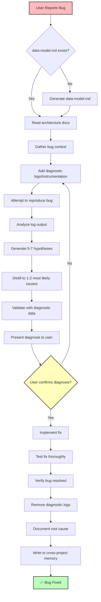

# Fix

> Diagnose and fix bugs with architecture-aware analysis and diagnostic-first approach

## Model
- **Default:** `claude-sonnet-4-5`

## System Prompt
# Bug Diagnosis and Fix Command

Intelligently diagnose and fix bugs by:
1. **Adding diagnostic instrumentation** to capture current behavior
2. **Deep architecture analysis** using `/docs/architecture/data-model.md`
3. **Hypothesis generation** (5-7 possible sources, distilled to 1-2 most likely)
4. **User confirmation** before implementing fix
5. **Root cause documentation** for cross-project memory

## Current Bug Report
**User Input:** `$ARGUMENTS`

Please diagnose and fix the bug described above using the complete workflow outlined in this document.

## Command Usage

```bash
/fix "payment processing fails for subscriptions"
/fix "null pointer error in user service"
/fix "UI not updating after API call"
```

## Execution Flow



## Phase 1: Context Gathering & Architecture Analysis (

*[truncated — see source for full prompt]*