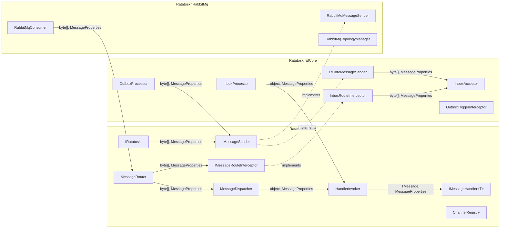
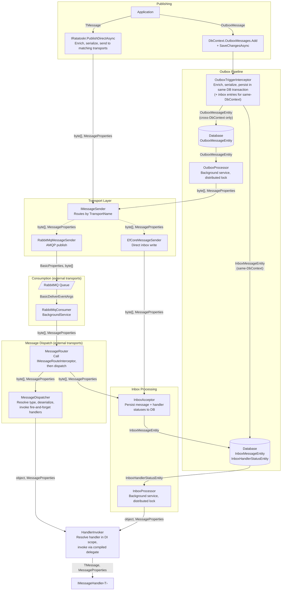
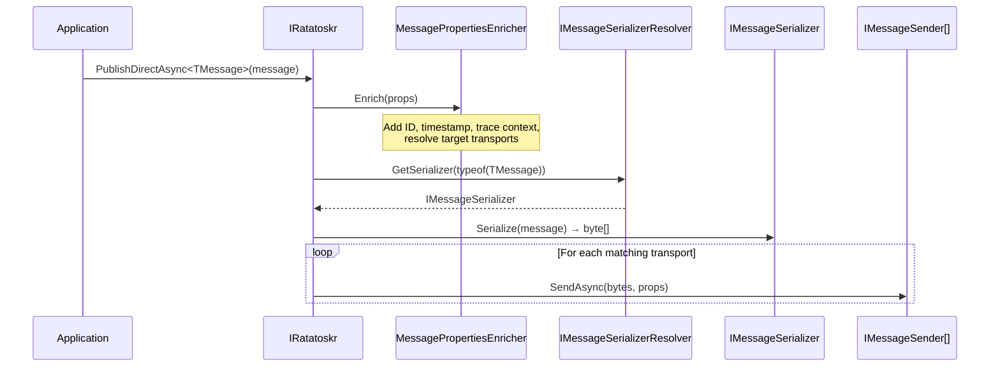
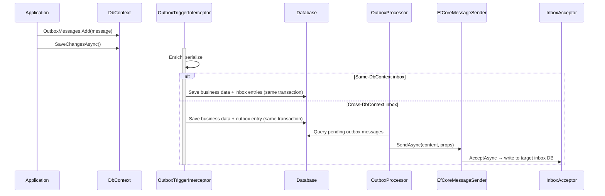
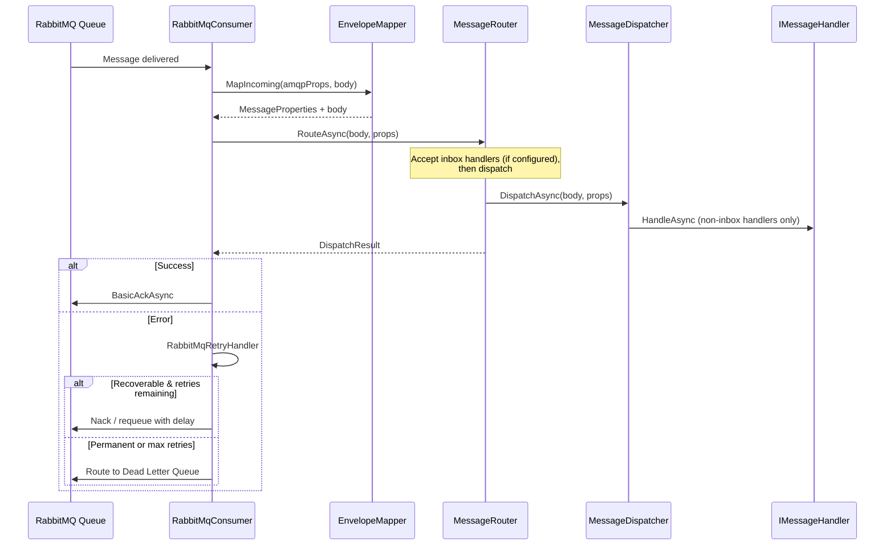
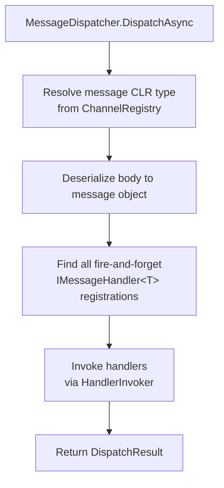
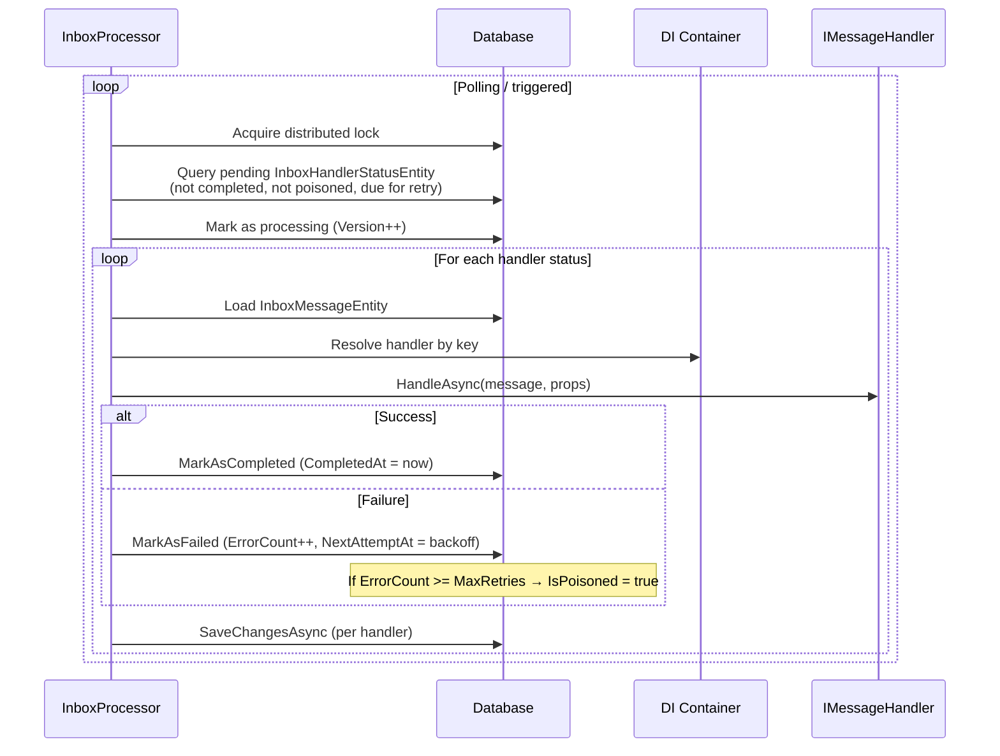

# Architecture

This page explains how messages flow through Ratatoskr — from publishing through transport to handler invocation. Understanding this pipeline helps you make informed decisions about transport choice, durability configuration, and error handling.

## Package Overview

Ratatoskr is split into four packages. The core library provides the abstractions and message routing pipeline. Transport and durability packages plug into the core via well-defined interfaces.

## End-to-End Flow

The following diagram shows the complete message lifecycle. The sections below detail each step.

## Publishing

There are two ways to publish messages: directly via <xref:Ratatoskr.IRatatoskr>, or transactionally via the EF Core outbox.

### Direct Publishing

The application calls `IRatatoskr.PublishDirectAsync<T>()`. Ratatoskr enriches the message properties (CloudEvents ID, timestamp, W3C trace context), resolves the serializer for the message type, serializes the message, then sends it to all `IMessageSender` implementations matching the configured transports.

### Transactional Publishing (Outbox)

Messages are added to `OutboxMessages` and persisted in the same database transaction as your business data. The `OutboxTriggerInterceptor` hooks into EF Core's `SaveChangesAsync`:

- **Same-DbContext:** Inbox entries are created directly in the same transaction. No outbox row is needed — the inbox processor picks them up immediately.
- **Cross-DbContext:** An `OutboxMessageEntity` is created. The `OutboxProcessor` background service dispatches it to the target inbox.

See [Outbox](outbox.md) for complete configuration and error handling details.

## Consuming

### RabbitMQ Transport

On startup, `RabbitMqTopologyManager` provisions exchanges, queues, and bindings. The `RabbitMqConsumer` background service subscribes to configured queues. When a message arrives, the CloudEvents AMQP mapper extracts `MessageProperties` from AMQP headers, then passes them to the `MessageRouter`.

The router calls `IMessageRouteInterceptor` (if registered) to handle inbox acceptance, then delegates to `MessageDispatcher` for fire-and-forget handler invocation.

### EF Core Transport

The EF Core transport has no in-memory channel or consumer loop. Messages flow through `EfCoreMessageSender` → `InboxAcceptor` → database → `InboxProcessor` → handler. See [EF Core Transport](efcore-transport.md) for details.

### Message Dispatch

The `MessageDispatcher` resolves the message type from the `ChannelRegistry`, deserializes it, then invokes each fire-and-forget handler via `HandlerInvoker`. Inbox-managed handlers are not part of this pipeline — they are persisted by `InboxAcceptor` and delivered later by `InboxProcessor`.

## Inbox Processing

The `InboxProcessor` runs as a background service with a distributed lock. It queries pending handler statuses, claims them via optimistic concurrency, and invokes each handler through `HandlerInvoker`. Progress is saved per handler — a failure in one handler does not affect others.

See [Inbox](inbox.md) for complete setup, configuration, and retry behavior.

## Delivery Guarantees

Ratatoskr provides **at-least-once delivery**:

- The outbox guarantees that staged messages will eventually be sent, even across application restarts
- The inbox guarantees that each handler will be invoked at least once per message
- Messages may be delivered more than once in crash scenarios (outbox retry, inbox stuck message recovery)
- **No ordering guarantees** across retries — messages may be reprocessed in a different order than they were originally received

> [!IMPORTANT]
> Handlers must be **idempotent**. The inbox deduplicates deliveries per (message ID, handler) pair to minimize duplicate processing, but if a handler succeeds and the process crashes before the completion status is persisted, the handler will be re-invoked. Design handlers to produce the same result when called twice with the same message.

## Key Distinction: Transport vs. Durability

Ratatoskr separates two concerns that are often conflated:

| Concept | What It Does | Package |
|---------|-------------|---------|
| **Transport** | Moves messages between services (RabbitMQ, EF Core) | `Ratatoskr.RabbitMq`, `Ratatoskr.EfCore` |
| **Durability** | Persists messages for reliable delivery (Outbox, Inbox) | `Ratatoskr.EfCore` |

You can use RabbitMQ transport **with** EF Core durability (outbox + inbox), or you can use the EF Core transport without an outbox. These are independent configuration choices.

## Concurrency and Distribution

Ratatoskr is designed for multi-instance deployment:

- **Distributed locks** via [Medallion.Threading](https://github.com/madelson/DistributedLock) — both `OutboxProcessor` and `InboxProcessor` acquire a named lock before processing. Only one instance processes at a time.
- **Optimistic concurrency** — `Version` columns on outbox and inbox entities prevent two workers from processing the same record simultaneously.
- **Idempotent persistence** — The inbox uses unique constraints for deduplication. Concurrent inserts resolve safely via constraint violations.
- **Multi-DbContext isolation** — Each `DbContext` type gets its own processor, lock, and configuration. Different channels can use different databases for bounded context isolation.

## Message Schema Evolution

Ratatoskr uses `System.Text.Json` for message serialization. By default:

- New fields added to a message type deserialize as `default` for in-flight messages that don't contain them
- Removed fields are silently ignored during deserialization of old messages
- Renamed fields appear as new fields (old data is lost)

**Recommendations:**

- Only add fields (additive changes). Never rename or remove fields that may exist in in-flight outbox/inbox messages.
- For breaking changes, introduce a new message type and migrate consumers before producers.

## Ordering Guarantees

Ratatoskr provides **at-least-once delivery** but does **not** guarantee strict message ordering across instances.

### Why ordering is not preserved

- Outbox and inbox processors poll the database in batches (`Take(BatchSize)`) and process asynchronously
- Multiple worker instances grab overlapping batches in parallel, which can reorder messages across instances
- Within a single processor instance, messages are processed in a deterministic order within each batch (`CreatedAt` for the outbox, `MessageId` for the inbox), but concurrent batches from different instances have no ordering coordination

### When ordering matters

If your business logic requires that `OrderUpdated` always follows `OrderCreated` for the same order:

1. **Sequence numbers** — Include a monotonically increasing sequence number in your message payload. Consumers reject or reorder out-of-sequence messages.
2. **Partition keys** — Route related messages to the same queue/partition using RabbitMQ routing keys. A single consumer on that queue preserves ordering.
3. **Sagas / process managers** — Use a saga pattern to track expected message sequences and compensate when messages arrive out of order.
4. **Single-instance processing** — For low-throughput scenarios, run a single processor instance per message type to preserve ordering within that type.

### What Ratatoskr does guarantee

- Messages are eventually delivered at least once (assuming the processor is running and the database is available)
- Within a single batch on a single processor instance, messages are processed in a deterministic order (`CreatedAt` for the outbox, `MessageId` for the inbox)
- Deduplication via the inbox pattern prevents duplicate processing for the same (MessageId, HandlerKey) pair in the common case; delivery is still at-least-once because a crash between handler completion and status update can trigger a re-run

## What's Next

- [Messages & Handlers](messages-handlers.md) — Message types, handler patterns, and serialization
- [Channels & Routing](channels-routing.md) — Channel-first design and ownership rules
- [Outbox](outbox.md) — Transactional outbox pattern in depth
- [Inbox](inbox.md) — Per-handler durability and deduplication